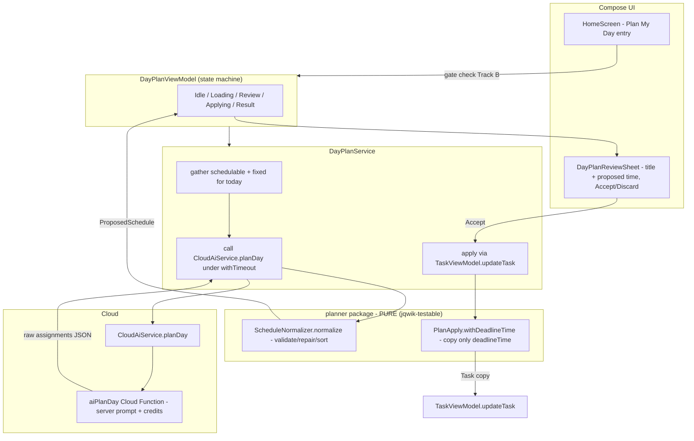
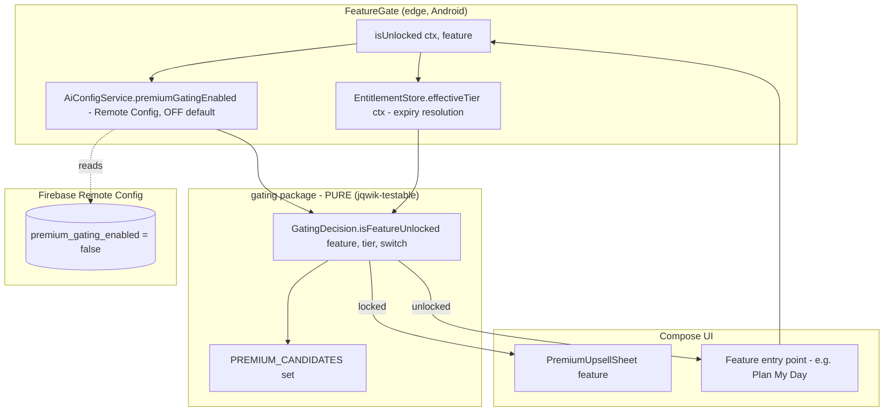

# Design Document

## Overview

This feature adds two **independent** capabilities to the Preamble Android app. They share no runtime dependency and are designed so either can ship alone. Track B references Track A only as one named gating candidate.

- **Track A — AI Plan-My-Day:** the user asks the app to schedule today's unscheduled tasks. The existing Cloud AI path (`CloudAiService` → a Cloud Function) *proposes* start times; a **pure, Android-free normalizer** in a new `com.theblankstate.preamble.planner` package validates/repairs/sorts the proposal so that correctness (no double-booking, distinct times, priority ordering, `HH:mm` shape) is guaranteed regardless of what the model returns. The result is shown for review; on accept it is applied through the existing `TaskViewModel.updateTask` path, changing **only** `deadlineTime`.
- **Track B — Premium gating infrastructure (default OFF, safety-critical):** replace the always-`true` `FeatureGate.isUnlocked` stub with a real decision driven by a **pure function** `GatingDecision.isFeatureUnlocked(feature, tier, masterSwitchEnabled)`. The master switch is a remotely fetched Firebase Remote Config boolean `premium_gating_enabled` that **defaults to false / OFF**. While OFF the pure function returns unlocked for *every* feature and *every* tier — provably identical to today's behavior. Only when an owner turns it ON do the designated candidate features lock for non-premium tiers.

The central design principle for both tracks is the same: **push every "for all inputs" decision into a pure function** so it is deterministic, jqwik-testable, and free of Android/network/AI dependencies. The Cloud AI call, the Remote Config fetch, the entitlement read, and the Compose UI are treated as thin edges around that pure core.

### Current-state findings that drive the design

| Area | Current state (verified in code) | Decision for this feature |
| --- | --- | --- |
| Cloud AI client | `CloudAiService` (object) exposes `chat` (SSE, credit-charged, `429 = DAILY_LIMIT_REACHED`) and `parseTask` (one-shot JSON, **always FREE**). OkHttp `readTimeout = 120s`, `connectTimeout = 15s`. Auth via Firebase ID token bearer. | Add a one-shot `CloudAiService.planDay(...)` mirroring `parseTask`'s request/parse shape, pointed at a new `aiPlanDay` Cloud Function. |
| Server AI entry points | `functions/src/ai-parse-task.ts` (`aiParseTask`, `onRequest`, `timeoutSeconds: 30`, `verifyAuth`, `getAiConfig(db)` for model selection, server-held prompt). `ai-chat.ts` is the credit-charged path. | Add `functions/src/ai-plan-day.ts` (`aiPlanDay`) — server-held planning prompt, reuses `getAiConfig` model selection, **charges credits** (Track A is an AI feature) and returns a dedicated insufficient-credits signal. |
| Task model | `data/Task.kt`: `deadlineTime: String?` is an `HH:mm` time-of-day scoped to `createdDate`; `priority: Int` (0–3); `isEvent: Boolean`; `endTime: String?` for events. | Schedulable = current-day, not completed, `deadlineTime == null`, `isEvent == false`. Fixed = current-day items that already have a time (incl. event `[deadlineTime, endTime)` ranges). |
| Task update path | `viewmodel/TaskViewModel.updateTask(task, newTitle, newDate, newDeadlineTime, … many params with `task.*` defaults)` → `repository.updateTask`, cancels/reschedules alarms, handles Google sync. | Apply each accepted time via `updateTask(task, newTitle = task.title, newDate = task.createdDate, newDeadlineTime = proposed)` so only `deadlineTime` changes; alarms/sync side effects stay consistent. |
| Entitlement | `data/Entitlement.kt`: `EntitlementTier` enum; `EntitlementStore.effectiveTier(ctx)` resolves expiries (expired premium → `UNPREMIUM`); `EntitlementStore.unlocks(tier)` classifies premium vs non-premium (both **pure**). `PremiumFeature` enum lists candidates. `FeatureGate.isUnlocked(ctx, feature) = true` (stub). | New pure `GatingDecision`; `FeatureGate` becomes the edge that reads `effectiveTier` + the remote switch and delegates to `GatingDecision`. Add `AI_AUTO_PLANNING` and `UNLIMITED_AI_CREDITS` to `PremiumFeature`. |
| Remote config | `ai/AiConfigService.kt` already wraps Firebase Remote Config: `setDefaultsAsync(...)`, `fetchAndActivate()`, and `killSwitch()` reads a BOOLEAN with `getOrDefault(false)`. `firebase/remote_config_template.json` defines BOOLEAN flags (e.g. `ai_kill_switch` default `"false"`). | Add `premium_gating_enabled` (BOOLEAN, default `false`) to the template and an in-app default; add `AiConfigService.premiumGatingEnabled()` mirroring `killSwitch()` (OFF on unfetched/error). |
| Theme gate | `ads/FeatureGateManager.kt` is a *separate* stub (`themeUnlocked`/`isThemeUnlocked` always true). | Left unchanged; it governs theme unlock only and is orthogonal to `FeatureGate`/`PremiumFeature`. Documented coexistence below. |
| Analytics | `analytics/AnalyticsManager.kt` central `captureEvent(event, props)` (PostHog + Firebase). | Add `trackDayPlanRequested/Accepted/Discarded` and `trackGateEvaluated/UpsellShown`. |
| Test toolchain | `net.jqwik:jqwik` + JUnit 5 wired in `app/build.gradle.kts` with `useJUnitPlatform()`; existing pure-logic suites under `app/src/test/java/.../collab`. | Reuse for `planner` and `gating` pure logic. New Cloud Functions test for `aiPlanDay`. |

### Technology context

- **Client:** Kotlin 2.0.21, Jetpack Compose, Room (no schema change in this feature). Pure-logic homes: `app/src/main/java/com/theblankstate/preamble/planner/` and `…/gating/` (both Android/network/AI-free).
- **Backend:** Firebase Cloud Functions (TypeScript), Firebase Auth, Firebase Remote Config, the existing server-side AI credit economy.
- **No Room migration is required.** Track A reuses the existing `deadlineTime` column via `updateTask`; Track B reads Remote Config + `EntitlementStore` (SharedPreferences/Firestore). No new entity, column, or DB-version bump.
- **Test execution constraint (JDK 21 / `jlink`):** as in the sibling `collaborative-tasks` and `social-engagement` specs, JVM unit-test execution currently needs a complete **JDK 21 with `jlink`** which the build environment lacks (`gradle.properties` pins JDK 17). New pure-logic (jqwik) and Compose tests are authored to **compile cleanly** and run once a full JDK 21 toolchain is available; the Cloud Functions tests run under Node independently of that constraint.

## Architecture

### Track A — Plan-My-Day



**Flow:** entry point → (Track B gate check) → `DayPlanService` gathers `Schedulable_Task`s and `Fixed_Commitment`s for the current day → if empty, short-circuit with a "nothing to plan" message and **no** AI call (Req 1.4) → otherwise call `CloudAiService.planDay` bounded by `withTimeout` (Req 5.1) → feed the **raw** AI assignments into the pure `ScheduleNormalizer` → on a non-empty valid result enter `Review` (Req 3) → on Accept, apply each time via `updateTask` (Req 4.1–4.2); on Discard, leave everything unchanged (Req 4.3).

### Track B — Premium gating



**Flow:** a hosting feature calls `FeatureGate.isUnlocked(ctx, feature)`. The edge resolves the **effective tier** (`EntitlementStore.effectiveTier`, which downgrades expired premium to `UNPREMIUM`, Req 9.3) and reads the **master switch** (`AiConfigService.premiumGatingEnabled()`, OFF when unfetched/absent/error, Req 7.2). It then delegates to the pure `GatingDecision`. When the result is locked, the host shows `PremiumUpsellSheet` and does **not** perform the action (Req 11.1); when unlocked, it proceeds (Req 11.2). **While the switch is OFF, `GatingDecision` ignores the tier entirely and returns unlocked**, so a `Live_User` sees exactly today's behavior (Req 8).

## Components and Interfaces

### Track A

**1. `com.theblankstate.preamble.planner` (new, pure — no Android/Firebase/AI imports)**

```kotlin
package com.theblankstate.preamble.planner

/** A task eligible for auto-scheduling. Minutes-of-day are never stored here; only identity + priority. */
data class SchedulableTask(val id: String, val title: String, val priority: Int)

/** An immovable current-day item. A point commitment has endMinute == null;
 *  an event reserves the half-open range [startMinute, endMinute). */
data class FixedCommitment(val startMinute: Int, val endMinute: Int? = null)

/** Inputs to a day plan. dayStartMinute/dayEndMinute define the working window (minutes from 00:00). */
data class DayPlanInput(
    val schedulable: List<SchedulableTask>,
    val fixed: List<FixedCommitment>,
    val dayStartMinute: Int,
    val dayEndMinute: Int,
    val slotMinutes: Int = 30,
)

/** One assignment exactly as the AI proposed it (untrusted, may be malformed/duplicate/out-of-window). */
data class RawAssignment(val taskId: String, val time: String)   // time is an arbitrary string from the model

/** A single validated assignment in canonical HH:mm form. */
data class ScheduledAssignment(val taskId: String, val time: String)

/** Validated, non-conflicting, priority-sorted result. */
data class ProposedSchedule(val assignments: List<ScheduledAssignment>)

sealed interface PlanOutcome {
    data class Valid(val schedule: ProposedSchedule) : PlanOutcome
    /** Maps Req 5.3: AI error / unparseable / yields no valid time for any task. */
    data object CouldNotGenerate : PlanOutcome
}

object ScheduleNormalizer {
    /** PURE. Validates and repairs the AI proposal into a correct ProposedSchedule, or CouldNotGenerate. */
    fun normalize(input: DayPlanInput, raw: List<RawAssignment>): PlanOutcome
}
```

**`ScheduleNormalizer.normalize` algorithm (the correctness core):**

1. **Build the reserved set.** Convert every `FixedCommitment` to the set of occupied minute-slots in the working window (a point reserves its slot; an event reserves all slots in `[startMinute, endMinute)`). Req 2.2.
2. **Build candidate slots.** Enumerate `dayStartMinute, dayStartMinute+slotMinutes, …` up to `dayEndMinute`, dropping any slot in the reserved set. These are the only legal times → guarantees `HH:mm` validity (Req 2.5) and non-conflict (Req 2.2).
3. **Choose a per-task time.** For each `SchedulableTask` (deduplicated by id, ignoring any `RawAssignment` whose `taskId` is not a schedulable task — Req 2.1), if the AI's proposed `time` parses to a legal candidate slot that is still free, take it; otherwise mark the task for repair. Repair assigns the next free candidate slot. A task gets **at most one** time (Req 2.1); if no free slot remains it is left unscheduled.
4. **Enforce priority ordering by re-zipping.** Collect the chosen distinct slots into a sorted ascending list; order the placed tasks by `priority` descending (tie-break: AI proposed time ascending, then `id`); zip earliest-slot → highest-priority-task. Because the time multiset is preserved and re-assigned in sorted order against a priority-sorted task list, **every higher-priority task is no later than every lower-priority task** (Req 2.4) while distinctness (Req 2.3) is preserved.
5. **Outcome.** If at least one task was placed, return `Valid`. If `raw` is empty, unparseable upstream, or no task could be placed, return `CouldNotGenerate` (Req 5.3).

```kotlin
package com.theblankstate.preamble.planner

import com.theblankstate.preamble.data.Task

object PlanApply {
    /** PURE. Returns a copy of [task] with only deadlineTime replaced (Req 4.2 safety guarantee). */
    fun withDeadlineTime(task: Task, time: String): Task = task.copy(deadlineTime = time)
}
```

**2. `CloudAiService.planDay` (added to `ai/CloudAiService.kt`)** — one-shot request mirroring `parseTask`, pointed at `aiPlanDay`:

```kotlin
suspend fun planDay(
    schedulable: List<PlanTaskDto>,      // {id, title, priority}
    fixed: List<PlanFixedDto>,           // {start: "HH:mm", end: "HH:mm"?}
    date: String,                        // task createdDate, "yyyy-MM-dd"
    dayStart: String, dayEnd: String,    // working window "HH:mm"
): PlanDayResult?                        // success → assignments; null → network/error; sealed signal for INSUFFICIENT_CREDITS
```

It serializes the body with `org.json`, attaches the bearer token, and parses `{ success, assignments:[{id,time}], model }`. An HTTP `402`/`success:false` with `error == "INSUFFICIENT_CREDITS"` is surfaced as a distinct result so the client can map Req 5.5; `429` maps to the existing daily-limit message.

**3. `aiPlanDay` Cloud Function (`functions/src/ai-plan-day.ts`, new)** — structurally a sibling of `aiParseTask`:

- `onRequest({ cors: true, timeoutSeconds: 30, memory: "256MiB" })`, `verifyAuth` on the bearer token.
- Body: `{ schedulable, fixed, date, dayStart, dayEnd, appVersionCode }`.
- Server-held planning prompt (kept server-side like all prompts): instructs the model to assign each schedulable task a single `HH:mm` start time within the window, avoiding the fixed commitment times and scheduling higher-priority tasks earlier. Output is a strict JSON array `[{ "id": "...", "time": "HH:mm" }]`.
- Model selection via `getAiConfig(db)` (same as the other AI paths).
- **Credit economy:** unlike the free `aiParseTask`, `aiPlanDay` runs under the **credit-charged** path (Req 5.4). Before calling the model it performs the same server-side balance check used by `aiChat`; insufficient balance returns the `INSUFFICIENT_CREDITS` signal (Req 5.5) and **never** mutates tasks (tasks are client-owned anyway).
- The function only *proposes*; all correctness enforcement happens client-side in `ScheduleNormalizer`, so a malformed model response degrades to `CouldNotGenerate` rather than a bad schedule.

**4. `DayPlanService` + `DayPlanViewModel` (new, `viewmodel/` or `planner/` Android side)** — orchestration edge:

- `gatherInput(today)`: from `TaskRepository`, select `Schedulable_Task`s (current day, `!isCompleted`, `deadlineTime == null`, `!isEvent`) and `Fixed_Commitment`s (current-day tasks/events that already have a time, including event ranges via `endTime`). Maps to `DayPlanInput`.
- State machine: `Idle → Loading → Review(schedule, tasksById) → Applying → Applied | Failed`, plus terminal messages `NoSchedulableTasks`, `CouldNotGenerate`, `InsufficientCredits`.
- `requestPlan()`: if no schedulable tasks → `NoSchedulableTasks` (Req 1.4, no AI call). Else emit analytics `day_plan_requested(count)` (Req 6.1), then `withTimeout(PLAN_TIMEOUT_MS)` around `CloudAiService.planDay`. Timeout/error/insufficient-credits → corresponding terminal state, **tasks untouched** (Req 5.2, 5.3, 5.5). Success → `ScheduleNormalizer.normalize`; `CouldNotGenerate` → terminal message; `Valid` → `Review`.
- `accept()`: for each `ScheduledAssignment`, look up the original `Task`, call `TaskViewModel.updateTask(task, newTitle = task.title, newDate = task.createdDate, newDeadlineTime = assignment.time)`. If any update throws, surface "could not apply" (Req 4.4) — note alarms/sync are handled inside `updateTask`. Emit `day_plan_accepted` (Req 6.2).
- `discard()`: return to `Idle`, no mutation (Req 4.3); emit `day_plan_discarded` (Req 6.3).

**5. UI (`ui/screens/HomeScreen.kt` entry + `ui/components/DayPlanReviewSheet.kt` new):**
- A "Plan my day" entry point on `HomeScreen`. Tapping it first runs the Track B gate for `PremiumFeature.AI_AUTO_PLANNING` (see Track B); if unlocked, it triggers `DayPlanViewModel.requestPlan()`.
- `DayPlanReviewSheet`: a modal bottom sheet listing each task's **title + proposed `HH:mm`** (Req 3.3) with **Accept** and **Discard** actions. Shown only in the `Review` state; while shown, nothing is written (Req 3.2).

### Track B

**1. `com.theblankstate.preamble.gating` (new, pure):**

```kotlin
package com.theblankstate.preamble.gating

import com.theblankstate.preamble.data.EntitlementTier
import com.theblankstate.preamble.data.EntitlementStore
import com.theblankstate.preamble.data.PremiumFeature

object GatingDecision {
    /** The candidate set that is gated when the switch is ON (Req 10.4). Everything else stays unlocked. */
    val PREMIUM_CANDIDATES: Set<PremiumFeature> = setOf(
        PremiumFeature.AI_AUTO_PLANNING,        // AI auto-planning (Track A)
        PremiumFeature.WRAPPED,                 // advanced stats / Wrapped
        PremiumFeature.STATS_EXTENDED_RANGE,
        PremiumFeature.STATS_DEDICATED_SCREEN,
        PremiumFeature.UNLIMITED_AI_CREDITS,    // unlimited AI credits
    )

    /** PURE. The whole gating policy. */
    fun isFeatureUnlocked(
        feature: PremiumFeature,
        tier: EntitlementTier,
        masterSwitchEnabled: Boolean,
    ): Boolean = when {
        !masterSwitchEnabled -> true                       // Req 8: OFF ⇒ always unlocked, tier ignored
        feature !in PREMIUM_CANDIDATES -> true             // Req 10.5: non-candidate always unlocked
        else -> EntitlementStore.unlocks(tier)             // Req 10.1–10.3: reuse existing tier classifier
    }
}
```

`EntitlementStore.unlocks` is already a pure `when` over the enum (returns `true` for `PROMOTIONAL`/`PREMIUM`/`PREMIUM_STUDENT`/`PREMIUM_YOUNGSTER`, `false` for `FREE_TIER`/`UNPREMIUM`), so the candidate-locked branch reuses the single source of truth rather than reimplementing tier logic.

**2. `PremiumFeature` enum (extend `data/Entitlement.kt`):** add `AI_AUTO_PLANNING` and `UNLIMITED_AI_CREDITS`. Existing members (`AI_AUTO_SUBTASKS`, `AI_EDIT_FROM_NOTIFICATION`, `EXPRESSIVE_APPEARANCE`) are intentionally **not** in `PREMIUM_CANDIDATES`, so they remain unlocked even when the switch is ON (Req 10.5).

**3. `FeatureGate` edge (replace stub in `data/Entitlement.kt`):**

```kotlin
object FeatureGate {
    fun isUnlocked(ctx: Context, feature: PremiumFeature): Boolean {
        val tier = EntitlementStore.effectiveTier(ctx)             // Req 9.3 expiry resolution at the edge
        val switch = AiConfigService.premiumGatingEnabled()        // Req 7.1/7.2 remote read, OFF default
        return GatingDecision.isFeatureUnlocked(feature, tier, switch)
    }
}
```

When `switch == false` the call collapses to `GatingDecision … = true` for every input — **byte-for-byte the same observable behavior as today's `return true`** (Req 8.3), which is what makes turning gating on a safe, deliberate, reversible owner action.

**4. Master switch source — Firebase Remote Config (`AiConfigService`):**
- Add key constant `K_PREMIUM_GATING = "premium_gating_enabled"`.
- Add `false` to the `setDefaultsAsync(...)` map (in-app default, so first launch / offline reads OFF).
- Add:
  ```kotlin
  fun premiumGatingEnabled(): Boolean = runCatching {
      FirebaseRemoteConfig.getInstance().getBoolean(K_PREMIUM_GATING)
  }.getOrDefault(false)   // unfetched / read failure ⇒ OFF (Req 7.2)
  ```
  This mirrors the existing `killSwitch()` exactly. Transition to ON happens only when the fetched value is `true` (Req 7.4).

**5. `firebase/remote_config_template.json` change** — add a BOOLEAN parameter (consistent with `ai_kill_switch`):
```json
"premium_gating_enabled": {
  "defaultValue": { "value": "false" },
  "description": "Master switch for premium feature gating. false = no gating (all features unlocked, production-equivalent). Turn ON deliberately to lock candidate features for non-premium tiers.",
  "valueType": "BOOLEAN"
}
```

**6. Upsell UI (`ui/components/PremiumUpsellSheet.kt`, new):** a bottom sheet that **identifies the gated `PremiumFeature`** (Req 11.3) and explains premium is required. No purchase/billing flow (out of scope). Shown by the host when `FeatureGate.isUnlocked` returns locked.

**7. Coexistence with `ads/FeatureGateManager`:** unchanged. `FeatureGateManager` is a separate stub governing **theme unlock** (`themeUnlocked`/`isThemeUnlocked`, always true) and has no relationship to `PremiumFeature`. `FeatureGate` (in `data/`) is the only component that consults `GatingDecision`. The two are documented as distinct and are not merged.

**8. Analytics (`AnalyticsManager`):** `trackGateEvaluated(feature: String, unlocked: Boolean)` (Req 12.1) and `trackUpsellShown(feature: String)` (Req 12.2), routed through the existing `captureEvent`.

## Data Models

### Track A — request/response schema (`aiPlanDay`)

Request body (client → function):
```json
{
  "schedulable": [{ "id": "t1", "title": "Write report", "priority": 3 }],
  "fixed":       [{ "start": "13:00", "end": "14:00" }, { "start": "18:30" }],
  "date": "2026-04-27",
  "dayStart": "09:00",
  "dayEnd": "21:00",
  "appVersionCode": 12
}
```
Response body (function → client):
```json
{ "success": true, "assignments": [{ "id": "t1", "time": "09:30" }], "model": "gemini-2.5-flash" }
```
Insufficient credits: `success:false` with `error:"INSUFFICIENT_CREDITS"` (Req 5.5). All `time` values are `HH:mm` (Req 2.5). The client treats `assignments` as **untrusted** `RawAssignment`s — the pure normalizer is the authority.

### Track A — internal pure models

`SchedulableTask`, `FixedCommitment`, `DayPlanInput`, `RawAssignment`, `ScheduledAssignment`, `ProposedSchedule`, `PlanOutcome` as defined above. Times cross the wire as `HH:mm` strings and are converted to minute-of-day integers inside the normalizer for arithmetic, then formatted back to `HH:mm` on output.

### Track B — gating models

- `EntitlementTier` (existing, unchanged): `FREE_TIER`, `UNPREMIUM`, `PROMOTIONAL`, `PREMIUM`, `PREMIUM_STUDENT`, `PREMIUM_YOUNGSTER`.
- `PremiumFeature` (existing + 2 new): `WRAPPED`, `AI_AUTO_SUBTASKS`, `AI_EDIT_FROM_NOTIFICATION`, `EXPRESSIVE_APPEARANCE`, `STATS_EXTENDED_RANGE`, `STATS_DEDICATED_SCREEN`, **`AI_AUTO_PLANNING`**, **`UNLIMITED_AI_CREDITS`**.
- `premium_gating_enabled`: remote `Boolean`, default `false`.

**No persistent storage changes:** no Room entity/column/migration; `deadlineTime` already exists. Entitlement continues to use SharedPreferences + Firestore; the switch uses Remote Config.

## Correctness Properties

*A property is a characteristic or behavior that should hold true across all valid executions of a system — essentially, a formal statement about what the system should do. Properties serve as the bridge between human-readable specifications and machine-verifiable correctness guarantees.*

These properties cover **only the pure logic**: Track A's `ScheduleNormalizer`/`PlanApply` and Track B's `GatingDecision`/`EntitlementStore.effectiveTier`. They explicitly **exclude** the Cloud AI call (`aiPlanDay`/`CloudAiService.planDay`), the Remote Config fetch (`AiConfigService.premiumGatingEnabled`), and all Compose UI — those are validated by Cloud Functions tests, example/edge tests, and Compose tests in the Testing Strategy.

### Track A — Plan-My-Day (ScheduleNormalizer / PlanApply)

### Property 1: One canonical time per schedulable task, none for others

*For any* `DayPlanInput` and *any* list of `RawAssignment`s (including duplicates and ids not present in the input), the `Valid` schedule produced by `ScheduleNormalizer.normalize` assigns **at most one** time to each `SchedulableTask` id, assigns **no** time to any id that is not a `SchedulableTask`, and every assigned time matches the canonical `HH:mm` form `^([01]\d|2[0-3]):[0-5]\d$`.

**Validates: Requirements 2.1, 2.5**

### Property 2: Proposed times never coincide with fixed commitments

*For any* `DayPlanInput` (with point and ranged `FixedCommitment`s) and *any* `RawAssignment`s, no time in the resulting `ProposedSchedule` falls within the reserved minute-set of any `FixedCommitment`.

**Validates: Requirements 2.2**

### Property 3: All proposed times are distinct

*For any* `DayPlanInput` and *any* `RawAssignment`s, the times in the resulting `ProposedSchedule` are pairwise distinct — no two `SchedulableTask`s are assigned the same time.

**Validates: Requirements 2.3**

### Property 4: Higher priority is scheduled no later than lower priority

*For any* `DayPlanInput` and *any* `RawAssignment`s, for every pair of assigned tasks whose `priority` values differ, the task with the higher `priority` is assigned a time no later than the task with the lower `priority`.

**Validates: Requirements 2.4**

### Property 5: Invalid or unschedulable proposals map to "could not generate"

*For any* `DayPlanInput`, if the `RawAssignment` list is empty, entirely malformed, or yields no placeable time for any `SchedulableTask` (e.g. every candidate slot is reserved), then `ScheduleNormalizer.normalize` returns `CouldNotGenerate`; conversely, whenever at least one `SchedulableTask` can be placed it returns `Valid` with a non-empty schedule.

**Validates: Requirements 5.3**

### Property 6: Applying a proposed time changes only `deadlineTime`

*For any* `Task` and *any* `HH:mm` time string, `PlanApply.withDeadlineTime(task, time)` returns a `Task` equal to the original in every field except `deadlineTime`, which equals the given time (title, description, priority, tags, recurrence fields, completion state, and all other fields are preserved).

**Validates: Requirements 4.2**

### Track B — Premium gating (GatingDecision / EntitlementStore.effectiveTier)

### Property 7: Master switch OFF is always unlocked for everyone (safety invariant)

*For any* `PremiumFeature` and *any* `EntitlementTier`, `GatingDecision.isFeatureUnlocked(feature, tier, masterSwitchEnabled = false)` returns `true`. The result does not depend on the tier, so a non-premium holder is treated identically to a premium holder and a `Live_User` sees no withheld feature and no upsell.

**Validates: Requirements 8.1, 8.2, 8.3**

### Property 8: Gating decision is deterministic and depends only on its inputs

*For any* `PremiumFeature`, `EntitlementTier`, and switch value, evaluating `GatingDecision.isFeatureUnlocked` twice with identical inputs returns the same result, and that result is a function of exactly those three inputs (no hidden/global state).

**Validates: Requirements 9.1, 9.2**

### Property 9: Expired premium resolves to UNPREMIUM

*For any* `Entitlement` whose tier is a premium tier (`PREMIUM`, `PREMIUM_STUDENT`, or `PREMIUM_YOUNGSTER`) and whose `expiresAtMs` is non-zero and in the past, `EntitlementStore.effectiveTier` resolves the effective tier to `UNPREMIUM`.

**Validates: Requirements 9.3**

### Property 10: Switch ON locks candidate features for non-premium tiers

*For any* `PremiumFeature` in `PREMIUM_CANDIDATES` and *any* tier in `{FREE_TIER, UNPREMIUM}`, `GatingDecision.isFeatureUnlocked(feature, tier, masterSwitchEnabled = true)` returns `false` (locked).

**Validates: Requirements 10.1**

### Property 11: Switch ON keeps candidate features unlocked for premium tiers

*For any* `PremiumFeature` in `PREMIUM_CANDIDATES` and *any* tier in `{PROMOTIONAL, PREMIUM, PREMIUM_STUDENT, PREMIUM_YOUNGSTER}`, `GatingDecision.isFeatureUnlocked(feature, tier, masterSwitchEnabled = true)` returns `true` (unlocked).

**Validates: Requirements 10.2, 10.3**

### Property 12: Switch ON leaves non-candidate features unlocked for all tiers

*For any* `PremiumFeature` **not** in `PREMIUM_CANDIDATES` and *any* `EntitlementTier`, `GatingDecision.isFeatureUnlocked(feature, tier, masterSwitchEnabled = true)` returns `true` (unlocked).

**Validates: Requirements 10.5**

## Error Handling

### Track A

| Failure | Handling | Requirement |
| --- | --- | --- |
| No schedulable tasks | Short-circuit to `NoSchedulableTasks`; **no** AI call; show "no unscheduled tasks to plan". | 1.4 |
| AI call exceeds timeout | `withTimeout(PLAN_TIMEOUT_MS)` cancels the call; state → `CouldNotGenerate`; tasks untouched. | 5.1, 5.2 |
| Network/server error, or unparseable/empty/all-conflicting proposal | `planDay` returns null or normalizer returns `CouldNotGenerate`; show "day plan could not be generated"; tasks untouched. | 5.3 |
| Insufficient credits (server signal) | `planDay` returns the `INSUFFICIENT_CREDITS` result; state → `InsufficientCredits`; show "more AI credits required"; tasks untouched. | 5.4, 5.5 |
| `updateTask` throws during apply | Catch per-assignment; surface "schedule could not be applied"; rely on `updateTask`'s own atomic copy so no field is partially corrupted. | 4.4 |

All Track A failures are **non-destructive**: the only mutation in the whole flow is the per-task `updateTask` on explicit Accept. The pure normalizer cannot throw on bad model output — it degrades to `CouldNotGenerate`.

### Track B

| Failure | Handling | Requirement |
| --- | --- | --- |
| Remote Config not yet fetched / read throws / key absent | `premiumGatingEnabled()` uses `getOrDefault(false)` ⇒ switch OFF ⇒ everything unlocked. | 7.2, 8 |
| Entitlement unreadable | `EntitlementStore.effectiveTier` falls back to `FREE_TIER`; harmless while switch OFF (still unlocked). | 9.3 |
| Unknown/future `PremiumFeature` not in candidates | `GatingDecision` returns unlocked (non-candidate branch). | 10.5 |

The defining safety guarantee: **any failure or uncertainty in Track B resolves to "unlocked"**, because the switch defaults OFF and OFF means unlocked for all.

## Testing Strategy

A layered strategy. Property-based tests (jqwik, JUnit 5 platform — already wired in `app/build.gradle.kts`) cover the **pure** logic; example/edge, Cloud Functions, and Compose tests cover the edges.

### Property-based tests (jqwik) — pure logic only

- **Library:** `net.jqwik:jqwik` (existing dependency); do not hand-roll generators frameworks.
- **Location:** `app/src/test/java/com/theblankstate/preamble/planner/` and `…/gating/` (sibling of the existing `collab` suites).
- **Minimum 100 iterations** per property (`@Property(tries = 100)` or higher).
- **Tagging:** each property test carries a comment `// Feature: ai-planning-and-gating, Property {n}: {property text}`.
- **Coverage:** one property-based test per correctness property (Properties 1–12). Generators:
  - Track A: random `DayPlanInput` (varied window, slot size, schedulable count, priorities) and arbitrary `RawAssignment` lists that deliberately include duplicate ids, unknown ids, malformed time strings, out-of-window times, and times landing on reserved slots — to exercise the validate/repair path.
  - Track B: enumerate the full `PremiumFeature` × `EntitlementTier` × `{true,false}` space (small finite domains, so jqwik exhaustively/repeatedly covers them); for Property 9, generate `Entitlement`s with premium tiers and past `expiresAtMs` offsets.

### Example / edge / integration tests

- **Cloud Functions (`aiPlanDay`)** — Node test in `functions/`: valid request returns `HH:mm` assignments; credit decrement occurs (Req 5.4); insufficient balance returns `INSUFFICIENT_CREDITS` and mutates nothing (Req 5.5). (Integration — input does not vary meaningfully, so 1–3 examples, not PBT.)
- **Client orchestration (`DayPlanViewModel`/`DayPlanService`)** — example tests with a stubbed `CloudAiService`: empty schedulable ⇒ no AI call + message (1.4); `>=1` ⇒ `planDay` called (1.5); timeout ⇒ `CouldNotGenerate` + no writes (5.1, 5.2); insufficient credits ⇒ message + no writes (5.5); accept ⇒ one `updateTask` per assignment (4.1) and analytics fired (6.1–6.3); discard ⇒ no writes + Idle (4.3); apply failure ⇒ message (4.4); while in Review no writes occur (3.2).
- **Selection logic** — example test for the schedulable/fixed selector (1.2, 1.3).
- **Remote Config reader** — example tests: missing/throwing config ⇒ `premiumGatingEnabled() == false` (7.2); `true ⇒ ON`, `false ⇒ OFF` (7.4).
- **Gating host behavior** — example tests: locked ⇒ upsell shown + action skipped + `upsell_shown` analytics (11.1, 12.2); unlocked ⇒ action runs + no upsell + `gate_evaluated` analytics (11.2, 12.1).

### Smoke / configuration checks

- `firebase/remote_config_template.json` defines `premium_gating_enabled` BOOLEAN with default `"false"`, and `AiConfigService` in-app defaults include it as `false` (7.3).
- `GatingDecision.PREMIUM_CANDIDATES` equals exactly the designated set `{AI_AUTO_PLANNING, WRAPPED, STATS_EXTENDED_RANGE, STATS_DEDICATED_SCREEN, UNLIMITED_AI_CREDITS}` (10.4).
- **OFF-equals-all-unlocked guard test:** an explicit test asserting that for the entire `PremiumFeature` × `EntitlementTier` matrix, `FeatureGate`/`GatingDecision` with the switch OFF returns unlocked for every combination — the regression guard that production behavior is unchanged while gating is dormant (8.1–8.3).

### Compose tests

- `DayPlanReviewSheet`: renders each task's title + proposed `HH:mm`, with working Accept/Discard (3.1, 3.3).
- `PremiumUpsellSheet`: names the gated `PremiumFeature` (11.3).
- Plan-My-Day `HomeScreen` entry point presence/trigger (1.1).

### Test execution constraint

As noted in Overview, full JVM test execution requires a complete **JDK 21 with `jlink`** that the current environment lacks (JDK 17 pinned). The jqwik and Compose test sources are authored to **compile cleanly** and run once the JDK 21 toolchain is available; the Node-based Cloud Functions tests run independently of that constraint.
