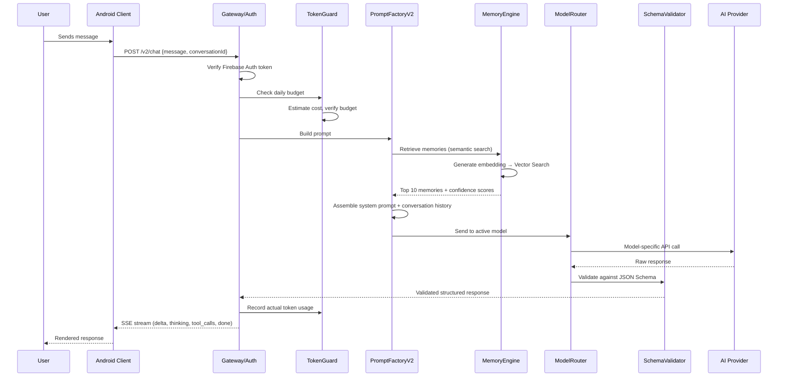
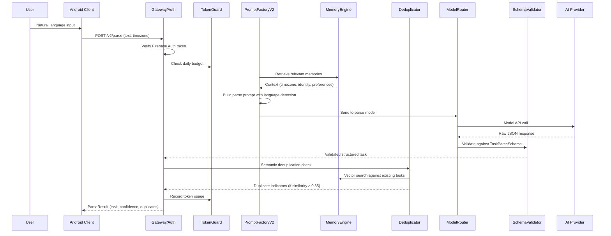

# Design Document: AI V2 Ecosystem

## Overview

The AI V2 Ecosystem is a complete reimplementation of Preamble's AI capabilities, deployed as an independent system alongside V1. It addresses V1's architectural weaknesses (split prompt factories, no shared memory, no structured output enforcement, no semantic search, no observability) while adding competitive features: rich response rendering, tool-call permissions, proactive insights, and multilingual RAG.

**Key architectural decisions:**

1. **Server-side only intelligence** — All prompt logic, model routing, schema validation, memory retrieval, and tool execution live in Cloud Functions (TypeScript). The Android client is a thin rendering layer that sends requests and displays structured responses.

2. **Complete V1 isolation** — V2 uses separate Cloud Function entry points, separate Firestore collections, and separate admin configuration. No shared module imports between V1 and V2 function entry points.

3. **Single Prompt Factory** — One `PromptFactoryV2` module serves both parsing and chat, eliminating the V1 drift between `prompt-builder.ts` (parse) and `chat-prompt.ts` (chat).

4. **Firestore Vector Search for RAG** — Memory entries are stored with vector embeddings generated via Vertex AI text-embedding models (up to 768 dimensions), enabling semantic retrieval with cosine distance and confidence scoring.

5. **Structured Output enforcement** — All AI model responses pass through JSON Schema validation before reaching the client. Invalid responses trigger one retry, then a structured error.

6. **Multi-model abstraction** — A `ModelRouter` routes requests to any configured provider (Gemini, Claude, GPT-4o, Mistral) via a uniform interface, with admin-configurable cost rates and a single default model.

**Technology stack:**
- **Backend**: Firebase Cloud Functions v2 (TypeScript, Node.js 20)
- **Database**: Firestore (named database "preamble") with Vector Search indexes
- **Embeddings**: Vertex AI text-embedding-005 (768 dimensions)
- **AI Providers**: Google GenAI SDK, Anthropic SDK, OpenAI SDK, Mistral SDK
- **Android Client**: Kotlin, Jetpack Compose, OkHttp, Hilt DI
- **Admin Panel**: React/Vite (existing admin-panel, extended with AI V2 section)

## Architecture

```mermaid
graph TB
    subgraph "Android Client"
        UI[Chat/Parse UI - Compose]
        V2Client[CloudAiV2Service]
        RichRenderer[RichResponseRenderer]
        ToolPermUI[ToolPermissionDialog]
    end

    subgraph "Cloud Functions V2"
        Gateway[API Gateway & Auth]
        TokenGuard[TokenEconomyGuard]
        PromptFactory[PromptFactoryV2]
        ModelRouter[ModelRouter]
        SchemaValidator[StructuredOutputValidator]
        ToolExecutor[ToolExecutor]
        MemoryEngine[MemoryEngine]
        TraceLogger[TraceLogger]
    end

    subgraph "External AI Providers"
        Gemini[Gemini API]
        Claude[Anthropic API]
        GPT[OpenAI API]
        Mistral[Mistral API]
    end

    subgraph "Firestore"
        MemoryCol[v2_memory/{uid}/entries]
        ConvCol[v2_conversations/{uid}/threads]
        TokenCol[v2_token_usage/{uid}]
        ConfigCol[v2_config/models]
        TasksCol[tasks - existing]
    end

    subgraph "Vertex AI"
        Embeddings[text-embedding-005]
    end

    UI --> V2Client
    V2Client --> Gateway
    Gateway --> TokenGuard
    TokenGuard --> PromptFactory
    PromptFactory --> MemoryEngine
    MemoryEngine --> Embeddings
    MemoryEngine --> MemoryCol
    PromptFactory --> ModelRouter
    ModelRouter --> Gemini
    ModelRouter --> Claude
    ModelRouter --> GPT
    ModelRouter --> Mistral
    ModelRouter --> SchemaValidator
    SchemaValidator --> ToolExecutor
    ToolExecutor --> TasksCol
    ToolExecutor --> V2Client
    V2Client --> ToolPermUI
    V2Client --> RichRenderer
    Gateway --> TraceLogger
    TokenGuard --> TokenCol
    Gateway --> ConfigCol
    PromptFactory --> ConvCol
```

### Request Flow (Chat)



### Request Flow (Parse)



## Components and Interfaces

### 1. Cloud Function Entry Points (V2)

All V2 endpoints are separate from V1 and share no module imports with V1 entry points.

| Endpoint | Method | Purpose |
|----------|--------|---------|
| `v2Chat` | POST | Main chat endpoint, SSE streaming |
| `v2ChatContinue` | POST | Send tool results, get final response |
| `v2Parse` | POST | Parse natural language → structured task |
| `v2TokenBalance` | GET | Get current token usage and budget |
| `v2Config` | GET | Fetch model registry for client display |
| `v2DailyBriefing` | POST | Generate daily briefing on demand |

### 2. PromptFactoryV2

Single module serving both parse and chat prompts. Responsibilities:
- System prompt assembly from templates
- Conversation history windowing and summarization
- Memory context injection (from MemoryEngine)
- Language-detection-aware prompt adaptation
- Tool schema injection (for chat path)
- Force-tool-call mode (for parse path)

```typescript
interface PromptFactoryV2 {
  buildParsePrompt(input: ParseInput): PromptPayload;
  buildChatPrompt(input: ChatInput): PromptPayload;
  buildBriefingPrompt(input: BriefingInput): PromptPayload;
}

interface ParseInput {
  text: string;               // User's raw input (1-500 chars)
  timezone: string;           // User's timezone (e.g., "Asia/Kolkata")
  currentDateTime: string;    // ISO 8601 local datetime
  memories: MemoryEntry[];    // Relevant memories from MemoryEngine
  language?: DetectedLanguage;
}

interface ChatInput {
  message: string;
  conversationId: string;
  history: ConversationMessage[];
  memories: MemoryEntry[];
  userTasks?: TaskSnapshot[];  // For tool-call context
  mode: "concise" | "detailed";
  activeModel: ModelConfig;
}
```

### 3. ModelRouter

Abstracts multiple AI providers behind a uniform interface.

```typescript
interface ModelRouter {
  generate(request: ModelRequest): Promise<ModelResponse>;
  streamGenerate(request: ModelRequest): AsyncIterable<StreamChunk>;
  estimateTokens(text: string, model: ModelConfig): number;
}

interface ModelConfig {
  provider: "google" | "anthropic" | "openai" | "mistral";
  modelId: string;
  displayName: string;
  costPerMillionTokens: number;
  supportsReasoning: boolean;
  maxContextWindow: number;
  enabled: boolean;
  isDefault: boolean;
}

interface ModelRequest {
  systemPrompt: string;
  messages: ConversationMessage[];
  tools?: ToolDefinition[];
  forceToolCall?: boolean;
  responseSchema?: JSONSchema;
  temperature?: number;
  maxOutputTokens?: number;
}

interface ModelResponse {
  text: string;
  toolCalls?: ToolCall[];
  thinkingText?: string;
  inputTokens: number;
  outputTokens: number;
  finishReason: "stop" | "tool_calls" | "length" | "error";
}
```

### 4. StructuredOutputValidator

Validates all model responses against predefined JSON Schemas.

```typescript
interface StructuredOutputValidator {
  validateParseResponse(response: unknown): ParseResult | ValidationError;
  validateChatResponse(response: unknown): ChatResult | ValidationError;
  validateToolCallResult(response: unknown): ToolCallResult | ValidationError;
}
```

### 5. MemoryEngine (Memory_V2)

Manages semantic memory with Firestore Vector Search.

```typescript
interface MemoryEngine {
  // Retrieval
  search(uid: string, query: string, options?: SearchOptions): Promise<MemoryEntry[]>;
  getLinkedEntries(uid: string, entryId: string, limit?: number): Promise<MemoryEntry[]>;
  
  // Storage
  store(uid: string, entry: NewMemoryEntry): Promise<string>;
  merge(uid: string, existingId: string, newData: Partial<MemoryEntry>): Promise<void>;
  
  // Lifecycle
  elevateToLongTerm(uid: string, entryId: string): Promise<void>;
  expireStaleShortTerm(uid: string, retentionDays: number): Promise<number>;
  
  // Deduplication
  findDuplicates(uid: string, text: string, threshold?: number): Promise<MemoryEntry[]>;
}

interface SearchOptions {
  limit?: number;                    // Default 10, max 20
  minConfidence?: number;            // Default 0.3
  categories?: MemoryCategory[];     // Filter by category
  memoryType?: "short_term" | "long_term" | "all";
}

interface MemoryEntry {
  id: string;
  uid: string;
  text: string;
  embedding: number[];               // 768-dim vector
  category: MemoryCategory;
  memoryType: "short_term" | "long_term";
  confidence: number;                // 0.0-1.0
  linkedEntryIds: string[];          // Max 20
  source: "chat" | "parse" | "system";
  createdAt: number;
  lastAccessedAt: number;
  accessCount: number;
  conversationId?: string;           // For short-term scoping
}

type MemoryCategory = 
  | "identity" | "preference" | "goal" | "interest"
  | "context" | "relationship" | "habit" | "schedule"
  | "project" | "important_date" | "location" | "productivity_pattern";
```

### 6. TokenEconomyGuard

Enforces daily token budgets with multi-model cost normalization.

```typescript
interface TokenEconomyGuard {
  checkBudget(uid: string, estimatedCost: number): Promise<BudgetCheck>;
  recordUsage(uid: string, usage: TokenUsage): Promise<void>;
  getBalance(uid: string): Promise<TokenBalance>;
  resetDailyUsage(uid: string): Promise<void>;
}

interface BudgetCheck {
  allowed: boolean;
  remainingBudget: number;
  dailyBudget: number;
  resetTime: string;             // ISO 8601
}

interface TokenUsage {
  inputTokens: number;
  outputTokens: number;
  model: string;
  costPerMillionTokens: number;
  normalizedCost: number;        // Computed: (input + output) * costRate / 1_000_000
  traceId: string;
}

interface TokenBalance {
  consumed: number;              // Normalized tokens consumed today
  budget: number;                // Daily budget for user's tier
  remaining: number;
  tier: SubscriptionTier;
  resetTime: string;
}

type SubscriptionTier = "pro_student" | "pro_youth" | "pro_standard";
```

### 7. ToolExecutor

Executes approved tool calls within user data scope.

```typescript
interface ToolExecutor {
  execute(uid: string, toolCall: ApprovedToolCall): Promise<ToolResult>;
  validateScope(uid: string, toolCall: ToolCall): ScopeValidation;
}

interface ToolCall {
  name: string;
  category: "read" | "write";
  description: string;
  targetData: string;
  args: Record<string, unknown>;
}

interface ApprovedToolCall extends ToolCall {
  approvedAt: number;
  traceId: string;
}

// Read tools
type ReadTool = 
  | "get_today_tasks"
  | "get_tasks_by_date_range"
  | "get_task_by_name"
  | "get_friends_list"
  | "get_social_circles";

// Write tools
type WriteTool =
  | "create_task"
  | "update_task"
  | "complete_task"
  | "create_circle"
  | "add_circle_members";
```

### 8. TraceLogger

Structured logging for all V2 operations.

```typescript
interface TraceLogger {
  startTrace(uid: string, operation: V2Operation): TraceContext;
  logMemoryRetrieval(ctx: TraceContext, count: number, topConfidence: number): void;
  logModelCall(ctx: TraceContext, model: string, inputTokens: number, outputTokens: number, latencyMs: number): void;
  logFailure(ctx: TraceContext, reason: string, elapsedMs: number): void;
  endTrace(ctx: TraceContext, outcome: "success" | "error"): void;
}

interface TraceContext {
  traceId: string;               // UUID v4
  uid: string;
  operation: V2Operation;
  startTime: number;
}

type V2Operation = "parse" | "chat" | "chat_continue" | "briefing" | "tool_exec";
```

### 9. Android Client Components

```kotlin
// V2-specific service — no shared code with V1 CloudAiService
object CloudAiV2Service {
    suspend fun chat(request: V2ChatRequest): Flow<V2StreamEvent>
    suspend fun chatContinue(request: V2ToolResultRequest): Flow<V2StreamEvent>
    suspend fun parse(request: V2ParseRequest): V2ParseResult
    suspend fun getTokenBalance(): V2TokenBalance
    suspend fun getModelConfig(): List<V2ModelInfo>
    suspend fun getDailyBriefing(): V2BriefingResult
}

// Rich response rendering
class RichResponseRenderer {
    fun render(blocks: List<RenderBlock>): List<ComposableContent>
}

sealed class RenderBlock {
    data class Markdown(val content: String) : RenderBlock()
    data class CodeBlock(val code: String, val language: String?) : RenderBlock()
    data class MathBlock(val latex: String, val inline: Boolean) : RenderBlock()
    data class ThinkingBlock(val reasoning: String) : RenderBlock()
    data class Citation(val title: String, val url: String, val snippet: String?) : RenderBlock()
    data class ToolPermission(val toolCall: ToolCallInfo) : RenderBlock()
}
```

### 10. ConversationManager

Handles thread-safe conversation processing with sequential message ordering.

```typescript
interface ConversationManager {
  processMessage(uid: string, conversationId: string, message: string): Promise<void>;
  getHistory(uid: string, conversationId: string, limit?: number): Promise<ConversationMessage[]>;
  summarizeOlderMessages(uid: string, conversationId: string, keepRecent: number): Promise<string>;
}
```

Sequential processing is enforced by using Firestore transactions with a per-conversation lock document. Messages arriving while a prior message is processing are queued via a Cloud Tasks queue.

## Data Models

### Firestore Collection: `v2_config/models`

```json
{
  "models": [
    {
      "id": "gemini-2.5-flash",
      "provider": "google",
      "modelId": "gemini-2.5-flash",
      "displayName": "Gemini Flash",
      "enabled": true,
      "isDefault": true,
      "costPerMillionTokens": 0.15,
      "supportsReasoning": false,
      "maxContextWindow": 1048576
    },
    {
      "id": "claude-sonnet-4",
      "provider": "anthropic",
      "modelId": "claude-sonnet-4-20250514",
      "displayName": "Claude Sonnet",
      "enabled": true,
      "isDefault": false,
      "costPerMillionTokens": 3.0,
      "supportsReasoning": true,
      "maxContextWindow": 200000
    }
  ],
  "tierBudgets": {
    "pro_student": 50000,
    "pro_youth": 100000,
    "pro_standard": 200000
  },
  "memoryConfidenceThreshold": 0.3,
  "maxMemoryEntriesPerUser": 1000,
  "shortTermRetentionDays": 7
}
```

### Firestore Collection: `v2_memory/{uid}/entries/{entryId}`

```json
{
  "text": "User's name is Rahul, studies at IIT Delhi",
  "embedding": [0.183, 0.241, ...],  
  "category": "identity",
  "memoryType": "long_term",
  "confidence": 0.95,
  "linkedEntryIds": ["entry_abc", "entry_def"],
  "source": "chat",
  "createdAt": 1720000000000,
  "lastAccessedAt": 1720100000000,
  "accessCount": 5,
  "conversationId": null
}
```

**Vector Index**: Composite index on `embedding` field (768 dimensions, COSINE distance) with pre-filter on `uid` (equality).

### Firestore Collection: `v2_conversations/{uid}/threads/{conversationId}`

```json
{
  "createdAt": 1720000000000,
  "updatedAt": 1720100000000,
  "messageCount": 15,
  "summarizedUpTo": 8,
  "summaryText": "User discussed study schedule for UPSC prep...",
  "isProcessing": false,
  "lastBriefingDate": "2025-01-15"
}
```

### Firestore Subcollection: `v2_conversations/{uid}/threads/{conversationId}/messages/{messageId}`

```json
{
  "role": "user" | "assistant" | "system",
  "content": "Kal subah 7 baje gym karna hai",
  "toolCalls": null,
  "toolResults": null,
  "renderBlocks": null,
  "inputTokens": 0,
  "outputTokens": 0,
  "model": "gemini-2.5-flash",
  "traceId": "550e8400-e29b-41d4-a716-446655440000",
  "createdAt": 1720000000000
}
```

### Firestore Collection: `v2_token_usage/{uid}`

```json
{
  "date": "2025-01-15",
  "consumed": 12500,
  "tier": "pro_student",
  "budget": 50000,
  "timezone": "Asia/Kolkata",
  "lastRequestAt": 1720100000000,
  "requests": [
    {
      "traceId": "550e8400-...",
      "model": "gemini-2.5-flash",
      "inputTokens": 1200,
      "outputTokens": 350,
      "normalizedCost": 232,
      "timestamp": 1720100000000
    }
  ]
}
```

### Task Parse Response Schema (JSON Schema)

```json
{
  "$schema": "http://json-schema.org/draft-07/schema#",
  "type": "object",
  "required": ["title", "confidence"],
  "properties": {
    "title": { "type": "string", "maxLength": 200 },
    "date": { "type": "string", "pattern": "^\\d{4}-\\d{2}-\\d{2}$" },
    "time": { "type": "string", "pattern": "^([01]\\d|2[0-3]):[0-5]\\d$" },
    "priority": { "type": "integer", "minimum": 1, "maximum": 4 },
    "tags": {
      "type": "array",
      "items": { "type": "string", "maxLength": 50 },
      "maxItems": 10
    },
    "recurrence": {
      "type": "object",
      "properties": {
        "recurrenceType": { "enum": ["daily", "weekly", "monthly", "yearly"] },
        "recurrenceInterval": { "type": "integer", "minimum": 1, "maximum": 365 },
        "recurrenceDays": { "type": "array", "items": { "type": "integer" } },
        "recurrenceEndDate": { "type": "string", "pattern": "^\\d{4}-\\d{2}-\\d{2}$" }
      },
      "required": ["recurrenceType", "recurrenceInterval"]
    },
    "description": { "type": "string", "maxLength": 1000 },
    "confidence": { "type": "number", "minimum": 0, "maximum": 1 },
    "detectedLanguage": { "type": "string" },
    "duplicates": {
      "type": "array",
      "items": {
        "type": "object",
        "properties": {
          "taskId": { "type": "string" },
          "similarity": { "type": "number" },
          "title": { "type": "string" }
        }
      }
    }
  }
}
```

### Chat Response Schema (JSON Schema)

```json
{
  "$schema": "http://json-schema.org/draft-07/schema#",
  "type": "object",
  "required": ["content"],
  "properties": {
    "content": { "type": "string" },
    "thinking": { "type": "string" },
    "toolCalls": {
      "type": "array",
      "items": {
        "type": "object",
        "required": ["name", "category", "description", "args"],
        "properties": {
          "name": { "type": "string" },
          "category": { "enum": ["read", "write"] },
          "description": { "type": "string" },
          "targetData": { "type": "string" },
          "args": { "type": "object" }
        }
      }
    },
    "citations": {
      "type": "array",
      "items": {
        "type": "object",
        "properties": {
          "title": { "type": "string" },
          "url": { "type": "string", "format": "uri" },
          "snippet": { "type": "string", "maxLength": 200 }
        }
      }
    },
    "memoryUpdates": {
      "type": "array",
      "items": {
        "type": "object",
        "properties": {
          "op": { "enum": ["upsert", "delete"] },
          "text": { "type": "string" },
          "category": { "type": "string" }
        }
      }
    }
  }
}
```


## Correctness Properties

*A property is a characteristic or behavior that should hold true across all valid executions of a system — essentially, a formal statement about what the system should do. Properties serve as the bridge between human-readable specifications and machine-verifiable correctness guarantees.*

### Property 1: Parse output schema conformance

*For any* valid input string of 1–500 characters in any language or script, the Parser_V2 output SHALL conform to the Task JSON Schema: title present and ≤200 characters, priority (if present) is integer 1–4, tags (if present) has ≤10 items each ≤50 characters, description (if present) is ≤1000 characters, and confidence is a number in [0.0, 1.0].

**Validates: Requirements 1.1, 1.4, 2.1**

### Property 2: Structured output validation correctness

*For any* JSON object, the StructuredOutputValidator SHALL accept it if and only if it conforms to the applicable JSON Schema — accepting all conforming responses and rejecting all non-conforming responses with zero false positives or false negatives.

**Validates: Requirements 1.2, 21.2**

### Property 3: Invalid input rejection without model invocation

*For any* input string that is empty, composed entirely of whitespace characters, or exceeds 500 characters in length, the Parser_V2 SHALL reject the input and return an error without invoking the AI model.

**Validates: Requirements 1.6**

### Property 4: Temporal resolution correctness

*For any* relative temporal expression (e.g., "tomorrow", "next Tuesday", "in 2 hours") combined with a known current local datetime and timezone, the Parser_V2 SHALL resolve the expression to the correct absolute date and/or time, and any extracted time value SHALL be a valid HH:mm within 00:00–23:59.

**Validates: Requirements 2.5, 3.1, 3.4**

### Property 5: Low confidence field omission

*For any* parse result where a temporal or recurrence field has Parse_Confidence below 0.5, that field SHALL be omitted from the structured output rather than included with a guessed value.

**Validates: Requirements 2.6, 3.5, 3.6, 4.5**

### Property 6: Language and script preservation

*For any* input containing non-Latin script characters (Devanagari, Arabic, CJK, etc.) in the task description, the Parser_V2 output title and description SHALL preserve the original script characters without transliteration or translation.

**Validates: Requirements 2.4**

### Property 7: Recurrence extraction schema conformance and title cleaning

*For any* input containing a recurrence expression that is successfully extracted, the recurrence output SHALL conform to the recurrence schema (type ∈ {daily, weekly, monthly, yearly}, interval ∈ [1, 365]), AND the extracted task title SHALL NOT contain the recurrence expression words.

**Validates: Requirements 4.1, 4.2**

### Property 8: Deduplication threshold partitioning

*For any* parsed task and set of existing tasks with computed similarity scores, the Parser_V2 SHALL flag as potential duplicate all and only those existing tasks with similarity ≥ 0.85, while always returning the parsed task itself (never discarding it regardless of duplicate flags).

**Validates: Requirements 5.2, 5.3**

### Property 9: User data scope enforcement

*For any* AI V2 request, all Firestore document paths SHALL be scoped to the authenticated user's UID, all tool calls referencing a different user's data SHALL be rejected, all requests without valid authentication SHALL be rejected before any data access or AI processing, and all Memory_V2 vector searches SHALL return only entries belonging to the authenticated user.

**Validates: Requirements 8.1, 8.2, 8.5, 8.6**

### Property 10: Memory retrieval ordering and filtering

*For any* semantic search query against Memory_V2, the returned entries SHALL be ordered by descending similarity score, limited to at most 10 entries, all entries SHALL have Memory_Confidence in [0.0, 1.0], no entry SHALL have confidence below the 0.3 threshold, linked entries per result SHALL not exceed 5, and relationship links per entry SHALL not exceed 20.

**Validates: Requirements 10.2, 10.3, 10.4, 11.4, 11.5**

### Property 11: Memory categorization invariant

*For any* new memory entry stored in Memory_V2, it SHALL be classified into exactly one Memory_Category from the allowed set {identity, preference, goal, interest, context, relationship, habit, schedule, project, important_date, location, productivity_pattern}.

**Validates: Requirements 11.1**

### Property 12: Token cost normalization correctness

*For any* combination of input token count, output token count, and model cost_per_million_tokens rate, the normalized cost SHALL equal (inputTokens + outputTokens) × costPerMillionTokens / 1,000,000, and the result SHALL be a non-negative number.

**Validates: Requirements 16.3, 17.1**

### Property 13: Token budget enforcement

*For any* user with daily token consumption and budget, requests SHALL be rejected when cumulative consumption ≥ budget OR when estimated request cost > remaining budget, AND for any balance query the invariant consumed + remaining = budget SHALL hold.

**Validates: Requirements 17.2, 17.4, 17.5**

### Property 14: Tool permission gating

*For any* set of N tool calls proposed by Chat_V2, exactly N separate permission prompts SHALL be presented (each containing category, description, and target data), and only explicitly granted tool calls SHALL be executed — denied or unanswered prompts SHALL result in zero tool execution.

**Validates: Requirements 7.1, 7.3, 7.6**

### Property 15: V2 Firestore collection isolation

*For any* V2 operation (memory storage, conversation persistence, token tracking, configuration read), all Firestore collection paths SHALL use V2-prefixed collections (v2_memory, v2_conversations, v2_token_usage, v2_config) and SHALL NOT read from or write to V1 collections (users/{uid}/ai_memory, config/ai).

**Validates: Requirements 26.4**

### Property 16: Rich response render block type correctness

*For any* RenderBlock in a Chat_V2 response, the RichResponseRenderer SHALL produce a non-null composable of the correct type: Markdown blocks render formatted text, CodeBlocks render monospaced text (with syntax highlighting when language is specified), MathBlocks render formatted equations (or raw LaTeX on parse failure), ThinkingBlocks render collapsible sections, and Citations render tappable links with title and snippet ≤200 characters.

**Validates: Requirements 6.1, 6.2, 6.3, 6.4, 6.5, 6.6, 6.7**

### Property 17: Memory entry count cap

*For any* user, the total number of memory entries stored in Memory_V2 SHALL never exceed 1000. When the limit is reached, new entries SHALL trigger eviction of the least-recently-accessed entries.

**Validates: Requirements 10.1**

## Error Handling

### Client-Side Error Handling

| Error Condition | Response | User Experience |
|----------------|----------|-----------------|
| Auth token expired/missing | `401 Unauthorized` | Redirect to login, clear session |
| Daily token budget exceeded | `429 Too Many Requests` + reset time | Show "Daily limit reached" with countdown |
| Insufficient budget for request | `403 Forbidden` + remaining budget | Show "Not enough credits" with upgrade option |
| No models available | `503 Service Unavailable` | Show "AI temporarily unavailable" |
| Network timeout (>30s parse, >120s chat) | Client timeout | Show retry button with "Connection slow" |
| Invalid input (empty, too long) | `400 Bad Request` + reason | Inline validation error on input field |

### Server-Side Error Handling

| Error Condition | Strategy | Logging |
|----------------|----------|---------|
| Model response fails schema validation | Retry once with same input (10s timeout) | Log both attempts with trace ID |
| Retry also fails validation | Return structured error `GENERATION_FAILED` | Log failure reason + trace ID |
| Memory_V2 retrieval timeout (>5s) | Return empty result set, proceed without memory | Log timeout with trace ID |
| Memory extraction failure | Retry with exponential backoff (max 3 attempts) | Log each attempt |
| Tool execution failure (network/timeout/server) | Return error to user, no data alteration | Log failure + trace ID |
| Cross-user data access attempt | Deny + return `SCOPE_VIOLATION` error | Log with UID + trace ID (security alert) |
| Conversation lock contention | Queue message via Cloud Tasks | Log queue entry |
| Embedding generation failure | Skip memory retrieval, proceed with direct context | Log failure + trace ID |

### Graceful Degradation Hierarchy

1. **Full capability**: Memory + Model + Tools all available
2. **No memory**: Memory_V2 unavailable → proceed with conversation history only
3. **No tools**: Tool execution fails → inform user, continue conversation
4. **Model degradation**: Primary model fails → fall back to default model
5. **Complete failure**: No models available → return `503` with retry guidance

### Rate Limiting

- Per-user: Max 10 requests/minute to any V2 endpoint
- Per-conversation: Sequential processing (no concurrent messages in same thread)
- Global: Cloud Function concurrency limits per instance (configurable)

## Testing Strategy

### Property-Based Testing (PBT)

This feature is highly suitable for property-based testing due to extensive pure-logic components: schema validation, token arithmetic, threshold enforcement, input validation, and data scoping.

**Library**: [fast-check](https://github.com/dubzzz/fast-check) (TypeScript, for Cloud Functions tests)

**Configuration**:
- Minimum 100 iterations per property test
- Each test tagged with: `Feature: ai-v2-ecosystem, Property {N}: {description}`

**Properties to implement as PBT**:
1. Parse output schema conformance (Property 1)
2. Schema validation accept/reject correctness (Property 2)
3. Invalid input rejection (Property 3)
4. Temporal resolution (Property 4)
5. Low confidence field omission (Property 5)
6. Script preservation (Property 6)
7. Recurrence schema + title cleaning (Property 7)
8. Deduplication threshold (Property 8)
9. User data scope (Property 9)
10. Memory retrieval ordering/filtering (Property 10)
11. Memory categorization (Property 11)
12. Token cost normalization (Property 12)
13. Budget enforcement (Property 13)
14. Tool permission gating (Property 14)
15. V2 collection isolation (Property 15)
16. Render block type correctness (Property 16)
17. Memory count cap (Property 17)

### Unit Tests (Example-Based)

| Area | Key Examples |
|------|-------------|
| Schema validation retry | Mock model → invalid → valid on retry → success |
| Schema validation double failure | Mock model → invalid twice → structured error |
| Memory graceful degradation | Memory service down → parse/chat still works |
| Tool call failure handling | Tool executor throws → user informed, no data change |
| Subscription tier budgets | Each tier returns correct Daily_Token_Budget |
| Language detection low confidence | Ambiguous input → Parse_Confidence < 0.5 |
| Recurrence patterns | "every other day", "on Mon Wed Fri", "twice a week", "first Monday of every month" |
| Daily briefing time window | Trigger at 04:00-12:00, no trigger outside window |
| V1 coexistence | V1 requests handled by V1 functions unchanged |

### Integration Tests

| Area | Strategy |
|------|----------|
| End-to-end parse flow | Real model call → validate full response pipeline |
| End-to-end chat flow | Real model call → SSE streaming → rich rendering |
| Memory storage and retrieval | Store entries → vector search → verify results |
| Token economy full cycle | Track consumption → hit limit → verify rejection → reset |
| Tool call full cycle | Chat proposes tool → permission → execution → result in response |
| Conversation history | Multiple messages → summarization → verify context preservation |
| Model routing | Configure multiple models → verify routing logic |
| Admin panel config changes | Update model → verify next request uses new model |

### Testing Architecture

```
functions/
├── src/
│   └── v2/                          # V2 source code
├── tests/
│   ├── unit/
│   │   ├── schema-validator.test.ts
│   │   ├── token-economy.test.ts
│   │   ├── memory-engine.test.ts
│   │   └── prompt-factory.test.ts
│   ├── property/
│   │   ├── parse-schema.prop.ts     # Property 1
│   │   ├── validation.prop.ts       # Property 2
│   │   ├── input-rejection.prop.ts  # Property 3
│   │   ├── temporal.prop.ts         # Property 4
│   │   ├── confidence.prop.ts       # Property 5
│   │   ├── script-preserve.prop.ts  # Property 6
│   │   ├── recurrence.prop.ts       # Property 7
│   │   ├── dedup-threshold.prop.ts  # Property 8
│   │   ├── data-scope.prop.ts       # Property 9
│   │   ├── memory-retrieval.prop.ts # Property 10
│   │   ├── categorization.prop.ts   # Property 11
│   │   ├── token-math.prop.ts       # Property 12
│   │   ├── budget-enforce.prop.ts   # Property 13
│   │   ├── tool-permission.prop.ts  # Property 14
│   │   ├── collection-iso.prop.ts   # Property 15
│   │   ├── render-blocks.prop.ts    # Property 16
│   │   └── memory-cap.prop.ts       # Property 17
│   └── integration/
│       ├── parse-e2e.test.ts
│       ├── chat-e2e.test.ts
│       └── memory-e2e.test.ts
app/
├── src/
│   └── test/
│       ├── ai/v2/
│       │   ├── RichRendererTest.kt
│       │   └── ToolPermissionTest.kt
│       └── ...
```

