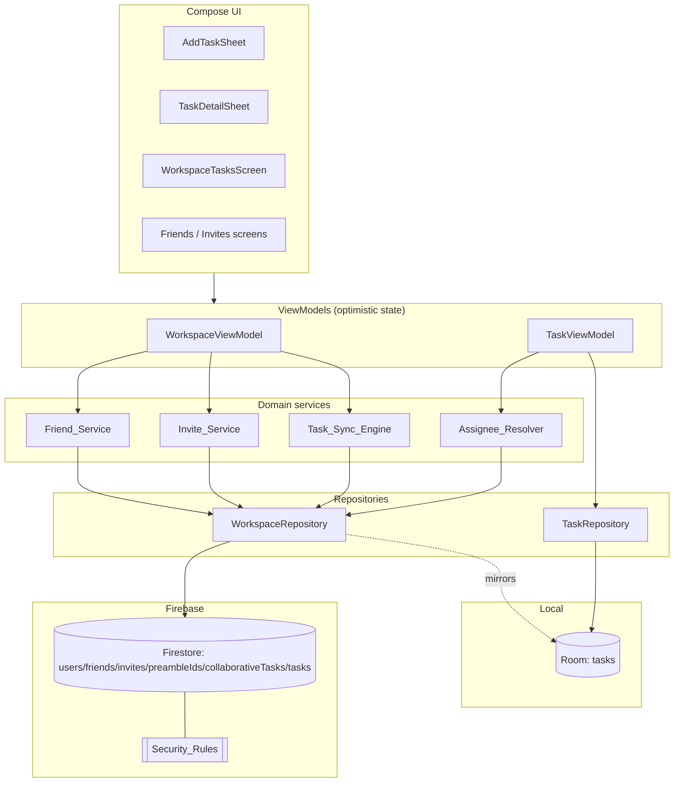
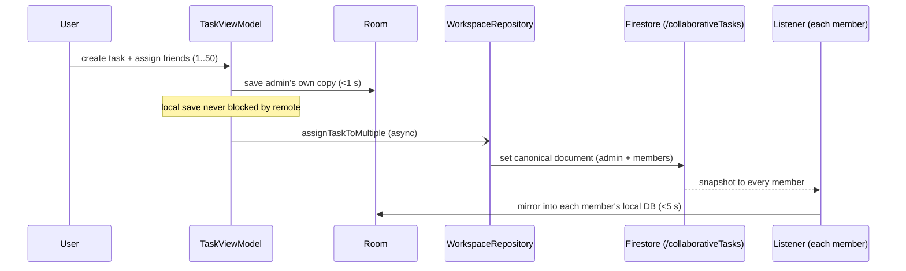
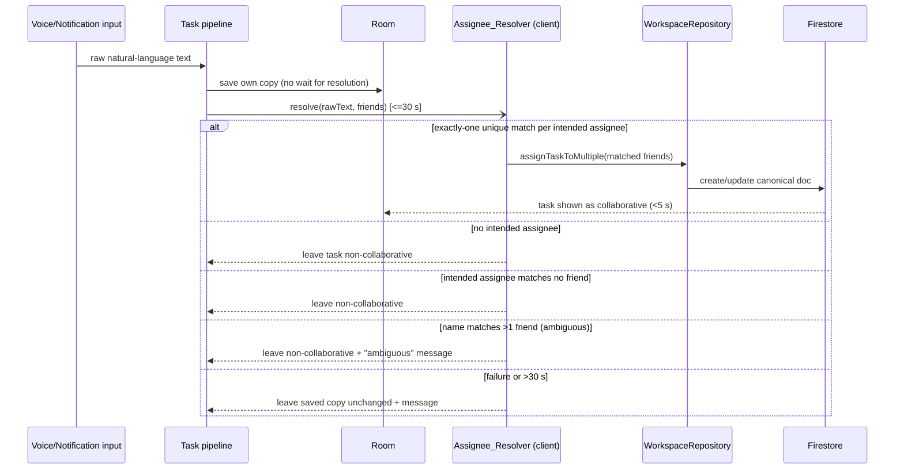
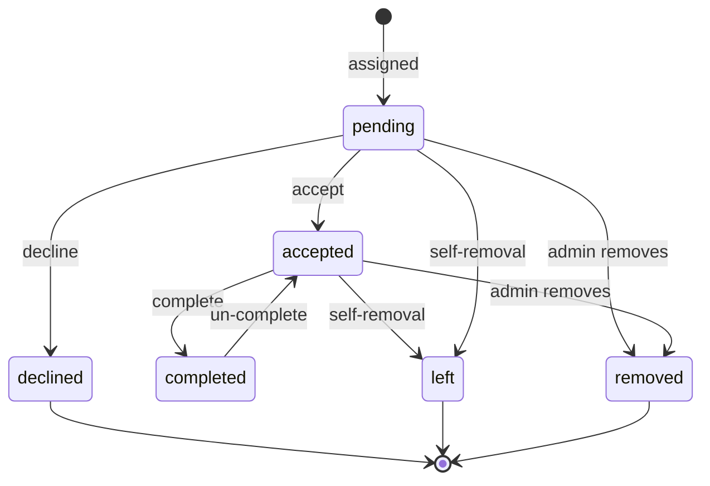
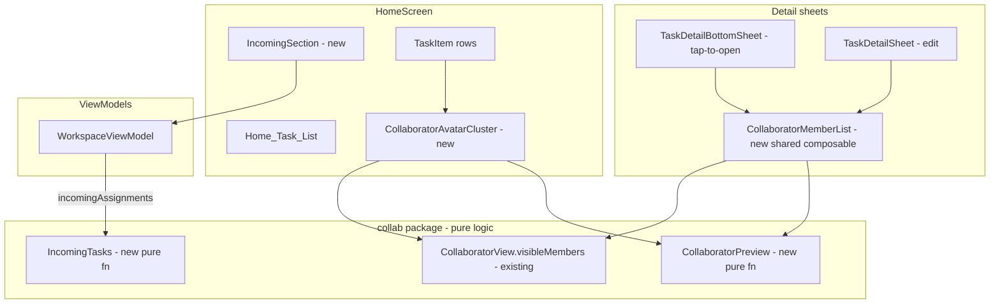

# Design Document

## Overview

This design rebuilds the friend-invite system and the collaborative-task system for the Preamble Android app so that they are fast, reliable, secure, and consistent with the live production data already stored in Firestore. It is organized around the components named in the requirements glossary (Friend_Service, Invite_Service, Task_Sync_Engine, Assignee_Resolver, Security_Rules) and maps each onto concrete Kotlin/Compose/Firestore building blocks that already exist in the codebase.

The work falls into five tracks:

1. **Friend and invite lifecycle** — discovery by Preamble ID, invite links, accept/decline/remove with optimistic UI and reciprocal records.
2. **Collaborative task lifecycle** — assignment from the create sheet, canonical-document propagation to assignees, per-member acceptance/completion, admin management (add/remove/transfer), and member self-removal.
3. **Assignee resolution** — a dedicated AI phase that runs after the user's own copy is saved, resolves natural-language assignees to friends, and no longer depends on the removed `aiResolveAssignees` Cloud Function.
4. **Resilience** — every backend interaction reverts optimistic UI on failure or timeout and never propagates an unhandled exception.
5. **Security rules** — a single, verified Firestore rule set that preserves all legacy (non-collaborative) behavior for live users, protects collaborative data to members only, and removes the prior overly-permissive task-read behavior.

### Current-state findings that drive the design

Investigation of the existing code surfaced several gaps between what is implemented and what the requirements demand. The design closes each:

| Area | Current state | Required change |
| --- | --- | --- |
| Assignee maximum | `WorkspaceRepository.MAX_ASSIGNEES = 20`; rules cap `memberUids.size() <= 21`, `assigneeUids.size() <= 20` | Raise to 50 assignees (51 members incl. admin) per Requirements 6.1, 6.5, 8.2 |
| Create-sheet selection | `AddTaskSheet` caps friend selection at 5 | Allow 1–50 selections (Requirement 6.1) |
| Assignee_Resolver | `AiParsingWorker.resolveAssigneeFriends` calls `CloudAiService.resolveAssignees` → `aiResolveAssignees` Cloud Function | Resolve client-side / through a path independent of that function (Requirement 9.9) |
| Ambiguity handling | Resolver returns every fuzzy name match | Treat a name matching >1 friend as ambiguous: no assignment + message (Requirement 9.7) |
| Resolver timeout | No explicit bound | Bound the phase to 30 s; on timeout leave task non-collaborative + message (Requirements 9.2, 9.8) |
| Friend-removal timeout | `removeFriend` has no time bound | Treat >10 s as failure and revert (Requirement 4.4) |
| Write timeout | No global bound | Treat >30 s writes as failed and revert optimistic UI (Requirement 14.5) |
| Member-status validation | `ALLOWED_MEMBER_STATUSES` excludes `left`/`removed`; rules allow all six | Keep client write-set as the four user-driven statuses while rules accept the full six terminal/non-terminal set (Requirement 8.4) |
| Rule verification | Single `firebase-firestore-rules.rules`; emulator test suite exists | Add documented verification comparing proposed vs. prior stable rules across all scopes (Requirements 15.7, 18) |

### Technology context

- **Client:** Kotlin 2.0.21, Jetpack Compose (BOM 2025.05.00), Room 2.7.1 (DB version 29), Navigation Compose, minSdk 24 / target 36.
- **Backend:** Firebase Firestore (named database `"preamble"`), Auth, Cloud Functions (TypeScript), FCM.
- **Local source of truth:** Room. A collaborative task has exactly one canonical Firestore document at `/collaborativeTasks/{taskId}`; Room mirrors it for the UI.
- **Existing test surface:** JUnit 4 (no JVM unit tests yet), and a Node `@firebase/rules-unit-testing` suite under `firebase-rules-tests/` that runs against the Firestore emulator.

## Architecture

### Component map



The named requirement components map onto code as follows:

- **Friend_Service / Invite_Service** → `WorkspaceRepository` (Firestore reads/writes for `preambleIds`, `users/{uid}/friends`, `users/{uid}/invites`) fronted by `WorkspaceViewModel` (optimistic state, validation, error messaging).
- **Task_Sync_Engine** → `WorkspaceRepository.getCollaborativeTasksFlow()` + `WorkspaceViewModel.synchronizeCollaborativeTasksToRoom()` (canonical document ⇄ Room mirror).
- **Assignee_Resolver** → a new client-side resolver invoked from the AI/voice/notification task pipeline (`AiParsingWorker`), replacing the `CloudAiService.resolveAssignees` Cloud Function dependency.
- **Security_Rules** → `firebase-firestore-rules.rules`.

### Optimistic-UI control flow

All friend and collaborative actions follow one pattern, already established in `WorkspaceViewModel`:

```mermaid
sequenceDiagram
    participant U as User
    participant VM as ViewModel
    participant L as Local state (StateFlow + Room)
    participant R as WorkspaceRepository
    participant F as Firestore

    U->>VM: action (accept / decline / remove / assign / complete)
    VM->>VM: snapshot previous state
    VM->>L: apply change immediately (<200 ms)
    VM->>R: launch backend op (with timeout)
    alt success within timeout
        R->>F: write
        F-->>R: ok
        Note over VM,L: keep optimistic state; listener reconciles
    else failure or timeout
        R-->>VM: Result.failure / timeout
        VM->>L: restore snapshot exactly
        VM->>U: error message
    end
```

Two timeouts are introduced via `kotlinx.coroutines.withTimeout`:

- **10 s** for friend removal (Requirement 4.4).
- **30 s** for any collaborative/friend write and for assignee resolution (Requirements 14.5, 9.2/9.8).

A timeout is treated identically to a backend failure: revert to the exact pre-action snapshot and surface a message.

### Assignment data flow



### Assignee-resolution flow (separate AI phase)



## Components and Interfaces

### Invite_Service (`WorkspaceRepository` + `WorkspaceViewModel`)

Responsible for friend discovery and the invitation lifecycle.

```kotlin
// Normalization is the single source of truth for Preamble IDs.
object PreambleId {
    fun normalize(raw: String): String = raw.trim().uppercase()
    fun isBlank(raw: String): Boolean = normalize(raw).isEmpty()
}

// Validation outcome used by both manual entry and invite-link entry.
sealed interface InviteValidation {
    data object Ok : InviteValidation
    data object EmptyId : InviteValidation
    data object SelfInvite : InviteValidation
    data object AlreadyFriends : InviteValidation
    data object AlreadyPending : InviteValidation
    data object NotFound : InviteValidation
}
```

`WorkspaceRepository` additions/changes:

- `suspend fun sendInvite(targetPreambleId, senderName, senderPreambleId): Result<Unit>` — extended to enforce **all** Requirement 1 checks before any write: normalize, reject empty (1.2), reject self (1.5), reject existing friend (1.6), reject duplicate pending request (1.7), reject unknown ID (1.4). The created `WorkspaceInvite` carries `senderUid`, `senderName`, `senderPreambleId` (Requirement 1.8).
- Duplicate-pending detection reads `users/{targetUid}/invites/{senderUid}` (the invite is keyed by sender uid, so a duplicate is a deterministic document existence check).

`WorkspaceViewModel` additions:

- `fun prefillFromInviteLink(uri: Uri)` — parses `https://preamble.theblankstate.com/invite/{Preamble_ID}`, validates the embedded ID is well-formed, and either pre-fills the add-friend field (2.2) or surfaces an "invalid invite link" message (2.4). Pre-filled submission runs the same validation path as manual entry (2.3).
- `fun buildInviteLink(): String` — `https://preamble.theblankstate.com/invite/${PreambleId.normalize(myPreambleId)}` (2.1).

### Friend_Service (`WorkspaceRepository` + `WorkspaceViewModel`)

- `acceptInvite` / `declineInvite` / `removeFriend` keep their batched reciprocal-write implementations.
- `removeFriend(friendUid)` in the ViewModel gains a **10 s timeout** (Requirement 4.4) and continues to block when shared tasks require resolution.
- `friendRemovalImpact(friendUid): FriendRemovalImpact` already partitions shared tasks into `administeredTasks` and `memberTasks`; the warning UI (Requirement 5.2) renders each by title and role, and `resolveTasksAndRemoveFriend` applies the chosen actions before deleting the friend record (5.7) and reverts on any failure (5.8).
- New guard: if the user confirms removal while any admin-owned affected task still lacks a completed transfer, removal is blocked with a message listing unresolved tasks by title (Requirement 5.6).

### Task assignment (`TaskViewModel` + `WorkspaceRepository`)

- `MAX_ASSIGNEES` raised to **50**. `assignTaskToMultiple` validates `1 <= distinctAssignees.size <= 50` and rejects oversized requests without creating a document (6.5, 6.6).
- The create path saves the admin's own Room copy first within 1 s, then asynchronously creates the canonical document (6.2, 6.3, 6.7). A canonical-create failure retains the local copy and surfaces a message (6.8).
- When no friend is assigned, no canonical document is created and the task stays a normal local task (6.4).

### Task_Sync_Engine (`WorkspaceRepository` + `WorkspaceViewModel`)

- `getCollaborativeTasksFlow()` listens on `collaborativeTasks where memberUidMap.{uid} == true`, maps each document into a `Task` via `documentToTask`, and filters terminal statuses.
- `synchronizeCollaborativeTasksToRoom` mirrors visible tasks into Room and prunes stale local assigned tasks, propagating canonical changes to each member within the 5 s window under normal connectivity (7.1, 7.5). A per-member mirror failure retains the last synced copy and surfaces a message (7.6).
- The canonical `task` payload includes title, description, tags, priority, deadline, recurrence, and subtasks copied from the admin's task at confirm time (7.2). AI-derived attributes that finalize later are written as a subsequent canonical update (7.3, 7.4).
- Per-member completion is tracked in `memberStates[uid].isCompleted`; the shared payload's `isCompleted` is always forced to `false` (7.7, 8.7).

### Member actions (`WorkspaceRepository` + `WorkspaceViewModel`)

- `updateCollabAssignmentStatus` — accept/decline/complete; enforces the pending→accepted/declined and accepted→completed transitions (10.1–10.5) and writes only `memberStates[uid]` (8.6).
- `updateCollabTaskSubtasks` — shared subtask edits persisted to the canonical document (10.6).
- `removeCollaborator`, `transferOwnership`, `leaveCollaborativeTask` — transaction-based admin/member operations (Requirements 11, 12).
- All of these revert local state and message on failure (10.7, 11.6, 12.5).

### Collaborator view (`TaskDetailSheet`)

Renders, for a collaborative task: members whose status is `pending`/`accepted`/`completed` (excluding `declined`/`left`/`removed`), the admin indicator, each member's completion flag, and each member's acceptance status shown separately from completion (Requirements 13.1–13.4). Admin sees per-member remove + transfer controls; non-admin members see a Self_Removal control; the admin sees no direct Self_Removal control (13.5–13.7).

### Assignee_Resolver (client-side)

```kotlin
sealed interface AssigneeResolution {
    data class Assigned(val friends: List<Friend>) : AssigneeResolution // unique matches
    data object NoAssignee : AssigneeResolution                          // none intended
    data object Unmatched : AssigneeResolution                           // intended, no friend
    data class Ambiguous(val term: String) : AssigneeResolution          // term matches >1 friend
    data object Failed : AssigneeResolution                              // error / timeout
}

interface AssigneeResolver {
    suspend fun resolve(rawText: String, friends: List<Friend>): AssigneeResolution
}
```

The resolver runs **after** the own-copy save, client-side, within a 30 s budget (`withTimeout`), and does not call the `aiResolveAssignees` Cloud Function (9.1, 9.2, 9.9). Matching detects assignment intent (markers such as "assign", "send to", "share with"), then for each intended term resolves friends by normalized name / Preamble ID. A term that resolves to exactly one friend is assigned; zero intended → `NoAssignee`; an intended term with no friend → `Unmatched`; a term matching more than one friend → `Ambiguous` (9.3, 9.5, 9.6, 9.7). Only `Assigned` triggers `assignTaskToMultiple`; every other outcome leaves the task non-collaborative, and `Ambiguous`/`Failed` additionally surface a message (9.4, 9.8).

### Security_Rules (`firebase-firestore-rules.rules`)

Structure is retained and adjusted:

- Collaborative-document size caps raised to `memberUids.size() <= 51` and `assigneeUids.size() <= 50`.
- Legacy `/tasks/{taskId}` and per-user collections keep their existing owner-scoped rules unchanged so live users are unaffected (Requirement 15).
- `/collaborativeTasks/{taskId}`: get/list gated on membership; create gated on admin == requester and a valid schema-v2 document; update allowed for admin metadata, own member-state, own subtask edit, or self-removal; delete admin-only (Requirement 16).
- Friend/invite/preambleIds rules enforce per-account ownership with the narrowly-scoped reciprocal exceptions for accepting an invite and clearing one's own side of a friendship (Requirement 17).

### Security-rule verification (Requirement 18)

Because two rule sets are named inputs — the currently deployed rules and the prior stable rules — verification is a documented comparison rather than a runtime feature. It is implemented as an expansion of the existing Node `@firebase/rules-unit-testing` suite plus a written verification matrix:

- For each scope (Legacy_Task, Collaborative_Task, per-user collections, friend/invite/preambleIds), enumerate every read/write the published app performs and assert the proposed rules permit exactly the authorized actors and deny the rest (18.1, 18.3, 18.4).
- Assert no task is readable by a non-owner/non-member, demonstrating the prior overly-permissive read is gone (18.2).
- Assert prior-stable permissions for legacy paths and per-user collections are preserved (15.7, 18.5).
- Record any operation the app performs but the rules deny as a gap entry `{path, operation, actorRole, expectedOutcome}` (18.6), and record a pass/fail per check (18.7).

## Data Models

### Canonical collaborative task document (`/collaborativeTasks/{taskId}`)

```jsonc
{
  "schemaVersion": 2,
  "taskId": "uuid",
  "adminUid": "uid",
  "adminName": "Display Name",
  "memberUids": ["adminUid", "assigneeUid1", "..."],   // includes admin, no dups, size 1..51
  "assigneeUids": ["assigneeUid1", "..."],             // excludes admin, subset of memberUids, no dups, size 0..50
  "memberUidMap": { "adminUid": true, "assigneeUid1": true }, // keys == memberUids exactly
  "memberStates": {
    "adminUid":   { "uid": "...", "name": "...", "role": "admin",  "status": "accepted", "isCompleted": false, "completedTimestamp": null, "assignedTimestamp": 0 },
    "assigneeUid1": { "uid": "...", "name": "...", "role": "member", "status": "pending", "isCompleted": false, "completedTimestamp": null, "assignedTimestamp": 0 }
  },
  "task": { /* serialized Task payload, isCompleted forced false, local collab fields stripped */ },
  "createdAt": 0,
  "updatedAt": 0
}
```

Invariants (enforced in both `WorkspaceRepository` construction and Security_Rules):

- Exactly one `adminUid`; `adminUid ∈ memberUids` (8.1, 8.2).
- `memberUids` contains the admin, has no duplicates, size ≤ 51 (50 assignees + admin) (8.2).
- `assigneeUids ⊆ memberUids`, `adminUid ∉ assigneeUids`, no duplicates (8.3).
- `memberStates` keys == `memberUids` exactly; each `status ∈ {pending, accepted, completed, declined, left, removed}`; each `isCompleted ∈ {true, false}` (8.4).
- `memberUidMap.keys() == memberUids` (queryability + rule consistency).

### Local `Task` entity (Room, DB v29)

The existing `Task` entity carries the local projection of collaboration state; no schema migration is required for this feature. Relevant fields:

| Field | Meaning |
| --- | --- |
| `collabAdminUid` / `collabAdminName` | non-null ⇒ task is collaborative; identifies admin |
| `collabAssigneesJson` | serialized `List<CollabAssigneeStatus>` (uid, name, status, isCompleted, completedTimestamp, assignedTimestamp) |
| `assignmentStatus` | current user's own member status |
| `isCompleted` / `completedTimestamp` | current user's own completion (mapped from `memberStates[uid]`) |
| `subtasksJson` | shared subtasks |

`documentToTask` projects the canonical document into a `Task` for the current user (own status/completion from `memberStates[uid]`); `taskPayload` serializes the admin's `Task`, strips the eight local-only collab fields, and forces `isCompleted=false`.

### Friend, Invite, and Preamble ID directory

```kotlin
data class Friend(val uid, val name, val preambleId, val addedAt, val productivityPoints)
data class WorkspaceInvite(val id, val senderUid, val targetUid, val senderName, val senderPreambleId, val timestamp)
```

- Friend records: `/users/{uid}/friends/{friendUid}` (reciprocal pair).
- Invite records: `/users/{targetUid}/invites/{senderUid}` (keyed by sender, making duplicate detection a single existence check).
- Public directory: `/preambleIds/{NORMALIZED_ID}` → `{ uid, name, preambleId }`, written by the owner only.

### Member status state machine



`declined`, `left`, and `removed` are terminal for visibility purposes (filtered out of lists and the collaborator view).

## Correctness Properties

*A property is a characteristic or behavior that should hold true across all valid executions of a system — essentially, a formal statement about what the system should do. Properties serve as the bridge between human-readable specifications and machine-verifiable correctness guarantees.*

The properties below were derived from the prework analysis, then consolidated to remove redundancy (the many "revert on failure", "optimistic transition", and "data-model invariant" criteria each collapse into a single comprehensive property). Firestore Security_Rules behavior (Requirements 15–18) is verified by emulator-based integration tests and documented verification, not by property-based tests, and so is intentionally excluded here.

### Property 1: Preamble ID normalization is idempotent

*For any* string, normalizing it yields a value with no leading/trailing whitespace and no lowercase letters, and normalizing an already-normalized value returns it unchanged (`normalize(normalize(x)) == normalize(x)`).

**Validates: Requirements 1.1**

### Property 2: Invite-link round-trip

*For any* Preamble ID, building an invite link and then parsing it recovers the normalized ID; and *for any* string that is not a well-formed invite link, parsing returns an "invalid link" result and never a usable ID.

**Validates: Requirements 2.1, 2.2, 2.4**

### Property 3: Invite validation gates request creation

*For any* submitted Preamble ID, friend set, and pending-invite set, the validation returns `Ok` only when the normalized ID is non-empty, is not the user's own ID, is not an existing friend, and has no pending request; in every rejecting case no Friend_Request is produced and the matching rejection reason is returned.

**Validates: Requirements 1.2, 1.5, 1.6, 1.7**

### Property 4: Created invite carries sender identity

*For any* sender uid, name, and Preamble ID, a created Friend_Request records the sender's uid, the sender's display name, and the sender's normalized Preamble ID.

**Validates: Requirements 1.8**

### Property 5: Canonical collaborative document invariants

*For any* admin uid and any set of 1–50 distinct assignee uids, the constructed canonical document satisfies: exactly one `adminUid`; `memberUids` contains the admin, has no duplicates, and has size ≤ 51; `assigneeUids` is a duplicate-free subset of `memberUids` that excludes the admin; `memberUidMap` keys equal `memberUids` exactly; `memberStates` has exactly one entry per member (and none for non-members), each with a status in {pending, accepted, completed, declined, left, removed} and a boolean completion flag; the admin's state is `accepted` and every assignee's state is `pending`.

**Validates: Requirements 6.3, 8.1, 8.2, 8.3, 8.4, 8.5**

### Property 6: Collaborative iff assignees present

*For any* task creation, a canonical Collaborative_Task document is created exactly when one or more friends are assigned; with zero assigned friends the task remains a normal local task and no document is created.

**Validates: Requirements 6.4**

### Property 7: Assignee-count boundary

*For any* requested assignee list, assignment succeeds when the distinct count is between 1 and 50 and is rejected (with no document created or modified) when the distinct count exceeds 50 — both at creation time and when an admin adds members to an existing task.

**Validates: Requirements 6.5, 6.6, 11.9**

### Property 8: Task payload copy fidelity and shared-completion exclusion

*For any* task, projecting the serialized canonical payload back into a task preserves title, description, tags, priority, deadline time, recurrence settings, and subtasks equal to the source, and the payload's shared `isCompleted` is always `false` (completion is per-member only).

**Validates: Requirements 7.2, 7.7**

### Property 9: Single-member state changes are isolated

*For any* `memberStates` map and any target member, changing that member's status/completion updates only that member's entry and leaves every other member's entry identical.

**Validates: Requirements 8.6**

### Property 10: Member status transition guards

*For any* member status, accepting or declining is permitted only from `pending` and completing is permitted only from `accepted`; a permitted transition produces the expected status (and, for completion, sets the completion flag true with a UTC completion timestamp), while a non-permitted source status leaves the member's status and completion flag unchanged.

**Validates: Requirements 10.1, 10.2, 10.3, 10.4, 10.5**

### Property 11: Optimistic transitions reflect immediately in local state

*For any* current local state, an accept/decline/remove-member/add-member/self-removal/assignment action produces the expected post-state in local state before the backend operation completes (e.g., accepted invite leaves the incoming list and enters the friend list; a removed member leaves the member and assignee lists).

**Validates: Requirements 3.3, 3.5, 4.1, 10.1, 10.2, 11.2, 11.8, 12.2**

### Property 12: Failure or timeout reverts to the exact prior state

*For any* action and *for any* backend failure or timeout (10 s for friend removal, 30 s for collaborative/friend writes), the affected local state is restored exactly to the snapshot taken immediately before the action — including list ordering — every record unaffected by the action is left untouched, and an error message is surfaced.

**Validates: Requirements 3.6, 3.7, 4.3, 4.4, 5.5, 5.8, 6.8, 7.6, 10.7, 11.6, 12.5, 14.2, 14.3, 14.5**

### Property 13: Friend-removal impact partition

*For any* set of collaborative tasks and any friend, the computed impact partitions exactly the tasks shared with that friend into admin-owned tasks (current user is admin) and member tasks (current user is non-admin), with the two sets disjoint and together equal to the full shared set.

**Validates: Requirements 5.1**

### Property 14: Ownership transfer preserves invariants

*For any* collaborative task and any target, transferring ownership to a current member sets that member as the sole admin, retains the previous admin as an `accepted` member, and preserves all document invariants of Property 5; transferring to a non-member is rejected and leaves admin/member/assignee records unchanged.

**Validates: Requirements 11.4, 11.5**

### Property 15: Self-removal affects only the leaving member

*For any* collaborative task in which the user is a non-admin member, self-removal removes only that user from `memberUids`, `assigneeUids`, and `memberUidMap`, sets only that user's status to `left`, and leaves every other member's records unchanged; a self-removal attempt by the admin is rejected.

**Validates: Requirements 12.2, 12.3, 12.4**

### Property 16: Collaborator view excludes terminal members

*For any* set of member states, the collaborator view shows exactly the members whose status is `pending`, `accepted`, or `completed` and excludes every member whose status is `declined`, `left`, or `removed`.

**Validates: Requirements 13.1**

### Property 17: Assignee resolution classification

*For any* natural-language text and friend set, the resolver yields: `Assigned` with the uniquely matched friends when every intended assignee resolves to exactly one friend; `NoAssignee` when no assignment is intended; `Unmatched` when an intended assignee matches no friend; and `Ambiguous` when an intended name matches more than one friend. Only `Assigned` creates or updates a Collaborative_Task.

**Validates: Requirements 9.3, 9.5, 9.6, 9.7**

### Property 18: Error handling is total

*For any* backend failure or denied operation surfaced to a friend or collaborative action handler, the handler completes without propagating an unhandled exception (it resolves to a handled error result).

**Validates: Requirements 14.4**

## Error Handling

Error handling is uniform and built on the optimistic-UI pattern, so that no Firestore failure crashes the app or leaves local state inconsistent (Requirement 14).

- **Snapshot-and-revert.** Before any optimistic mutation, the ViewModel captures the exact prior `StateFlow` values (and, where Room is touched, the prior `Task` rows). On `Result.failure` or timeout, it restores those snapshots verbatim and emits a `WorkspaceUiState.Error` with a human-readable message (14.2, 14.3). This is the mechanism behind Property 12.
- **Timeouts.** Friend removal is wrapped in `withTimeout(10_000)`; all other collaborative/friend writes and the assignee-resolution phase are wrapped in `withTimeout(30_000)`. A `TimeoutCancellationException` is caught and mapped to the same revert path as a failure (4.4, 14.5, 9.8).
- **Listener failures.** Each Firestore snapshot listener (`friends`, `invites`, `collaborativeTasks`) is collected with `.catch { reportListenerFailure(label, it) }`, which logs the error, retains the last-loaded data for that data set, and emits an error message naming the data set — without tearing down the app (14.1).
- **Total handling.** Every repository entry point returns `Result<T>` via `runCatching`, and every ViewModel launch handles both branches; no failure path rethrows to the coroutine root (14.4). This is the basis of Property 18.
- **Friend-removal orchestration.** `resolveTasksAndRemoveFriend` applies each chosen action (transfer for admin-owned, self-removal for member tasks) and deletes the friend record only after all actions succeed; any failure restores the friend and leaves every affected task in its pre-attempt state (5.7, 5.8). A confirm attempt with an unresolved admin-owned task is blocked with a message listing the unresolved titles (5.6).
- **User-facing messages.** A `Throwable.userMessage(default)` helper maps known Firestore exceptions (notably `PERMISSION_DENIED`) to friendly text and falls back to a provided default, so denied writes read as "could not be saved" rather than raw exceptions.

## Testing Strategy

The feature is tested with three complementary layers. Property-based testing applies to the pure client-side logic (normalization, document construction, state transitions, resolver classification, optimistic revert); Firestore Security_Rules are verified with the emulator-based integration suite; UI and timing concerns use example/instrumented tests.

### Property-based tests (client logic)

- **Library:** add **jqwik** (`net.jqwik:jqwik`) as a `testImplementation` dependency for JVM unit tests, alongside JUnit 5. jqwik is the standard property-based testing library for the JVM/Kotlin and integrates with Gradle's `test` task; we will not hand-roll property testing. (The current module only has JUnit 4 and no JVM unit tests, so this adds the JVM test source set wiring.)
- **Pure-logic extraction:** to make the logic testable without Firebase, the document-construction (`createCollaborativeDocument`), payload (`taskPayload`/`documentToTask`), normalization, validation, member-state transition, resolver-classification, and impact-partition logic are factored into pure functions that do not require a live `FirebaseFirestore` instance. The ViewModel revert logic is exercised against an in-memory fake repository that can be told to fail or time out.
- **Configuration:** each property test runs a **minimum of 100 iterations** (jqwik `@Property(tries = 100)` or higher).
- **Tagging:** each property test is annotated with a comment of the form
  `// Feature: collaborative-tasks, Property {n}: {property text}`
  and implements exactly one of the 18 properties above (one property → one property test).
- **Generators:** custom generators produce arbitrary admin/assignee uid sets (including the 0, 1, 50, and 51 boundaries), member-state maps with mixed statuses, tasks with varied content (Unicode titles, empty/blank descriptions, large subtask lists), invite/friend lists, and natural-language strings with and without assignment markers and with duplicate friend names.

### Integration tests (Firestore Security_Rules — Requirements 15–18)

- Extend the existing Node `@firebase/rules-unit-testing` suite (`firebase-rules-tests/firestore.rules.test.mjs`) run via the Firestore emulator.
- Cover, with 1–3 representative actors each: legacy task owner isolation and unauthenticated denial (15.1–15.4); preservation of per-user collection permissions (15.5, 18.5); collaborative get/list membership gating and non-member denial demonstrating the overly-permissive read is gone (16.1, 16.2, 18.2); admin-only create/edit/delete and the own-member-state / own-subtask / self-removal update paths (16.3–16.10); friend/invite/preambleIds ownership and reciprocal exceptions (17.1–17.7); and role-based permit/deny checks for collaborative operations (18.3, 18.4).
- The raised size caps (`memberUids ≤ 51`, `assigneeUids ≤ 50`) get explicit boundary cases at 50 and 51 assignees.

### Verification matrix (Requirement 18)

- A documented comparison of the proposed rules against the prior stable rules across the four scopes (Legacy_Task, Collaborative_Task, per-user collections, friend/invite/preambleIds), recording every behavioral difference (18.1), a gap entry `{path, operation, actorRole, expectedOutcome}` for any app operation the rules deny (18.6), and a pass/fail result per check (18.7). This lives alongside the spec as the deliverable that gates deployment.

### Example and instrumented tests

- **Example unit tests** cover specific branches that are not universal: directory hit/miss for invite send (1.3, 1.4), duplicate-pending rejection (1.7), AI-attribute timing cases (7.3, 7.4), resolver failure/timeout messaging (9.8), and friend-removal block/orchestration (5.6, 5.7).
- **Compose UI / instrumented tests** verify rendering and the ≤ 200 ms / ≤ 1 s timing-sensitive behaviors that property tests do not assert: incoming-list and empty-state rendering (3.1, 3.2), the 1–50 friend selector (6.1), local-save-within-1s without blocking (6.2, 6.7), the collaborator-view indicators and role-based controls (13.2–13.7), and listener-error messaging (14.1).
- **Smoke check** confirms the assignee resolver runs client-side and does not call the removed `aiResolveAssignees` Cloud Function (9.9).

---

# Design Document — Iteration 2: UI Extensions

This section extends the implemented feature with the four UI requirements added in Iteration 2 (Requirements 19–22). It builds entirely on the architecture, components, and pure-logic packages described above (Kotlin/Compose, Room DB v29, the side-effect-free `com.theblankstate.preamble.collab` package, `WorkspaceViewModel`/`TaskViewModel`, `WorkspaceRepository`). No existing design content is changed; this section only adds the new surfaces and the logic behind them, and reconciles one discrepancy uncovered during investigation.

## Overview (Iteration 2)

The four changes are all presentation-layer, and three of them reuse logic that already exists:

1. **Req 19 — Incoming_Section on the Home_Task_List**: surface the existing incoming pending shared-task flow (`WorkspaceViewModel.incomingAssignments` + `acceptAssignment`/`declineAssignment`) at the top of the home list with inline Accept/Decline, without disturbing the existing `WorkspaceTasksScreen` "Incoming" tab.
2. **Req 20 — Collaborator status in the tap-to-open Task_Detail_Sheet**: move/replicate the collaborator view (the `CollaboratorView.visibleMembers` filter) into the sheet that actually opens on tap. **Investigation found this is currently rendered in the wrong sheet** (see below).
3. **Req 21 — Collapsible collaborator list**: a preview-of-3 + expand/collapse control in the detail sheet, driven by a single pure preview/overflow function.
4. **Req 22 — Avatar_Cluster on task rows**: a compact cluster (up to 3 + "+N") on collaborative `TaskItem` rows, driven by the same pure preview/overflow function.

## Investigation: which sheet opens on tap (Requirement 20 root cause)

Requirement 13 specified the collaborator view for "the Task_Create_Sheet detail view", and task 9.2 implemented it in `ui/components/TaskDetailSheet.kt`. Requirement 20 reports that the collaborator view is **not visible** when a user taps a task. The Compose wiring confirms the discrepancy:

**Where a tap goes.** In `ui/components/TaskItem.kt`, the task row's gesture handler is:

```kotlin
.combinedClickable(
    enabled = isEditable || onDetail != null,
    onClick    = { onDetail?.invoke() ?: run { showDetailDialog = true } },
    onLongClick = { onDetail?.invoke() ?: run { showDetailDialog = true } }
)
```

So a **tap invokes `onDetail`**, not `onEdit`.

**What `onDetail` opens.** In `ui/screens/HomeScreen.kt`, every row is wired with two distinct callbacks:

| Callback | State set | Sheet shown |
| --- | --- | --- |
| `onDetail = { taskToShowDetail = task }` | `taskToShowDetail` | **`TaskDetailBottomSheet`** (read-only, `ui/components/TaskDetailBottomSheet.kt`) |
| `onEdit = { taskToEdit = task }` | `taskToEdit` | `TaskDetailSheet` (edit sheet, `ui/components/TaskDetailSheet.kt`) |

`onEdit` is reachable only from the row's overflow menu ("Details"/edit affordance) and from the `TaskDetailBottomSheet`'s own "Edit" button (`HomeScreen.kt`: `onEdit = { taskToEdit = task; taskToShowDetail = null }`).

**Root cause.** The collaborator view + role controls from task 9.2 live in `TaskDetailSheet.kt` (the **edit** sheet, opened via `onEdit`). The sheet that opens on **tap** is `TaskDetailBottomSheet.kt` (the read-only detail sheet, opened via `onDetail`), and it has **no** collaborator section. Confirmed by reference search: `CollaboratorView.visibleMembers` is used only in `TaskDetailSheet.kt` (around the "Assigned Members & Status" `EditSection`), and nowhere in `TaskDetailBottomSheet.kt`. Hence the user taps a task, sees the read-only sheet, and the collaborator status is absent — it only appears if they go on to edit the task.

**Reconciliation plan.** Treat `TaskDetailBottomSheet` as the canonical **Task_Detail_Sheet** for the collaborator view (it is the tap-to-open surface named in Requirement 20). Add a read-only collaborator section to `TaskDetailBottomSheet` that reuses the exact same `CollaboratorView.visibleMembers(task.collabAssignees) { it.status }` filter already used by `TaskDetailSheet`, plus the admin row derived from `task.collabAdminUid`/`collabAdminName`. The existing collaborator block in `TaskDetailSheet` (which also carries the admin's role controls — remove/transfer/leave) is retained for the edit flow; the two surfaces share the same filtering and member-row rendering through a common composable so they cannot drift. Requirement 13's role-control behavior is unchanged and stays in the edit sheet; Requirement 20 only requires the read-only **status** display (members, admin indicator, completion, acceptance) in the tap-to-open sheet.

## Architecture (Iteration 2)



The new presentation pieces sit on top of unchanged ViewModel/repository logic. The two genuinely new bits of *logic* (the Incoming partition and the preview/overflow math) are added as pure functions in the existing `collab` package so they are testable with the established jqwik suite and cannot accidentally depend on Firestore or Android.

## Components and Interfaces (Iteration 2)

### Incoming_Section (Req 19) — `HomeScreen` + existing `WorkspaceViewModel`

`HomeScreen` already obtains a `WorkspaceViewModel` (`viewModel()` at the top of the composable) and already uses it for the edit sheet's `removeMember`/`transferOwnership`/`leaveTask`. `MainActivity.PreambleApp` already derives a pending count exactly as `incomingAssignments.count { it.assignmentStatus == "pending" }`, confirming that the current user's own Member_Status is projected onto `Task.assignmentStatus` by `TaskProjection`/`documentToTask`.

Design:

- Source the section from `workspaceViewModel.incomingAssignments` (the existing flow: collaborative tasks where `collabAdminUid != currentUid`), narrowed by a new pure helper to those whose **own** status is `pending`:

```kotlin
// collab/IncomingTasks.kt — pure, no Android/Firestore
object IncomingTasks {
    /** Own Member_Status that places a collaborative task in the Home Incoming_Section. */
    const val INCOMING_STATUS = "pending"

    /** Tasks shown in the Incoming_Section: collaborative tasks whose own status is pending. */
    fun incoming(tasks: List<Task>): List<Task> =
        tasks.filter { it.assignmentStatus == INCOMING_STATUS }

    /** Header is shown iff at least one such task exists (Req 19.8). */
    fun hasIncoming(tasks: List<Task>): Boolean = incoming(tasks).isNotEmpty()
}
```

- Render an `IncomingSection` composable as the first item of the home `LazyColumn` (above the existing date groups). It shows a section header only when `IncomingTasks.hasIncoming(...)` is true (19.1, 19.8). Each row shows the task title plus an inline Accept and Decline `IconButton`/`TextButton` pair (19.2).
- Accept calls `workspaceViewModel.acceptAssignment(task)`; Decline calls `workspaceViewModel.declineAssignment(task)`. These already perform the optimistic `<200 ms` update before the backend write, the pending-only transition guard, and the exact-state revert on failure/timeout (19.3–19.7 reuse Requirements 10/14 behavior). After accept, the task's own status becomes `accepted`, so `IncomingTasks.incoming` no longer returns it and it falls through to the normal Home list (19.4); after decline it is filtered out entirely (19.5).
- The existing `WorkspaceTasksScreen` "Incoming" tab (Tab index 4 in `PreambleApp`) is untouched and continues to read the same `incomingAssignments` flow and the same accept/decline methods, preserving its behavior (19.9).

Note: `incomingAssignments` currently includes non-admin tasks of any status; the Home section deliberately re-narrows to `pending` via `IncomingTasks.incoming` rather than changing the shared flow, so the Workspace tab is unaffected.

### Collaborator section in the tap-to-open sheet (Req 20) — `TaskDetailBottomSheet`

- Add a read-only "Collaborators" section to `TaskDetailBottomSheet`, shown only when the task is collaborative (`task.collabAdminUid != null || task.collabAssignees.isNotEmpty()`), mirroring the guard already used in `TaskDetailSheet`.
- Membership shown = admin row (from `collabAdminUid`/`collabAdminName`) plus `CollaboratorView.visibleMembers(task.collabAssignees) { it.status }`, i.e. exactly `pending`/`accepted`/`completed`, excluding `declined`/`left`/`removed` (20.1, reusing the existing Property 16 filter).
- Each row indicates: the Admin (badge on the admin row, 20.2), completion (`isCompleted` ⇒ a completed indicator, 20.3), and acceptance status (`status == "pending"` vs `"accepted"`) rendered as a separate chip/label from the completion indicator (20.4).
- This section is **read-only**: it carries no remove/transfer/leave controls (those remain in the edit `TaskDetailSheet`, Requirement 13.5–13.7).

### Shared collaborator-list composable (Req 20 + 21) — `CollaboratorMemberList`

To keep the tap-to-open sheet and the edit sheet consistent and to host the collapsible behavior once, extract a single composable:

```kotlin
@Composable
fun CollaboratorMemberList(
    adminUid: String?,
    adminName: String?,
    assignees: List<CollabAssigneeStatus>,
    currentUserUid: String?,
    showRoleControls: Boolean,            // true only in the edit sheet
    onRemoveMember: ((String) -> Unit)? = null,
    onTransferOwnership: ((String) -> Unit)? = null,
    onLeave: (() -> Unit)? = null,
)
```

- It computes the visible members via `CollaboratorView.visibleMembers`, prepends the admin row, and applies the collapsible preview from `CollaboratorPreview` (below).
- `TaskDetailBottomSheet` uses it with `showRoleControls = false`; `TaskDetailSheet` uses it with `showRoleControls = true` and forwards the existing `onRemoveCollabMember`/`onTransferCollabOwnership`/`onLeaveCollabTask` callbacks already wired in `HomeScreen`. This guarantees both sheets render the same membership and cannot drift.

### Collapsible collaborator list (Req 21) — `CollaboratorPreview` pure function

```kotlin
// collab/CollaboratorPreview.kt — pure, no Android/Firestore
object CollaboratorPreview {
    /** Member_Preview_Count (Req 21 / glossary): collapsed preview size. */
    const val PREVIEW_COUNT = 3

    data class Preview<T>(
        val shown: List<T>,     // members rendered in the current state
        val overflow: Int,      // hidden count when collapsed (0 when expanded or small)
        val canExpand: Boolean, // an expand/collapse affordance is offered
    )

    /** total <= PREVIEW_COUNT -> full list, no control; otherwise preview of 3 (collapsed) or all (expanded). */
    fun <T> preview(visible: List<T>, expanded: Boolean): Preview<T> {
        val n = visible.size
        return when {
            n <= PREVIEW_COUNT -> Preview(visible, 0, canExpand = false)
            expanded           -> Preview(visible, 0, canExpand = true)
            else               -> Preview(visible.take(PREVIEW_COUNT), n - PREVIEW_COUNT, canExpand = true)
        }
    }
}
```

- `CollaboratorMemberList` holds a local `var expanded by remember { mutableStateOf(false) }` and renders `CollaboratorPreview.preview(visibleMembers, expanded)`. When `canExpand` is true it shows an expand control (collapsed) or a collapse control (expanded); toggling flips `expanded` (21.1–21.3). When the visible count is ≤ 3 the full list renders with no control (21.4). Expanding renders the full `CollaboratorView.visibleMembers` output (21.2).
- The "visible" input is always the `pending`/`accepted`/`completed` set (terminal members already excluded), so the preview math composes with the Requirement 16 filter.

### Avatar_Cluster on task rows (Req 22) — `CollaboratorAvatarCluster` + `TaskItem`

Investigation note: there is **no** existing avatar-cluster composable on the task row. `TaskItem.kt` renders no collaborator avatars today. The existing avatar conventions in the codebase are (a) initials-in-a-circle (`WorkspaceTasksScreen.kt`: a 32.dp `Box` with `CircleShape` background and a single-letter `Text`) and (b) DiceBear `AsyncImage` seeded by `preambleId` (`WorkspaceScreen.kt`/`WorkspaceTasksScreen.kt`). The cluster is designed as a new composable consistent with the initials-circle convention (it needs no network image and scales to small sizes), reusing the same color/shape tokens.

```kotlin
@Composable
fun CollaboratorAvatarCluster(
    task: Task,
    modifier: Modifier = Modifier,
)
```

Design:

- Renders nothing for a non-collaborative task or one with no visible members (`task.collabAdminUid == null && task.collabAssignees.isEmpty()`), satisfying 22.5 and the ≥1-member precondition of 22.1.
- The displayed set is the admin row plus `CollaboratorView.visibleMembers(task.collabAssignees) { it.status }` (terminal members excluded), then reduced with `CollaboratorPreview.preview(displayed, expanded = false)`: it draws up to `PREVIEW_COUNT (3)` overlapping initials-circles (`shown`) and, when `overflow > 0`, a trailing "+N" chip where `N == overflow == max(0, displayedCount - 3)` (22.2, 22.3).
- Each individual avatar is styled by status: `accepted`/`completed` use the filled/primary treatment; `pending` uses a muted/outlined treatment — a visible distinction (22.4). The status→style mapping is a small pure helper so the distinction is unit-checkable.
- The cluster is placed on the `TaskItem` row (compact, end-aligned in the row's header area) and does not alter the row's `combinedClickable`, completion toggle, or the existing completion-driven reordering of the Home list (22.6).

## Data Models (Iteration 2)

No schema or entity changes. Iteration 2 reads only fields that already exist on the local `Task` entity:

- `collabAdminUid` / `collabAdminName` — collaborative marker + admin identity (admin row, admin badge).
- `collabAssignees: List<CollabAssigneeStatus>` (derived from `collabAssigneesJson`) — each carries `uid`, `name`, `status`, `isCompleted`, timestamps, consumed by `CollaboratorView.visibleMembers`, the preview, and the avatar cluster.
- `assignmentStatus` — the current user's own Member_Status, used by `IncomingTasks.incoming` to select the Home Incoming_Section (own status `pending`).

The two new pure functions (`IncomingTasks`, `CollaboratorPreview`) and the new `CollaboratorView` consumers live in the existing pure `collab` package; `CollaboratorMemberList` and `CollaboratorAvatarCluster` are new Compose components in `ui/components`. `IncomingSection` is a new private composable in `HomeScreen.kt`.

## Correctness Properties (Iteration 2)

*A property is a characteristic or behavior that should hold true across all valid executions of a system — essentially, a formal statement about what the system should do. Properties serve as the bridge between human-readable specifications and machine-verifiable correctness guarantees.*

Following the prework analysis and reflection, most Iteration 2 acceptance criteria reuse properties already defined above and add no new property:

- **Req 19.3–19.7** (optimistic accept/decline, pending-only guard, exact-state revert) are already covered by **Property 10** (status transition guards), **Property 11** (optimistic transitions reflect immediately), and **Property 12** (failure/timeout reverts to exact prior state) — the Home Incoming_Section calls the same `WorkspaceViewModel.acceptAssignment`/`declineAssignment` paths.
- **Req 20.1 and 21.2** (the visible-member set: `pending`/`accepted`/`completed`, terminal excluded) are already covered by **Property 16** (collaborator view excludes terminal members) via `CollaboratorView.visibleMembers`; only the rendering surface changes.

Two genuinely new pure functions are introduced, each getting one consolidated property. Per the reflection, the collapsible-list arithmetic (Req 21) and the avatar-cluster arithmetic (Req 22.2/22.3) are the **same** preview/overflow computation and are validated by a single property.

### Property 19: Incoming_Section selects exactly the own-pending collaborative tasks

*For any* list of collaborative tasks (each with an arbitrary own Member_Status), the Incoming_Section content equals exactly the tasks whose own status is `pending`, preserving their input order, and the Incoming_Section header is present if and only if at least one such task exists.

**Validates: Requirements 19.1, 19.8**

### Property 20: Collaborator preview-and-overflow is correct and consistent across surfaces

*For any* list of visible members (the `pending`/`accepted`/`completed` set) and the preview cap `Member_Preview_Count = 3`: when the list size is at or below 3 the full list is shown with no expand affordance; when the size exceeds 3 the collapsed state shows exactly the first 3 members and an overflow of `size − 3` with an expand affordance, and the expanded state shows every visible member with no overflow; and collapsing after expanding returns exactly the collapsed preview. The same computation governs the avatar cluster, where the number of individually shown avatars equals `min(size, 3)` and the "+N" overflow equals `max(0, size − 3)`.

**Validates: Requirements 21.1, 21.2, 21.3, 21.4, 22.2, 22.3**

## Testing Strategy (Iteration 2)

Iteration 2 follows the same layered strategy as the rest of the feature: pure logic via jqwik property tests (minimum 100 iterations, one property → one property test), with Compose UI/instrumented tests for rendering, role, and timing concerns.

### Property-based tests (new pure logic)

- **`IncomingTasks` (Property 19):** generator produces collaborative-task lists with arbitrary own `assignmentStatus` values (including `pending`, `accepted`, `completed`, `declined`, `left`, `removed`, and absent); assert `IncomingTasks.incoming` returns exactly the `pending` subset in order and `hasIncoming` matches non-emptiness. Tag: `// Feature: collaborative-tasks, Property 19: ...`.
- **`CollaboratorPreview` (Property 20):** generator produces visible-member lists of sizes spanning the boundaries (0, 1, 2, 3, 4, 50); assert `preview(list, expanded=false)` and `preview(list, expanded=true)` satisfy the shown-count, overflow, and `canExpand` rules, and that `preview(list, expanded=false)` equals collapsing after expanding (`preview` is the single source for both the collaborator list and the avatar-cluster counts). Tag: `// Feature: collaborative-tasks, Property 20: ...`.
- Reused property tests (Properties 10, 11, 12, 16) are not duplicated; the new surfaces are wired to the same code they already cover.

### Example and instrumented tests

- **Compose UI tests:** Incoming_Section renders above all other home content when own-pending tasks exist and is absent otherwise, with inline Accept/Decline controls present (19.1, 19.2, 19.8); tapping a task opens `TaskDetailBottomSheet` and that sheet now shows the collaborator section with the admin indicator, per-member completion, and a separate acceptance indicator (20.1–20.4); the collaborator list shows a preview of 3 with a working expand/collapse beyond 3 and no control at or below 3 (21.1, 21.3, 21.4); the avatar cluster appears on collaborative rows with accepted/completed styled distinctly from pending and is absent on non-collaborative rows (22.1, 22.4, 22.5).
- **Timing examples:** accept/decline from the Incoming_Section reflect in the home list within 200 ms before the backend completes, and revert on failure (19.3, 19.5, 19.7) — exercised against the in-memory fake repository used by the existing optimistic-revert tests.
- **Regression examples:** the `WorkspaceTasksScreen` "Incoming" tab still renders and accepts/declines unchanged (19.9); completion-driven reordering of the Home_Task_List is unchanged when an Avatar_Cluster is present (22.6).
