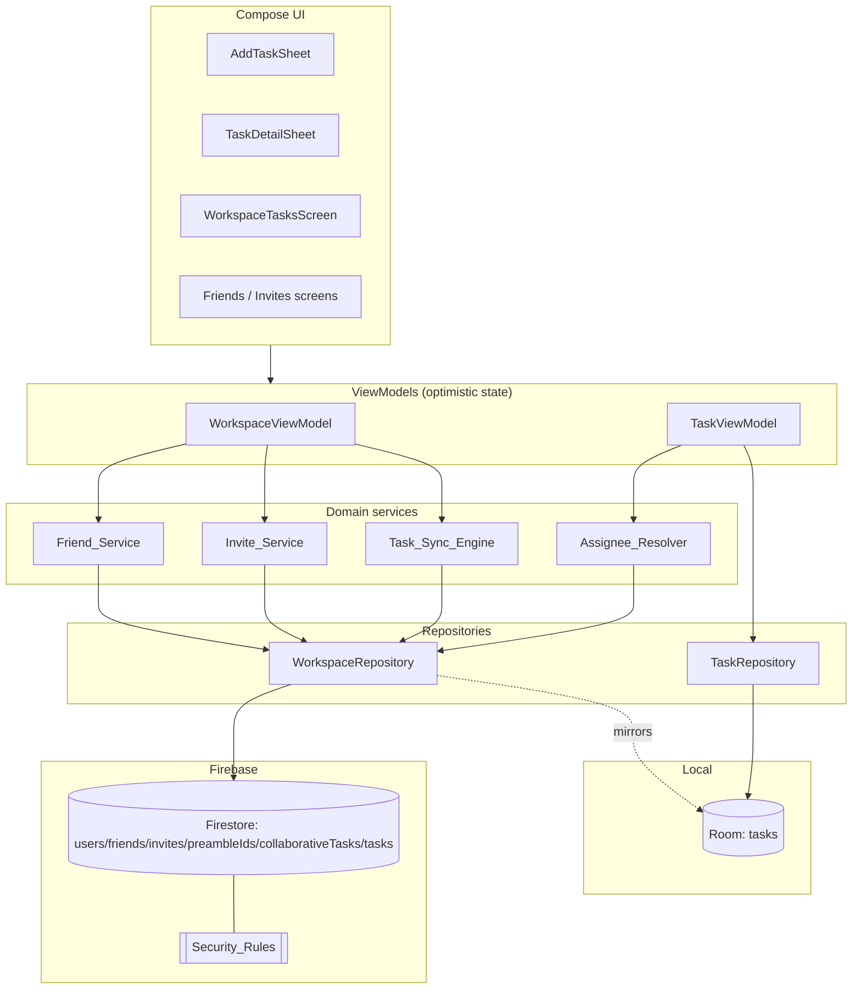
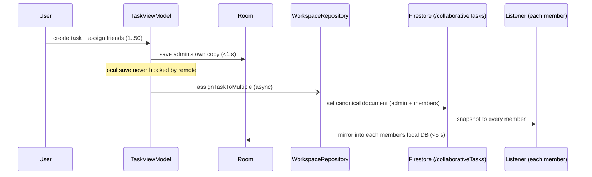
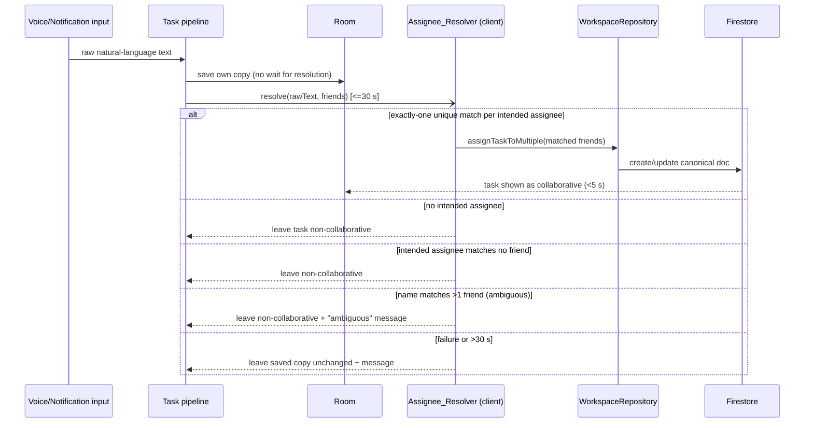
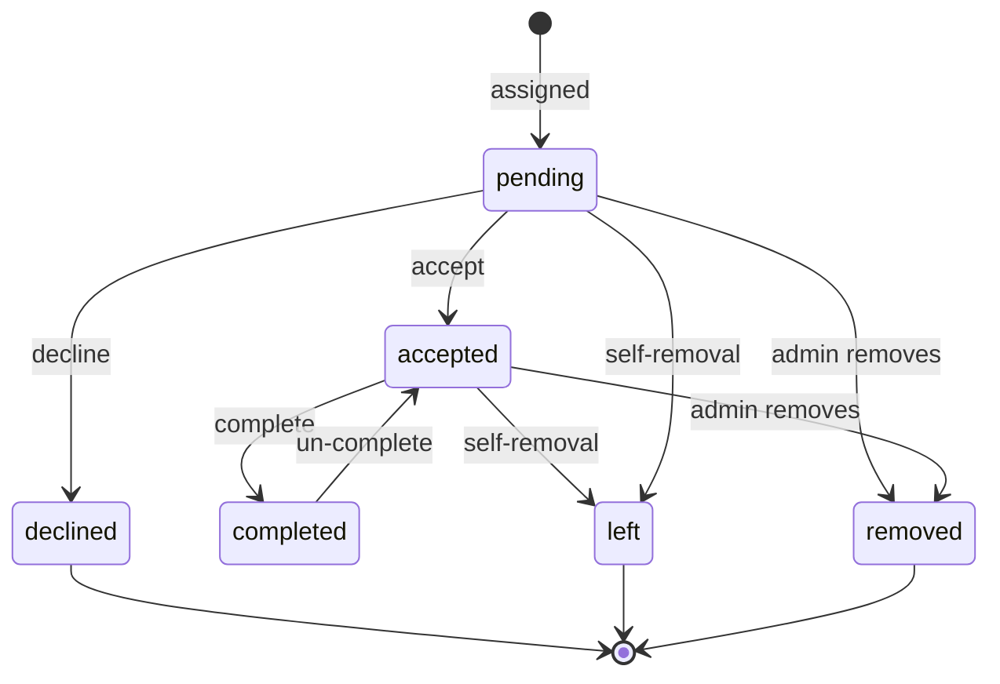
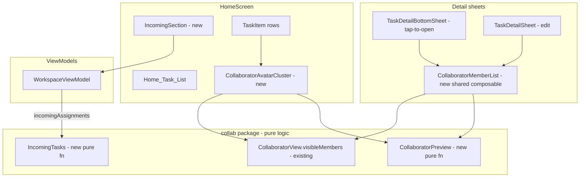
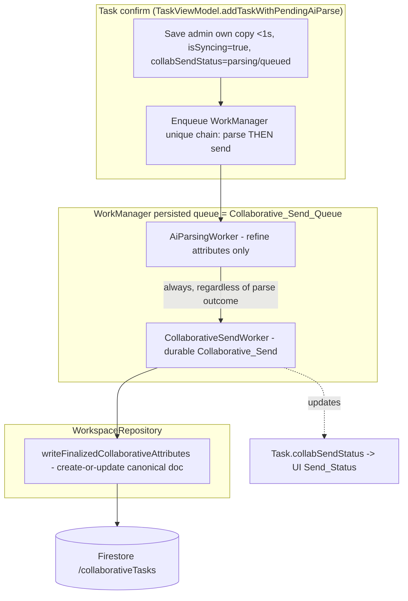
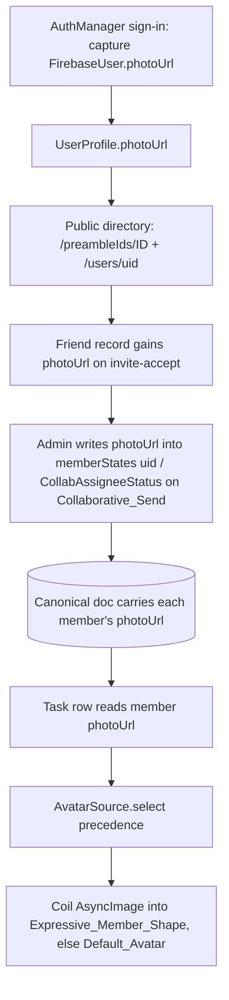
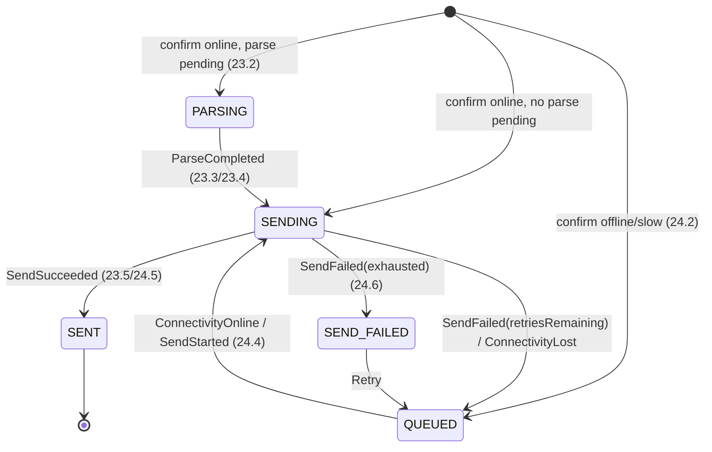
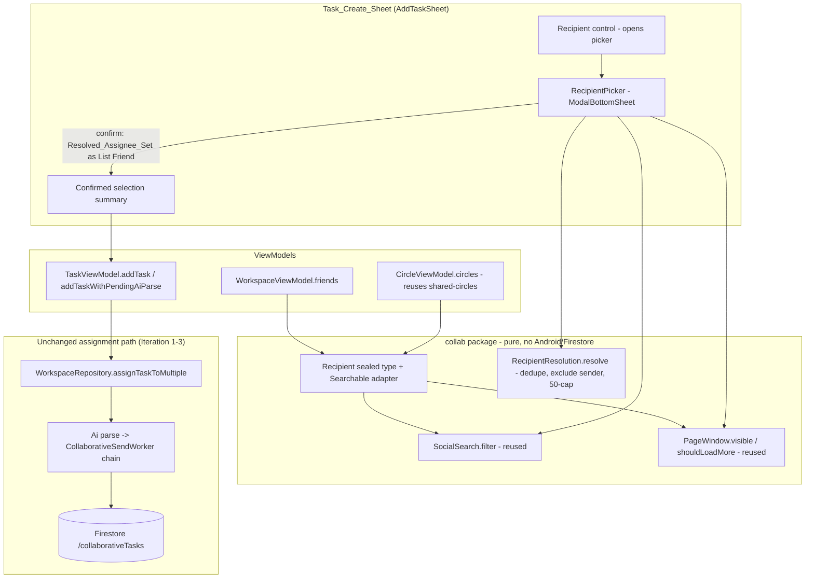

# Design Document

## Overview

This design rebuilds the friend-invite system and the collaborative-task system for the Preamble Android app so that they are fast, reliable, secure, and consistent with the live production data already stored in Firestore. It is organized around the components named in the requirements glossary (Friend_Service, Invite_Service, Task_Sync_Engine, Assignee_Resolver, Security_Rules) and maps each onto concrete Kotlin/Compose/Firestore building blocks that already exist in the codebase.

The work falls into five tracks:

1. **Friend and invite lifecycle** — discovery by Preamble ID, invite links, accept/decline/remove with optimistic UI and reciprocal records.
2. **Collaborative task lifecycle** — assignment from the create sheet, canonical-document propagation to assignees, per-member acceptance/completion, admin management (add/remove/transfer), and member self-removal.
3. **Assignee resolution** — a dedicated AI phase that runs after the user's own copy is saved, resolves natural-language assignees to friends, and no longer depends on the removed `aiResolveAssignees` Cloud Function.
4. **Resilience** — every backend interaction reverts optimistic UI on failure or timeout and never propagates an unhandled exception.
5. **Security rules** — a single, verified Firestore rule set that preserves all legacy (non-collaborative) behavior for live users, protects collaborative data to members only, and removes the prior overly-permissive task-read behavior.

### Current-state findings that drive the design

Investigation of the existing code surfaced several gaps between what is implemented and what the requirements demand. The design closes each:

| Area | Current state | Required change |
| --- | --- | --- |
| Assignee maximum | `WorkspaceRepository.MAX_ASSIGNEES = 20`; rules cap `memberUids.size() <= 21`, `assigneeUids.size() <= 20` | Raise to 50 assignees (51 members incl. admin) per Requirements 6.1, 6.5, 8.2 |
| Create-sheet selection | `AddTaskSheet` caps friend selection at 5 | Allow 1–50 selections (Requirement 6.1) |
| Assignee_Resolver | `AiParsingWorker.resolveAssigneeFriends` calls `CloudAiService.resolveAssignees` → `aiResolveAssignees` Cloud Function | Resolve client-side / through a path independent of that function (Requirement 9.9) |
| Ambiguity handling | Resolver returns every fuzzy name match | Treat a name matching >1 friend as ambiguous: no assignment + message (Requirement 9.7) |
| Resolver timeout | No explicit bound | Bound the phase to 30 s; on timeout leave task non-collaborative + message (Requirements 9.2, 9.8) |
| Friend-removal timeout | `removeFriend` has no time bound | Treat >10 s as failure and revert (Requirement 4.4) |
| Write timeout | No global bound | Treat >30 s writes as failed and revert optimistic UI (Requirement 14.5) |
| Member-status validation | `ALLOWED_MEMBER_STATUSES` excludes `left`/`removed`; rules allow all six | Keep client write-set as the four user-driven statuses while rules accept the full six terminal/non-terminal set (Requirement 8.4) |
| Rule verification | Single `firebase-firestore-rules.rules`; emulator test suite exists | Add documented verification comparing proposed vs. prior stable rules across all scopes (Requirements 15.7, 18) |

### Technology context

- **Client:** Kotlin 2.0.21, Jetpack Compose (BOM 2025.05.00), Room 2.7.1 (DB version 29), Navigation Compose, minSdk 24 / target 36.
- **Backend:** Firebase Firestore (named database `"preamble"`), Auth, Cloud Functions (TypeScript), FCM.
- **Local source of truth:** Room. A collaborative task has exactly one canonical Firestore document at `/collaborativeTasks/{taskId}`; Room mirrors it for the UI.
- **Existing test surface:** JUnit 4 (no JVM unit tests yet), and a Node `@firebase/rules-unit-testing` suite under `firebase-rules-tests/` that runs against the Firestore emulator.

## Architecture

### Component map



The named requirement components map onto code as follows:

- **Friend_Service / Invite_Service** → `WorkspaceRepository` (Firestore reads/writes for `preambleIds`, `users/{uid}/friends`, `users/{uid}/invites`) fronted by `WorkspaceViewModel` (optimistic state, validation, error messaging).
- **Task_Sync_Engine** → `WorkspaceRepository.getCollaborativeTasksFlow()` + `WorkspaceViewModel.synchronizeCollaborativeTasksToRoom()` (canonical document ⇄ Room mirror).
- **Assignee_Resolver** → a new client-side resolver invoked from the AI/voice/notification task pipeline (`AiParsingWorker`), replacing the `CloudAiService.resolveAssignees` Cloud Function dependency.
- **Security_Rules** → `firebase-firestore-rules.rules`.

### Optimistic-UI control flow

All friend and collaborative actions follow one pattern, already established in `WorkspaceViewModel`:

```mermaid
sequenceDiagram
    participant U as User
    participant VM as ViewModel
    participant L as Local state (StateFlow + Room)
    participant R as WorkspaceRepository
    participant F as Firestore

    U->>VM: action (accept / decline / remove / assign / complete)
    VM->>VM: snapshot previous state
    VM->>L: apply change immediately (<200 ms)
    VM->>R: launch backend op (with timeout)
    alt success within timeout
        R->>F: write
        F-->>R: ok
        Note over VM,L: keep optimistic state; listener reconciles
    else failure or timeout
        R-->>VM: Result.failure / timeout
        VM->>L: restore snapshot exactly
        VM->>U: error message
    end
```

Two timeouts are introduced via `kotlinx.coroutines.withTimeout`:

- **10 s** for friend removal (Requirement 4.4).
- **30 s** for any collaborative/friend write and for assignee resolution (Requirements 14.5, 9.2/9.8).

A timeout is treated identically to a backend failure: revert to the exact pre-action snapshot and surface a message.

### Assignment data flow



### Assignee-resolution flow (separate AI phase)



## Components and Interfaces

### Invite_Service (`WorkspaceRepository` + `WorkspaceViewModel`)

Responsible for friend discovery and the invitation lifecycle.

```kotlin
// Normalization is the single source of truth for Preamble IDs.
object PreambleId {
    fun normalize(raw: String): String = raw.trim().uppercase()
    fun isBlank(raw: String): Boolean = normalize(raw).isEmpty()
}

// Validation outcome used by both manual entry and invite-link entry.
sealed interface InviteValidation {
    data object Ok : InviteValidation
    data object EmptyId : InviteValidation
    data object SelfInvite : InviteValidation
    data object AlreadyFriends : InviteValidation
    data object AlreadyPending : InviteValidation
    data object NotFound : InviteValidation
}
```

`WorkspaceRepository` additions/changes:

- `suspend fun sendInvite(targetPreambleId, senderName, senderPreambleId): Result<Unit>` — extended to enforce **all** Requirement 1 checks before any write: normalize, reject empty (1.2), reject self (1.5), reject existing friend (1.6), reject duplicate pending request (1.7), reject unknown ID (1.4). The created `WorkspaceInvite` carries `senderUid`, `senderName`, `senderPreambleId` (Requirement 1.8).
- Duplicate-pending detection reads `users/{targetUid}/invites/{senderUid}` (the invite is keyed by sender uid, so a duplicate is a deterministic document existence check).

`WorkspaceViewModel` additions:

- `fun prefillFromInviteLink(uri: Uri)` — parses `https://preamble.theblankstate.com/invite/{Preamble_ID}`, validates the embedded ID is well-formed, and either pre-fills the add-friend field (2.2) or surfaces an "invalid invite link" message (2.4). Pre-filled submission runs the same validation path as manual entry (2.3).
- `fun buildInviteLink(): String` — `https://preamble.theblankstate.com/invite/${PreambleId.normalize(myPreambleId)}` (2.1).

### Friend_Service (`WorkspaceRepository` + `WorkspaceViewModel`)

- `acceptInvite` / `declineInvite` / `removeFriend` keep their batched reciprocal-write implementations.
- `removeFriend(friendUid)` in the ViewModel gains a **10 s timeout** (Requirement 4.4) and continues to block when shared tasks require resolution.
- `friendRemovalImpact(friendUid): FriendRemovalImpact` already partitions shared tasks into `administeredTasks` and `memberTasks`; the warning UI (Requirement 5.2) renders each by title and role, and `resolveTasksAndRemoveFriend` applies the chosen actions before deleting the friend record (5.7) and reverts on any failure (5.8).
- New guard: if the user confirms removal while any admin-owned affected task still lacks a completed transfer, removal is blocked with a message listing unresolved tasks by title (Requirement 5.6).

### Task assignment (`TaskViewModel` + `WorkspaceRepository`)

- `MAX_ASSIGNEES` raised to **50**. `assignTaskToMultiple` validates `1 <= distinctAssignees.size <= 50` and rejects oversized requests without creating a document (6.5, 6.6).
- The create path saves the admin's own Room copy first within 1 s, then asynchronously creates the canonical document (6.2, 6.3, 6.7). A canonical-create failure retains the local copy and surfaces a message (6.8).
- When no friend is assigned, no canonical document is created and the task stays a normal local task (6.4).

### Task_Sync_Engine (`WorkspaceRepository` + `WorkspaceViewModel`)

- `getCollaborativeTasksFlow()` listens on `collaborativeTasks where memberUidMap.{uid} == true`, maps each document into a `Task` via `documentToTask`, and filters terminal statuses.
- `synchronizeCollaborativeTasksToRoom` mirrors visible tasks into Room and prunes stale local assigned tasks, propagating canonical changes to each member within the 5 s window under normal connectivity (7.1, 7.5). A per-member mirror failure retains the last synced copy and surfaces a message (7.6).
- The canonical `task` payload includes title, description, tags, priority, deadline, recurrence, and subtasks copied from the admin's task at confirm time (7.2). AI-derived attributes that finalize later are written as a subsequent canonical update (7.3, 7.4).
- Per-member completion is tracked in `memberStates[uid].isCompleted`; the shared payload's `isCompleted` is always forced to `false` (7.7, 8.7).

### Member actions (`WorkspaceRepository` + `WorkspaceViewModel`)

- `updateCollabAssignmentStatus` — accept/decline/complete; enforces the pending→accepted/declined and accepted→completed transitions (10.1–10.5) and writes only `memberStates[uid]` (8.6).
- `updateCollabTaskSubtasks` — shared subtask edits persisted to the canonical document (10.6).
- `removeCollaborator`, `transferOwnership`, `leaveCollaborativeTask` — transaction-based admin/member operations (Requirements 11, 12).
- All of these revert local state and message on failure (10.7, 11.6, 12.5).

### Collaborator view (`TaskDetailSheet`)

Renders, for a collaborative task: members whose status is `pending`/`accepted`/`completed` (excluding `declined`/`left`/`removed`), the admin indicator, each member's completion flag, and each member's acceptance status shown separately from completion (Requirements 13.1–13.4). Admin sees per-member remove + transfer controls; non-admin members see a Self_Removal control; the admin sees no direct Self_Removal control (13.5–13.7).

### Assignee_Resolver (client-side)

```kotlin
sealed interface AssigneeResolution {
    data class Assigned(val friends: List<Friend>) : AssigneeResolution // unique matches
    data object NoAssignee : AssigneeResolution                          // none intended
    data object Unmatched : AssigneeResolution                           // intended, no friend
    data class Ambiguous(val term: String) : AssigneeResolution          // term matches >1 friend
    data object Failed : AssigneeResolution                              // error / timeout
}

interface AssigneeResolver {
    suspend fun resolve(rawText: String, friends: List<Friend>): AssigneeResolution
}
```

The resolver runs **after** the own-copy save, client-side, within a 30 s budget (`withTimeout`), and does not call the `aiResolveAssignees` Cloud Function (9.1, 9.2, 9.9). Matching detects assignment intent (markers such as "assign", "send to", "share with"), then for each intended term resolves friends by normalized name / Preamble ID. A term that resolves to exactly one friend is assigned; zero intended → `NoAssignee`; an intended term with no friend → `Unmatched`; a term matching more than one friend → `Ambiguous` (9.3, 9.5, 9.6, 9.7). Only `Assigned` triggers `assignTaskToMultiple`; every other outcome leaves the task non-collaborative, and `Ambiguous`/`Failed` additionally surface a message (9.4, 9.8).

### Security_Rules (`firebase-firestore-rules.rules`)

Structure is retained and adjusted:

- Collaborative-document size caps raised to `memberUids.size() <= 51` and `assigneeUids.size() <= 50`.
- Legacy `/tasks/{taskId}` and per-user collections keep their existing owner-scoped rules unchanged so live users are unaffected (Requirement 15).
- `/collaborativeTasks/{taskId}`: get/list gated on membership; create gated on admin == requester and a valid schema-v2 document; update allowed for admin metadata, own member-state, own subtask edit, or self-removal; delete admin-only (Requirement 16).
- Friend/invite/preambleIds rules enforce per-account ownership with the narrowly-scoped reciprocal exceptions for accepting an invite and clearing one's own side of a friendship (Requirement 17).

### Security-rule verification (Requirement 18)

Because two rule sets are named inputs — the currently deployed rules and the prior stable rules — verification is a documented comparison rather than a runtime feature. It is implemented as an expansion of the existing Node `@firebase/rules-unit-testing` suite plus a written verification matrix:

- For each scope (Legacy_Task, Collaborative_Task, per-user collections, friend/invite/preambleIds), enumerate every read/write the published app performs and assert the proposed rules permit exactly the authorized actors and deny the rest (18.1, 18.3, 18.4).
- Assert no task is readable by a non-owner/non-member, demonstrating the prior overly-permissive read is gone (18.2).
- Assert prior-stable permissions for legacy paths and per-user collections are preserved (15.7, 18.5).
- Record any operation the app performs but the rules deny as a gap entry `{path, operation, actorRole, expectedOutcome}` (18.6), and record a pass/fail per check (18.7).

## Data Models

### Canonical collaborative task document (`/collaborativeTasks/{taskId}`)

```jsonc
{
  "schemaVersion": 2,
  "taskId": "uuid",
  "adminUid": "uid",
  "adminName": "Display Name",
  "memberUids": ["adminUid", "assigneeUid1", "..."],   // includes admin, no dups, size 1..51
  "assigneeUids": ["assigneeUid1", "..."],             // excludes admin, subset of memberUids, no dups, size 0..50
  "memberUidMap": { "adminUid": true, "assigneeUid1": true }, // keys == memberUids exactly
  "memberStates": {
    "adminUid":   { "uid": "...", "name": "...", "role": "admin",  "status": "accepted", "isCompleted": false, "completedTimestamp": null, "assignedTimestamp": 0 },
    "assigneeUid1": { "uid": "...", "name": "...", "role": "member", "status": "pending", "isCompleted": false, "completedTimestamp": null, "assignedTimestamp": 0 }
  },
  "task": { /* serialized Task payload, isCompleted forced false, local collab fields stripped */ },
  "createdAt": 0,
  "updatedAt": 0
}
```

Invariants (enforced in both `WorkspaceRepository` construction and Security_Rules):

- Exactly one `adminUid`; `adminUid ∈ memberUids` (8.1, 8.2).
- `memberUids` contains the admin, has no duplicates, size ≤ 51 (50 assignees + admin) (8.2).
- `assigneeUids ⊆ memberUids`, `adminUid ∉ assigneeUids`, no duplicates (8.3).
- `memberStates` keys == `memberUids` exactly; each `status ∈ {pending, accepted, completed, declined, left, removed}`; each `isCompleted ∈ {true, false}` (8.4).
- `memberUidMap.keys() == memberUids` (queryability + rule consistency).

### Local `Task` entity (Room, DB v29)

The existing `Task` entity carries the local projection of collaboration state; no schema migration is required for this feature. Relevant fields:

| Field | Meaning |
| --- | --- |
| `collabAdminUid` / `collabAdminName` | non-null ⇒ task is collaborative; identifies admin |
| `collabAssigneesJson` | serialized `List<CollabAssigneeStatus>` (uid, name, status, isCompleted, completedTimestamp, assignedTimestamp) |
| `assignmentStatus` | current user's own member status |
| `isCompleted` / `completedTimestamp` | current user's own completion (mapped from `memberStates[uid]`) |
| `subtasksJson` | shared subtasks |

`documentToTask` projects the canonical document into a `Task` for the current user (own status/completion from `memberStates[uid]`); `taskPayload` serializes the admin's `Task`, strips the eight local-only collab fields, and forces `isCompleted=false`.

### Friend, Invite, and Preamble ID directory

```kotlin
data class Friend(val uid, val name, val preambleId, val addedAt, val productivityPoints)
data class WorkspaceInvite(val id, val senderUid, val targetUid, val senderName, val senderPreambleId, val timestamp)
```

- Friend records: `/users/{uid}/friends/{friendUid}` (reciprocal pair).
- Invite records: `/users/{targetUid}/invites/{senderUid}` (keyed by sender, making duplicate detection a single existence check).
- Public directory: `/preambleIds/{NORMALIZED_ID}` → `{ uid, name, preambleId }`, written by the owner only.

### Member status state machine



`declined`, `left`, and `removed` are terminal for visibility purposes (filtered out of lists and the collaborator view).

## Correctness Properties

*A property is a characteristic or behavior that should hold true across all valid executions of a system — essentially, a formal statement about what the system should do. Properties serve as the bridge between human-readable specifications and machine-verifiable correctness guarantees.*

The properties below were derived from the prework analysis, then consolidated to remove redundancy (the many "revert on failure", "optimistic transition", and "data-model invariant" criteria each collapse into a single comprehensive property). Firestore Security_Rules behavior (Requirements 15–18) is verified by emulator-based integration tests and documented verification, not by property-based tests, and so is intentionally excluded here.

### Property 1: Preamble ID normalization is idempotent

*For any* string, normalizing it yields a value with no leading/trailing whitespace and no lowercase letters, and normalizing an already-normalized value returns it unchanged (`normalize(normalize(x)) == normalize(x)`).

**Validates: Requirements 1.1**

### Property 2: Invite-link round-trip

*For any* Preamble ID, building an invite link and then parsing it recovers the normalized ID; and *for any* string that is not a well-formed invite link, parsing returns an "invalid link" result and never a usable ID.

**Validates: Requirements 2.1, 2.2, 2.4**

### Property 3: Invite validation gates request creation

*For any* submitted Preamble ID, friend set, and pending-invite set, the validation returns `Ok` only when the normalized ID is non-empty, is not the user's own ID, is not an existing friend, and has no pending request; in every rejecting case no Friend_Request is produced and the matching rejection reason is returned.

**Validates: Requirements 1.2, 1.5, 1.6, 1.7**

### Property 4: Created invite carries sender identity

*For any* sender uid, name, and Preamble ID, a created Friend_Request records the sender's uid, the sender's display name, and the sender's normalized Preamble ID.

**Validates: Requirements 1.8**

### Property 5: Canonical collaborative document invariants

*For any* admin uid and any set of 1–50 distinct assignee uids, the constructed canonical document satisfies: exactly one `adminUid`; `memberUids` contains the admin, has no duplicates, and has size ≤ 51; `assigneeUids` is a duplicate-free subset of `memberUids` that excludes the admin; `memberUidMap` keys equal `memberUids` exactly; `memberStates` has exactly one entry per member (and none for non-members), each with a status in {pending, accepted, completed, declined, left, removed} and a boolean completion flag; the admin's state is `accepted` and every assignee's state is `pending`.

**Validates: Requirements 6.3, 8.1, 8.2, 8.3, 8.4, 8.5**

### Property 6: Collaborative iff assignees present

*For any* task creation, a canonical Collaborative_Task document is created exactly when one or more friends are assigned; with zero assigned friends the task remains a normal local task and no document is created.

**Validates: Requirements 6.4**

### Property 7: Assignee-count boundary

*For any* requested assignee list, assignment succeeds when the distinct count is between 1 and 50 and is rejected (with no document created or modified) when the distinct count exceeds 50 — both at creation time and when an admin adds members to an existing task.

**Validates: Requirements 6.5, 6.6, 11.9**

### Property 8: Task payload copy fidelity and shared-completion exclusion

*For any* task, projecting the serialized canonical payload back into a task preserves title, description, tags, priority, deadline time, recurrence settings, and subtasks equal to the source, and the payload's shared `isCompleted` is always `false` (completion is per-member only).

**Validates: Requirements 7.2, 7.7**

### Property 9: Single-member state changes are isolated

*For any* `memberStates` map and any target member, changing that member's status/completion updates only that member's entry and leaves every other member's entry identical.

**Validates: Requirements 8.6**

### Property 10: Member status transition guards

*For any* member status, accepting or declining is permitted only from `pending` and completing is permitted only from `accepted`; a permitted transition produces the expected status (and, for completion, sets the completion flag true with a UTC completion timestamp), while a non-permitted source status leaves the member's status and completion flag unchanged.

**Validates: Requirements 10.1, 10.2, 10.3, 10.4, 10.5**

### Property 11: Optimistic transitions reflect immediately in local state

*For any* current local state, an accept/decline/remove-member/add-member/self-removal/assignment action produces the expected post-state in local state before the backend operation completes (e.g., accepted invite leaves the incoming list and enters the friend list; a removed member leaves the member and assignee lists).

**Validates: Requirements 3.3, 3.5, 4.1, 10.1, 10.2, 11.2, 11.8, 12.2**

### Property 12: Failure or timeout reverts to the exact prior state

*For any* action and *for any* backend failure or timeout (10 s for friend removal, 30 s for collaborative/friend writes), the affected local state is restored exactly to the snapshot taken immediately before the action — including list ordering — every record unaffected by the action is left untouched, and an error message is surfaced.

**Validates: Requirements 3.6, 3.7, 4.3, 4.4, 5.5, 5.8, 6.8, 7.6, 10.7, 11.6, 12.5, 14.2, 14.3, 14.5**

### Property 13: Friend-removal impact partition

*For any* set of collaborative tasks and any friend, the computed impact partitions exactly the tasks shared with that friend into admin-owned tasks (current user is admin) and member tasks (current user is non-admin), with the two sets disjoint and together equal to the full shared set.

**Validates: Requirements 5.1**

### Property 14: Ownership transfer preserves invariants

*For any* collaborative task and any target, transferring ownership to a current member sets that member as the sole admin, retains the previous admin as an `accepted` member, and preserves all document invariants of Property 5; transferring to a non-member is rejected and leaves admin/member/assignee records unchanged.

**Validates: Requirements 11.4, 11.5**

### Property 15: Self-removal affects only the leaving member

*For any* collaborative task in which the user is a non-admin member, self-removal removes only that user from `memberUids`, `assigneeUids`, and `memberUidMap`, sets only that user's status to `left`, and leaves every other member's records unchanged; a self-removal attempt by the admin is rejected.

**Validates: Requirements 12.2, 12.3, 12.4**

### Property 16: Collaborator view excludes terminal members

*For any* set of member states, the collaborator view shows exactly the members whose status is `pending`, `accepted`, or `completed` and excludes every member whose status is `declined`, `left`, or `removed`.

**Validates: Requirements 13.1**

### Property 17: Assignee resolution classification

*For any* natural-language text and friend set, the resolver yields: `Assigned` with the uniquely matched friends when every intended assignee resolves to exactly one friend; `NoAssignee` when no assignment is intended; `Unmatched` when an intended assignee matches no friend; and `Ambiguous` when an intended name matches more than one friend. Only `Assigned` creates or updates a Collaborative_Task.

**Validates: Requirements 9.3, 9.5, 9.6, 9.7**

### Property 18: Error handling is total

*For any* backend failure or denied operation surfaced to a friend or collaborative action handler, the handler completes without propagating an unhandled exception (it resolves to a handled error result).

**Validates: Requirements 14.4**

## Error Handling

Error handling is uniform and built on the optimistic-UI pattern, so that no Firestore failure crashes the app or leaves local state inconsistent (Requirement 14).

- **Snapshot-and-revert.** Before any optimistic mutation, the ViewModel captures the exact prior `StateFlow` values (and, where Room is touched, the prior `Task` rows). On `Result.failure` or timeout, it restores those snapshots verbatim and emits a `WorkspaceUiState.Error` with a human-readable message (14.2, 14.3). This is the mechanism behind Property 12.
- **Timeouts.** Friend removal is wrapped in `withTimeout(10_000)`; all other collaborative/friend writes and the assignee-resolution phase are wrapped in `withTimeout(30_000)`. A `TimeoutCancellationException` is caught and mapped to the same revert path as a failure (4.4, 14.5, 9.8).
- **Listener failures.** Each Firestore snapshot listener (`friends`, `invites`, `collaborativeTasks`) is collected with `.catch { reportListenerFailure(label, it) }`, which logs the error, retains the last-loaded data for that data set, and emits an error message naming the data set — without tearing down the app (14.1).
- **Total handling.** Every repository entry point returns `Result<T>` via `runCatching`, and every ViewModel launch handles both branches; no failure path rethrows to the coroutine root (14.4). This is the basis of Property 18.
- **Friend-removal orchestration.** `resolveTasksAndRemoveFriend` applies each chosen action (transfer for admin-owned, self-removal for member tasks) and deletes the friend record only after all actions succeed; any failure restores the friend and leaves every affected task in its pre-attempt state (5.7, 5.8). A confirm attempt with an unresolved admin-owned task is blocked with a message listing the unresolved titles (5.6).
- **User-facing messages.** A `Throwable.userMessage(default)` helper maps known Firestore exceptions (notably `PERMISSION_DENIED`) to friendly text and falls back to a provided default, so denied writes read as "could not be saved" rather than raw exceptions.

## Testing Strategy

The feature is tested with three complementary layers. Property-based testing applies to the pure client-side logic (normalization, document construction, state transitions, resolver classification, optimistic revert); Firestore Security_Rules are verified with the emulator-based integration suite; UI and timing concerns use example/instrumented tests.

### Property-based tests (client logic)

- **Library:** add **jqwik** (`net.jqwik:jqwik`) as a `testImplementation` dependency for JVM unit tests, alongside JUnit 5. jqwik is the standard property-based testing library for the JVM/Kotlin and integrates with Gradle's `test` task; we will not hand-roll property testing. (The current module only has JUnit 4 and no JVM unit tests, so this adds the JVM test source set wiring.)
- **Pure-logic extraction:** to make the logic testable without Firebase, the document-construction (`createCollaborativeDocument`), payload (`taskPayload`/`documentToTask`), normalization, validation, member-state transition, resolver-classification, and impact-partition logic are factored into pure functions that do not require a live `FirebaseFirestore` instance. The ViewModel revert logic is exercised against an in-memory fake repository that can be told to fail or time out.
- **Configuration:** each property test runs a **minimum of 100 iterations** (jqwik `@Property(tries = 100)` or higher).
- **Tagging:** each property test is annotated with a comment of the form
  `// Feature: collaborative-tasks, Property {n}: {property text}`
  and implements exactly one of the 18 properties above (one property → one property test).
- **Generators:** custom generators produce arbitrary admin/assignee uid sets (including the 0, 1, 50, and 51 boundaries), member-state maps with mixed statuses, tasks with varied content (Unicode titles, empty/blank descriptions, large subtask lists), invite/friend lists, and natural-language strings with and without assignment markers and with duplicate friend names.

### Integration tests (Firestore Security_Rules — Requirements 15–18)

- Extend the existing Node `@firebase/rules-unit-testing` suite (`firebase-rules-tests/firestore.rules.test.mjs`) run via the Firestore emulator.
- Cover, with 1–3 representative actors each: legacy task owner isolation and unauthenticated denial (15.1–15.4); preservation of per-user collection permissions (15.5, 18.5); collaborative get/list membership gating and non-member denial demonstrating the overly-permissive read is gone (16.1, 16.2, 18.2); admin-only create/edit/delete and the own-member-state / own-subtask / self-removal update paths (16.3–16.10); friend/invite/preambleIds ownership and reciprocal exceptions (17.1–17.7); and role-based permit/deny checks for collaborative operations (18.3, 18.4).
- The raised size caps (`memberUids ≤ 51`, `assigneeUids ≤ 50`) get explicit boundary cases at 50 and 51 assignees.

### Verification matrix (Requirement 18)

- A documented comparison of the proposed rules against the prior stable rules across the four scopes (Legacy_Task, Collaborative_Task, per-user collections, friend/invite/preambleIds), recording every behavioral difference (18.1), a gap entry `{path, operation, actorRole, expectedOutcome}` for any app operation the rules deny (18.6), and a pass/fail result per check (18.7). This lives alongside the spec as the deliverable that gates deployment.

### Example and instrumented tests

- **Example unit tests** cover specific branches that are not universal: directory hit/miss for invite send (1.3, 1.4), duplicate-pending rejection (1.7), AI-attribute timing cases (7.3, 7.4), resolver failure/timeout messaging (9.8), and friend-removal block/orchestration (5.6, 5.7).
- **Compose UI / instrumented tests** verify rendering and the ≤ 200 ms / ≤ 1 s timing-sensitive behaviors that property tests do not assert: incoming-list and empty-state rendering (3.1, 3.2), the 1–50 friend selector (6.1), local-save-within-1s without blocking (6.2, 6.7), the collaborator-view indicators and role-based controls (13.2–13.7), and listener-error messaging (14.1).
- **Smoke check** confirms the assignee resolver runs client-side and does not call the removed `aiResolveAssignees` Cloud Function (9.9).

---

# Design Document — Iteration 2: UI Extensions

This section extends the implemented feature with the four UI requirements added in Iteration 2 (Requirements 19–22). It builds entirely on the architecture, components, and pure-logic packages described above (Kotlin/Compose, Room DB v29, the side-effect-free `com.theblankstate.preamble.collab` package, `WorkspaceViewModel`/`TaskViewModel`, `WorkspaceRepository`). No existing design content is changed; this section only adds the new surfaces and the logic behind them, and reconciles one discrepancy uncovered during investigation.

## Overview (Iteration 2)

The four changes are all presentation-layer, and three of them reuse logic that already exists:

1. **Req 19 — Incoming_Section on the Home_Task_List**: surface the existing incoming pending shared-task flow (`WorkspaceViewModel.incomingAssignments` + `acceptAssignment`/`declineAssignment`) at the top of the home list with inline Accept/Decline, without disturbing the existing `WorkspaceTasksScreen` "Incoming" tab.
2. **Req 20 — Collaborator status in the tap-to-open Task_Detail_Sheet**: move/replicate the collaborator view (the `CollaboratorView.visibleMembers` filter) into the sheet that actually opens on tap. **Investigation found this is currently rendered in the wrong sheet** (see below).
3. **Req 21 — Collapsible collaborator list**: a preview-of-3 + expand/collapse control in the detail sheet, driven by a single pure preview/overflow function.
4. **Req 22 — Avatar_Cluster on task rows**: a compact cluster (up to 3 + "+N") on collaborative `TaskItem` rows, driven by the same pure preview/overflow function.

## Investigation: which sheet opens on tap (Requirement 20 root cause)

Requirement 13 specified the collaborator view for "the Task_Create_Sheet detail view", and task 9.2 implemented it in `ui/components/TaskDetailSheet.kt`. Requirement 20 reports that the collaborator view is **not visible** when a user taps a task. The Compose wiring confirms the discrepancy:

**Where a tap goes.** In `ui/components/TaskItem.kt`, the task row's gesture handler is:

```kotlin
.combinedClickable(
    enabled = isEditable || onDetail != null,
    onClick    = { onDetail?.invoke() ?: run { showDetailDialog = true } },
    onLongClick = { onDetail?.invoke() ?: run { showDetailDialog = true } }
)
```

So a **tap invokes `onDetail`**, not `onEdit`.

**What `onDetail` opens.** In `ui/screens/HomeScreen.kt`, every row is wired with two distinct callbacks:

| Callback | State set | Sheet shown |
| --- | --- | --- |
| `onDetail = { taskToShowDetail = task }` | `taskToShowDetail` | **`TaskDetailBottomSheet`** (read-only, `ui/components/TaskDetailBottomSheet.kt`) |
| `onEdit = { taskToEdit = task }` | `taskToEdit` | `TaskDetailSheet` (edit sheet, `ui/components/TaskDetailSheet.kt`) |

`onEdit` is reachable only from the row's overflow menu ("Details"/edit affordance) and from the `TaskDetailBottomSheet`'s own "Edit" button (`HomeScreen.kt`: `onEdit = { taskToEdit = task; taskToShowDetail = null }`).

**Root cause.** The collaborator view + role controls from task 9.2 live in `TaskDetailSheet.kt` (the **edit** sheet, opened via `onEdit`). The sheet that opens on **tap** is `TaskDetailBottomSheet.kt` (the read-only detail sheet, opened via `onDetail`), and it has **no** collaborator section. Confirmed by reference search: `CollaboratorView.visibleMembers` is used only in `TaskDetailSheet.kt` (around the "Assigned Members & Status" `EditSection`), and nowhere in `TaskDetailBottomSheet.kt`. Hence the user taps a task, sees the read-only sheet, and the collaborator status is absent — it only appears if they go on to edit the task.

**Reconciliation plan.** Treat `TaskDetailBottomSheet` as the canonical **Task_Detail_Sheet** for the collaborator view (it is the tap-to-open surface named in Requirement 20). Add a read-only collaborator section to `TaskDetailBottomSheet` that reuses the exact same `CollaboratorView.visibleMembers(task.collabAssignees) { it.status }` filter already used by `TaskDetailSheet`, plus the admin row derived from `task.collabAdminUid`/`collabAdminName`. The existing collaborator block in `TaskDetailSheet` (which also carries the admin's role controls — remove/transfer/leave) is retained for the edit flow; the two surfaces share the same filtering and member-row rendering through a common composable so they cannot drift. Requirement 13's role-control behavior is unchanged and stays in the edit sheet; Requirement 20 only requires the read-only **status** display (members, admin indicator, completion, acceptance) in the tap-to-open sheet.

## Architecture (Iteration 2)



The new presentation pieces sit on top of unchanged ViewModel/repository logic. The two genuinely new bits of *logic* (the Incoming partition and the preview/overflow math) are added as pure functions in the existing `collab` package so they are testable with the established jqwik suite and cannot accidentally depend on Firestore or Android.

## Components and Interfaces (Iteration 2)

### Incoming_Section (Req 19) — `HomeScreen` + existing `WorkspaceViewModel`

`HomeScreen` already obtains a `WorkspaceViewModel` (`viewModel()` at the top of the composable) and already uses it for the edit sheet's `removeMember`/`transferOwnership`/`leaveTask`. `MainActivity.PreambleApp` already derives a pending count exactly as `incomingAssignments.count { it.assignmentStatus == "pending" }`, confirming that the current user's own Member_Status is projected onto `Task.assignmentStatus` by `TaskProjection`/`documentToTask`.

Design:

- Source the section from `workspaceViewModel.incomingAssignments` (the existing flow: collaborative tasks where `collabAdminUid != currentUid`), narrowed by a new pure helper to those whose **own** status is `pending`:

```kotlin
// collab/IncomingTasks.kt — pure, no Android/Firestore
object IncomingTasks {
    /** Own Member_Status that places a collaborative task in the Home Incoming_Section. */
    const val INCOMING_STATUS = "pending"

    /** Tasks shown in the Incoming_Section: collaborative tasks whose own status is pending. */
    fun incoming(tasks: List<Task>): List<Task> =
        tasks.filter { it.assignmentStatus == INCOMING_STATUS }

    /** Header is shown iff at least one such task exists (Req 19.8). */
    fun hasIncoming(tasks: List<Task>): Boolean = incoming(tasks).isNotEmpty()
}
```

- Render an `IncomingSection` composable as the first item of the home `LazyColumn` (above the existing date groups). It shows a section header only when `IncomingTasks.hasIncoming(...)` is true (19.1, 19.8). Each row shows the task title plus an inline Accept and Decline `IconButton`/`TextButton` pair (19.2).
- Accept calls `workspaceViewModel.acceptAssignment(task)`; Decline calls `workspaceViewModel.declineAssignment(task)`. These already perform the optimistic `<200 ms` update before the backend write, the pending-only transition guard, and the exact-state revert on failure/timeout (19.3–19.7 reuse Requirements 10/14 behavior). After accept, the task's own status becomes `accepted`, so `IncomingTasks.incoming` no longer returns it and it falls through to the normal Home list (19.4); after decline it is filtered out entirely (19.5).
- The existing `WorkspaceTasksScreen` "Incoming" tab (Tab index 4 in `PreambleApp`) is untouched and continues to read the same `incomingAssignments` flow and the same accept/decline methods, preserving its behavior (19.9).

Note: `incomingAssignments` currently includes non-admin tasks of any status; the Home section deliberately re-narrows to `pending` via `IncomingTasks.incoming` rather than changing the shared flow, so the Workspace tab is unaffected.

### Collaborator section in the tap-to-open sheet (Req 20) — `TaskDetailBottomSheet`

- Add a read-only "Collaborators" section to `TaskDetailBottomSheet`, shown only when the task is collaborative (`task.collabAdminUid != null || task.collabAssignees.isNotEmpty()`), mirroring the guard already used in `TaskDetailSheet`.
- Membership shown = admin row (from `collabAdminUid`/`collabAdminName`) plus `CollaboratorView.visibleMembers(task.collabAssignees) { it.status }`, i.e. exactly `pending`/`accepted`/`completed`, excluding `declined`/`left`/`removed` (20.1, reusing the existing Property 16 filter).
- Each row indicates: the Admin (badge on the admin row, 20.2), completion (`isCompleted` ⇒ a completed indicator, 20.3), and acceptance status (`status == "pending"` vs `"accepted"`) rendered as a separate chip/label from the completion indicator (20.4).
- This section is **read-only**: it carries no remove/transfer/leave controls (those remain in the edit `TaskDetailSheet`, Requirement 13.5–13.7).

### Shared collaborator-list composable (Req 20 + 21) — `CollaboratorMemberList`

To keep the tap-to-open sheet and the edit sheet consistent and to host the collapsible behavior once, extract a single composable:

```kotlin
@Composable
fun CollaboratorMemberList(
    adminUid: String?,
    adminName: String?,
    assignees: List<CollabAssigneeStatus>,
    currentUserUid: String?,
    showRoleControls: Boolean,            // true only in the edit sheet
    onRemoveMember: ((String) -> Unit)? = null,
    onTransferOwnership: ((String) -> Unit)? = null,
    onLeave: (() -> Unit)? = null,
)
```

- It computes the visible members via `CollaboratorView.visibleMembers`, prepends the admin row, and applies the collapsible preview from `CollaboratorPreview` (below).
- `TaskDetailBottomSheet` uses it with `showRoleControls = false`; `TaskDetailSheet` uses it with `showRoleControls = true` and forwards the existing `onRemoveCollabMember`/`onTransferCollabOwnership`/`onLeaveCollabTask` callbacks already wired in `HomeScreen`. This guarantees both sheets render the same membership and cannot drift.

### Collapsible collaborator list (Req 21) — `CollaboratorPreview` pure function

```kotlin
// collab/CollaboratorPreview.kt — pure, no Android/Firestore
object CollaboratorPreview {
    /** Member_Preview_Count (Req 21 / glossary): collapsed preview size. */
    const val PREVIEW_COUNT = 3

    data class Preview<T>(
        val shown: List<T>,     // members rendered in the current state
        val overflow: Int,      // hidden count when collapsed (0 when expanded or small)
        val canExpand: Boolean, // an expand/collapse affordance is offered
    )

    /** total <= PREVIEW_COUNT -> full list, no control; otherwise preview of 3 (collapsed) or all (expanded). */
    fun <T> preview(visible: List<T>, expanded: Boolean): Preview<T> {
        val n = visible.size
        return when {
            n <= PREVIEW_COUNT -> Preview(visible, 0, canExpand = false)
            expanded           -> Preview(visible, 0, canExpand = true)
            else               -> Preview(visible.take(PREVIEW_COUNT), n - PREVIEW_COUNT, canExpand = true)
        }
    }
}
```

- `CollaboratorMemberList` holds a local `var expanded by remember { mutableStateOf(false) }` and renders `CollaboratorPreview.preview(visibleMembers, expanded)`. When `canExpand` is true it shows an expand control (collapsed) or a collapse control (expanded); toggling flips `expanded` (21.1–21.3). When the visible count is ≤ 3 the full list renders with no control (21.4). Expanding renders the full `CollaboratorView.visibleMembers` output (21.2).
- The "visible" input is always the `pending`/`accepted`/`completed` set (terminal members already excluded), so the preview math composes with the Requirement 16 filter.

### Avatar_Cluster on task rows (Req 22) — `CollaboratorAvatarCluster` + `TaskItem`

Investigation note: there is **no** existing avatar-cluster composable on the task row. `TaskItem.kt` renders no collaborator avatars today. The existing avatar conventions in the codebase are (a) initials-in-a-circle (`WorkspaceTasksScreen.kt`: a 32.dp `Box` with `CircleShape` background and a single-letter `Text`) and (b) DiceBear `AsyncImage` seeded by `preambleId` (`WorkspaceScreen.kt`/`WorkspaceTasksScreen.kt`). The cluster is designed as a new composable consistent with the initials-circle convention (it needs no network image and scales to small sizes), reusing the same color/shape tokens.

```kotlin
@Composable
fun CollaboratorAvatarCluster(
    task: Task,
    modifier: Modifier = Modifier,
)
```

Design:

- Renders nothing for a non-collaborative task or one with no visible members (`task.collabAdminUid == null && task.collabAssignees.isEmpty()`), satisfying 22.5 and the ≥1-member precondition of 22.1.
- The displayed set is the admin row plus `CollaboratorView.visibleMembers(task.collabAssignees) { it.status }` (terminal members excluded), then reduced with `CollaboratorPreview.preview(displayed, expanded = false)`: it draws up to `PREVIEW_COUNT (3)` overlapping initials-circles (`shown`) and, when `overflow > 0`, a trailing "+N" chip where `N == overflow == max(0, displayedCount - 3)` (22.2, 22.3).
- Each individual avatar is styled by status: `accepted`/`completed` use the filled/primary treatment; `pending` uses a muted/outlined treatment — a visible distinction (22.4). The status→style mapping is a small pure helper so the distinction is unit-checkable.
- The cluster is placed on the `TaskItem` row (compact, end-aligned in the row's header area) and does not alter the row's `combinedClickable`, completion toggle, or the existing completion-driven reordering of the Home list (22.6).

## Data Models (Iteration 2)

No schema or entity changes. Iteration 2 reads only fields that already exist on the local `Task` entity:

- `collabAdminUid` / `collabAdminName` — collaborative marker + admin identity (admin row, admin badge).
- `collabAssignees: List<CollabAssigneeStatus>` (derived from `collabAssigneesJson`) — each carries `uid`, `name`, `status`, `isCompleted`, timestamps, consumed by `CollaboratorView.visibleMembers`, the preview, and the avatar cluster.
- `assignmentStatus` — the current user's own Member_Status, used by `IncomingTasks.incoming` to select the Home Incoming_Section (own status `pending`).

The two new pure functions (`IncomingTasks`, `CollaboratorPreview`) and the new `CollaboratorView` consumers live in the existing pure `collab` package; `CollaboratorMemberList` and `CollaboratorAvatarCluster` are new Compose components in `ui/components`. `IncomingSection` is a new private composable in `HomeScreen.kt`.

## Correctness Properties (Iteration 2)

*A property is a characteristic or behavior that should hold true across all valid executions of a system — essentially, a formal statement about what the system should do. Properties serve as the bridge between human-readable specifications and machine-verifiable correctness guarantees.*

Following the prework analysis and reflection, most Iteration 2 acceptance criteria reuse properties already defined above and add no new property:

- **Req 19.3–19.7** (optimistic accept/decline, pending-only guard, exact-state revert) are already covered by **Property 10** (status transition guards), **Property 11** (optimistic transitions reflect immediately), and **Property 12** (failure/timeout reverts to exact prior state) — the Home Incoming_Section calls the same `WorkspaceViewModel.acceptAssignment`/`declineAssignment` paths.
- **Req 20.1 and 21.2** (the visible-member set: `pending`/`accepted`/`completed`, terminal excluded) are already covered by **Property 16** (collaborator view excludes terminal members) via `CollaboratorView.visibleMembers`; only the rendering surface changes.

Two genuinely new pure functions are introduced, each getting one consolidated property. Per the reflection, the collapsible-list arithmetic (Req 21) and the avatar-cluster arithmetic (Req 22.2/22.3) are the **same** preview/overflow computation and are validated by a single property.

### Property 19: Incoming_Section selects exactly the own-pending collaborative tasks

*For any* list of collaborative tasks (each with an arbitrary own Member_Status), the Incoming_Section content equals exactly the tasks whose own status is `pending`, preserving their input order, and the Incoming_Section header is present if and only if at least one such task exists.

**Validates: Requirements 19.1, 19.8**

### Property 20: Collaborator preview-and-overflow is correct and consistent across surfaces

*For any* list of visible members (the `pending`/`accepted`/`completed` set) and the preview cap `Member_Preview_Count = 3`: when the list size is at or below 3 the full list is shown with no expand affordance; when the size exceeds 3 the collapsed state shows exactly the first 3 members and an overflow of `size − 3` with an expand affordance, and the expanded state shows every visible member with no overflow; and collapsing after expanding returns exactly the collapsed preview. The same computation governs the avatar cluster, where the number of individually shown avatars equals `min(size, 3)` and the "+N" overflow equals `max(0, size − 3)`.

**Validates: Requirements 21.1, 21.2, 21.3, 21.4, 22.2, 22.3**

## Testing Strategy (Iteration 2)

Iteration 2 follows the same layered strategy as the rest of the feature: pure logic via jqwik property tests (minimum 100 iterations, one property → one property test), with Compose UI/instrumented tests for rendering, role, and timing concerns.

### Property-based tests (new pure logic)

- **`IncomingTasks` (Property 19):** generator produces collaborative-task lists with arbitrary own `assignmentStatus` values (including `pending`, `accepted`, `completed`, `declined`, `left`, `removed`, and absent); assert `IncomingTasks.incoming` returns exactly the `pending` subset in order and `hasIncoming` matches non-emptiness. Tag: `// Feature: collaborative-tasks, Property 19: ...`.
- **`CollaboratorPreview` (Property 20):** generator produces visible-member lists of sizes spanning the boundaries (0, 1, 2, 3, 4, 50); assert `preview(list, expanded=false)` and `preview(list, expanded=true)` satisfy the shown-count, overflow, and `canExpand` rules, and that `preview(list, expanded=false)` equals collapsing after expanding (`preview` is the single source for both the collaborator list and the avatar-cluster counts). Tag: `// Feature: collaborative-tasks, Property 20: ...`.
- Reused property tests (Properties 10, 11, 12, 16) are not duplicated; the new surfaces are wired to the same code they already cover.

### Example and instrumented tests

- **Compose UI tests:** Incoming_Section renders above all other home content when own-pending tasks exist and is absent otherwise, with inline Accept/Decline controls present (19.1, 19.2, 19.8); tapping a task opens `TaskDetailBottomSheet` and that sheet now shows the collaborator section with the admin indicator, per-member completion, and a separate acceptance indicator (20.1–20.4); the collaborator list shows a preview of 3 with a working expand/collapse beyond 3 and no control at or below 3 (21.1, 21.3, 21.4); the avatar cluster appears on collaborative rows with accepted/completed styled distinctly from pending and is absent on non-collaborative rows (22.1, 22.4, 22.5).
- **Timing examples:** accept/decline from the Incoming_Section reflect in the home list within 200 ms before the backend completes, and revert on failure (19.3, 19.5, 19.7) — exercised against the in-memory fake repository used by the existing optimistic-revert tests.
- **Regression examples:** the `WorkspaceTasksScreen` "Incoming" tab still renders and accepts/declines unchanged (19.9); completion-driven reordering of the Home_Task_List is unchanged when an Avatar_Cluster is present (22.6).

---

# Design Document — Iteration 3: Collaborative correctness & live task-list visuals

This section extends the implemented feature with the two WS3 correctness fixes (Requirements 23–24) and the three WS4 visual upgrades (Requirements 25–27). It builds entirely on the architecture, components, and pure-logic packages described in Iterations 1–2 (Kotlin/Compose, Room, the side-effect-free `com.theblankstate.preamble.collab` package, `WorkspaceViewModel`/`TaskViewModel`, `WorkspaceRepository`, `AiParsingWorker`). No existing design content is changed; this section only adds the new behavior and surfaces, grounded in the current code, and supersedes two earlier presentation choices exactly where Requirements 25.5 and 27.9 say so.

All new visual surfaces follow the Social_Hub_Design_Language already adopted across the app (per `MASTER_PLAN.md`): Cardfolio-style vibrant cards, the latest Material 3 Expressive components, and live "alive" morphing shapes with expressive motion.

## Overview (Iteration 3)

The work splits into two independent tracks:

- **WS3 — Collaborative-send correctness (Req 23, 24).** Today the collaborative send is a *side effect* buried inside `AiParsingWorker.applyParsedTask`: the canonical document is created (via `writeFinalizedCollaborativeAttributes`) only when the AI returns tool calls and only when the WorkManager job's `NetworkType.CONNECTED` constraint is met. Investigation confirms the two reported bugs follow directly from that design:
  1. **Parse returns nothing ⇒ never sent.** In `AiParsingWorker`, when the cloud returns no tool calls and the local fallback also returns no tool calls (or no AI is configured), the code path is `app.repository.updateTask(task.copy(isSyncing = false))` — `applyParsedTask` is never invoked, so the explicit-pending-collab branch that calls `writeFinalizedCollaborativeAttributes` never runs. A collaborative task whose parse yields nothing keeps its local copy but its canonical document is never created. This is exactly Requirement 23.4's gap.
  2. **Offline/slow ⇒ never sent.** `addTaskWithPendingAiParse` enqueues `AiParsingWorker` with `Constraints.Builder().setRequiredNetworkType(NetworkType.CONNECTED)`. While offline the worker never runs, so the send never happens; there is no durable queue that re-attempts the send after connectivity returns. This is Requirement 24's gap.

  The fix promotes the **Collaborative_Send to a first-class, durable step that always runs after the AI_Parse_Phase**, independent of whether parsing produced attributes, and surfaces a `Send_Status` to the Admin. The send becomes the responsibility of a dedicated `CollaborativeSendWorker` enqueued in a **WorkManager unique-work chain** *after* the parse work, so WorkManager's own persisted queue provides the durable Collaborative_Send_Queue (survives backgrounding and process restart) and the connectivity constraint now means "send when connectivity returns" instead of "never send." Mistral-via-Cloud-Functions remains the AI path; the own-copy-first `<1 s` save (Req 6.2/6.7) is unchanged.

- **WS4 — Live task-list visuals (Req 25, 26, 27).** Three presentation changes on the Home_Task_List, all reusing existing pure logic:
  1. **Expressive_Member_Shape (Req 25):** replace the plain `CircleShape` in `CollaboratorAvatarCluster` with a Material 3 Expressive morphing shape, preserving the Req 22 cluster/overflow/status behavior (which is already driven by the pure `CollaboratorPreview.preview` + `CollaboratorView.visibleMembers` + `avatarStatusStyle`).
  2. **Member profile images with default fallback (Req 26):** load each member's real Google photo into the shape with a strict precedence (real photo → Default_Avatar). This requires a concrete data decision because **no `photoUrl` is stored anywhere today** (confirmed: zero matches for `photoUrl`/`photoUri` in the codebase; row avatars are initials circles or DiceBear images seeded by `preambleId`).
  3. **Incoming_Task_Card (Req 27):** replace the minimal title-plus-buttons `IncomingSectionRow` with a full task card carrying normal metadata, an Accept control wider than a cross decline control, both alive M3 Expressive — reusing the Req 19 placement/gating/optimistic wiring already in `HomeScreen`.

## Architecture (Iteration 3)

### WS3 — Collaborative-send pipeline



Key architectural decisions, each grounded in existing code:

- **Separate send from parse.** `AiParsingWorker` keeps doing *only* attribute refinement. The explicit-pending-collab branch that currently calls `writeFinalizedCollaborativeAttributes` inline is removed from the worker's happy path and replaced by the chained `CollaborativeSendWorker`, so the send no longer depends on parsing producing tool calls (closes bug 1, Req 23.4). The natural-language `resolveAndAssignFriends` path (voice/notification, Req 9) is unchanged — it concerns *whether* a task becomes collaborative, not the durable send of an already-confirmed collaborative task.
- **WorkManager unique-work chain as the Collaborative_Send_Queue.** `addTaskWithPendingAiParse` replaces its single `enqueue(req)` with `WorkManager.beginUniqueWork(sendWorkName(taskId), ExistingWorkPolicy.REPLACE, parseRequest).then(sendRequest).enqueue()`. WorkManager persists enqueued work and chains across process death and reboot, which satisfies the durability requirement (24.3) without hand-rolling a Room queue. Both requests keep `NetworkType.CONNECTED`; the difference from today is that the **send is now its own retained step**, so when connectivity returns WorkManager runs it (24.4–24.5) instead of the send opportunity being lost.
- **Ordering parse-then-send (Req 23.7, 24.8).** The chain guarantees the send executes after the parse step completes (including the parse step's terminal `Result.success()` when it produced nothing). `CollaborativeSendWorker` reads the now-current task from Room, so it always sends the finalized attributes when parsing succeeded (23.3) and the as-entered attributes when parsing produced nothing (23.4).
- **Retry/backoff and terminal failure (Req 24.6).** `CollaborativeSendWorker` returns `Result.retry()` on transient (network/IO) failure with exponential backoff, identical to the existing worker's retry handling. It enforces a bounded attempt count via `runAttemptCount`: once `runAttemptCount >= MAX_SEND_ATTEMPTS` a further failure becomes terminal — the worker writes `collabSendStatus = send_failed`, retains the local copy, and surfaces the "couldn't share with collaborators" message, then returns `Result.failure()`.
- **Reconciling the existing `NetworkType.CONNECTED` behavior.** The constraint is retained (a Firestore write needs a network), but it no longer implies permanent loss: the send work sits in the persisted queue until the constraint is met. "Offline" now means "queued, will deliver on reconnect," not "never sent" (24.1, 24.7).

### WS3 — Send_Status surfacing

`Send_Status` is persisted on the local `Task` Room entity in a new nullable column `collabSendStatus` (alongside the existing `isSyncing`/`syncFailed` optimistic-sync columns), so the status survives process restart and is observed by the Home list through the same Room flow that already drives task rows. The Admin-visible status is derived purely from `collabSendStatus` and rendered on the task row using the M3 Expressive treatment (a small status chip consistent with the existing `isSyncing`/`syncFailed` indicators in `TaskItem`).

The status is produced by a pure state machine (`CollaborativeSend.SendStatus` + `nextSendStatus`, below) so the transition logic is testable without WorkManager/Firestore. The workers and the confirm path are the only writers; they emit events and persist the resulting status.

### WS4 — Member avatar source resolution



## Components and Interfaces (Iteration 3)

### Collaborative_Send pure logic (Req 23, 24) — `collab/CollaborativeSend.kt`

A new side-effect-free module hosts the `Send_Status` model and transition function so the durable-send state logic is unit/property-testable independent of Android and Firestore:

```kotlin
// collab/CollaborativeSend.kt — pure, no Android/Firestore
object CollaborativeSend {
    /** User-visible Send_Status (Req 23.2/23.5, 24.2/24.4/24.5/24.6). */
    enum class SendStatus { PARSING, QUEUED, SENDING, SENT, SEND_FAILED }

    /** Device reachability classification (Iteration 3 glossary: Connectivity). */
    enum class Connectivity { ONLINE, SLOW, OFFLINE }

    /** Events that drive the send lifecycle, emitted by the confirm path and the workers. */
    sealed interface Event {
        data class Confirmed(val connectivity: Connectivity, val parsePending: Boolean) : Event
        data object ParseCompleted : Event       // AI_Parse_Phase finished (any outcome)
        data object ConnectivityOnline : Event    // connectivity returned while queued
        data object ConnectivityLost : Event      // connectivity dropped mid-flight
        data object SendStarted : Event           // a canonical-write attempt began
        data object SendSucceeded : Event          // canonical write completed
        data class SendFailed(val retriesRemaining: Boolean) : Event
        data object Retry : Event                  // manual retry of a send_failed task
    }

    /** Initial status when a collaborative task is confirmed (Req 23.1/23.2, 24.1/24.2). */
    fun initial(connectivity: Connectivity, parsePending: Boolean): SendStatus = when {
        connectivity == Connectivity.ONLINE && parsePending -> SendStatus.PARSING
        connectivity == Connectivity.ONLINE && !parsePending -> SendStatus.SENDING
        else -> SendStatus.QUEUED // offline / slow are enqueued (24.1)
    }

    /** Pure transition. SENT is absorbing; SEND_FAILED only leaves via an explicit Retry. */
    fun next(current: SendStatus, event: Event): SendStatus = when (current) {
        SendStatus.SENT -> SendStatus.SENT
        SendStatus.SEND_FAILED -> if (event is Event.Retry) SendStatus.QUEUED else SendStatus.SEND_FAILED
        else -> when (event) {
            is Event.SendSucceeded -> SendStatus.SENT
            is Event.SendFailed -> if (event.retriesRemaining) SendStatus.QUEUED else SendStatus.SEND_FAILED
            is Event.SendStarted, is Event.ConnectivityOnline -> SendStatus.SENDING
            is Event.ConnectivityLost -> SendStatus.QUEUED
            is Event.ParseCompleted -> if (current == SendStatus.PARSING) SendStatus.SENDING else current
            is Event.Confirmed -> initial(event.connectivity, event.parsePending)
            is Event.Retry -> current
        }
    }
}
```

The machine encodes the requirement narrative: `PARSING` while awaiting the AI_Parse_Phase before send (23.2); `QUEUED` while held offline/slow in the Collaborative_Send_Queue (24.2); `SENDING` during an in-progress attempt (24.4); `SENT` only after the canonical write completes, never before (23.5, 24.5, 24.7); and `SEND_FAILED` only once retries are exhausted (24.6). `SENT` is absorbing and the machine can only reach `SENT` via `SendSucceeded`, which is what guarantees a queued send is never reported delivered prematurely (24.7).

### CollaborativeSendWorker (Req 23, 24) — `ai/CollaborativeSendWorker.kt`

A new `CoroutineWorker`, enqueued as the second link of the parse→send chain:

- Input: `taskId`. Reads the current task from Room (so it picks up AI-refined attributes when the parse step succeeded, or the as-entered attributes when it produced nothing).
- Guard: if the task is missing, no longer collaborative, or already `SENT`, returns `Result.success()` (idempotent; safe re-run after restart).
- Action: builds the assignee `Friend` list from `task.collabAssignees` (excluding the admin) and calls the existing `WorkspaceRepository.writeFinalizedCollaborativeAttributes(task, assignees)`. That method already (a) **creates** the canonical document when it does not exist — covering both the parse-returned-nothing case and the offline-deferred case (23.3, 23.4, 24.5) — and (b) **updates only the shared `task` payload** when the document already exists, leaving every member's `memberStates` byte-for-byte unchanged (23.8, 7.4, 8.6). No new repository method is required for the core send.
- Status writes: sets `collabSendStatus = sending` (via `nextSendStatus(SendStarted)`) before the attempt; on success sets `sent` and `isSyncing = false`; on transient failure returns `Result.retry()` (status stays `queued`); on terminal failure (`runAttemptCount >= MAX_SEND_ATTEMPTS`) sets `send_failed`, retains the local copy, and surfaces the error message (24.6).
- The `set_reminder`/no-collab paths are untouched.

`AiParsingWorker` change: its explicit-pending-collab branch (the block that currently calls `writeFinalizedCollaborativeAttributes` and the parallel no-tool-calls early returns) no longer performs the send. For a collaborative task the worker only refines and persists attributes and clears `isSyncing` for the *parse* phase; the chained `CollaborativeSendWorker` performs the send regardless of parse outcome. This is the single change that closes bug 1.

### Confirm path (Req 23.1, 24.1) — `TaskViewModel.addTaskWithPendingAiParse`

- Unchanged: normalize/validate, build the collaborative `Task` (admin as both admin and member; each assignee `pending`, Req 23.6), save the own copy within 1 s (`repository.insertTask`), `isSyncing = true`.
- New: stamp the initial `collabSendStatus` from `CollaborativeSend.initial(connectivity, parsePending = true)` — `parsing` when online, `queued` when offline/slow (23.2, 24.2). `Connectivity` is classified via a small `ConnectivityProbe` (Android `ConnectivityManager` active-network capabilities), kept behind an interface so the pure machine stays testable.
- New: replace the single `WorkManager.enqueue(parseRequest)` with the unique-work chain `beginUniqueWork(sendWorkName(taskId), REPLACE, parseRequest).then(sendRequest).enqueue()` so the send is durably queued after parse.
- The non-collaborative path is unchanged (single parse work, no send link).

### Expressive_Member_Shape (Req 25) — `CollaboratorAvatarCluster`

The cluster's selection math, overflow, and status styling already live in pure helpers and stay exactly as-is (Req 25.3/25.4/25.5 explicitly preserve Req 22). Only the *container shape* changes:

- Replace `CircleShape` in `AvatarCircle` and `OverflowChip` with a Material 3 Expressive shape. Use `androidx.graphics.shapes` `RoundedPolygon`/`Morph` (the Material 3 Expressive shapes library, `androidx.compose.material3:material3` + `androidx.graphics:graphics-shapes`) exposed as a `Shape` via a small `MorphableShape`/`RoundedPolygonShape` adapter, clipped with `Modifier.clip(shape)`. A subtle morph/scale on appearance gives the "alive" motion consistent with the Social Hub.
- `avatarStatusStyle` (the `accepted`/`completed` → FILLED vs `pending` → OUTLINED mapping) is unchanged, so the accepted-vs-pending distinction (22.4 / 25.4) is preserved through the new shape's fill/outline.
- `AVATAR_SIZE`, overlap arrangement, and the `+N` chip are unchanged; the chip uses the same Expressive shape.

### Member_Avatar image with Default_Avatar fallback (Req 26) — `MemberAvatar` composable + `collab/AvatarSource.kt`

The current cluster renders initials only. Req 26 adds the real Google photo with a strict fallback. Two pieces:

1. **Pure selection precedence** (`collab/AvatarSource.kt`):

```kotlin
// collab/AvatarSource.kt — pure, no Android/Firestore
object AvatarSource {
    enum class Source { REAL_PHOTO, DEFAULT }

    /**
     * Req 26.4 precedence: a real Google photo wins only when one is available, it is not a
     * generated initials/monogram placeholder, and the fetch has not failed; otherwise the
     * Default_Avatar is used (covering "no url", "placeholder", "fetch failed", and "loading").
     */
    fun select(hasRealPhoto: Boolean, isInitialsPlaceholder: Boolean, fetchFailed: Boolean): Source =
        if (hasRealPhoto && !isInitialsPlaceholder && !fetchFailed) Source.REAL_PHOTO else Source.DEFAULT

    /**
     * Heuristic detector for a Generated_Initials_Avatar / Google default monogram URL
     * (Req 26.3). Blank/null is "no real photo"; Google's default-avatar/monogram URLs
     * (paths under `/a/default-user`, `/a-/` monogram variants, or the `=...-mo` monogram
     * sizing suffix) are treated as placeholders. Real `lh3.googleusercontent.com/a/...`
     * photo URLs are not.
     */
    fun isGeneratedInitialsAvatar(url: String?): Boolean { /* pattern match, see Testing */ }
}
```

2. **`MemberAvatar` Compose component** inside the Expressive_Member_Shape: given a member's `photoUrl`, compute `select(hasRealPhoto = !url.isNullOrBlank(), isInitialsPlaceholder = isGeneratedInitialsAvatar(url), fetchFailed)` and:
   - `REAL_PHOTO` → Coil `AsyncImage(model = url)` clipped to the Expressive shape, with `onError` flipping a local `fetchFailed` state so the next composition falls back (26.2); a `placeholder` showing the Default_Avatar while loading (26.5).
   - `DEFAULT` → the bundled Default_Avatar drawable inside the shape (26.2, 26.3, 26.4).
   - Coil (already an `AsyncImage` dependency used for DiceBear avatars elsewhere) provides memory + disk caching of the photo.

`CollaboratorAvatarCluster` swaps its `AvatarCircle(name, style)` for `MemberAvatar(photoUrl, name, style, shape)`, keeping the initials as the in-shape fallback content when `DEFAULT` is chosen and no bundled image applies.

### Incoming_Task_Card (Req 27) — `HomeScreen` `IncomingSectionRow` → `IncomingTaskCard`

Req 27.9 supersedes the minimal Req 19.2 row while preserving all other Req 19 behavior. The change is confined to the row composable; the `IncomingSection` wrapper, its placement (first `LazyColumn` item, under the home progress indicators, above all other tasks), header-suppression, pending-only gating, and the `acceptAssignment`/`declineAssignment` optimistic wiring are unchanged (27.1, 27.6–27.9 reuse Req 19/10/14).

- Rename/replace `IncomingSectionRow` with `IncomingTaskCard(task, onAccept, onDecline)` that renders the task using the **same metadata layout a normal task card uses** — reuse the normal `TaskItem` card body (title, deadline time formatted exactly as `TaskItem` formats it, tags, priority) in a non-interactive presentation, or factor the shared metadata block so the incoming card and `TaskItem` cannot drift (27.2).
- Controls: an inline Accept control and a cross (close) decline control. The Accept control is given a greater horizontal length than the cross (e.g. Accept is a wide filled M3 button with `weight`, the decline is a compact icon/`X` button) (27.3, 27.4). Both are Material 3 Expressive (alive shape/motion) consistent with the Social Hub (27.5).
- Accept/Decline call the existing `workspaceViewModel.acceptAssignment(task)` / `declineAssignment(task)` (the same optimistic `<200 ms`, pending-only guard, exact-state revert) (27.6–27.8).

## Data Models (Iteration 3)

### Local `Task` entity — new `collabSendStatus` column (Req 23, 24)

A single new nullable column persists the `Send_Status` so it survives process restart and flows through the existing Room → Home list pipeline:

| Field | Meaning |
| --- | --- |
| `collabSendStatus: String?` | one of `parsing`, `queued`, `sending`, `sent`, `send_failed`; `null` for non-collaborative tasks |

This requires a Room migration. The database is currently at **version 30** (`PreambleDatabase`, `MIGRATION_29_30` present); Iteration 3 adds `MIGRATION_30_31` and bumps the version to **31**:

```kotlin
private val MIGRATION_30_31 = object : Migration(30, 31) {
    override fun migrate(db: SupportSQLiteDatabase) {
        db.execSQL("ALTER TABLE `tasks` ADD COLUMN `collabSendStatus` TEXT DEFAULT NULL")
    }
}
```

(Earlier design text referencing "DB v29" describes Iterations 1–2, which added no column; this is the first Iteration-3 schema change.)

### `CollabAssigneeStatus` and `Friend` — new `photoUrl` field (Req 26)

`photoUrl` is added to the per-member status object and the friend record. Because `CollabAssigneeStatus` is serialized inside the existing `collabAssigneesJson` TEXT column, **no Room migration is needed** for it; `Friend` is a Firestore document model, so its new field is additive and backward-compatible.

```kotlin
data class CollabAssigneeStatus(
    val uid: String,
    val name: String,
    val photoUrl: String? = null,   // NEW (Req 26): member's Google photo, carried in the canonical doc
    val status: String = "pending",
    val isCompleted: Boolean = false,
    val completedTimestamp: Long? = null,
    val assignedTimestamp: Long = 0L,
)

data class Friend(
    val uid: String = "",
    val name: String = "",
    val preambleId: String = "",
    val photoUrl: String? = null,   // NEW (Req 26): populated from the public directory on invite-accept
    val addedAt: Long = System.currentTimeMillis(),
    val productivityPoints: Int = 0,
)
```

### `UserProfile` and the public directory — new `photoUrl` (Req 26)

The concrete decision for "where do members' Google photos come from," since none is stored today:

1. **Capture at sign-in.** In `AuthManager.signInWithGoogle`, after `auth.signInWithCredential(...)`, read `authResult.user?.photoUrl?.toString()` (the Google account photo is also available as `GoogleIdTokenCredential.profilePictureUri`). Store it in `UserProfile.photoUrl` (SharedPrefs) and via `UserProfileStore.syncToFirestore`.
2. **Publish to the public directory.** `syncToFirestore` already writes a world-readable `/preambleIds/{ID}` doc `{uid, name, preambleId}` (readable per Req 17.5) and the per-user `/users/{uid}` doc. Add `photoUrl` to both payloads.
3. **Plumb to friends.** When a friend relationship is established (invite accept), the reciprocal `Friend` records are populated with each counterpart's `photoUrl` read from the public directory entry, so `Friend.photoUrl` is available at task-assignment time.
4. **Carry in the canonical doc.** On the Collaborative_Send the admin writes each member's `photoUrl` into `memberStates[uid]` / `CollabAssigneeStatus` (admin's own from `UserProfile.photoUrl`, assignees' from the `Friend` records). This is the authoritative source for the task row, and it solves the case where two members are not mutual friends — every member reads the photos from the shared document they already have access to.

This makes the row's `photoUrl` resolution a local read of `task.collabAssignees[i].photoUrl` (+ the admin row), with no extra network call beyond Coil fetching the image itself.

### `Send_Status` lifecycle (reference)



## Correctness Properties (Iteration 3)

*A property is a characteristic or behavior that should hold true across all valid executions of a system — essentially, a formal statement about what the system should do. Properties serve as the bridge between human-readable specifications and machine-verifiable correctness guarantees.*

Following the prework analysis and reflection, the great majority of Iteration 3 acceptance criteria reuse properties already defined above or are layout/visual concerns verified by UI/snapshot/manual checks:

- **Canonical-document content and invariants** for the deferred/queued send (Req 23.6 admin-as-admin+member and assignees-pending; Req 23.8 / 24.5 payload fidelity and availability) are already covered by **Property 5** (canonical document invariants), **Property 8** (payload copy fidelity and shared-completion exclusion), and **Property 9** (single-member state changes are isolated — the basis for "preserve every member's Member_State" on a subsequent update). No new property.
- **Cluster displayed-member selection and overflow with the new shapes** (Req 25.3) are already covered by **Property 20** (preview-and-overflow), and **Property 16** (terminal members excluded) governs the visible set; the shapes change only the container, not the counts. The `accepted`/`completed`-vs-`pending` style mapping (Req 25.4) is a finite enumerated mapping (`avatarStatusStyle`) checked by example.
- **Incoming_Task_Card selection, optimistic accept/decline, and revert** (Req 27.1 selection, 27.6, 27.7, 27.8) are already covered by **Property 19** (Incoming_Section selection), **Property 10** (status transition guards), **Property 11** (optimistic transitions reflect immediately), and **Property 12** (failure/timeout reverts to the exact prior state) — the card calls the same `acceptAssignment`/`declineAssignment` paths.

Two genuinely new pieces of pure logic are introduced, each consolidated into a single property per the reflection.

### Property 21: Send_Status lifecycle is correct and never reports an undelivered send as sent

*For any* initial Connectivity and parse-pending flag, the initial Send_Status is `parsing` when online with a pending parse, `queued` when offline or slow, and `sending` when online with no pending parse. *For any* current Send_Status and *any* sequence of lifecycle events, the transition function satisfies all of: a send reaches `sent` **only** by applying a `SendSucceeded` event to a non-terminal state (so a send is never reported delivered before its canonical write completes); `sent` is absorbing (no event leaves it); `send_failed` is reached only by a `SendFailed` event whose retries are exhausted and is left only by an explicit `Retry` (which returns to `queued`); a `ParseCompleted` event never leaves a task in a terminal non-sent state (the lifecycle always progresses toward a send); and `ConnectivityLost` while in flight returns the status to `queued` rather than discarding it.

**Validates: Requirements 23.1, 23.2, 23.3, 23.4, 23.5, 23.7, 24.1, 24.2, 24.4, 24.6, 24.7, 24.8**

### Property 22: Member avatar source selection follows the real-photo-then-default precedence

*For any* combination of the booleans `hasRealPhoto`, `isInitialsPlaceholder`, and `fetchFailed`, the avatar source selection returns `REAL_PHOTO` if and only if a real photo is available, it is not a generated initials/monogram placeholder, and the fetch has not failed; in every other case (no photo, placeholder image, fetch failure, or still loading) it returns `DEFAULT`. Consequently the Default_Avatar is always chosen for the placeholder, fetch-failed, and loading cases, and a real Google photo is shown only when it is genuinely a usable photograph.

**Validates: Requirements 26.1, 26.2, 26.3, 26.4, 26.5**

## Error Handling (Iteration 3)

Iteration 3 reuses the uniform snapshot-and-revert, total-handling, and timeout machinery described in the base Error Handling section, and adds the durable-send failure path:

- **Durable send failures.** `CollaborativeSendWorker` maps transient failures (`UnknownHostException`, `SocketTimeoutException`, `IOException`, and Firestore unavailability) to `Result.retry()` with exponential backoff, leaving `collabSendStatus = queued`. A non-retryable failure, or exhaustion of `MAX_SEND_ATTEMPTS` (checked via `runAttemptCount`), is terminal: the worker sets `collabSendStatus = send_failed`, retains the Admin's local copy unchanged, surfaces the "couldn't share with collaborators" message (reusing the `Throwable.userMessage` helper), and returns `Result.failure()` (Req 24.6). It never deletes or rewrites the own copy on failure (consistent with Req 6.8).
- **Idempotent re-runs.** Because WorkManager may re-run queued work after process death, `CollaborativeSendWorker` is idempotent: a task already `sent` (or no longer collaborative, or absent) short-circuits to `Result.success()`. `writeFinalizedCollaborativeAttributes` is itself create-or-update and preserves member states, so a duplicate delivery cannot clobber acceptance/completion (Req 8.6, 23.8).
- **Never-discard guarantee.** The pending send lives in WorkManager's persisted queue and the persisted `collabSendStatus` column; neither connectivity loss nor restart drops it, and `sent` is only written after the canonical write returns success — the code-level expression of Property 21's "reaches `sent` only via `SendSucceeded`" invariant (Req 24.3, 24.7).
- **Image fetch failures (WS4).** A failed Coil load flips the row's local `fetchFailed` state, and `AvatarSource.select` then yields `DEFAULT`, so a broken or placeholder photo degrades to the Default_Avatar rather than showing a broken image (Req 26.2, 26.3). This is presentation-only and never affects task data.

## Testing Strategy (Iteration 3)

Iteration 3 follows the same layered strategy as the rest of the feature: pure logic via jqwik property tests (minimum 100 iterations, one property → one property test), WorkManager/Firestore behavior via integration/instrumented tests, and UI/snapshot tests for the visual surfaces.

### Property-based tests (new pure logic)

- **`CollaborativeSend` (Property 21):** generators produce arbitrary `Connectivity` values, parse-pending flags, and **random sequences of `Event`s**. Assert the initial-status table, the central "`sent` only via `SendSucceeded` and `sent` absorbing" invariant, the "`send_failed` only on exhausted retries, leaves only via `Retry`" invariant, the "`ParseCompleted` always keeps the task progressing toward a send" invariant, and the "`ConnectivityLost` returns to `queued`, never discards" invariant. Tag: `// Feature: collaborative-tasks, Property 21: ...`.
- **`AvatarSource.select` (Property 22):** exhaustively (and via jqwik over the 2³ boolean space, ≥100 tries) assert `REAL_PHOTO` iff `hasRealPhoto && !isInitialsPlaceholder && !fetchFailed`, else `DEFAULT`. Tag: `// Feature: collaborative-tasks, Property 22: ...`.
- Reused property tests (Properties 5, 8, 9, 10, 11, 12, 16, 19, 20) are not duplicated; the new surfaces and the durable send are wired to the code those properties already cover.

### Example, edge-case, and integration tests

- **AI-parse-outcome branches (Req 23.3, 23.4, 23.8):** example tests over the send step — parse produced refined attributes ⇒ canonical doc carries finalized attributes; parse produced nothing/failed ⇒ canonical doc still created with as-entered attributes; doc already exists ⇒ subsequent update changes only the shared payload and leaves `memberStates` unchanged (exercised against the in-memory fake repository and the emulator).
- **Durable send / WorkManager (Req 23.7, 24.3, 24.5, 24.8):** instrumented tests using `WorkManagerTestInitHelper`/`TestDriver` to drive the parse→send chain, simulate the `NetworkType.CONNECTED` constraint being unmet then met, and verify the send runs after reconnect and survives a simulated process restart (re-enqueued unique work + persisted `collabSendStatus`). Ordering (parse before send) is asserted on the chain.
- **`AvatarSource.isGeneratedInitialsAvatar` (Req 26.3 detection):** edge-case tests over representative Google photo URLs — a real `lh3.googleusercontent.com/a/<id>` photo URL (not a placeholder), a default-monogram/`default-user` URL and the `=...-mo` monogram sizing variant (placeholder), and `null`/blank (no real photo).
- **Compose UI / snapshot tests (Req 25, 27):** the avatar cluster renders members inside the Expressive_Member_Shape (non-circular) with `accepted`/`completed` styled distinctly from `pending` and absent on non-collaborative rows (25.1, 25.3, 25.4); a real photo renders inside the shape while a fetch failure / placeholder / loading state shows the Default_Avatar (26.1, 26.2, 26.5); the Incoming_Task_Card renders at the top under the progress indicators with normal metadata (title, deadline time formatted as on a normal card, tags, priority), an Accept control measurably wider than the cross decline control, both Expressive (27.1–27.5); accept/decline from the card reflect within 200 ms before the backend completes and revert on failure (27.6–27.8, against the in-memory fake repository).
- **Manual / design review (Req 25.2, 27.5):** Material 3 Expressive conformance with the Social_Hub_Design_Language is confirmed by design review, as visual "aliveness" is not machine-verifiable.
---

# Design Document — Iteration 4: WS2 (Send to Circle + searchable recipient picker)

This section extends task creation with the two WS2 changes added in Iteration 4 (Requirements 28–31): sending a task to one or more **Circles** from the Task_Create_Sheet under the recorded **members-as-assignees** model, and replacing the inline friend dropdown/chips with a single **Recipient_Picker** that lists Friends and Circles together and scales to thousands of entries. It builds entirely on the architecture, components, and pure-logic packages described in Iterations 1–3 (Kotlin/Compose, Room, the side-effect-free `com.theblankstate.preamble.collab` package, `TaskViewModel`, `WorkspaceRepository`) and on the already-shipped `shared-circles` feature (`CircleRepository`, `CircleViewModel`, the `Circle`/`CircleMember` projections). No existing design content is changed; this section only adds the new behavior and surfaces, grounded in the current code, and supersedes exactly the inline recipient selector the way Requirement 30.9 says.

All new visual surfaces follow the Social_Hub_Design_Language adopted across the app: Cardfolio-style vibrant cards, the latest Material 3 Expressive components, and live "alive" morphing shapes with expressive motion, so the Recipient_Picker feels consistent with the Social Hub theme.

## Overview (Iteration 4)

The work splits into one new pure-logic kernel and one presentation change, both reusing existing infrastructure:

- **Circle_Send resolution (Req 28, 29).** "Send to a Circle" is the **members-as-assignees** model recorded in the requirements: at confirm time each selected Circle is expanded to its current Circle_Members (other than the sender), unioned with the individually selected Friends, deduplicated, and the sender is excluded — producing the **Resolved_Assignee_Set**. That set then flows into the **existing** friend-assignment path (`assignTaskToMultiple` / `addTask` / `addTaskWithPendingAiParse`) exactly as if those people had been picked individually. Because the expansion happens at send time, the resolved membership is a **snapshot**: the canonical Collaborative_Task does **not** store any `circleId` and never re-syncs to later Circle membership changes (Req 28.9). The resolution is a pure function in a new `com.theblankstate.preamble.collab` module so it is jqwik-testable, including the dedupe, sender-exclusion, and 50-cap behavior (Req 29).

- **Recipient_Picker (Req 30, 31).** The inline "Assign to Friend" `DropdownMenu` and the assignee `InputChip` row in `AddTaskSheet.kt` are replaced by a single Material 3 Expressive `ModalBottomSheet` that lists Friends **and** Circles as selectable Recipients, multi-select with a Selected_Count and a live Resolved_Assignee_Set size, a confirm action, and search + paging that reuse the same pure `SocialSearch.filter` and `PageWindow` helpers already used by the Social Hub friends list.

### Current-state findings that drive the design

Investigation of the existing code confirms the integration points and the two things that change:

| Area | Current state (file) | Iteration 4 change |
| --- | --- | --- |
| Recipient selection UI | `AddTaskSheet.kt`: a `Group` icon button opening a `DropdownMenu` of friends with `Checkbox` items, capped at `CollaborativeDocument.MAX_ASSIGNEES`, plus an `InputChip` row of selected assignees; the sheet receives `friends: List<Friend>` and emits `assignedToFriends: List<Friend>` through `onAddTask`/`onAddTaskPendingParse` | Replace both with the `RecipientPicker` modal bottom sheet (Req 30.9); the sheet still emits a resolved `List<Friend>` so the downstream path is unchanged |
| Circles availability in the sheet | `AddTaskSheet` has no Circle input; `HomeScreen` sources `friends` from `WorkspaceViewModel.friends` only | Pass the user's Circles into the sheet, sourced from `CircleViewModel.circles` (reusing `shared-circles`' `CircleRepository.getCirclesFlow()`) |
| Assignee resolution | `TaskViewModel.addTask` / `addTaskWithPendingAiParse` take `assignedToFriends: List<Friend>` and, when non-empty, call `WorkspaceRepository.assignTaskToMultiple` | Unchanged. The picker resolves Circles+Friends into the deduped, sender-excluded `List<Friend>` it passes as `assignedToFriends`; everything downstream (Iteration 3 rich content, per-member lifecycle, AI-parse-then-send, offline queue) is preserved |
| Assignee maximum | `WorkspaceRepository.MAX_ASSIGNEES = CollaborativeDocument.MAX_ASSIGNEES` (50); `assignTaskToMultiple` rejects oversized requests | Enforced **after** Circle expansion + dedupe in the pure resolver and surfaced live in the picker (Req 29) before the existing repository cap is ever reached |
| Search + paging | `SocialSearch.filter` (case-insensitive over `Searchable.preambleId`/`displayName`) and `PageWindow.visible`/`shouldLoadMore` already drive the Social Hub friends list (`WorkspaceScreen.kt`) | Reused unchanged over a unified `Recipient` list via a `Searchable` adapter |

### Key design decisions

| # | Decision | Rationale |
| --- | --- | --- |
| I4-D1 | **`Recipient` is a sealed type — `FriendRecipient(friend)` / `CircleRecipient(circle)`** — with a thin `Searchable` adapter so `SocialSearch.filter` matches Friends on name/Preamble_ID and Circles on Circle_Name. | Lets the picker hold one heterogeneous list and reuse the *exact* pure search + paging the Social Hub already uses, instead of inventing parallel logic. A Circle has no Preamble_ID, so the adapter exposes `preambleId = ""` for Circles and `displayName = circleName` (Req 30.3). |
| I4-D2 | **Circles are read from `CircleViewModel.circles`** (the existing `StateFlow<List<Circle>>` backed by `CircleRepository.getCirclesFlow()`, membership-gated by `memberUidMap.{uid} == true`). | The `shared-circles` feature already exposes the current user's Circles with each Circle's `memberUids` and `members`; reusing it avoids any new Firestore read path and gives the picker the member uid lists it needs to expand a Circle. |
| I4-D3 | **Circle_Send resolution is a pure function in a new `com.theblankstate.preamble.collab.RecipientResolution` module** that takes selected friend uids + selected circles (each with its member uid list) + the sender uid and returns the deduped, sender-excluded Resolved_Assignee_Set, classifying over/at/under the 50 cap. | Keeps the dedupe/exclusion/cap logic free of Android/Firestore so it is jqwik-testable, mirroring how `CollaborativeDocument`, `IncomingTasks`, `CollaboratorPreview`, and `CollaborativeSend` already isolate the testable kernel. |
| I4-D4 | **Snapshot at send (no `circleId` on the task).** Resolution runs at confirm time and produces plain Assignee refs; the canonical Collaborative_Task stores no Circle identifier. | Req 28.9: the task's Assignees are a point-in-time snapshot and must not track later Circle membership changes. Storing no `circleId` makes "no later re-sync" true by construction; subsequent membership is managed only through the existing admin controls (Requirement 11). |
| I4-D5 | **The picker emits `List<Friend>`, not a new assignment payload.** The resolved Assignee set is materialized as `Friend` refs (uid, name, preambleId, photoUrl) and handed to the unchanged `assignedToFriends` parameter. | Preserves the entire Iteration 1–3 pipeline (own-copy-first save, `assignTaskToMultiple`, AI-parse-then-send chain, offline `CollaborativeSendWorker` queue, per-member lifecycle) with zero changes below the sheet. Empty resolved set ⇒ the existing non-collaborative path (Req 28.7). |

## Architecture (Iteration 4)



The new pieces sit entirely above the unchanged assignment path: the picker computes a resolved `List<Friend>` and feeds it into the existing `assignedToFriends` flow, so the canonical-document write, the AI-parse-then-send chain, and the offline send queue are reused verbatim.

### Resolution + send flow

```mermaid
sequenceDiagram
    participant U as User
    participant P as RecipientPicker
    participant R as RecipientResolution (pure)
    participant ATS as AddTaskSheet
    participant TVM as TaskViewModel
    participant WR as WorkspaceRepository

    U->>P: select Friends and/or Circles (multi-select)
    P->>R: resolve(selectedFriends, selectedCircles, senderUid) [live, on every change]
    R-->>P: Resolved_Assignee_Set size (+ over-cap flag)
    Note over P: show Selected_Count + resolved size; block confirm when > 50 (29.3, 29.4)
    U->>P: confirm
    P->>R: resolve(...) -> assignee uids
    P->>ATS: confirmed Friends (resolved set as List<Friend>), with Circle/Friend origin for the summary
    U->>ATS: confirm task creation
    ATS->>TVM: onAddTask(..., assignedToFriends = resolvedFriends)
    alt resolved set non-empty
        TVM->>WR: assignTaskToMultiple(resolvedFriends, task, adminName, adminPhotoUrl)
        Note over TVM,WR: unchanged Iteration 1-3 pipeline (rich content, per-member lifecycle, AI-parse-then-send, offline queue)
    else resolved set empty (28.7)
        TVM->>TVM: create a normal non-collaborative task
    end
```

## Components and Interfaces (Iteration 4)

### Recipient model + Searchable adapter (Req 30) — `collab/Recipient.kt`

A unified, pure model so the picker can hold Friends and Circles in one list and reuse `SocialSearch`:

```kotlin
// collab/Recipient.kt — pure, no Android/Firestore
// Lightweight, framework-free views of a friend and a circle so the pure module
// does not depend on the repository types. The picker maps Friend -> FriendRef and
// Circle -> CircleRef at the call site.
data class FriendRef(val uid: String, val name: String, val preambleId: String, val photoUrl: String? = null)
data class CircleRef(val id: String, val name: String, val memberUids: List<String>)

/** A selectable target in the Recipient_Picker: exactly one of a Friend or a Circle (Req 30.1). */
sealed interface Recipient {
    val key: String                       // stable selection key: "f:<uid>" or "c:<id>"
    data class FriendRecipient(val friend: FriendRef) : Recipient { override val key get() = "f:${friend.uid}" }
    data class CircleRecipient(val circle: CircleRef) : Recipient { override val key get() = "c:${circle.id}" }
}

/**
 * Adapts a Recipient to SocialSearch.Searchable so the existing case-insensitive
 * filter matches a Friend on display name AND Preamble_ID and a Circle on Circle_Name
 * (Req 30.3). A Circle has no Preamble_ID, so preambleId is empty for circles.
 */
fun Recipient.asSearchable(): SocialSearch.Searchable = object : SocialSearch.Searchable {
    override val preambleId: String = when (this@asSearchable) {
        is Recipient.FriendRecipient -> friend.preambleId
        is Recipient.CircleRecipient -> ""
    }
    override val displayName: String = when (this@asSearchable) {
        is Recipient.FriendRecipient -> friend.name
        is Recipient.CircleRecipient -> circle.name
    }
}
```

To keep the reuse of `SocialSearch.filter` direct, the picker wraps each `Recipient` in a tiny `SearchableRecipient(recipient)` value class that **is** a `SocialSearch.Searchable` (delegating to `asSearchable()`), so `SocialSearch.filter(query, searchableRecipients)` returns the filtered recipients in input order, and `PageWindow.visible(filtered, pageCount)` windows them — exactly the `filter`-then-`visible` composition already used for the Social Hub friends list in `WorkspaceScreen.kt`.

### Circle_Send resolution (Req 28, 29) — `collab/RecipientResolution.kt`

The pure kernel that turns a selection into the Resolved_Assignee_Set and classifies it against the 50 cap:

```kotlin
// collab/RecipientResolution.kt — pure, no Android/Firestore
object RecipientResolution {
    /** Assignee maximum after Circle expansion + dedupe (Req 29.1; = CollaborativeDocument.MAX_ASSIGNEES). */
    const val MAX_ASSIGNEES = 50

    /**
     * The deduped Assignee uid set a selection would produce, plus a cap classification.
     * [assigneeUids] order is deterministic: selected friends first (in selection order),
     * then circle members in selection order, each uid appearing exactly once (Req 28.3, 28.4).
     */
    data class Resolved(
        val assigneeUids: List<String>,   // deduped, sender excluded (Req 28.2-28.5)
        val withinLimit: Boolean,         // size <= MAX_ASSIGNEES (Req 29.1, 29.4)
    ) { val size: Int get() = assigneeUids.size }

    /**
     * Expand every selected Circle into its current Circle_Members, union with the selected
     * friend uids, drop the sender, and dedupe — preserving a stable order (Req 28.2-28.5).
     * Pure: callers supply each selected circle's member uid list (read from Circle.memberUids).
     *
     * @param selectedFriendUids individually selected friends (uids).
     * @param selectedCircleMemberUids member-uid lists for each selected Circle, in selection order.
     * @param senderUid the sending user's uid, always excluded from the result (Req 28.5).
     */
    fun resolve(
        selectedFriendUids: List<String>,
        selectedCircleMemberUids: List<List<String>>,
        senderUid: String,
    ): Resolved {
        val ordered = LinkedHashSet<String>()        // insertion-ordered dedupe (28.3, 28.4)
        ordered.addAll(selectedFriendUids)
        selectedCircleMemberUids.forEach { ordered.addAll(it) }
        ordered.remove(senderUid)                     // sender is Admin+Member, never Assignee (28.5)
        val uids = ordered.toList()
        return Resolved(assigneeUids = uids, withinLimit = uids.size <= MAX_ASSIGNEES)
    }
}
```

Notes grounded in the requirements:

- **Dedupe (28.3, 28.4):** a uid that appears as an individually selected Friend and/or in one or more selected Circles is included exactly once — `LinkedHashSet` gives set semantics with a stable, explainable order.
- **Sender exclusion (28.5):** the sender is removed after the union, so a Circle that contains the sender (every Circle the user belongs to does) never makes the sender an Assignee; the sender remains only Admin+Member via the unchanged `createCollaborativeDocument` path.
- **Cap after expansion (29.1, 29.4):** `withinLimit` is computed on the **post-expansion, post-dedupe** size, which is what the picker reads to block confirmation; the existing `assignTaskToMultiple` 50-cap remains the backstop.
- **Empty set (28.7):** when `assigneeUids` is empty (no friends + no circles, or every selected Circle contains only the sender), the picker confirms with an empty `List<Friend>`, so `TaskViewModel` takes its existing non-collaborative branch (Req 6.4) and no canonical document is created.

### Recipient_Picker (Req 30, 31) — `ui/components/RecipientPicker.kt`

A new Material 3 Expressive `ModalBottomSheet` composable that replaces the inline selector. It is presentation + local selection state only; all matching/windowing/resolution is delegated to the pure helpers.

```kotlin
@Composable
fun RecipientPicker(
    friends: List<Friend>,            // from WorkspaceViewModel.friends
    circles: List<Circle>,            // from CircleViewModel.circles (shared-circles)
    senderUid: String,
    initiallySelectedKeys: Set<String>,        // preserved selection across reopen (Req 31.5)
    onConfirm: (selected: List<Recipient>) -> Unit,
    onDismiss: () -> Unit,
)
```

Behavior:

- **Listing (30.1, 31.1, 31.2).** Builds `recipients = friends.map { FriendRecipient(it.toRef()) } + circles.map { CircleRecipient(it.toRef()) }`. When `recipients` is empty, renders an empty-state ("No friends or Circles to send to") and no selectable rows (31.1). Each row shows the name, a Friend-vs-Circle affordance (Circle rows show the member count from `Circle.memberCount`), and a selected indicator (30.6).
- **Search (30.3, 30.4, 30.5, 31.3, 31.4).** A search field drives `val filtered = SocialSearch.filter(query, searchableRecipients)` over the **full** recipient set (independent of the paging window, 30.4). Blank/whitespace query ⇒ full set (30.5). A non-empty query with no matches ⇒ a no-match indication and no rows (31.3); clearing it restores the full set (31.4).
- **Paging (30.2).** `val visible = PageWindow.visible(filtered, pageCount)`; `PageWindow.shouldLoadMore(lastVisibleIndex, visible.size)` grows `pageCount` by one page as the user scrolls, so thousands of entries render incrementally — the same composition used for the Social Hub friends list.
- **Selection (30.6, 31.5, 31.6).** Selection is a `Set<String>` of `Recipient.key`, hoisted/remembered for the whole task-creation session so reopening the picker shows prior selections (31.5) and changing the search query never clears them (31.6) — selection is keyed, not list-index based, so it survives filtering and windowing.
- **Live count (29.3, 29.4, 30.6).** From the current selection the picker derives the selected Friends and the selected Circles' member uid lists and calls `RecipientResolution.resolve(...)`. It displays both the **Selected_Count** (number of selected Recipients) and the **Resolved_Assignee_Set size** (`resolved.size`). When `!resolved.withinLimit` it shows an "exceeds maximum assignees" indication and **disables the confirm control** (29.4).
- **Confirm (30.7, 30.8).** Confirm invokes `onConfirm(selectedRecipients)` and closes the sheet; `AddTaskSheet` then reflects the confirmed selection, distinguishing selected Friends from selected Circles in its summary (30.8).

### Wiring into AddTaskSheet and the unchanged assignment path (Req 28.1, 28.6, 28.8, 30.9)

`AddTaskSheet.kt` changes are confined to recipient selection:

- **Replace the inline selector.** Remove the `Group`-icon `DropdownMenu` of friend `Checkbox` items and the assignee `InputChip` row; add a single recipient control that opens `RecipientPicker` (30.9). The sheet gains a `circles: List<Circle>` parameter alongside the existing `friends: List<Friend>`.
- **Hold the confirmed selection.** Replace `var selectedFriends` with `var selectedRecipients by remember { mutableStateOf<List<Recipient>>(emptyList()) }` (the keyed selection that persists across reopen within the session, 31.5). A compact summary row shows the confirmed Friends and Circles distinctly (30.8) and the live resolved assignee count.
- **Resolve at confirm.** On task confirm, the sheet computes the resolved Assignee set and materializes it as `List<Friend>`:
  - selected `FriendRecipient`s contribute their `Friend` directly;
  - selected `CircleRecipient`s contribute, for each resolved member uid, a `Friend(uid, name, photoUrl)` built from that Circle's `members` (`CircleMember.uid`/`name`), filtered to the `RecipientResolution.resolve(...)` uid set so dedupe + sender-exclusion are applied once and consistently;
  - the materialized `List<Friend>` is passed to the **unchanged** `onAddTask(...)` / `onAddTaskPendingParse(...)` `assignedToFriends` parameter.
- **Downstream is untouched.** `TaskViewModel.addTask` / `addTaskWithPendingAiParse` and `WorkspaceRepository.assignTaskToMultiple` are unchanged: a non-empty `assignedToFriends` creates the canonical document recording the sender as Admin+Member and each resolved uid as a `pending` Member (Req 28.6, via the existing Req 6.3 path), and the full Iteration 3 behavior — rich content (Req 7.2), per-member acceptance/completion lifecycle (Req 8, 10), AI-parse-then-send and the offline `CollaborativeSendWorker` queue (Req 23, 24) — is preserved (Req 28.8). An empty `assignedToFriends` takes the existing non-collaborative branch (Req 28.7).
- **Snapshot at send (28.9).** Because the sheet hands down only plain `Friend` refs and no `circleId`, the canonical Collaborative_Task records no Circle identity and cannot re-sync to later Circle membership changes — the snapshot semantics hold by construction.

Call-site wiring: `HomeScreen` already sources `friends` from `WorkspaceViewModel.friends`. It additionally obtains a `CircleViewModel` (`viewModel()`), collects `circles` from `CircleViewModel.circles`, and passes both into `AddTaskSheet`. The sender uid is the existing `FirebaseAuth.getInstance().currentUser?.uid`.

### Edge cases (Req 31)

- **No friends and no Circles (31.1).** `recipients` is empty ⇒ empty-state shown, no selectable rows, confirm yields an empty resolved set ⇒ normal non-collaborative task (28.7).
- **At least one Friend or Circle (31.2).** All available Recipients are listed (subject to paging).
- **No-match search (31.3, 31.4).** A query matching no Friend name/Preamble_ID and no Circle_Name shows the no-match indication with no rows; clearing the query restores the full set via `SocialSearch.filter`'s blank-query passthrough.
- **Preserved selection across search and reopen (31.5, 31.6).** Selection is a session-scoped `Set<Recipient.key>` hoisted above both the search query and the sheet's open/closed state, so searching, selecting, searching again, and selecting more accumulates selections, and reopening the picker re-shows them.

## Data Models (Iteration 4)

No schema or entity changes, and **no `circleId` is added to the Collaborative_Task** (Req 28.9 snapshot semantics). Iteration 4 only introduces pure value types and reads existing fields:

- New pure types in the `collab` package: `Recipient` (sealed), `FriendRef`, `CircleRef`, and `RecipientResolution.Resolved`. These are framework-free and exist only to drive search/paging/resolution.
- Reused reads: `Friend` (`uid`, `name`, `preambleId`, `photoUrl`) from `WorkspaceViewModel.friends`; `Circle` (`id`, `name`, `memberUids`, `members: List<CircleMember>`, `memberCount`) from `CircleViewModel.circles`. `CircleMember` supplies `uid`/`name` used to materialize resolved Assignees as `Friend` refs.
- The canonical Collaborative_Task document is created by the **unchanged** `createCollaborativeDocument` path, so all Iteration 1 invariants (Property 5) continue to hold for Circle-sent tasks: the sender is the sole Admin and a Member, resolved uids are the Assignees, and `memberUidMap.keys() == memberUids`.

## Correctness Properties (Iteration 4)

*A property is a characteristic or behavior that should hold true across all valid executions of a system — essentially, a formal statement about what the system should do. Properties serve as the bridge between human-readable specifications and machine-verifiable correctness guarantees.*

Following the prework analysis and reflection, the only genuinely new pure logic in Iteration 4 is the Circle_Send resolution (`RecipientResolution.resolve`). The acceptance criteria that describe it — dedupe (28.3, 28.4), sender-exclusion (28.5), the resolved-set composition (28.2), the empty result from sender-only circles (28.7), and the post-expansion 50-cap classification (29.1, 29.4) — all describe the **same** pure function and consolidate into a single comprehensive property. Everything else reuses existing properties or is verified by example/UI tests:

- **Canonical-document construction and the collaborative-iff-assignees rule** for a Circle-sent task (Req 28.6, 28.7 outcome, 29.2 rejection) are already covered by **Property 5** (canonical document invariants), **Property 6** (collaborative iff assignees present), and **Property 7** (assignee-count boundary rejects > 50 with no document) — the resolver only produces the `List<Friend>` fed into the unchanged `assignTaskToMultiple` path. No new property.
- **Preserved Iteration 1–3 behavior** for Circle-sent tasks (Req 28.8: rich content, per-member lifecycle, AI-parse-then-send, offline queue) is already covered by **Property 8** (payload copy fidelity), **Property 9** (single-member state isolation), and **Property 21** (Send_Status lifecycle); the Circle path routes through the very same code. No new property.
- **Search and paging** in the picker (Req 30.2, 30.3, 30.4, 30.5, 31.3, 31.4) reuse `SocialSearch.filter` and `PageWindow` unchanged, already covered by the `social-hub-redesign` properties for those pure helpers (full-list case-insensitive filtering, blank-query passthrough, monotonic prefix windowing). The only new glue is the `Recipient → Searchable` adapter, checked by example.
- **Snapshot-at-send** (Req 28.9) is structural — the task stores no `circleId`, so there is no re-sync mechanism — and is verified by an example/inspection test, not a property.

### Property 23: Circle_Send resolution dedupes, excludes the sender, and caps after expansion

*For any* set of individually selected friend uids, *any* collection of selected Circles (each with an arbitrary member-uid list), and *any* sender uid, the Resolved_Assignee_Set produced by the resolution satisfies all of: it contains no duplicate identifiers; it contains exactly the identifiers in the union of the selected friend uids and all selected Circles' member uids, minus the sender's own uid (so an identifier appearing in several sources appears exactly once, and the sender never appears even when present among the friends or in any selected Circle); it is empty when no friends are selected and every selected Circle contains only the sender; and its `withinLimit` classification is true if and only if its size is at most the Assignee maximum of 50, measured after expansion and deduplication.

**Validates: Requirements 28.2, 28.3, 28.4, 28.5, 28.7, 29.1, 29.4**

## Error Handling (Iteration 4)

Iteration 4 reuses the uniform snapshot-and-revert, total-handling, and timeout machinery described in the base and Iteration 3 Error Handling sections; it adds no new backend write path of its own. Specific points:

- **Over-cap is prevented, not failed.** Because the picker disables confirmation while the resolved size exceeds 50 (Req 29.4) and the pure resolver classifies the cap before any write, an oversized Circle_Send is normally stopped in the UI. The existing `assignTaskToMultiple` / `createCollaborativeDocument` 50-cap remains the backstop (Property 7) and surfaces the "maximum number of assignees has been exceeded" message (Req 29.2) if an oversized request ever reaches it, with the admin's local copy retained (Req 6.8) — identical to friend-assignment behavior.
- **Reused send-failure handling.** A Circle-sent task is an ordinary Collaborative_Task once resolved, so the AI-parse-then-send chain, the durable `CollaborativeSendWorker` queue, retry/backoff, and the `send_failed` terminal path (Iteration 3 Error Handling, Property 21) apply unchanged.
- **Empty resolution is not an error.** An empty Resolved_Assignee_Set is a normal non-collaborative task (Req 28.7), not a failure; no message is shown.
- **Pure resolution is total.** `RecipientResolution.resolve` performs only in-memory set operations and cannot throw on any input (empty lists, sender-only circles, massive overlaps), so the live count and confirm-gating never crash the sheet.

## Testing Strategy (Iteration 4)

Iteration 4 follows the same layered strategy as the rest of the feature: pure logic via jqwik property tests (minimum 100 iterations, one property → one property test), with Compose UI/instrumented tests for rendering, selection, and timing concerns.

### Property-based tests (new pure logic)

- **`RecipientResolution.resolve` (Property 23):** generators produce arbitrary friend-uid lists, lists of Circle member-uid lists (including empty circles, sender-only circles, and circles overlapping each other and the friends), and a sender uid (sometimes present among the inputs, sometimes not), spanning the size boundaries that straddle 50 after expansion + dedupe (e.g. 49, 50, 51). Assert: no duplicates in the result; the result equals `(selectedFriendUids ∪ allCircleMemberUids) \ {senderUid}` as a set; the sender is always absent; an all-sender-only selection yields the empty set; and `withinLimit == (size <= 50)`. Tag: `// Feature: collaborative-tasks, Property 23: ...`.
- Reused property tests (Properties 5, 6, 7, 8, 9, 21, and the `social-hub-redesign` `SocialSearch`/`PageWindow` properties) are not duplicated; the Circle_Send path and the picker's search/paging are wired to code those properties already cover.

### Example, edge-case, and integration tests

- **Recipient/Searchable adapter (Req 30.3):** example tests that `Recipient.FriendRecipient.asSearchable()` exposes the friend's name and Preamble_ID and that `Recipient.CircleRecipient.asSearchable()` exposes the Circle_Name with an empty Preamble_ID, so `SocialSearch.filter` matches a Circle by name and a Friend by either field, case-insensitively.
- **Snapshot at send (Req 28.9):** example/inspection test that a canonical document built from a Circle_Send carries **no** `circleId` field and is structurally identical to a friend-assigned document, and that a later change to the originating Circle's membership does not alter the task's `memberUids`/`assigneeUids`.
- **Circle_Send integration (Req 28.6, 28.8):** test (against the in-memory fake repository and the emulator) that confirming a task with a selected Circle creates a single canonical document recording the sender as Admin+Member and each resolved member as `pending`, and that the task enters the same AI-parse-then-send chain as a friend-assigned task.
- **Compose UI tests for the Recipient_Picker (Req 28.1, 29.3, 29.4, 30.1, 30.2, 30.6–30.9, 31.1–31.6):** the modal sheet lists friends and circles (30.1, 28.1); scrolling grows the paged window (30.2); selecting friends/circles updates the Selected_Count and the displayed Resolved_Assignee_Set size (30.6, 29.3); a selection whose resolved size exceeds 50 shows the over-limit indication and disables confirm (29.4); confirm applies the selection, closes the sheet, and the sheet summary distinguishes selected Friends from Circles (30.7, 30.8); the inline dropdown/chips are gone and the picker is the sole control (30.9); empty friends+circles shows the empty-state with no rows (31.1) while one friend/circle is selectable (31.2); a no-match query shows the no-match indication and no rows (31.3) and clearing it restores the full set (31.4); selection persists across reopen (31.5) and across search-query changes (31.6).
- **Manual / design review (Req 30.1 Expressive conformance):** Material 3 Expressive "aliveness" of the picker (morphing shapes, expressive motion) is confirmed by design review, as visual aliveness is not machine-verifiable.
