# Design Document

## Overview

This feature adds two growth-loop mechanics on top of the already-shipped `collaborative-tasks` friend-invite system and the existing AI-credits economy:

1. **Rewarded two-sided referral invites** — a server-authoritative, idempotent reward (50 AI credits to each side) granted exactly once when a genuinely new user signs up through an existing user's `Invite_Link`/`Preamble_ID` and the reciprocal friendship is established.
2. **Shareable moments** — branded images of the weekly recap, a streak milestone, and a perfect day, captured from existing recap/stats content and handed to the Android system share sheet with a caption that always carries the sharer's `Invite_Link`.

No existing behavior changes. The manual friend-invite flow (`WorkspaceRepository.sendInvite`/`acceptInvite`), the AI-credits flow (`aiCreditsReward`), and the recap/stats screens keep working unchanged; this design only adds new collections, functions, composables, and pure logic.

The design makes four cross-cutting technical decisions the requirements deliberately deferred, and justifies each against the verified codebase.

1. **The reward is granted by a Firestore-triggered Cloud Function using the Admin SDK, never by a client.** Credit balances are stored as the `ai_credits` field on `users/{uid}` and mutated only via `FieldValue.increment` through the Admin SDK (verified in `functions/src/ai-credits.ts`). The Referral_Reward reuses that exact channel. At-most-once is enforced by a durable per-referral record at `/referrals/{referredUid}` whose `state` is flipped `pending → rewarded` **inside the same transaction** that increments both balances — so retries, re-triggers, and friend add/remove churn can never double-pay.

2. **Attribution is captured client-side at first sign-up, but carries zero authority.** When `MainActivity` opens an `invite/{id}` deep link and no account exists yet, the referring `Preamble_ID` is persisted to `SharedPreferences` (`"pending_referrer"`). On the first successful account creation (`AuthManager.SignInResult.isNewUser == true`), the client writes a **pending** `/referrals/{referredUid}` attribution doc. The client can only ever create a `pending` doc naming someone else; it can never set `state: "rewarded"` or grant credits (enforced by Security_Rules + Admin-SDK-only reward path).

3. **Shareables reuse the project's existing capture-and-share idiom, upgraded to a Compose graphics-layer capture.** `RecapScreen` already renders an `android.graphics.Canvas` to a `Bitmap` and shares it via `Intent.ACTION_SEND` (`saveBitmapToGallery`). This feature generalizes that into a reusable `ShareableImageRenderer` that renders a branded **Composable** to a `Bitmap` via `rememberGraphicsLayer().toImageBitmap()` (available in the project's Compose BOM `2025.05.00`), with a `PixelCopy`/`ComposeView` fallback for the API-24 floor, then writes a PNG through a **newly added `FileProvider`** (none is configured today) and fires the share sheet. Generation is non-blocking (coroutine + 10 s timeout) with progress and graceful failure.

4. **Only genuinely pure, algorithmic logic gets correctness properties.** Referral **eligibility classification**, the client **attribution-candidate decision**, **share-caption construction**, and **share-kind → content mapping** are pure functions validated with property-based tests. Security_Rules, FCM/trigger wiring, bitmap capture, and the credit transaction are integration-tested (emulator, Cloud Functions tests, Compose/instrumented), not property-tested.

### Current-state findings that drive the design

| Area | Current state (verified) | Decision for this feature |
| --- | --- | --- |
| Credit balance storage | `ai_credits` field on `users/{uid}`, incremented via `FieldValue.increment` + idempotency marker `ai_credits_first_bonus` (`ai-credits.ts`) | Reward increments the same `ai_credits` field on both users via Admin SDK; idempotency moves to a durable `/referrals/{referredUid}` record |
| Credit read rule | `match /users/{uid}/ai_credits/{doc} { allow read: if isOwner(uid); }` — no client write declared for the subcollection | Keep client-read-only; add `/referrals/{referredUid}` rules; reward writes bypass rules via Admin SDK |
| Invite link build/parse | Pure `InviteLink.build/parse` (`collab/InviteLink.kt`), Android/Firebase-free, already property-tested | Reused unchanged for the Referral_CTA link and every Share_Caption |
| Deep-link routing | `MainActivity.parseDeepLink` maps `https://preamble.theblankstate.com/invite/{id}` → `"invite/{id}"`, routed to the friends surface | Add pre-account capture of the referrer `Preamble_ID` into `SharedPreferences` at this point |
| Account creation | `AuthManager.signInWithGoogle` returns `SignInResult(user, isNewUser)`; `additionalUserInfo.isNewUser` available | Write the pending attribution only when `isNewUser == true` and a pending referrer is present |
| Friendship established | `WorkspaceRepository.acceptInvite` writes both `/users/{a}/friends/{b}` docs in one batch | Reward trigger fires on friend-doc creation; reciprocity verified server-side |
| Existing share idiom | `RecapScreen` Canvas→Bitmap + `ACTION_SEND` with `EXTRA_STREAM` + `FLAG_GRANT_READ_URI_PERMISSION`; saves to MediaStore | Generalize to `ShareableImageRenderer` (Compose graphics-layer capture) writing via `FileProvider` |
| FileProvider | **Not present** in `AndroidManifest.xml` (only an appwidget provider) | **Add** a `FileProvider` (`${applicationId}.fileprovider`) + `res/xml/file_paths.xml` |
| Milestone events | `TaskViewModel.CelebrationEvent.StreakDay(days)` / `PerfectDay(tasks)` already emitted | Source the streak/perfect-day shareables from these events |
| Analytics | `AnalyticsManager.captureEvent(event, props)` central PostHog+Firebase sink | Add referral-funnel and moment-shared events through `captureEvent` |
| Cloud Functions | TypeScript, `firebase-admin`/`firebase-functions` v2, callables (`sendNudge`) + Firestore triggers (`onTaskCreated`) exported from `index.ts` | Add `functions/src/referrals.ts`: pure `classifyReferralEligibility` + `onReferralFriendship` trigger; export from `index.ts` |

### Technology context

- **Client:** Kotlin 2.0.21, Jetpack Compose (BOM `2025.05.00` → `GraphicsLayer.toImageBitmap()` available), `minSdk 24`, `targetSdk 36`, `applicationId`/`namespace` = `com.theblankstate.preamble`, `compileOptions` Java 11.
- **Backend:** Firebase Firestore (named database `"preamble"`), Auth, Cloud Functions (TypeScript, `firebase-admin`/`firebase-functions` v2), FCM.
- **Pure-logic homes:** client logic in `com.theblankstate.preamble.referral` and `com.theblankstate.preamble.share` (Android/Firestore-free where marked); server logic in `functions/src/referrals.ts`.
- **Test execution constraint (carried from `collaborative-tasks`/`social-engagement`):** JVM unit-test execution (jqwik + Compose tests) currently requires a complete **JDK 21 with `jlink`**, which the build environment lacks (`gradle.properties` pins JDK 17). New pure-logic and Compose tests are authored to **compile cleanly** and run once a full JDK 21 toolchain is available. The Cloud Functions tests (`fast-check` + emulator) run under Node independently of that constraint.

## Architecture

### Component map

```mermaid
graph TD
    subgraph UI["Compose UI"]
        CTA[ReferralCta - friends/workspace surface]
        WRS[WeeklyRecapShareable]
        SMS[StreakMilestoneShareable]
        PDS[PerfectDayShareable]
        PROG[Progress + error UI]
    end

    subgraph VM["ViewModels"]
        RVM[ReferralViewModel - CTA state, attribution, funnel]
        SVM[ShareableViewModel - capture orchestration + timeout]
    end

    subgraph PURE["Pure logic (property-tested)"]
        IL[InviteLink - reused]
        RA[ReferralAttribution - attribution-candidate decision]
        SC[ShareCaption - caption builder]
        SK[ShareableContent - share-kind to content mapping]
    end

    subgraph CAP["Capture + share (integration-tested)"]
        SIR[ShareableImageRenderer - Composable to Bitmap]
        SSL[ShareSheetLauncher - FileProvider + ACTION_SEND]
        FP[[FileProvider - new]]
    end

    subgraph STORE["Client stores"]
        PRS[PendingReferrerStore - SharedPreferences]
        RR[ReferralRepository - writes /referrals pending]
    end

    subgraph FB["Firebase"]
        REFD[(referrals/&#123;referredUid&#125;)]
        USERS[(users/&#123;uid&#125;.ai_credits - client read-only)]
        FRIENDS[(users/&#123;uid&#125;/friends/&#123;friendId&#125;)]
        RULES[[Security_Rules]]
    end

    subgraph CF["Cloud Functions (TypeScript)"]
        CRE[classifyReferralEligibility - pure]
        ORF[onReferralFriendship - Firestore trigger + tx]
    end

    subgraph ANALYTICS["AnalyticsManager (PostHog + Firebase)"]
        AM[captureEvent]
    end

    CTA --> RVM
    WRS & SMS & PDS --> SVM
    RVM --> IL & RA & RR & AM
    SVM --> SC & SK & SIR & AM
    SIR --> SSL --> FP
    RA --> PRS
    RR --> REFD
    ORF --> CRE
    ORF --> USERS
    ORF --> REFD
    FRIENDS -. triggers .-> ORF
    REFD --- RULES
    USERS --- RULES
```



### Referral attribution + reward sequence

```mermaid
sequenceDiagram
    participant New as New user device
    participant MA as MainActivity
    participant Prefs as PendingReferrerStore
    participant Auth as AuthManager
    participant RR as ReferralRepository
    participant FS as Firestore
    participant Trig as onReferralFriendship (Admin SDK)

    New->>MA: open invite/{REFERRER_ID} (no account yet)
    MA->>Prefs: save pending_referrer = REFERRER_ID
    New->>Auth: sign in (first time)
    Auth-->>New: SignInResult(isNewUser = true)
    New->>Prefs: read pending_referrer
    New->>RR: resolve REFERRER_ID -> referrerUid
    Note over RR: ReferralAttribution.decide(...) excludes self / unresolved
    RR->>FS: create /referrals/{referredUid} {state: pending}
    RR->>RR: track referral-signup
    New->>FS: acceptInvite -> reciprocal friend docs
    FS-->>Trig: friend doc created
    Trig->>FS: read /referrals, both friend docs, auth metadata
    Note over Trig: classifyReferralEligibility(...) == Eligible?
    Trig->>FS: TX: increment both ai_credits +50; state -> rewarded
    Trig->>Trig: track referral-reward-granted
```

### Shareable-moment capture sequence

```mermaid
sequenceDiagram
    participant U as User
    participant S as Shareable Composable
    participant SVM as ShareableViewModel
    participant SIR as ShareableImageRenderer
    participant SSL as ShareSheetLauncher
    participant OS as Android Share Sheet

    U->>S: tap "Share"
    S->>SVM: requestShare(kind, content)
    SVM->>SVM: show progress; start 10s-timeout coroutine
    SVM->>SIR: render branded Composable -> Bitmap (off main thread)
    alt success within 10s
        SIR-->>SVM: Bitmap
        SVM->>SSL: writePng(FileProvider) + caption(InviteLink)
        SSL->>OS: ACTION_SEND (image/png + caption)
        SVM->>SVM: track moment-shared(kind)
    else failure or timeout
        SIR-->>SVM: error / timeout
        SVM->>SVM: hide progress; show error; do NOT open share sheet
    end
```

## Components and Interfaces

### Client — referral

**`referral/PendingReferrerStore.kt`** (thin `SharedPreferences` wrapper; not pure)
- `fun save(context, preambleId: String)` — store normalized referrer id under key `"pending_referrer"` in prefs file `"preamble_prefs"` (the file `TaskViewModel` already uses).
- `fun consume(context): String?` — read and clear the pending referrer (single-use, so a stale referrer cannot attach to a later account).

**`referral/ReferralAttribution.kt`** (PURE — Android/Firebase-free → jqwik)
```kotlin
sealed interface AttributionDecision {
    data class Attribute(val referrerUid: String, val referrerPreambleId: String) : AttributionDecision
    enum class Skip { NoPendingReferrer, Unresolved, SelfReferral } 
    data class Skipped(val reason: Skip) : AttributionDecision
}

object ReferralAttribution {
    /**
     * Decides whether a new account should record an attribution (Req 2.2-2.6).
     * @param pendingReferrerId normalized referrer Preamble_ID, or null/blank if none retained (2.5)
     * @param resolvedReferrerUid uid the referrer Preamble_ID resolves to, or null if it does not
     *        resolve to exactly one account (2.4)
     * @param newAccountUid the just-created account's uid
     * @param newAccountPreambleId the new account's own normalized Preamble_ID (for self check, 2.6)
     */
    fun decide(
        pendingReferrerId: String?,
        resolvedReferrerUid: String?,
        newAccountUid: String,
        newAccountPreambleId: String,
    ): AttributionDecision
}
```
Decision table (at most one referrer, Req 2.3 by construction — single input):
- blank/null `pendingReferrerId` → `Skipped(NoPendingReferrer)` (2.5)
- `resolvedReferrerUid == null` → `Skipped(Unresolved)` (2.4)
- `resolvedReferrerUid == newAccountUid` **or** `pendingReferrerId == newAccountPreambleId` → `Skipped(SelfReferral)` (2.6)
- otherwise → `Attribute(resolvedReferrerUid, pendingReferrerId)` (2.2)

**`referral/ReferralRepository.kt`** (Firestore gateway; not pure)
- `suspend fun createPendingAttribution(referrerUid, referrerPreambleId): Result<Unit>` — writes `/referrals/{currentUid}` with `state:"pending"`, `referredCreatedAt`, `attributedAt` (Req 2.2). No-op/`Result.failure` if a doc already exists (at-most-one referrer, Req 2.3).
- `suspend fun resolveReferrer(preambleId): String?` — reuses `WorkspaceRepository.resolvePreambleId` (Req 2.4 single-account resolution).
- Funnel helpers delegating to `AnalyticsManager` (Req 6.1–6.3).

**`ui/components/ReferralCta.kt`** (Composable, Req 1) — shown on the friends/workspace surface. Displays the reward statement ("you both get 50 credits", Req 1.1/1.5), the user's `InviteLink.build(myPreambleId)` (Req 1.2), a **Copy** control (clipboard + confirmation snackbar, Req 1.3, funnel 6.1) and a **Share** control (`ACTION_SEND` text carrying the link, Req 1.4, funnel 6.1). Reuses `WorkspaceViewModel.myPreambleId`/`buildInviteLink()`.

### Client — shareable moments

**`share/ShareableContent.kt`** (PURE → jqwik) — share-kind → content mapping
```kotlin
enum class ShareKind { WEEKLY_RECAP, STREAK_MILESTONE, PERFECT_DAY }

data class ShareableContent(
    val kind: ShareKind,
    val headline: String,
    val metricLabel: String,   // e.g. "Day 30", "5/5 done", "Week 17"
    val subtitle: String,
)

object ShareableContentMapper {
    /** Maps a recognized milestone/recap input to the content shown on the shareable (Req 7.3, 8.2, 9.2). */
    fun fromStreak(days: Int): ShareableContent          // includes streak length in days (8.2)
    fun fromPerfectDay(tasksCompleted: Int): ShareableContent  // includes task count (9.2)
    fun fromWeeklyRecap(recap: WeeklyRecapSummary): ShareableContent  // depicts recap summary (7.3)
}
```
`WeeklyRecapSummary` is a plain data carrier projected from existing recap/stats data (`StatsScreenV2`/`RecapScreen` slide data) — no new computation, just a mapping into the shareable's display fields.

**`share/ShareCaption.kt`** (PURE → jqwik) — caption construction (Req 11)
```kotlin
object ShareCaption {
    /**
     * Builds the share caption. Always appends the sharer's Invite_Link when a
     * Preamble_ID is present (Req 11.1, 11.2); omits the link (only) when absent (Req 11.3).
     */
    fun build(kind: ShareKind, normalizedPreambleId: String?): String
}
```
Rule: `build` returns body text for `kind` plus, when `normalizedPreambleId` is non-blank, a trailing line `InviteLink.build(normalizedPreambleId)`; when blank/null, the same body with no link line (the image is still generated and shared, Req 11.3).

**`share/ShareableImageRenderer.kt`** (capture; integration-tested) — renders a branded Composable to a `Bitmap`.
- Primary: host the shareable Composable in a `GraphicsLayer` (`rememberGraphicsLayer()`), call `graphicsLayer.toImageBitmap().asAndroidBitmap()` after layout. Off-screen, no window needed.
- Fallback (if a graphics-layer capture is unavailable at runtime): `ComposeView` measured/laid out off-screen + `PixelCopy` (API 24+) / `view.draw(Canvas)` — mirroring the existing `RecapScreen` Canvas approach.
- Returns `Result<Bitmap>`; never throws into the caller (Req 10.3).

**`share/ShareSheetLauncher.kt`** (share; integration-tested)
- `suspend fun share(context, bitmap, caption): Result<Unit>` — writes the PNG to `context.cacheDir/shared_images/`, obtains a content `Uri` via `FileProvider.getUriForFile(context, "${applicationId}.fileprovider", file)`, builds `ACTION_SEND` (`type="image/png"`, `EXTRA_STREAM`, `EXTRA_TEXT=caption`, `FLAG_GRANT_READ_URI_PERMISSION`) and launches `createChooser` (Req 7.4, 8.3, 9.3). Reuses the exact intent shape already in `RecapScreen`.

**`share/ShareableViewModel.kt`** (orchestration; not pure) — Req 10
- `fun requestShare(kind, content)` launches a coroutine on `Dispatchers.Default` for rendering, wrapped in `withTimeout(10_000)` (Req 10.4). Exposes `StateFlow<ShareUiState>` (`Idle | Generating | Error`) so the UI shows progress (Req 10.2) and keeps the main thread free (Req 10.1). On success calls `ShareSheetLauncher.share` and tracks `moment-shared` with `kind` (Req 10.5); on failure/timeout sets `Error` and does **not** open the share sheet (Req 10.3, 10.4).

**`ui/components/ShareableComposables.kt`** — three branded Composables (`WeeklyRecapShareable`, `StreakMilestoneShareable`, `PerfectDayShareable`) consuming `ShareableContent`. Each exposes a share control (Req 7.1, 8.1, 9.1) wired to `ShareableViewModel.requestShare`. Sourced from existing surfaces: weekly recap from `RecapScreen` data; streak/perfect-day from `TaskViewModel.CelebrationEvent.StreakDay`/`PerfectDay`.

### Server — Cloud Functions (`functions/src/referrals.ts`)

**`classifyReferralEligibility(input): ReferralDecision`** (PURE → `fast-check`)
```ts
export interface ReferralInput {
  referrerUid: string;
  referredUid: string;
  attributedAt: number;          // ms, from the /referrals doc
  referredAccountCreatedAt: number; // ms, from Admin Auth metadata
  state: "pending" | "rewarded" | "rejected";
  friendshipEstablished: boolean; // both friend docs exist
  now: number;
  windowMs: number;              // REFERRAL_NEW_ACCOUNT_WINDOW_MS
}
export type ReferralDecision =
  | { kind: "Eligible" }
  | { kind: "RejectSelfReferral" }       // Req 4.1
  | { kind: "RejectNotNewAccount" }      // Req 4.2
  | { kind: "RejectAlreadyRewarded" }    // Req 3.2, 4.3, 4.4
  | { kind: "RejectNoFriendship" }       // Req 3.1 precondition unmet
  | { kind: "RejectNoAttribution" };     // missing/invalid attribution
```
Evaluation order (precise eligibility, Req 3.1, 4.1–4.5):
1. `state === "rewarded"` → `RejectAlreadyRewarded` (at-most-once short-circuit, beats everything).
2. `referrerUid === referredUid` → `RejectSelfReferral`.
3. `!friendshipEstablished` → `RejectNoFriendship`.
4. account-age check — "genuinely new": `referredAccountCreatedAt >= attributedAt - windowMs && referredAccountCreatedAt <= attributedAt + windowMs`; if it fails (account materially predates the attribution) → `RejectNotNewAccount` (Req 4.2).
5. otherwise → `Eligible`.
(`state === "rejected"` and any structural gap surface as `RejectNoAttribution` at the trigger boundary before this function is called with a valid record.)

**`onReferralFriendship`** — `onDocumentCreated("users/{ownerUid}/friends/{friendUid}")` trigger (not pure; integration-tested)
1. Determine the candidate pair `(ownerUid, friendUid)`; the referral may be attributed in either direction, so look up `/referrals/{ownerUid}` and `/referrals/{friendUid}` and select the one whose `{referrerUid, referredUid}` matches this pair.
2. If none matches → exit (manual invite, no reward — Req 5.1/5.2).
3. Verify **reciprocal** friendship: both `/users/{referrerUid}/friends/{referredUid}` and `/users/{referredUid}/friends/{referrerUid}` exist (`friendshipEstablished`).
4. Read `admin.auth().getUser(referredUid).metadata.creationTime` for `referredAccountCreatedAt`.
5. Run `classifyReferralEligibility(...)`. If not `Eligible`, set `/referrals/{referredUid}.state = "rejected"` with `rejectedReason` and exit (Req 3.3) — no credits.
6. If `Eligible`, run a **single Firestore transaction** (Req 3.5, 3.6):
   ```ts
   await db.runTransaction(async (tx) => {
     const ref = db.doc(`referrals/${referredUid}`);
     const snap = await tx.get(ref);
     if (snap.data()?.state !== "pending") return;   // re-check inside tx (Req 3.2, 4.3, 4.4)
     tx.set(db.doc(`users/${referrerUid}`),
       { ai_credits: FieldValue.increment(REFERRAL_REWARD),
         ai_credits_total_earned: FieldValue.increment(REFERRAL_REWARD) }, { merge: true });
     tx.set(db.doc(`users/${referredUid}`),
       { ai_credits: FieldValue.increment(REFERRAL_REWARD),
         ai_credits_total_earned: FieldValue.increment(REFERRAL_REWARD) }, { merge: true });
     tx.update(ref, { state: "rewarded", rewardedAt: Date.now() });
   });
   ```
7. After commit, track `referral-reward-granted` (Req 6.5). The friendship event itself tracks `referral-friendship` (Req 6.4) on first reciprocal establishment.

The transactional `pending → rewarded` flip is the durable at-most-once guarantee: because both the read-and-check and the two increments happen atomically, concurrent triggers (the pair produces two friend-doc creations) and any later add/remove/re-add churn (Req 4.4) cannot pay twice — the second transaction sees `state !== "pending"` and returns without incrementing.

**`functions/src/config.ts` additions**
```ts
export const REFERRAL_REWARD = 50;                       // Req: 50 credits each side
export const REFERRAL_NEW_ACCOUNT_WINDOW_MS = 24 * 60 * 60 * 1000; // "genuinely new" tolerance
```

**`functions/src/index.ts`** — add `export { onReferralFriendship } from "./referrals";`

## Data Models

### New collection: `/referrals/{referredUid}`

One document per referred account, keyed by the **referred** user's uid (guarantees at-most-one referrer per referred account, Req 2.3 / 4.5, by document identity).

| Field | Type | Written by | Notes |
| --- | --- | --- | --- |
| `referredUid` | string | client (create) | equals doc id and `request.auth.uid` |
| `referrerUid` | string | client (create) | resolved referrer; `!= referredUid` |
| `referrerPreambleId` | string | client (create) | normalized referrer `Preamble_ID` |
| `state` | string | client→`"pending"`; Admin SDK→`"rewarded"`/`"rejected"` | client may only ever set `"pending"` |
| `referredCreatedAt` | number (ms) | client (create) | client clock; advisory only |
| `attributedAt` | number (ms) | client (create) | used by eligibility window |
| `rewardedAt` | number (ms) | Admin SDK | set on grant |
| `rejectedReason` | string | Admin SDK | set on rejection (Req 3.3) |

### Credit balance (existing, unchanged shape)

Reward increments the existing `ai_credits` (and `ai_credits_total_earned`) field on `users/{uid}`, identical to `aiCreditsReward`. No schema migration; no new client read surface (the existing `AiCreditsManager`/`aiCreditsBalance` already expose the balance).

### Shareable models (client, in-memory only)

`ShareKind`, `ShareableContent`, `WeeklyRecapSummary` (above) are transient view models projected from existing recap/stats/celebration data. No persistence, no Firestore, no Room migration.

### Security Rules

Add a `/referrals/{referredUid}` block and keep `users/{uid}/ai_credits` client-read-only. Exact snippets:

```
// Referral attribution. The referred user may create exactly one PENDING
// attribution naming someone else; only the Admin SDK may move it to
// "rewarded"/"rejected" or grant credits. (Req 2.2, 2.6, 3.4, 3.5, 4.1)
match /referrals/{referredUid} {
  // Owner reads their own attribution; referrer may read the doc that names them.
  allow read: if isOwner(referredUid)
    || (signedIn() && resource.data.referrerUid == request.auth.uid);

  // Create: only the referred user, only state "pending", never self-referral,
  // and the doc must be keyed by the creator's own uid.
  allow create: if isOwner(referredUid)
    && request.resource.data.referredUid == request.auth.uid
    && request.resource.data.referrerUid is string
    && request.resource.data.referrerUid != request.auth.uid
    && request.resource.data.state == "pending";

  // Clients can never update or delete (no flipping to "rewarded",
  // no changing referrerUid). All state changes go through the Admin SDK.
  allow update, delete: if false;
}

// AI credits — unchanged: read-only for clients; writes happen through Admin SDK. (Req 3.4)
match /users/{uid}/ai_credits/{doc} {
  allow read: if isOwner(uid);
}
```

Design note on Req 3.4: balances are written via `FieldValue.increment` on `users/{uid}` by the Admin SDK, which **bypasses Security_Rules** entirely, so no client write path to the reward exists. The `users/{uid}` document already carries `allow write: if isOwner(uid)`; this feature does not loosen it and does not depend on the client for any credit mutation. Hardening that parent rule to forbid client mutation of `ai_credits*` fields is recommended but is a pre-existing concern outside this feature's scope and is flagged for the requirements/owner to decide.

### AndroidManifest + resources (new)

Add inside `<application>`:
```xml
<provider
    android:name="androidx.core.content.FileProvider"
    android:authorities="${applicationId}.fileprovider"
    android:exported="false"
    android:grantUriPermissions="true">
    <meta-data
        android:name="android.support.FILE_PROVIDER_PATHS"
        android:resource="@xml/file_paths" />
</provider>
```
Add `app/src/main/res/xml/file_paths.xml`:
```xml
<paths>
    <cache-path name="shared_images" path="shared_images/" />
</paths>
```

## Correctness Properties

*A property is a characteristic or behavior that should hold true across all valid executions of a system — essentially, a formal statement about what the system should do. Properties serve as the bridge between human-readable specifications and machine-verifiable correctness guarantees.*

Only genuinely pure, algorithmic logic is expressed as properties. Security_Rules, the FCM/Firestore-trigger wiring, the off-screen bitmap capture, and the Admin-SDK credit transaction are **excluded** here and verified by integration tests (see Testing Strategy). After reflection, the testable acceptance criteria collapse to four non-redundant properties: the client attribution decision (Req 2), the server eligibility classification (Req 3/4), the share-kind→content mapping (Req 7/8/9), and the caption invite-link rule (Req 11).

### Property 1: Attribution decision selects at most one non-self, resolvable referrer

*For any* retained referrer `Preamble_ID` (including blank/null), any referrer-resolution result (a uid or "unresolved"), and any new-account identity, `ReferralAttribution.decide` returns `Attribute(referrerUid, referrerPreambleId)` **if and only if** the referrer id is non-blank, resolves to exactly one uid, and that uid (and id) is not the new account itself; in every other case it returns a `Skipped` reason and names no referrer. The result therefore never associates more than one referrer with the account, never attributes a self-referral, and always permits account creation to continue.

**Validates: Requirements 2.2, 2.3, 2.4, 2.5, 2.6**

### Property 2: Referral eligibility classification is exactly the conjunction of all gates

*For any* `ReferralInput`, `classifyReferralEligibility` returns `Eligible` **if and only if** the attribution is not already `rewarded`, the referrer and referred uids differ, the reciprocal friendship is established, and the referred account's creation time falls within the new-account window around `attributedAt`. Whenever any gate fails it returns a non-`Eligible` decision: an already-`rewarded` state always yields `RejectAlreadyRewarded` (regardless of the other inputs), equal uids yield `RejectSelfReferral`, an out-of-window creation time yields `RejectNotNewAccount`, and a missing friendship yields `RejectNoFriendship`.

**Validates: Requirements 3.1, 3.2, 3.3, 4.1, 4.2, 4.3**

### Property 3: Shareable content embeds its defining metric

*For any* recognized shareable input, the `ShareableContentMapper` output carries the metric that defines that shareable: `fromStreak(days)` produces content whose fields include the streak length in days, `fromPerfectDay(tasks)` produces content whose fields include the completed-task count, and `fromWeeklyRecap(summary)` produces content whose fields reflect the supplied recap summary values.

**Validates: Requirements 7.3, 8.2, 9.2**

### Property 4: Every caption carries the invite link exactly when a Preamble_ID is present

*For any* `ShareKind` and any normalized `Preamble_ID`, `ShareCaption.build` produces a non-empty caption that contains `InviteLink.build(preambleId)` when the id is non-blank, and contains no invite-link text when the id is blank or null (while still producing shareable body text). The embedded link always uses the normalized form of the id.

**Validates: Requirements 11.1, 11.2, 11.3**

## Error Handling

### Referral attribution (client)
- **Unresolved / self / absent referrer:** handled as ordinary `Skipped` outcomes of `ReferralAttribution.decide` — account creation always completes; no `/referrals` write (Req 2.4–2.6).
- **Duplicate attribution:** `ReferralRepository.createPendingAttribution` first checks for an existing `/referrals/{uid}` doc; a second attempt is a no-op success so a stale `pending_referrer` cannot overwrite an existing referrer (Req 2.3). The Security_Rules `allow update: if false` also blocks any rewrite.
- **Network/permission failure:** wrapped in `runCatching` (the repository convention); failure is logged and never blocks sign-up (Req 2.x "allow account creation to complete unchanged").
- **Single-use referrer:** `PendingReferrerStore.consume` clears the key after reading, so a referrer captured for one install cannot attach to a later, unrelated account.

### Reward grant (server)
- **Ineligible referral:** the trigger sets `state = "rejected"` with `rejectedReason` and exits without incrementing (Req 3.3) — credits are never granted on the reject path.
- **Concurrency / double-fire:** the pair produces two friend-doc creations and the trigger may run more than once; the in-transaction `state !== "pending"` re-check guarantees at-most-once (Req 3.2, 3.5, 4.4). The transaction either commits both increments and the flip together or not at all (Req 3.6).
- **Auth metadata lookup failure:** treated as "cannot confirm genuinely-new" → reject (fail-closed), so a transient lookup error never grants credit.
- **Analytics failure:** `referral-reward-granted`/`referral-friendship` tracking is best-effort and never rolls back a committed grant.

### Shareable generation (client)
- **Render failure:** `ShareableImageRenderer` returns `Result.failure`; `ShareableViewModel` moves to `Error`, shows an error message, and does **not** open the share sheet (Req 10.3).
- **Timeout:** rendering runs under `withTimeout(10_000)`; a `TimeoutCancellationException` is mapped to the same `Error` state with no share sheet (Req 10.4).
- **FileProvider/IO failure:** `ShareSheetLauncher.share` returns `Result.failure` (e.g. cache write fails); surfaced as `Error`, no share sheet.
- **Missing Preamble_ID:** not an error — the image is still generated and shared with a link-free caption (Req 11.3).
- **Main-thread safety:** capture and PNG encoding run on `Dispatchers.Default`/`IO`; only state emission and `startActivity` touch the main thread (Req 10.1).

## Testing Strategy

A layered strategy matches each concern to the cheapest test that can falsify it. Property-based tests cover only the four pure functions above; everything else uses example, integration, emulator, or instrumented tests.

### 1. Property-based tests (pure logic)

**Client pure logic — jqwik (Kotlin, JUnit Platform).** New source under `app/src/test/java/com/theblankstate/preamble/referral/` and `.../share/`, reusing the wiring established in `collaborative-tasks` task 1.1.
- Property 1 → `ReferralAttribution.decide` over generated referrer ids, resolution results, and account identities.
- Property 3 → `ShareableContentMapper` over generated streak days, task counts, and recap summaries.
- Property 4 → `ShareCaption.build` over all `ShareKind` values and arbitrary (incl. blank/null/mixed-case) `Preamble_ID`s; asserts inclusion/exclusion and normalization against `InviteLink.build`.

**Server pure logic — `fast-check` (TypeScript).** New test under `functions/` for `classifyReferralEligibility`.
- Property 2 → generated `ReferralInput`s spanning all gate combinations; asserts `Eligible` ⇔ conjunction of gates and the specific reject kinds for each violation.

Requirements common to all property tests:
- Minimum **100 iterations** (`@Property(tries = 100)` for jqwik; `fc.assert(..., { numRuns: 100 })` for fast-check).
- Each test tagged with a comment referencing its design property, format:
  `// Feature: growth-loops, Property {n}: {property text}`.
- One property ⇒ one property-based test.

### 2. Example / edge-case unit tests
- `PendingReferrerStore` save/consume single-use behavior (Req 2.1).
- `ShareableViewModel` state machine: progress shown (Req 10.2); failure → `Error` + no share sheet (Req 10.3); 10 s timeout via a virtual `TestDispatcher`/delayed renderer → `Error` (Req 10.4).
- Analytics events fired through a fake `AnalyticsManager`/`captureEvent` sink: invite shared/copied (6.1), referral-signup (6.3), moment-shared with kind (10.5).

### 3. Firestore Security_Rules — emulator suite (`@firebase/rules-unit-testing`)
- Referred user can create their own `pending` attribution; cannot name self; cannot create for another uid (Req 2.2, 2.6).
- Client `update`/`delete` of `/referrals/{uid}` denied; client cannot set `state: "rewarded"` or change `referrerUid` (Req 3.4, 3.5).
- Client write to `users/{uid}/ai_credits` denied (Req 3.4).
- Referrer can read the attribution that names them; non-parties cannot.

### 4. Cloud Functions integration tests (emulator + Admin SDK)
- Eligible signup → both balances increase by exactly 50 and `state → rewarded` (Req 3.1, 3.6).
- Double trigger fire / concurrent friend-doc creation → single grant (Req 3.2, 3.5).
- Friend remove + re-add after reward → no additional grant (Req 4.4).
- Self-referral, pre-existing account (creation time outside window), and missing friendship → `state → rejected`, no increment (Req 3.3, 4.1, 4.2).
- Friendship with no `/referrals` attribution → manual flow untouched, no credit change (Req 5.1, 5.2).
- `referral-friendship` and `referral-reward-granted` analytics emitted (Req 6.4, 6.5).
- Existing `sendInvite`/`acceptInvite` validation tests re-run unchanged (Req 5.3).

### 5. Compose / instrumented tests (capture + share)
- `ReferralCta` renders reward statement, amount, and `InviteLink.build(myPreambleId)`; copy writes clipboard + confirmation; share fires `ACTION_SEND` text containing the link (Req 1.1–1.5, 6.1).
- Share controls present on recap/streak/perfect-day surfaces (Req 7.1, 8.1, 9.1).
- `ShareableImageRenderer` produces a non-null bitmap of the expected dimensions for each kind (Req 7.2, 8.2, 9.2 pixel side).
- `ShareSheetLauncher` builds an `ACTION_SEND` `image/png` intent with a `FileProvider` `EXTRA_STREAM`, `FLAG_GRANT_READ_URI_PERMISSION`, and `EXTRA_TEXT` caption containing the link (Req 7.4, 8.3, 9.3).
- Deep-link open fires `referral-invite-opened` (Req 6.2); existing-account sign-in writes no `/referrals` doc (Req 5.2).

### Test execution constraint
JVM unit-test execution (jqwik + Compose tests) currently requires a complete **JDK 21 with `jlink`**, which the build environment lacks (`gradle.properties` pins JDK 17). As in `collaborative-tasks` and `social-engagement`, new pure-logic and Compose test sources are authored to **compile cleanly** and run once a full JDK 21 toolchain is available. The Cloud Functions tests (`fast-check`) and the Firestore rules emulator suite run under Node and are unaffected by this constraint.
