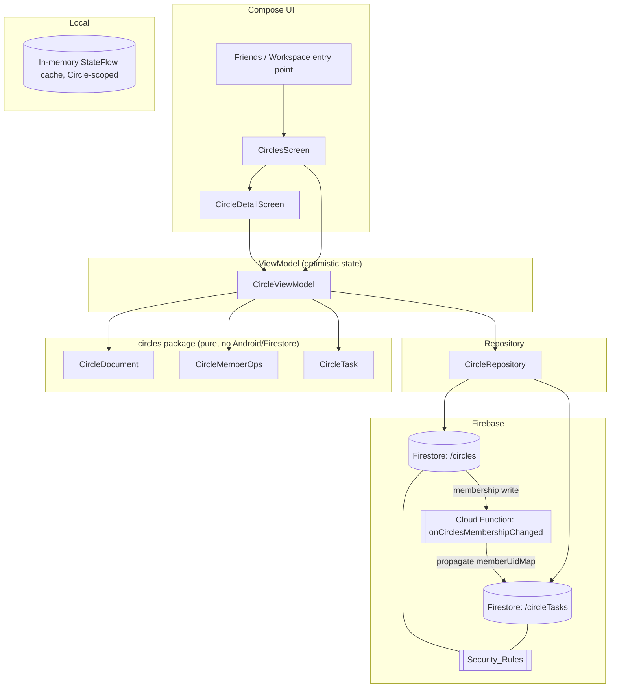
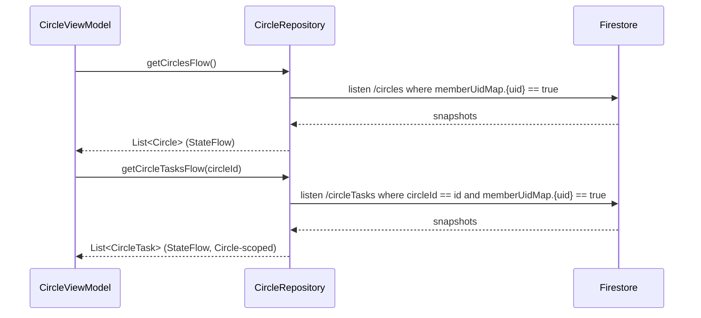
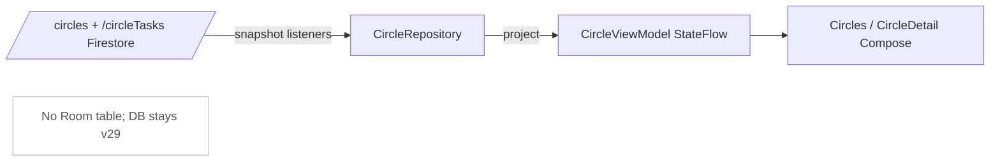
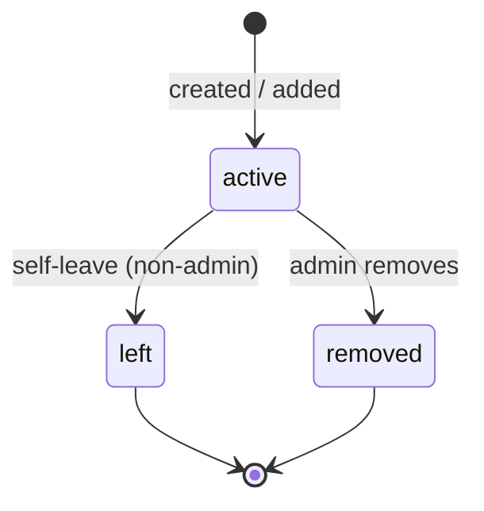

# Design Document

## Overview

This design adds **Shared Circles** to the Preamble Android app. A Circle is a named shared space owned by one Circle_Admin and joined by up to 50 Circle_Members, holding a single **shared** task list: any member can add a task, every member sees it in real time, and completing a task completes it **for the whole Circle** with attribution to the Member who did it.

The feature is built by **paralleling** the already-shipped `collaborative-tasks` feature rather than inventing new machinery. The canonical Circle document mirrors the `/collaborativeTasks/{taskId}` shape (`adminUid`, `memberUids`, `memberUidMap`, `memberStates`, timestamps) so the deployed Security_Rules helper idioms — membership reads via `memberUidMap[uid] == true`, admin-gated metadata writes, the `affectedKeys().hasOnly([...])` own-slice write, and the self-removal idiom — port over with minimal new rule logic. The client mirrors the `WorkspaceRepository` + `WorkspaceViewModel` optimistic-UI + timeout pattern, and the pure logic mirrors the side-effect-free `com.theblankstate.preamble.collab` package (`CollaborativeDocument`, `CollaborativeMemberOps`) in a new `com.theblankstate.preamble.circles` package.

The work falls into five tracks:

1. **Circle lifecycle** — create, rename, add member, remove member, leave, delete, with optimistic UI and the canonical-document membership model (Requirements 1–8).
2. **Shared task lifecycle** — add, real-time sync, **shared** completion with Completer attribution, author/admin-gated edit and delete (Requirements 9–12).
3. **Membership propagation** — keeping the denormalized `memberUidMap` on each Circle_Task in sync with its parent Circle's membership via a Cloud Function trigger (design decision below).
4. **Resilience** — every backend interaction reverts optimistic UI on failure or 30 s timeout and never propagates an unhandled exception (Requirement 15).
5. **Security rules** — new `/circles/{circleId}` and `/circleTasks/{taskId}` rule blocks added to the existing `firebase-firestore-rules.rules`, leaving all current behavior unchanged (Requirements 13, 14).

### Key design decisions

| # | Decision | Rationale |
| --- | --- | --- |
| D1 | **Canonical `/circles/{circleId}` document** mirroring `/collaborativeTasks` field names (`adminUid`, `name`, `memberUids`, `memberUidMap`, `memberStates{uid:{name,role,status,joinedAt}}`, `createdAt`, `updatedAt`). | Lets the deployed rule helper idioms (`hasValidMemberUidMap`, membership-via-map, admin-gated update, self-removal `hasOnly`) port over directly. Pure logic lives in `circles.CircleDocument` / `circles.CircleMemberOps`. |
| D2 | **Circle_Tasks stored TOP-LEVEL at `/circleTasks/{taskId}`** carrying `circleId` + a **denormalized `memberUidMap`** copied from the parent Circle. | Enables the same `where memberUidMap.{uid} == true` list query and membership rule check as `collaborativeTasks`, with **no parent-document lookup** inside rules (Firestore rule `get()` calls are billed and limited). Matches the established `collaborativeTasks` query idiom. |
| D3 | **Membership changes propagate `memberUidMap` onto the Circle's tasks via a Cloud Function trigger** (`onCirclesMembershipChanged`, `onDocumentWritten` on `/circles/{circleId}`), not client batched writes. | Correctness: a removed member must lose task access even if the admin's app dies mid-batch; a client batch is best-effort and races with the membership write. The trigger is authoritative, runs with Admin SDK privileges, and updates every `/circleTasks where circleId == X`. **Flagged** as the one piece of new server infrastructure this feature adds. |
| D4 | **Shared (global) completion**: a single `isCompleted` + `completedBy{uid,name}` + `completedAt` on the Circle_Task — **not** per-member `memberStates[uid].isCompleted`. | The deliberate departure called out in the requirements: household lists need "done for everyone". Un-completing clears `completedBy`/`completedAt`. |
| D5 | **Circle_Tasks kept in a separate local representation scoped to `Circle_Detail_Screen`; NOT mixed into the Home_Task_List.** | The Home list uses **per-user** completion (`memberStates[uid].isCompleted`) and personal-task semantics; Circle_Tasks use **global** Shared_Completion. Mixing the two models into one list creates UI and data-model confusion (a "done" row that means different things). Keeping them separate avoids a Room migration and keeps the two completion models cleanly isolated (see Data Models). |
| D6 | **Friendship-on-add enforced client-side only** (rules check membership/admin/schema, not friend relationships). | Mirrors how `collaborative-tasks` handled assignee membership: enforcing "is a friend" in rules needs cross-document reads of the admin's friends subcollection on every add. The admin's friend list is the source for the add UI, and the rule still guarantees only the admin can add anyone. |

### Technology context

- **Client:** Kotlin 2.0.21, Jetpack Compose, Room 2.7.1 (current DB version 29), Navigation Compose, minSdk 24 / target 36, `compileOptions` Java 11.
- **Backend:** Firebase Firestore (named database `"preamble"`), Auth, Cloud Functions (TypeScript, `firebase-functions/v2`), FCM.
- **Pure logic:** new side-effect-free package `com.theblankstate.preamble.circles` (no Android/Firestore deps), paralleling `com.theblankstate.preamble.collab`.
- **Test surface:** JVM unit tests with **jqwik** (already wired in `gradle/libs.versions.toml`, `jqwik = "1.8.5"`) + JUnit 5; Node `@firebase/rules-unit-testing` emulator suite under `firebase-rules-tests/`; Cloud Functions tests for the trigger.
- **Constraint:** JVM property/unit test **execution** is currently blocked because the build environment lacks a complete **JDK 21 with `jlink`** (`gradle.properties` pins an older JDK). Until a full JDK 21 toolchain is available, pure-logic and Compose test sources are verified by **compilation** rather than by running them — identical to the constraint recorded in the `collaborative-tasks` and `social-engagement` task notes.

## Architecture

### Component map



Requirement components map onto code as follows:

- **Circle_Service** → `CircleRepository` (Firestore reads/writes on `/circles`) fronted by `CircleViewModel` (optimistic state, validation, error messaging). Pure transforms in `circles.CircleDocument` / `circles.CircleMemberOps`.
- **Circle_Task_Service** → `CircleRepository` (`/circleTasks` reads/writes + `getCircleTasksFlow`) fronted by `CircleViewModel`. Pure transforms in `circles.CircleTask`.
- **Security_Rules** → new `/circles` and `/circleTasks` blocks in `firebase-firestore-rules.rules`.
- **Membership propagation** → new `onCirclesMembershipChanged` Cloud Function in `functions/src/`.

### Optimistic-UI control flow

Every Circle and Circle_Task action follows the single pattern already proven in `WorkspaceViewModel`:

```mermaid
sequenceDiagram
    participant U as User
    participant VM as CircleViewModel
    participant L as Local state (StateFlow)
    participant R as CircleRepository
    participant F as Firestore

    U->>VM: action (create / rename / add / remove / leave / delete / addTask / complete / edit / delete)
    VM->>VM: snapshot previous state
    VM->>L: apply change immediately (<200 ms)
    VM->>R: launch backend op (withTimeout 30s)
    alt success within timeout
        R->>F: write
        F-->>R: ok
        Note over VM,L: keep optimistic state; listener reconciles
    else failure or 30s timeout
        R-->>VM: Result.failure / TimeoutCancellationException
        VM->>L: restore snapshot exactly
        VM->>U: error message
    end
```

A single **30 s** write timeout (`kotlinx.coroutines.withTimeout(30_000)`) applies to every Circle/Circle_Task write (Requirements 1.5, 3.6, 4.8, 5.6, 6.4, 7.5, 9.6, 11.6, 12.6). A timeout is handled identically to a backend failure: restore the exact pre-action snapshot and surface a message.

### Membership propagation flow (Cloud Function — Decision D3)

```mermaid
sequenceDiagram
    participant Admin as Circle_Admin app
    participant F as Firestore /circles/{id}
    participant CF as onCirclesMembershipChanged
    participant CT as Firestore /circleTasks (where circleId == id)
    participant M as Each member app (listeners)

    Admin->>F: update memberUids / memberUidMap (add / remove / leave)
    F-->>CF: onDocumentWritten(before, after)
    CF->>CF: diff before.memberUidMap vs after.memberUidMap
    alt membership changed
        CF->>CT: batch set memberUidMap = after.memberUidMap on every task with circleId == id
        CT-->>M: snapshot; removed member's listener drops the tasks (<5s)
    else only name/timestamp changed
        CF->>CF: no-op
    end
    alt circle deleted (after == null)
        CF->>CT: batch delete every task with circleId == id
    end
```

The trigger is the **authoritative** keeper of the task-level `memberUidMap`. The client never writes `memberUidMap` onto tasks; it only writes the parent Circle's membership and lets the trigger fan out. This guarantees Requirement 5.5 (a removed member stops seeing the Circle's tasks within 5 s) and Requirement 7.2/7.3 (deleting a Circle deletes its tasks for everyone) even if the acting client disconnects immediately after the membership write.

### Real-time read flow



`getCircleTasksFlow` is **scoped to the open Circle** (`Circle_Detail_Screen`), reinforcing Decision D5: Circle_Tasks never enter the global Home task flow.

## Components and Interfaces

### CircleDocument (pure — `circles/CircleDocument.kt`)

Parallels `CollaborativeDocument`. Builds and validates the canonical `/circles/{circleId}` document and owns its structural invariants (Requirements 8.1–8.5, 13.7).

```kotlin
package com.theblankstate.preamble.circles

/** Pure descriptor of a circle member (admin or member). */
data class CircleMemberRef(val uid: String, val name: String)

sealed interface CircleDocumentResult {
    data class Created(val document: Map<String, Any?>) : CircleDocumentResult
    data object EmptyName : CircleDocumentResult        // Req 1.2
    data object TooManyMembers : CircleDocumentResult   // Req 4.6, 8.2
}

object CircleDocument {
    const val MAX_MEMBERS = 50                          // Max_Circle_Members incl. admin (Req 8.2)
    val MEMBER_STATUSES: Set<String> = setOf("active", "left", "removed") // Req 8.4
    const val ROLE_ADMIN = "admin"
    const val ROLE_MEMBER = "member"

    /** Trim leading/trailing whitespace (Req 1.1, 3.2). */
    fun normalizeName(raw: String): String = raw.trim()

    /** Membership map whose keys equal memberUids exactly (Req 8.3). */
    fun memberUidMap(memberUids: List<String>): Map<String, Boolean> =
        memberUids.filter(String::isNotBlank).distinct().associateWith { true }

    /**
     * Builds the canonical circle document at creation: the creator is the sole admin
     * and the only active member (Req 1.3, 8.1). Returns EmptyName when the normalized
     * name is blank (Req 1.2).
     */
    fun build(
        circleId: String,
        adminUid: String,
        adminName: String,
        name: String,
        now: Long
    ): CircleDocumentResult

    /** Validates every invariant a create/update must satisfy (mirrors rule schema, Req 8, 13.7). */
    fun isValid(document: Map<String, Any?>): Boolean
}
```

Invariants enforced (and mirrored in Security_Rules):

- exactly one `adminUid`; `adminUid ∈ memberUids` (8.1, 8.2);
- `memberUids` contains the admin, no duplicates, size 1..`MAX_MEMBERS` (8.2);
- `memberUidMap.keys() == memberUids` exactly (8.3);
- `memberStates` has exactly one entry per member and none for non-members; each entry has `name`, `role ∈ {admin, member}`, `status ∈ {active, left, removed}`, `joinedAt` (8.4);
- non-empty `name`, `createdAt`, `updatedAt` (8.5).

### CircleMemberOps (pure — `circles/CircleMemberOps.kt`)

Parallels `CollaborativeMemberOps`. Single-member transforms that touch only the affected member's slice (Requirement 8.6), returning `Updated`/`Rejected`.

```kotlin
object CircleMemberOps {
    const val REASON_NOT_FRIEND = "Only friends can be added to a Circle."
    const val REASON_ALREADY_MEMBER = "That person is already in this Circle."
    const val REASON_CIRCLE_FULL = "This Circle has reached the maximum number of members."
    const val REASON_ADMIN_CANNOT_LEAVE = "Delete the Circle instead of leaving it."
    const val REASON_ADMIN_CANNOT_REMOVE_SELF = "Delete the Circle instead of removing yourself."
    const val REASON_NOT_ADMIN = "Only the Circle admin can change membership."
    const val REASON_NOT_A_MEMBER = "That person is not in this Circle."

    sealed interface DocumentOpResult {
        data class Updated(val document: Map<String, Any?>) : DocumentOpResult
        data class Rejected(val reason: String) : DocumentOpResult
    }

    /** Admin adds a member: appends only the new member to memberUids/memberUidMap/memberStates
     *  (status=active, role=member); rejects duplicates and over-capacity (Req 4.2, 4.4, 4.6, 8.6). */
    fun addMember(document: Map<String, Any?>, newMember: CircleMemberRef, now: Long): DocumentOpResult

    /** Admin removes a non-admin member: removes only that uid from memberUids/memberUidMap, sets only
     *  that member's status to "removed"; rejects removing the admin (Req 5.2, 5.3, 8.6). */
    fun removeMember(document: Map<String, Any?>, targetUid: String, now: Long): DocumentOpResult

    /** Non-admin leaves: removes only self from memberUids/memberUidMap, sets only own status to "left";
     *  rejects admin self-removal (Req 6.2, 6.3, 8.6). */
    fun leaveCircle(document: Map<String, Any?>, leavingUid: String, now: Long): DocumentOpResult

    /** Admin renames: sets only `name` (normalized) + `updatedAt`; rejects empty name (Req 3.3, 3.4). */
    fun rename(document: Map<String, Any?>, newName: String, now: Long): DocumentOpResult
}
```

`addMember`/`removeMember`/`leaveCircle` recompute `memberUidMap` from the new `memberUids` via `CircleDocument.memberUidMap`, exactly as `CollaborativeMemberOps` does, so the keys-equal-members invariant is preserved by construction.

### CircleTask (pure — `circles/CircleTask.kt`)

Owns Circle_Task construction, the **shared-completion** transform (Decision D4), and the **edit/delete authorization** classification (Requirements 9, 11, 12).

```kotlin
object CircleTask {
    const val MAX_TITLE_LEN = 500

    sealed interface BuildResult {
        data class Created(val document: Map<String, Any?>) : BuildResult
        data object EmptyTitle : BuildResult   // Req 9.4
    }

    /**
     * Builds a /circleTasks/{taskId} document: circleId, authorUid, title (trimmed, non-empty),
     * a not-completed shared-completion state, denormalized memberUidMap (copied from the parent
     * circle), createdAt/updatedAt (Req 9.2). Returns EmptyTitle when the title is blank (Req 9.4).
     */
    fun build(
        taskId: String,
        circleId: String,
        authorUid: String,
        title: String,
        memberUidMap: Map<String, Boolean>,
        now: Long
    ): BuildResult

    /**
     * Shared-completion transform (Req 11.2, 11.4): setting completed records
     * isCompleted=true, completedBy={uid,name}, completedAt=now for the WHOLE circle;
     * setting not-completed clears isCompleted=false, completedBy=null, completedAt=null.
     */
    fun setCompletion(
        document: Map<String, Any?>,
        completed: Boolean,
        actorUid: String,
        actorName: String,
        now: Long
    ): Map<String, Any?>

    /** Authorization for title-edit and delete: author OR circle admin (Req 12.1–12.4). */
    enum class EditDeleteDecision { ALLOW, DENY }
    fun classifyEditDelete(
        taskAuthorUid: String,
        circleAdminUid: String,
        requesterUid: String
    ): EditDeleteDecision   // ALLOW iff requester == author || requester == admin
}
```

`completedBy` is `null` when not completed and `{ "uid": ..., "name": ... }` when completed; clearing it on un-complete is the explicit Requirement 11.4 behavior.

### CircleRepository (`repository/CircleRepository.kt`)

Firestore gateway. Every write returns `Result<Unit>` via `runCatching`; the ViewModel applies the 30 s timeout. Methods build documents/transforms through the pure `circles` package and never embed business rules inline.

```kotlin
class CircleRepository(private val db: FirebaseFirestore, private val auth: FirebaseAuth) {
    fun getCirclesFlow(): Flow<List<Circle>>                       // listen /circles where memberUidMap.{uid}==true (Req 2.1, 2.3)
    fun getCircleTasksFlow(circleId: String): Flow<List<CircleTaskModel>> // listen /circleTasks where circleId==id and memberUidMap.{uid}==true (Req 10.1, 10.2)

    suspend fun createCircle(name: String): Result<String>        // Req 1.3
    suspend fun renameCircle(circleId: String, newName: String): Result<Unit>  // Req 3.4
    suspend fun addMember(circleId: String, friend: Friend): Result<Unit>      // Req 4.2
    suspend fun removeMember(circleId: String, memberUid: String): Result<Unit> // Req 5.2
    suspend fun leaveCircle(circleId: String): Result<Unit>       // Req 6.2 (own-slice update)
    suspend fun deleteCircle(circleId: String): Result<Unit>      // Req 7.2 (CF cascades task deletes)

    suspend fun addCircleTask(circleId: String, title: String): Result<String>  // Req 9.2
    suspend fun setCircleTaskCompletion(taskId: String, completed: Boolean): Result<Unit> // Req 11.2
    suspend fun editCircleTaskTitle(taskId: String, newTitle: String): Result<Unit>       // Req 12.1
    suspend fun deleteCircleTask(taskId: String): Result<Unit>    // Req 12.3
}
```

- `leaveCircle` issues the **own-slice** update (the rule's `removesSelfFromCircleOnly()` path), not a full document overwrite, so a non-admin write is accepted.
- `addCircleTask` reads the parent Circle's current `memberUidMap` to seed the denormalized copy (the trigger keeps it current thereafter).
- `deleteCircle` deletes only the `/circles/{id}` document; the Cloud Function cascades the task deletes (Decision D3), avoiding a large client-side batch and a client-side `list` over another member's tasks.
- Listener errors are surfaced through `.catch { reportListenerFailure(label, it) }` retaining last-loaded data (Requirement 15.1).

### CircleViewModel (`ui/viewmodels/CircleViewModel.kt`)

Holds optimistic `StateFlow` state and orchestrates snapshot-and-revert with the 30 s timeout, mirroring `WorkspaceViewModel`.

```kotlin
class CircleViewModel(...) : ViewModel() {
    val circles: StateFlow<List<Circle>>                 // from getCirclesFlow
    val circleTasks: StateFlow<List<CircleTaskModel>>    // from getCircleTasksFlow(openCircleId)
    val uiState: StateFlow<CircleUiState>

    fun createCircle(name: String)        // validate empty (1.2); optimistic insert; revert on fail (1.4, 1.5)
    fun renameCircle(circle: Circle, newName: String)     // 3.3–3.6
    fun addMember(circle: Circle, friend: Friend)         // 4.2–4.8
    fun removeMember(circle: Circle, memberUid: String)   // 5.2–5.6
    fun leaveCircle(circle: Circle)                       // 6.1–6.4 (confirm in UI)
    fun deleteCircle(circle: Circle)                      // 7.1–7.5 (confirm in UI)

    fun openCircle(circleId: String)                      // starts getCircleTasksFlow(circleId)
    fun addTask(circleId: String, title: String)          // 9.2–9.6
    fun setCompletion(task: CircleTaskModel, completed: Boolean) // 11.2–11.6
    fun editTaskTitle(task: CircleTaskModel, newTitle: String)   // 12.1, 12.5, 12.6
    fun deleteTask(task: CircleTaskModel)                 // 12.3, 12.5, 12.6
}

private companion object { const val WRITE_TIMEOUT_MS = 30_000L }
```

Local validation (empty name → reject + message, non-friend/duplicate/over-capacity add → reject + message, empty title → reject + message) runs through the pure `circles` results **before** any optimistic mutation, so rejected requests never touch state (Requirements 1.2, 3.3, 4.3/4.4/4.6, 9.4). `editTaskTitle`/`deleteTask` gate on `CircleTask.classifyEditDelete` before issuing the write so the UI only offers the control to author/admin (Requirements 12.1–12.4).

### UI surfaces

- **CirclesScreen** (`ui/screens/CirclesScreen.kt`) — lists the user's Circles (name + member count, Req 2.1), an empty-state with a create control when the user belongs to none (Req 2.2), and a create-Circle entry (Req 1.1). Reachable from the friends/workspace area (Req 2.4) by adding a navigation entry alongside the existing workspace destinations.
- **CircleDetailScreen** (`ui/screens/CircleDetailScreen.kt`) — shows one Circle's shared task list (title, Shared_Completion state, Completer name, author name, Req 10.1), an add-task control (Req 9.1), an empty-state when there are no tasks (Req 10.3), a completion toggle per task (Req 11.1, 11.4), and author/admin-only edit/delete affordances (Req 12). For the Circle_Admin it also renders membership controls (add from friends, remove member, rename, delete); for a non-admin member it renders a confirmed Leave control (Req 6.1) and no admin controls (Req 5.4, 6.3, 7.4).

### Security_Rules (`firebase-firestore-rules.rules`)

Two new blocks are added; **all existing rules are unchanged**. New helpers parallel the deployed `isQueryableCollabMember` / `hasValidMemberUidMap` / `updatesOwnMemberStatusOnly` / `removesSelfFromCollaborativeTaskOnly` idioms.

```javascript
// ---- Circle helpers ----
function circleIsMember() {
  return signedIn()
    && resource.data.memberUids is list
    && request.auth.uid in resource.data.memberUids;
}
function circleIsQueryableMember() {
  return signedIn()
    && resource.data.memberUidMap is map
    && resource.data.memberUidMap[request.auth.uid] == true;
}
function circleHasValidMemberUidMap(data) {
  return data.memberUidMap is map
    && data.memberUidMap.keys().hasAll(data.memberUids)
    && data.memberUidMap.keys().hasOnly(data.memberUids)
    && data.memberUidMap[data.adminUid] == true;
}
function isValidCircleMemberStatus(status) {
  return status in ['active', 'left', 'removed'];
}
function isValidCircleDocument(circleId) {
  let d = request.resource.data;
  return d.circleId == circleId
    && d.adminUid is string
    && d.name is string && d.name.size() >= 1
    && d.memberUids is list
    && d.memberUids.size() >= 1
    && d.memberUids.size() <= 50            // Max_Circle_Members (Req 8.2, 13.7)
    && d.memberUids.hasAll([d.adminUid])    // admin is a member (Req 8.1)
    && circleHasValidMemberUidMap(d)        // keys == memberUids (Req 8.3, 13.7)
    && d.memberStates is map;
}
function isCircleAdminCreate(circleId) {
  return signedIn()
    && request.resource.data.adminUid == request.auth.uid          // creator is admin (Req 13.3)
    && request.auth.uid in request.resource.data.memberUids        // and a member (Req 13.3)
    && isValidCircleDocument(circleId);
}
function isCircleAdminUpdate(circleId) {
  return signedIn()
    && resource.data.adminUid == request.auth.uid                  // only admin (Req 13.4)
    && request.resource.data.adminUid == resource.data.adminUid    // admin unchanged
    && request.resource.data.circleId == resource.data.circleId
    && isValidCircleDocument(circleId);
}
// Non-admin self-removal: own-slice idiom (Req 13.5), parallels removesSelfFromCollaborativeTaskOnly.
function removesSelfFromCircleOnly() {
  return circleIsMember()
    && resource.data.adminUid != request.auth.uid
    && request.resource.data.diff(resource.data).affectedKeys()
         .hasOnly(['memberUids', 'memberUidMap', 'memberStates', 'updatedAt'])
    && request.resource.data.memberUids == resource.data.memberUids.removeAll([request.auth.uid])
    && circleHasValidMemberUidMap(request.resource.data)
    && request.resource.data.memberStates.diff(resource.data.memberStates).affectedKeys()
         .hasOnly([request.auth.uid])
    && request.resource.data.memberStates[request.auth.uid].status == 'left';
}

match /circles/{circleId} {
  allow get:    if circleIsMember();                                 // Req 13.1, 13.2
  allow list:   if circleIsQueryableMember();                        // Req 13.1
  allow create: if isCircleAdminCreate(circleId);                    // Req 13.3
  allow update: if isCircleAdminUpdate(circleId)                     // rename/add/remove (Req 13.4)
                || removesSelfFromCircleOnly();                      // self-leave (Req 13.5)
  allow delete: if signedIn() && resource.data.adminUid == request.auth.uid; // Req 13.6
}
```

```javascript
// ---- Circle task helpers (denormalized memberUidMap on the task itself — Decision D2) ----
function circleTaskIsMember() {
  return signedIn()
    && resource.data.memberUidMap is map
    && resource.data.memberUidMap[request.auth.uid] == true;        // no parent lookup (Req 14.1, 14.2)
}
function circleTaskIncomingIsMember() {
  return signedIn()
    && request.resource.data.memberUidMap is map
    && request.resource.data.memberUidMap[request.auth.uid] == true;
}
function isValidCircleTaskCreate() {
  let d = request.resource.data;
  return d.circleId is string
    && d.authorUid == request.auth.uid                              // author is requester (Req 14.3)
    && d.title is string && d.title.size() >= 1 && d.title.size() <= 500
    && d.isCompleted == false
    && circleTaskIncomingIsMember();                                // member of the circle (Req 14.3)
}
// ANY member may write ONLY the shared-completion fields (Req 14.4) — diff-based, parallels
// updatesOwnMemberStatusOnly / updatesOwnReactionOnly.
function updatesOnlyCompletionFields() {
  return circleTaskIsMember()
    && request.resource.data.diff(resource.data).affectedKeys()
         .hasOnly(['isCompleted', 'completedBy', 'completedAt', 'updatedAt'])
    && request.resource.data.isCompleted is bool
    && request.resource.data.circleId == resource.data.circleId
    && request.resource.data.authorUid == resource.data.authorUid
    && request.resource.data.title == resource.data.title;
}
// Title edit / delete: author or circle admin only (Req 14.5, 14.6).
function isCircleTaskAuthor() {
  return signedIn() && resource.data.authorUid == request.auth.uid;
}
function isCircleAdminOf(circleId) {
  return signedIn()
    && get(/databases/$(database)/documents/circles/$(circleId)).data.adminUid == request.auth.uid;
}
function authorOrAdminEdit() {
  return circleTaskIsMember()
    && (isCircleTaskAuthor() || isCircleAdminOf(resource.data.circleId))
    && request.resource.data.circleId == resource.data.circleId
    && request.resource.data.authorUid == resource.data.authorUid
    && request.resource.data.memberUidMap == resource.data.memberUidMap; // members untouched (CF owns it)
}

match /circleTasks/{taskId} {
  allow get:    if circleTaskIsMember();                  // Req 14.1, 14.2
  allow list:   if circleTaskIsMember();                  // member list query (Req 14.1)
  allow create: if isValidCircleTaskCreate();             // Req 14.3, 14.7
  allow update: if updatesOnlyCompletionFields()          // any member, completion only (Req 14.4)
                || authorOrAdminEdit();                   // author/admin title edit (Req 14.5, 14.6)
  allow delete: if circleTaskIsMember()
                && (isCircleTaskAuthor() || isCircleAdminOf(resource.data.circleId)); // Req 14.5, 14.6
}
```

Notes:

- The completion-write rule (`updatesOnlyCompletionFields`) checks the **task's own** denormalized `memberUidMap` — the direct consequence of Decision D2 — so any member can flip completion without a parent `get()`. Non-members are denied because their uid is absent from the map (Req 14.7). Unauthenticated requests fail `signedIn()` (Req 13.8, 14.8).
- `memberUidMap` on a task is writable only by the Admin-SDK Cloud Function (Decision D3); the member-facing rules above all assert `memberUidMap` is **unchanged** on completion and edit, so no client can widen access by editing the map. (The trigger uses Admin privileges, which bypass rules.)
- Friendship is **not** checked in rules (Decision D6); the admin-gated `update` already prevents anyone but the admin from adding members.

### Cloud Function: `onCirclesMembershipChanged` (`functions/src/circles.ts`)

New `onDocumentWritten` trigger on `/circles/{circleId}` in the `"preamble"` database, exported from `functions/src/index.ts` (parallels the existing `onCollaborativeTaskReaction` style). Pseudocode:

```typescript
export const onCirclesMembershipChanged = onDocumentWritten(
  { database: "preamble", document: "circles/{circleId}" },
  async (event) => {
    const before = event.data?.before.data();
    const after = event.data?.after.data();
    const db = getFirestore("preamble");
    const circleId = event.params.circleId;

    // Deletion: cascade-delete every task of this circle (Req 7.2, 7.3).
    if (!after) {
      await deleteByQuery(db, "circleTasks", "circleId", circleId);
      return;
    }
    // Membership change: propagate the new memberUidMap onto every task (Req 5.5, D3).
    const beforeMap = asStringMap(before?.memberUidMap);
    const afterMap = asStringMap(after.memberUidMap);
    if (JSON.stringify(sortedKeys(beforeMap)) === JSON.stringify(sortedKeys(afterMap))) return; // no-op
    await batchSet(db, "circleTasks", "circleId", circleId, { memberUidMap: afterMap });
  }
);
```

Failures are logged and the function is idempotent (re-running produces the same task `memberUidMap`), so retries are safe.

## Data Models

### Canonical Circle document (`/circles/{circleId}`)

```jsonc
{
  "circleId": "uuid",
  "adminUid": "uid",
  "name": "Home",                                   // non-empty, normalized (trimmed)
  "memberUids": ["adminUid", "memberUid1", "..."],  // includes admin, no dups, size 1..50
  "memberUidMap": { "adminUid": true, "memberUid1": true }, // keys == memberUids exactly
  "memberStates": {
    "adminUid":   { "name": "Ada",  "role": "admin",  "status": "active", "joinedAt": 0 },
    "memberUid1": { "name": "Lin",  "role": "member", "status": "active", "joinedAt": 0 }
  },
  "createdAt": 0,
  "updatedAt": 0
}
```

Invariants are listed under `CircleDocument` and mirrored by `isValidCircleDocument` in the rules. `status` is one of `active` / `left` / `removed`; a `left`/`removed` member is dropped from `memberUids` and `memberUidMap` while its `memberStates` entry is retained for history (paralleling collaborative self-removal).

### Circle task document (`/circleTasks/{taskId}`) — Decision D2 + D4

```jsonc
{
  "taskId": "uuid",
  "circleId": "uuid",                               // parent circle (Req 9.2)
  "authorUid": "uid",                               // Circle_Author (Req 9.2)
  "authorName": "Ada",
  "title": "Buy milk",                              // non-empty, 1..500
  "isCompleted": false,                             // SHARED completion (Req 11) — NOT per-member
  "completedBy": null,                              // { "uid", "name" } when completed, else null
  "completedAt": null,                              // UTC millis when completed, else null
  "memberUidMap": { "adminUid": true, "memberUid1": true }, // DENORMALIZED copy of the circle's map
  "createdAt": 0,
  "updatedAt": 0
}
```

The `memberUidMap` is a **denormalized copy** of the parent Circle's map, written at create time from the current parent and kept in sync by the Cloud Function (Decision D3). It exists solely so list queries (`where circleId == id and memberUidMap.{uid} == true`) and the membership rule checks work without a parent-document `get()`.

### Local representation (Decision D5 — no Room migration)

Circle data is held in **`CircleViewModel` `StateFlow` caches**, not in the Room `tasks` table:

- `Circle` — `circleId, name, adminUid, members: List<CircleMember>, createdAt, updatedAt`.
- `CircleTaskModel` — `taskId, circleId, authorUid, authorName, title, isCompleted, completedByUid, completedByName, completedAt, createdAt`.

These are projected from Firestore snapshots by `CircleRepository` and exposed to Compose directly. **No Room entity and no Room migration (DB version stays 29)** are introduced, because:

1. Circle_Tasks use **global** Shared_Completion while the Room `tasks` table models **per-user** completion; the two cannot share a row type without ambiguity (Decision D5).
2. Circle_Tasks are only ever shown on the Circle-scoped `Circle_Detail_Screen`, so offline persistence beyond Firestore's own local cache is not required by any acceptance criterion.

Firestore's built-in offline cache still serves the snapshot listeners when connectivity drops, satisfying "retain last successfully synced copy" (Requirement 10.4, 15.1) without a bespoke Room mirror.



### Member status state machine



`left` and `removed` are terminal; such members are excluded from `memberUids`/`memberUidMap` (so they lose access via the rules) while retaining a `memberStates` entry for attribution/history.

## Correctness Properties

*A property is a characteristic or behavior that should hold true across all valid executions of a system — essentially, a formal statement about what the system should do. Properties serve as the bridge between human-readable specifications and machine-verifiable correctness guarantees.*

These properties cover only the **pure logic** in `com.theblankstate.preamble.circles` (`CircleDocument`, `CircleMemberOps`, `CircleTask`), which is where the feature's correctness-critical decisions live. Per the prework analysis and reflection, the data-model invariants collapse into one comprehensive property, each membership transform combines its single-slice isolation with its rejection guard, and the shared-completion set/clear behavior is one property. Deliberately **excluded** (and tested by other layers): the Firestore Security_Rules (Requirements 13, 14) — emulator integration tests; the `memberUidMap`-propagation Cloud Function trigger (Decision D3) and the Circle/Circle_Task delete cascade — Cloud Functions integration tests; the snapshot listeners and the optimistic-UI timing/revert in `CircleViewModel` — Compose/instrumented and fake-repository example tests.

### Property 1: Canonical Circle document invariants

*For any* admin uid, admin name, non-empty Circle name, and any set of 0–49 additional distinct member uids, the document produced by `CircleDocument.build` (and the document produced by every `CircleMemberOps` transform) satisfies: exactly one `adminUid`; `memberUids` contains the admin, has no duplicates, and has size between 1 and 50; `memberUidMap` keys equal `memberUids` exactly with `memberUidMap[adminUid] == true`; `memberStates` has exactly one entry per member and none for any non-member, each entry carrying a `name`, a `role ∈ {admin, member}`, a `status ∈ {active, left, removed}`, and a `joinedAt`; and a non-empty `name`, a `createdAt`, and an `updatedAt`. At creation the admin's state is `active` with `role=admin` and is the only member.

**Validates: Requirements 1.3, 8.1, 8.2, 8.3, 8.4, 8.5**

### Property 2: Name normalization is idempotent and gates empty names

*For any* string, `CircleDocument.normalizeName` returns a value with no leading or trailing whitespace and `normalizeName(normalizeName(x)) == normalizeName(x)`; and for any document and any candidate name, `CircleMemberOps.rename` sets only the `name` (to the normalized value) and `updatedAt` when the normalized name is non-empty, and leaves the existing `name` unchanged when the normalized name is empty (and `CircleDocument.build` likewise returns `EmptyName` with no document for an empty normalized name).

**Validates: Requirements 1.1, 1.2, 3.2, 3.3, 3.4**

### Property 3: Adding a member is single-slice and capacity-bounded

*For any* Circle document and any candidate member, `CircleMemberOps.addMember` succeeds exactly when the candidate is not already a member and the resulting member count would not exceed 50; on success it adds only that uid to `memberUids` and `memberUidMap` and adds only that member's `memberStates` entry (with `status=active`, `role=member`), leaving every other member's `memberUids`/`memberUidMap`/`memberStates` records byte-for-byte identical; on rejection (duplicate member or capacity exceeded) the document is returned unchanged.

**Validates: Requirements 4.2, 4.4, 4.5, 4.6, 8.6**

### Property 4: Removing a member is single-slice and admin-guarded

*For any* Circle document and any target uid, `CircleMemberOps.removeMember` succeeds only when the target is a non-admin member; on success it removes only that uid from `memberUids` and `memberUidMap` and sets only that member's `memberStates` status to `removed` (retaining the entry), leaving every other member's records unchanged; an attempt to remove the admin's own uid (or a non-member) is rejected and leaves the document unchanged.

**Validates: Requirements 5.2, 5.3, 8.6**

### Property 5: Leaving a Circle affects only the leaving member and is admin-guarded

*For any* Circle document in which the user is a non-admin member, `CircleMemberOps.leaveCircle` removes only that user from `memberUids` and `memberUidMap`, sets only that user's `memberStates` status to `left`, and leaves every other member's records unchanged; an attempt by the admin to leave is rejected and leaves the document unchanged.

**Validates: Requirements 6.2, 6.3, 8.6**

### Property 6: Shared completion sets and clears the Completer

*For any* Circle_Task document, any acting member, and any timestamp, `CircleTask.setCompletion(true, actor, name, now)` yields `isCompleted == true`, `completedBy == { uid: actor, name }`, and `completedAt == now` regardless of the prior state; and `CircleTask.setCompletion(false, ...)` yields `isCompleted == false`, `completedBy == null`, and `completedAt == null` regardless of the prior state. In both cases `circleId`, `authorUid`, `title`, and `memberUidMap` are unchanged.

**Validates: Requirements 11.2, 11.4**

### Property 7: Edit/delete authorization classification

*For any* triple of task author uid, Circle admin uid, and requester uid, `CircleTask.classifyEditDelete` returns `ALLOW` if and only if the requester equals the author or the requester equals the admin, and returns `DENY` otherwise.

**Validates: Requirements 12.1, 12.2, 12.3, 12.4**

### Property 8: Circle_Task construction invariants and empty-title rejection

*For any* task id, circle id, author, member map, and timestamp, `CircleTask.build` with a non-empty (post-trim) title produces a document recording the `circleId`, the `authorUid`, the trimmed `title`, a not-completed shared-completion state (`isCompleted == false`, `completedBy == null`, `completedAt == null`), the denormalized `memberUidMap` copied from the input, and a `createdAt`; and with an empty (all-whitespace) title returns `EmptyTitle` and produces no document.

**Validates: Requirements 9.2, 9.4**

## Error Handling

Error handling is uniform and built on the optimistic-UI pattern, so that no Firestore failure crashes the app or leaves local state inconsistent (Requirement 15).

- **Snapshot-and-revert.** Before any optimistic mutation, `CircleViewModel` captures the exact prior `StateFlow` value(s). On `Result.failure` or timeout it restores those snapshots verbatim and emits a `CircleUiState.Error` with a human-readable message (15.2, 15.4). Every action — create, rename, add, remove, leave, delete, add-task, set-completion, edit-title, delete-task — uses this path (1.5, 3.6, 4.8, 5.6, 6.4, 7.5, 9.6, 11.6, 12.6).
- **Single write timeout.** All Circle/Circle_Task writes are wrapped in `withTimeout(30_000)`; a `TimeoutCancellationException` is caught and mapped to the same revert path as a failure (Requirements 1.5, 3.6, 4.8, 5.6, 6.4, 7.5, 9.6, 11.6, 12.6).
- **Listener failures.** Each snapshot listener (`/circles`, `/circleTasks`) is collected with `.catch { reportListenerFailure(label, it) }`, which logs the error, retains the last-loaded data for that data set, and emits a message naming which data set (Circles or Circle tasks) could not be loaded — without tearing down the app (15.1, 10.4).
- **Total handling.** Every `CircleRepository` entry point returns `Result<T>` via `runCatching`, and every `CircleViewModel` launch handles both branches; no failure path rethrows to the coroutine root (15.3).
- **Pre-validation never mutates.** Empty-name (1.2, 3.3), non-friend / duplicate / over-capacity add (4.3, 4.4, 4.6), admin self-remove / admin leave (5.3, 6.3), and empty-title (9.4) are rejected through the pure `circles` results **before** any optimistic write, so a rejected request leaves state untouched and only surfaces a message.
- **User-facing messages.** A `Throwable.userMessage(default)` helper maps known Firestore exceptions (notably `PERMISSION_DENIED`) to friendly text and falls back to a provided default, so denied writes read as "could not be saved" rather than raw exceptions.

## Testing Strategy

The feature is tested with four complementary layers. Property-based testing applies to the pure `circles` logic; Firestore Security_Rules use the emulator integration suite; the membership-propagation/cascade Cloud Function uses a Cloud Functions test; UI, timing, and optimistic-revert concerns use Compose/instrumented and fake-repository example tests.

### Property-based tests (pure `circles` logic)

- **Library:** **jqwik** (`net.jqwik:jqwik`, already declared in `gradle/libs.versions.toml` as `jqwik = "1.8.5"`) as a `testImplementation` dependency alongside JUnit 5. We do not hand-roll property testing.
- **Pure-logic extraction:** `CircleDocument`, `CircleMemberOps`, and `CircleTask` are side-effect-free and take/return plain maps, so they are testable without Firebase or Android — exactly as the `collab` package is.
- **Configuration:** each property test runs a **minimum of 100 iterations** (`@Property(tries = 100)` or higher).
- **Tagging:** each property test carries a comment of the form
  `// Feature: shared-circles, Property {n}: {property text}`
  and implements exactly one of the 8 properties above (one property → one property test).
- **Generators:** custom generators produce arbitrary admin/member uid sets spanning the boundaries (0, 1, 49, 50, 51 members), member-state maps with mixed `active`/`left`/`removed` statuses, Circle names with leading/trailing/Unicode whitespace and empty/blank strings, task titles (empty, blank, 1-char, 500-char, Unicode), and author/admin/requester uid triples (equal and distinct) for the authorization classification.

### Integration tests (Firestore Security_Rules — Requirements 13, 14)

- Extend the existing Node `@firebase/rules-unit-testing` suite (`firebase-rules-tests/firestore.rules.test.mjs`) run via the Firestore emulator.
- Cover, with 1–3 representative actors each: member vs non-member `/circles` get/list (13.1, 13.2); admin-only create with creator-as-admin-and-member (13.3); admin-only rename/add/remove and denial for non-admins (13.4); the non-admin self-removal own-slice path and denial when the write touches another member (13.5); admin-only delete (13.6); schema rejection for a bad `memberUidMap` or invalid status (13.7); unauthenticated denial (13.8); Circle_Task member read/list via the denormalized `memberUidMap` and non-member denial (14.1, 14.2); member create with `authorUid == self` (14.3); the `updatesOnlyCompletionFields()` path permitting **any** member to flip `isCompleted`/`completedBy`/`completedAt` while denying any other field change (14.4); author/admin title-edit and delete, with denial for other members (14.5, 14.6); non-member write denial (14.7); and unauthenticated denial (14.8).
- Boundary cases assert member-count 50 is accepted and 51 is rejected.

### Cloud Functions test (membership propagation + cascade — Decision D3)

- A Cloud Functions test (emulator or `firebase-functions-test`) exercises `onCirclesMembershipChanged`: adding/removing/leaving a member updates the denormalized `memberUidMap` on every `/circleTasks` document with that `circleId` (so a removed member's `memberUidMap[uid]` becomes absent, cutting access within the 5 s window — 5.5); a name-only change is a no-op; and deleting the `/circles/{id}` document cascade-deletes every task with that `circleId` (7.2, 7.3). Idempotence is asserted by running the trigger twice.

### Example and instrumented tests

- **Fake-repository example tests** cover the optimistic timing and exact-state revert that property tests do not assert: each action reflects in `CircleViewModel` state before the backend completes (1.4, 3.4, 4.2, 5.2, 6.2, 7.2, 9.3, 11.5, 12.5) and reverts to the exact prior snapshot on induced failure/timeout (1.5, 3.6, 4.8, 5.6, 6.4, 7.5, 9.6, 11.6, 12.6, 15.2, 15.4); a listener error retains last-loaded data and surfaces a message without crashing (15.1, 10.4); and non-friend add rejection surfaces the friends-only message (4.3).
- **Compose UI / instrumented tests** verify rendering and navigation: the Circles list with name + member count and the empty-state create control (2.1, 2.2); reachability from the friends/workspace area (2.4); the shared task list showing title, Shared_Completion, Completer name, and author (10.1) and its empty state (10.3); the completion toggle (11.1); author/admin-only edit/delete affordances and their absence for other members (12.1–12.4); and the admin-only membership controls vs the non-admin confirmed Leave control (5.4, 6.1, 6.3, 7.4).

### Test execution environment constraint

JVM property/unit-test **execution** (the jqwik tests above) and Compose tests are currently blocked because the build environment lacks a complete **JDK 21 with `jlink`** (`gradle.properties` pins an older JDK), matching the constraint recorded in the `collaborative-tasks` and `social-engagement` task notes. Until a full JDK 21 toolchain is available, the pure-logic and Compose test sources are verified by **compilation** (they must compile cleanly against the production code) rather than by running them; the rules emulator suite and the Cloud Functions test run on Node and are unaffected.
