# Design Document

## Overview

This feature layers three lightweight social mechanics — **kudos/reactions**, a **weekly friends leaderboard** built on Productivity_Points, and **nudges** — onto the already-shipped `collaborative-tasks` feature. It reuses that feature's canonical document at `/collaborativeTasks/{taskId}` (`schemaVersion == 2`), its pure-logic package `com.theblankstate.preamble.collab`, the `WorkspaceRepository`/`WorkspaceViewModel`/`TaskViewModel` triad, the Room `Task` mirror (DB v29), and the deployed Firestore Security_Rules idioms (`updatesOwnMemberStatusOnly`, `isCollabMember`). No existing collaborative-tasks behavior changes; this design only adds new behavior.

The design makes four cross-cutting technical decisions that the requirements deliberately deferred, and justifies each against the real codebase:

1. **Reactions live on the canonical task document.** A `reactions` map keyed by reactor uid is added to `/collaborativeTasks/{taskId}`, mirroring the `memberStates[uid]` shape. A new Security_Rules function `updatesOwnReactionOnly()` reuses the deployed `updatesOwnMemberStatusOnly()` idiom verbatim (the `diff().affectedKeys().hasOnly([...])` scoped to `request.auth.uid`). Pure toggle/validation logic goes into a new side-effect-free `collab/Reactions.kt`, and reactions are projected into the local `Task` for rendering.

2. **The authoritative score moves out of the reciprocal friend record.** `Friend.productivityPoints` lives at `/users/{ownerUid}/friends/{friendUid}` and is **owner-writable only** (collaborative-tasks Req 17), so a friend can neither write their own authoritative score there nor have others read it. The score therefore moves to a **self-owned, friend-readable** document `/leaderboard/{uid}`, with a read rule gated on friendship (`exists(/users/{uid}/friends/{reader})`) and an owner-only, increment-only-by-10, monotonic write rule. Weekly windowing is handled by per-ISO-week buckets keyed on a deterministic Monday-00:00-UTC week key.

3. **Pushes require a server-side trigger.** There is no client path to push to another specific user. A new **Cloud Functions** module (`functions/`, TypeScript) adds a **callable `sendNudge`** (authoritative membership + pending + 60-minute rate-limit checks, then FCM send) and a **Firestore `onUpdate` trigger** `onCollaborativeTaskReaction` that detects added/changed reactions and sends the kudos push. Both send **data-only** FCM messages rendered by the existing `PreambleFcmService`.

4. **Pure logic stays JVM-testable.** Every decision that has a "for all inputs" character — reaction toggle semantics, emoji validation, weekly-window bucketing, points idempotency/monotonicity, leaderboard ordering, nudge rate-limit arithmetic — is implemented as a pure function in the `collab` package and validated with the established jqwik suite. Security_Rules and FCM delivery are verified by emulator and Cloud Functions integration tests, not property tests.

### Current-state findings that drive the design

| Area | Current state (verified) | Decision for this feature |
| --- | --- | --- |
| Reaction storage | No reaction concept exists | Add `reactions` map to `/collaborativeTasks/{taskId}`; project into `Task.reactionsJson` |
| Own-slice write idiom | `updatesOwnMemberStatusOnly()` deployed in `firebase-firestore-rules.rules` | Add sibling `updatesOwnReactionOnly()`; add it to the `/collaborativeTasks` `update` allow list |
| Score location | `Friend.productivityPoints` at `/users/{uid}/friends/{friendUid}`, owner-writable only; shown on `WorkspaceScreen` | New `/leaderboard/{uid}` self-owned, friend-readable doc; legacy field retained for back-compat but no longer authoritative |
| Award trigger | `WorkspaceRepository.updateCollabAssignmentStatus` performs the `accepted → completed` transition | Award on the first-ever completion of a task per member, written by the completing user to `/leaderboard/{uid}`, idempotent via an `awardedTasks` set |
| Push delivery | `users/{uid}.fcmToken` stored; `PreambleFcmService` renders data-only messages; `functions/` exists (TypeScript, `firebase-functions`) with `onTaskCreated`/`onTaskDeleted` Firestore triggers and callables | Add callable `sendNudge` + Firestore trigger `onCollaborativeTaskReaction`; reuse `PreambleFcmService` rendering |
| Room schema | `Task` entity, DB v29, no reaction field | Add nullable `reactionsJson` column → **Migration(29, 30)** (the only schema change in this feature) |
| Test toolchain | `testImplementation(libs.jqwik)` + JUnit 5 wired; `useJUnitPlatform()`; emulator suite under `firebase-rules-tests/` | Reuse for pure logic + rules; add a Cloud Functions test layer |

### Technology context

- **Client:** Kotlin 2.0.21, Jetpack Compose, Room 2.7.1 (DB version 29 → **30** for this feature), `compileOptions` Java 11, JVM unit tests on the JUnit Platform with jqwik.
- **Backend:** Firebase Firestore (named database `"preamble"`), Auth, Cloud Functions (TypeScript, `firebase-admin`/`firebase-functions`), FCM.
- **Pure-logic home:** `app/src/main/java/com/theblankstate/preamble/collab/` (Android/Firestore-free).
- **Test execution constraint:** JVM unit-test execution currently requires a complete **JDK 21 with `jlink`**, which the build environment lacks (`gradle.properties` pins `org.gradle.java.home` to JDK 17). As in collaborative-tasks, new pure-logic and Compose tests are authored to **compile cleanly** and run once a full JDK 21 toolchain is available; the emulator and Cloud Functions tests run under Node independently of that constraint.

## Architecture

### Component map

```mermaid
graph TD
    subgraph UI["Compose UI"]
        TDBS[TaskDetailBottomSheet - reactions + nudge]
        CML[CollaboratorMemberList - reactions/nudge per row]
        LB[LeaderboardSection - WorkspaceScreen]
    end

    subgraph VM["WorkspaceViewModel (optimistic state)"]
        RVM[updateMyReaction]
        NVM[nudge]
        LVM[leaderboard flow]
    end

    subgraph PURE["collab package - pure logic (JVM-testable)"]
        RX[Reactions]
        WW[WeeklyWindow]
        LDR[Leaderboard]
        NRL[NudgeRateLimit / NudgeEligibility]
        TP[TaskProjection - extended]
    end

    subgraph REPO["WorkspaceRepository"]
        RR[updateMyReaction tx]
        LR[awardCompletionPoints tx]
        LRead[leaderboard reads]
        NR[sendNudge callable client]
    end

    subgraph FB["Firebase"]
        CT[(collaborativeTasks/&#123;taskId&#125; + reactions)]
        LDOC[(leaderboard/&#123;uid&#125;)]
        NUD[(nudges/&#123;id&#125; - Admin SDK only)]
        RULES[[Security_Rules]]
    end

    subgraph CF["Cloud Functions (functions/, TypeScript)"]
        SN[sendNudge - callable]
        KT[onCollaborativeTaskReaction - Firestore onUpdate]
    end

    subgraph FCM["FCM"]
        PFS[PreambleFcmService - data-only render]
    end

    UI --> VM
    RVM --> RX
    LVM --> LDR & WW
    NVM --> NRL & NRL
    VM --> REPO
    RR --> CT
    LR --> LDOC
    LRead --> LDOC
    NR --> SN
    CT --- RULES
    LDOC --- RULES
    NUD --- RULES
    KT --> CT
    SN --> NUD
    SN --> PFS
    KT --> PFS
    TP --> CT
```



Component-to-glossary mapping:

- **Reaction_Service** → `collab/Reactions.kt` (pure) + `WorkspaceRepository.updateMyReaction` (Firestore transaction) + `WorkspaceViewModel` (optimistic state) + `CollaboratorMemberList`/`TaskDetailBottomSheet` (UI).
- **Leaderboard_Service** → `collab/Leaderboard.kt` + `collab/WeeklyWindow.kt` (pure) + `WorkspaceRepository.awardCompletionPoints`/leaderboard reads + `LeaderboardSection` (UI).
- **Nudge_Service** → `collab/NudgeRateLimit.kt`/`collab/NudgeEligibility.kt` (pure) + `WorkspaceRepository.sendNudge` (callable client) + the `sendNudge` Cloud Function (authoritative enforcement) + `WorkspaceViewModel.nudge` (optimistic state).
- **Notification_Service** → the two Cloud Functions (`sendNudge`, `onCollaborativeTaskReaction`) + `PreambleFcmService`.

### Optimistic-UI control flow (reused)

Reactions and nudges reuse the established snapshot-and-revert pattern from collaborative-tasks (200 ms apply, 30 s timeout, exact revert on failure/timeout):

```mermaid
sequenceDiagram
    participant U as User
    participant VM as WorkspaceViewModel
    participant L as Local state (StateFlow + Room)
    participant R as WorkspaceRepository
    participant F as Firestore / Cloud Function

    U->>VM: react(emoji) / nudge(target)
    VM->>VM: snapshot previous state
    VM->>L: apply optimistic change (<200 ms)
    VM->>R: backend op within withTimeout(30_000)
    alt success
        R->>F: transaction / callable
        F-->>R: ok
        Note over VM,L: keep optimistic state; listener reconciles
    else failure or 30 s timeout
        R-->>VM: Result.failure / TimeoutCancellationException
        VM->>L: restore snapshot exactly
        VM->>U: error message
    end
```

### Kudos reaction + push flow

```mermaid
sequenceDiagram
    participant U as Reactor (Member)
    participant VM as WorkspaceViewModel
    participant R as WorkspaceRepository
    participant F as Firestore (/collaborativeTasks)
    participant T as onCollaborativeTaskReaction (trigger)
    participant FCM as FCM -> PreambleFcmService

    U->>VM: tap emoji
    VM->>VM: Reactions.apply(reactions, uid, emoji)  // pure toggle/change/remove
    VM->>R: updateMyReaction(taskId, emoji?)
    R->>F: tx update reactions.{uid} (+ updatedAt)  // updatesOwnReactionOnly()
    F-->>T: onUpdate(before, after)
    T->>T: diff reactions; was a reaction added/changed (not removed)?
    alt added or changed
        T->>F: read memberStates -> members with status == completed (excl. reactor)
        T->>FCM: data-only push to each completed member's fcmToken
    else removed (no push)
        Note over T: Req 6.3 - no push on removal
    end
```

### Nudge + rate-limit + push flow

```mermaid
sequenceDiagram
    participant U as Sender (Member/Admin)
    participant VM as WorkspaceViewModel
    participant R as WorkspaceRepository
    participant CF as sendNudge (callable, Admin SDK)
    participant ND as /nudges/&#123;taskId_sender_target&#125;
    participant FCM as FCM -> PreambleFcmService

    U->>VM: nudge(task, targetUid)
    VM->>VM: NudgeRateLimit.canSend(lastSentAt, now) for instant UI
    VM->>VM: optimistic "nudged" state (<200 ms)
    VM->>R: sendNudge(taskId, targetUid) within withTimeout(30_000)
    R->>CF: callable invoke
    CF->>CF: validate membership + target pending + not-self (Req 11)
    CF->>ND: read lastSentAt; enforce 60-min window (Req 12)
    alt eligible
        CF->>ND: write lastSentAt = now
        CF->>FCM: data-only push "<sender> nudged you about '<task>'"
        CF-->>R: ok
    else ineligible / rate-limited
        CF-->>R: failed-precondition(reason)
        R-->>VM: revert nudged state + message
    end
```

## Components and Interfaces

### Reaction_Service

#### Pure logic — `collab/Reactions.kt` (new, Android/Firestore-free)

Mirrors the style of `CollaborativeMemberOps`/`MemberStatusTransitions`: operates on the loosely-typed canonical document map, returns new immutable maps, never touches a clock or I/O (caller supplies `now`).

```kotlin
package com.theblankstate.preamble.collab

object Reactions {
    /** Reaction_Emoji_Set (Req glossary): exactly six emoji, fixed order. */
    val EMOJI_SET: List<String> = listOf("👍", "🎉", "🔥", "👏", "❤️", "💪")

    fun isValidEmoji(emoji: String): Boolean = emoji in EMOJI_SET

    /** Reaction record fields stored under reactions[reactorUid]. */
    // { "emoji": String, "targetUid": String?, "createdAt": Long }

    /**
     * Toggle/change/remove semantics over a reactions map keyed by reactor uid (Req 2):
     *  - no existing reaction + emoji  -> add (Req 1.2)
     *  - existing reaction, different  -> replace emoji, keep single entry (Req 2.2)
     *  - existing reaction, same emoji -> remove (Req 2.3)
     * Rejects emoji outside EMOJI_SET with [ReactionResult.Rejected] and an unchanged map (Req 1.3).
     * Only reactorUid's entry is ever added/changed/removed; all others are byte-for-byte identical (Req 2.5).
     */
    fun apply(
        reactions: Map<String, Any?>,
        reactorUid: String,
        emoji: String,
        targetUid: String?,
        now: Long
    ): ReactionResult

    /** Explicit remove control (Req 2.4): removes only reactorUid's entry; no-op if absent. */
    fun remove(reactions: Map<String, Any?>, reactorUid: String): Map<String, Any?>

    sealed interface ReactionResult {
        data class Updated(val reactions: Map<String, Any?>, val effect: Effect) : ReactionResult
        data class Rejected(val reactions: Map<String, Any?>, val reason: String) : ReactionResult
    }
    enum class Effect { ADDED, CHANGED, REMOVED }
}
```

`Effect` lets the ViewModel decide messaging, and is what the Cloud Function reproduces server-side to decide whether to push (push on `ADDED`/`CHANGED`, never on `REMOVED` — Req 6.3).

#### Projection — `collab/TaskProjection.kt` (extended)

`documentToTask` already projects `memberStates` into `collabAssigneesJson`. It is extended to project the document's `reactions` map into a new `reactionsJson` field on `Task`, resolving each reactor's display name from `memberStates[reactorUid].name` so the UI can show "name + emoji" (Req 3.1) without an extra lookup. `taskPayload` adds `"reactions"` to `LOCAL_COLLAB_FIELDS`-style handling only in that the admin's own `Task.reactionsJson` is **not** written back into the shared `task` payload (reactions live at the top level of the document, not inside `task`).

```kotlin
@Stable
data class TaskReaction(
    val reactorUid: String,
    val reactorName: String,
    val emoji: String,
    val targetUid: String? = null,
    val createdAt: Long = 0L
)
```

#### Repository — `WorkspaceRepository.updateMyReaction`

Transaction-based, mirroring `updateCollabAssignmentStatus` (read snapshot → compute via pure `Reactions` → write only `reactions.{uid}` + `updatedAt`). Passing `emoji == null` means "remove".

```kotlin
suspend fun updateMyReaction(taskId: String, emoji: String?): Result<Unit>
// uid = requireCurrentUid()
// require(emoji == null || Reactions.isValidEmoji(emoji))  // client-side guard (Req 1.3)
// tx: snapshot -> Reactions.apply/remove -> transaction.update(
//   "reactions.$uid" -> entryOrFieldDelete, "updatedAt" -> now)
// removal uses FieldValue.delete() on "reactions.$uid"
```

#### ViewModel — `WorkspaceViewModel`

`fun updateMyReaction(task: Task, emoji: String)` snapshots the task's projected reactions, applies `Reactions.apply` to local state (<200 ms), launches `repository.updateMyReaction` inside `withTimeout(30_000)`, and reverts to the exact snapshot on failure/timeout with an error message (Req 5).

#### UI — `CollaboratorMemberList` / `TaskDetailBottomSheet`

- A six-emoji reaction control (the `Reactions.EMOJI_SET`, Req 1.1) is shown to members; the signed-in user's current reaction is highlighted; tapping the highlighted emoji removes it, tapping another changes it (Req 2). A reaction summary row shows each reactor's name + emoji (Req 3.1) and an empty-state when there are none (Req 3.3). Live updates arrive through the existing `getCollaborativeTasksFlow()` listener → Room mirror within the 5 s window (Req 3.2).

### Leaderboard_Service

#### Pure logic — `collab/WeeklyWindow.kt` (new)

Deterministic ISO-week bucketing in UTC; the Weekly_Window starts Monday 00:00:00 UTC.

```kotlin
object WeeklyWindow {
    /** Epoch-millis of the most recent Monday 00:00:00 UTC at or before [utcMillis]. */
    fun windowStart(utcMillis: Long): Long

    /** Stable ISO-8601 week key, e.g. "2026-W17", computed in UTC. Equal keys <=> same window. */
    fun weekKey(utcMillis: Long): String

    /** True iff [awardMillis] falls in the same window as [nowMillis] (Req 9.4). */
    fun isInCurrentWindow(awardMillis: Long, nowMillis: Long): Boolean
}
```

#### Pure logic — `collab/Leaderboard.kt` (new)

Award computation (idempotency + monotonic increment + weekly bucketing) and ranking.

```kotlin
object Leaderboard {
    const val COMPLETION_AWARD = 10   // Req glossary / 7.1

    data class ScoreDoc(
        val uid: String,
        val totalPoints: Int = 0,                 // monotonic, increment-only by 10 (Req 8)
        val weeklyPoints: Map<String, Int> = emptyMap(),  // weekKey -> points (Req 9 window)
        val awardedTasks: Set<String> = emptySet()        // at-most-once idempotency (Req 7.2)
    )

    /**
     * Awards COMPLETION_AWARD for [taskId] iff it has not been awarded before (Req 7.1, 7.2).
     * On award: totalPoints += 10; weeklyPoints[weekKey(now)] += 10; awardedTasks += taskId.
     * If taskId is already in awardedTasks, returns the doc unchanged (re-completion grants nothing).
     */
    fun award(doc: ScoreDoc, taskId: String, now: Long): ScoreDoc

    data class Entry(val uid: String, val name: String, val weeklyPoints: Int)

    /**
     * Builds the Friends_Leaderboard for [selfUid] + [friendUids] only (Req 9.1, 9.3),
     * scoring each by weeklyPoints[weekKey(now)] (0 when absent; pre-window points excluded, Req 9.4),
     * ordered by points descending (Req 9.2). Non-friend uids are never included.
     */
    fun ranking(
        selfUid: String,
        friendUids: Set<String>,
        scores: Map<String, ScoreDoc>,
        names: Map<String, String>,
        now: Long
    ): List<Entry>
}
```

#### Award trigger location

The award is written **by the completing user** immediately after the `accepted → completed` transition succeeds in `WorkspaceRepository.updateCollabAssignmentStatus`. A new `awardCompletionPoints(taskId)` performs a transaction on `/leaderboard/{uid}`:

- read current `ScoreDoc` (or treat as empty on first ever award),
- `Leaderboard.award(doc, taskId, now)`; if unchanged (already awarded), commit nothing,
- otherwise write `totalPoints`, `weeklyPoints`, `awardedTasks`, `updatedAt`.

Because the award is keyed on `taskId ∈ awardedTasks`, a subsequent un-complete → re-complete of the same task grants nothing (Req 7.2), and un-completion never decrements (Req 7.3). The award only fires for collaborative tasks (the call site is the collaborative completion path), satisfying Req 7.5. This reuses the at-most-once requirement (R7.2) via the `awardedTasks` set as the idempotency key.

#### Read/compute path + UI

`WorkspaceViewModel` exposes a `leaderboard: StateFlow<List<Leaderboard.Entry>>`, computed by reading `/leaderboard/{uid}` for self and each friend uid (snapshot listener on self + a bounded multi-get / `whereIn` batches for friends), then `Leaderboard.ranking(...)` with `now = System.currentTimeMillis()`. The UI is a new `LeaderboardSection` composable on `WorkspaceScreen.kt` (the friends surface that already renders `friend.productivityPoints`), showing each entry's name + current-window points in descending order, with an empty-state when the user has no friends (Req 9.6). The legacy `friend.productivityPoints` display is superseded by the leaderboard's current-window figure read from `/leaderboard`.

### Nudge_Service

#### Pure logic — `collab/NudgeEligibility.kt` and `collab/NudgeRateLimit.kt` (new)

```kotlin
object NudgeEligibility {
    /** Classifies a nudge attempt purely from membership + statuses (Req 11). */
    fun classify(
        senderUid: String,
        targetUid: String,
        memberUids: Set<String>,
        targetStatus: String?
    ): Result
    sealed interface Result {
        data object Eligible : Result
        data object SenderNotMember : Result    // Req 11.1
        data object TargetNotPending : Result    // Req 11.2
        data object SelfNudge : Result           // Req 11.3
    }
}

object NudgeRateLimit {
    const val WINDOW_MILLIS = 60L * 60L * 1000L  // 60 minutes (Req 12)
    /** True iff at least 60 min have elapsed since [lastSentAt] (null = never sent) — Req 12.1, 12.3. */
    fun canSend(lastSentAt: Long?, now: Long): Boolean
    /** Millis remaining before the next nudge is allowed (0 when allowed) — drives the UI message (Req 12.2). */
    fun cooldownRemaining(lastSentAt: Long?, now: Long): Long
}
```

The rate limit is applied independently per `(senderUid, targetUid, taskId)` because the stored key (below) is composed of all three (Req 12.4).

#### Cloud Function — `sendNudge` (callable, `functions/src/nudge.ts`)

Authoritative enforcement, since the client cannot push directly. Using the Admin SDK, it:

1. authenticates the caller (`context.auth`; deny if absent),
2. reads `/collaborativeTasks/{taskId}` and verifies the caller is in `memberUids` (Req 11.1) and is not the target (Req 11.3),
3. verifies `memberStates[targetUid].status == "pending"` (Req 11.2; the Admin path of Req 11.4 is covered because the admin is a member),
4. reads `/nudges/{taskId}_{senderUid}_{targetUid}` and enforces `NudgeRateLimit` server-side using the same 60-minute window (Req 12),
5. on success, writes `lastSentAt = now` to that nudge doc and sends a **data-only** FCM message to `users/{targetUid}.fcmToken` with the rendered body `"<sender> nudged you about '<task>'"` (Req 10.2, 10.3),
6. returns `ok`, or a `failed-precondition` error carrying the reason so the client reverts and messages (Req 10.5, 11.2, 12.2).

The `/nudges` collection is written **only** through the Admin SDK, so its Security_Rules deny all client access.

#### Repository + ViewModel

`WorkspaceRepository.sendNudge(taskId, targetUid): Result<Unit>` invokes the callable (Firebase Functions SDK) inside the caller's coroutine. `WorkspaceViewModel.nudge(task, targetUid)` reflects an optimistic "nudged" state within 200 ms (using `NudgeRateLimit.canSend` against the last local nudge time for that triple to gate the control and show cooldown), launches the callable inside `withTimeout(30_000)`, and reverts the nudged state with a message on failure/timeout (Req 10.4, 10.5). The Nudge control appears only for members whose target is `pending` (Req 10.1, 11.1).

### Notification_Service

#### Cloud Function — `onCollaborativeTaskReaction` (Firestore `onUpdate`, `functions/src/kudos.ts`)

Triggered on writes to `/collaborativeTasks/{taskId}`. It diffs `before.reactions` vs `after.reactions` for the changed reactor(s); if the effect is `ADDED` or `CHANGED` (not `REMOVED`), it reads `after.memberStates`, selects every member other than the reactor whose `status == "completed"` (Req 6.1, 6.4), and sends each a data-only FCM push identifying the reactor's display name, the emoji, and the task title (Req 6.2). Removals send nothing (Req 6.3). A delivery failure is logged and does not affect the stored reaction (Req 6.5 — the reaction write already committed independently).

#### `PreambleFcmService` (reused, no structural change)

Both functions send **data-only** messages with `title`/`body` already rendered plus a `deepLink` (`preamble://task/{taskId}`) and a `type` key (`"kudos"` | `"nudge"`). `PreambleFcmService.onMessageReceived` already reads `data["title"]`, `data["body"]`, and `data["deepLink"]` and builds the notification + tap intent from them, so no client rendering change is required; the kudos/nudge messages reuse the existing `broadcast` channel.

### Security_Rules (`firebase-firestore-rules.rules`)

Three additions; all existing rules are preserved unchanged.

**(a) Reactions on `/collaborativeTasks/{taskId}`** — new function mirroring `updatesOwnMemberStatusOnly()`:

```
function isValidReactionEmoji(emoji) {
  return emoji in ['👍', '🎉', '🔥', '👏', '❤️', '💪'];
}

function isValidOwnReaction() {
  let r = request.resource.data.reactions[request.auth.uid];
  return r is map && r.emoji is string && isValidReactionEmoji(r.emoji);
}

function updatesOwnReactionOnly() {
  return isCollabMember()
    && request.resource.data.diff(resource.data).affectedKeys().hasOnly(['reactions', 'updatedAt'])
    && request.resource.data.reactions.diff(resource.data.get('reactions', {})).affectedKeys().hasOnly([request.auth.uid])
    && (
        // remove: own key absent after the write (Req 2.3, 2.4)
        !(request.auth.uid in request.resource.data.reactions)
        // add/change: own key present and a valid 6-set emoji (Req 1.2, 1.3, 2.2)
        || isValidOwnReaction()
       );
}
```

`resource.data.get('reactions', {})` handles the first-ever reaction (the field may be absent). The `affectedKeys().hasOnly([request.auth.uid])` clause is the exact own-slice idiom from `updatesOwnMemberStatusOnly`, so a member can only add/change/remove their own reaction and never touch another member's (Req 4.2, 4.3); `isCollabMember()` denies non-members (Req 4.1) and unauthenticated callers (Req 4.4). The `/collaborativeTasks` `update` allow rule gains `|| updatesOwnReactionOnly()`:

```
allow update: if isCollaborativeAdminUpdate(taskId)
  || updatesOwnMemberStatusOnly()
  || updatesOwnSubtaskStateOnly()
  || updatesOwnReactionOnly()
  || removesSelfFromCollaborativeTaskOnly();
```

**(b) `/leaderboard/{uid}`** — self-owned, friend-readable score:

```
function isValidPointsAward() {
  let before = resource.data.totalPoints;
  let after  = request.resource.data.totalPoints;
  return after == before + 10                                   // exactly Completion_Award (Req 8.2)
    && after >= before                                          // monotonic non-decreasing (Req 8.3)
    && request.resource.data.diff(resource.data).affectedKeys()
         .hasOnly(['totalPoints', 'weeklyPoints', 'awardedTasks', 'updatedAt']);
}

match /leaderboard/{uid} {
  // Owner reads own score; a friend may read iff they are in the owner's friends subcollection.
  allow read: if isOwner(uid)
    || (signedIn() && exists(/databases/$(database)/documents/users/$(uid)/friends/$(request.auth.uid)));
  // First award creates the doc at exactly the Completion_Award.
  allow create: if isOwner(uid)
    && request.resource.data.uid == uid
    && request.resource.data.totalPoints == 10;
  // Subsequent awards are owner-only, +10, monotonic.
  allow update: if isOwner(uid) && isValidPointsAward();
  allow delete: if false;
}
```

This resolves the trust boundary: the score is **owner-writable** (Req 8.1, 8.4 — unauthenticated denied via `isOwner`) and **friend-readable** (Req 9.1/9.3 — the reader must exist in the owner's `friends` subcollection, which is the reciprocal friendship record the owner controls). Increments are bounded to exactly 10 (Req 8.2) and can never decrease (Req 8.3). Weekly bucketing lives inside `weeklyPoints` and the leaderboard reads only the current week key, so a window crossing changes the displayed ranking deterministically without any write (Req 9.5).

**(c) `/nudges/{nudgeId}`** — Admin-SDK-only:

```
match /nudges/{nudgeId} {
  allow read, write: if false;   // written/read only by the sendNudge Cloud Function (Admin SDK)
}
```

## Data Models

### Reactions on the canonical document (`/collaborativeTasks/{taskId}`)

A new top-level `reactions` map keyed by reactor uid, mirroring `memberStates[uid]`:

```jsonc
{
  // ... existing schema-v2 fields (memberUids, memberStates, task, ...) unchanged ...
  "reactions": {
    "reactorUidA": { "emoji": "🎉", "targetUid": "completedMemberUid", "createdAt": 1735689600000 },
    "reactorUidB": { "emoji": "👍", "targetUid": null,                 "createdAt": 1735689601000 }
  },
  "updatedAt": 0
}
```

Invariants (enforced by `Reactions` construction and `updatesOwnReactionOnly()`):

- At most one entry per reactor uid (the map key is the reactor uid) — Req 2.1.
- `emoji ∈ Reactions.EMOJI_SET` (exactly the six) — Req 1.2, 1.3.
- `createdAt` is UTC epoch-millis — Req 1.2.
- `targetUid`, when present, is a member uid the reactor acknowledges (optional; informational for the kudos push).
- The map is absent on tasks with no reactions (empty-state — Req 3.3).

### `/leaderboard/{uid}` (new collection)

```jsonc
{
  "uid": "ownerUid",
  "totalPoints": 30,                       // monotonic, increment-only by 10 (Req 8)
  "weeklyPoints": { "2026-W16": 20, "2026-W17": 10 },  // ISO-week buckets, UTC (Req 9)
  "awardedTasks": ["taskId1", "taskId2", "taskId3"],   // at-most-once idempotency key (Req 7.2)
  "updatedAt": 0
}
```

- `totalPoints` satisfies the tamper-resistance rules (owner-only, +10, non-decreasing).
- `weeklyPoints[WeeklyWindow.weekKey(now)]` is the value shown on the leaderboard for the current window; older keys are simply not read (and may be pruned client-side without affecting correctness).
- `awardedTasks` is the idempotency set: `Leaderboard.award` is a no-op when the task is already present.

### Local `Task` entity (Room) — one new column, **Migration(29, 30)**

This feature adds exactly one column to the existing `tasks` table:

| Field | Meaning |
| --- | --- |
| `reactionsJson: String?` | serialized `List<TaskReaction>` projected from the document's `reactions` map by `documentToTask`; `null`/empty when no reactions |

Because Room is at **DB version 29**, adding a nullable column requires bumping to **version 30** and registering a migration:

```kotlin
val MIGRATION_29_30 = object : Migration(29, 30) {
    override fun migrate(db: SupportSQLiteDatabase) {
        db.execSQL("ALTER TABLE tasks ADD COLUMN reactionsJson TEXT")
    }
}
```

The leaderboard and nudge mechanics introduce **no** Room changes — leaderboard scores are read from Firestore on demand, and nudge state is ephemeral optimistic UI plus the Admin-SDK `/nudges` record. So `reactionsJson` is the only schema/migration impact of this feature.

### Reaction projection types (`collab`)

```kotlin
data class TaskReaction(reactorUid, reactorName, emoji, targetUid?, createdAt)   // projected for UI
// Reactions.ScoreDoc / Leaderboard.ScoreDoc / Leaderboard.Entry as defined above
```

### Nudge record (`/nudges/{taskId}_{senderUid}_{targetUid}`, Admin-SDK only)

```jsonc
{
  "taskId": "...",
  "senderUid": "...",
  "senderName": "...",
  "targetUid": "...",
  "taskTitle": "...",
  "lastSentAt": 1735689600000   // UTC epoch-millis of the most recent nudge for this triple
}
```

The deterministic composite id makes the 60-minute rate limit a single-document read keyed exactly on `(sender, target, task)`, giving the per-triple independence of Req 12.4.

## Correctness Properties

*A property is a characteristic or behavior that should hold true across all valid executions of a system — essentially, a formal statement about what the system should do. Properties serve as the bridge between human-readable specifications and machine-verifiable correctness guarantees.*

These properties were derived from the prework analysis and consolidated to remove redundancy: the seven reaction criteria collapse into one comprehensive reaction-semantics property; the points criteria collapse into one award property; the leaderboard criteria into one ranking property; and the nudge criteria into eligibility and rate-limit properties. Firestore Security_Rules behavior (Requirements 1.4, 4.1–4.4, 8.1–8.4) and FCM/Cloud Function delivery (Requirements 6.1–6.5, 10.2, 10.3) are **excluded** — they are verified by the Firestore emulator suite and Cloud Functions integration tests, not property-based tests. All properties target pure functions in `com.theblankstate.preamble.collab`.

### Property 1: Reaction toggle/change/remove semantics, single-entry, validation, and isolation

*For any* reactions map keyed by reactor uid, *for any* reactor uid, and *for any* emoji string: when the emoji is in the six-member `Reactions.EMOJI_SET`, `Reactions.apply` (a) adds exactly one entry for that reactor with the chosen emoji and a UTC `createdAt` when the reactor had none (`ADDED`), (b) replaces the emoji in place keeping exactly one entry for that reactor when the reactor already had a different emoji (`CHANGED`), and (c) removes the reactor's entry when the chosen emoji equals the reactor's current emoji (`REMOVED`); when the emoji is not in the set, `apply` rejects the action and returns the map unchanged. `Reactions.remove` removes only the reactor's entry (and is a no-op when absent). In every case the result contains at most one entry per reactor and every other reactor's entry is identical to the input.

**Validates: Requirements 1.2, 1.3, 2.1, 2.2, 2.3, 2.4, 2.5**

### Property 2: Reaction projection fidelity

*For any* canonical document containing a `reactions` map and a `memberStates` map, `TaskProjection.documentToTask` projects into `reactionsJson` exactly one `TaskReaction` per reaction entry, each carrying that entry's emoji and the reactor's display name resolved from `memberStates[reactorUid].name`; a document with no reactions projects to an empty/`null` `reactionsJson`.

**Validates: Requirements 3.1**

### Property 3: Weekly-window bucketing is deterministic at the Monday-00:00-UTC boundary

*For any* two UTC timestamps, `WeeklyWindow.weekKey` returns equal keys if and only if both fall in the same window `[Monday 00:00:00 UTC, next Monday 00:00:00 UTC)`; `windowStart` returns the most recent Monday-00:00-UTC instant at or before the timestamp and is constant across all timestamps within one window; and `isInCurrentWindow(award, now)` is true exactly when `weekKey(award) == weekKey(now)`.

**Validates: Requirements 7.4, 9.5**

### Property 4: Points award is idempotent, monotonic, and bucketed by exactly the Completion_Award

*For any* `ScoreDoc` and *for any* task id and UTC `now`: if the task id is not already in `awardedTasks`, `Leaderboard.award` increases `totalPoints` by exactly `COMPLETION_AWARD` (10), increases `weeklyPoints[weekKey(now)]` by exactly 10, and adds the task id to `awardedTasks`; if the task id is already in `awardedTasks`, `award` returns the document unchanged (so a re-completion grants nothing). Across any sequence of awards `totalPoints` is non-decreasing and never decreases (no operation removes points), and `totalPoints` always equals 10 × the number of distinct awarded tasks.

**Validates: Requirements 7.1, 7.2, 7.3, 7.4, 8.2, 8.3**

### Property 5: Friends_Leaderboard membership, ordering, and window exclusion

*For any* self uid, friend-uid set, score-document map, and UTC `now`, `Leaderboard.ranking` returns entries whose uids are exactly the self uid together with the friend uids (no non-friend, non-self uid ever appears), each scored solely by `weeklyPoints[weekKey(now)]` (defaulting to 0 and thereby excluding all points awarded before the current window), and ordered by that score in non-increasing (descending) order.

**Validates: Requirements 9.1, 9.2, 9.3, 9.4**

### Property 6: Nudge eligibility classification

*For any* sender uid, target uid, member-uid set, and target status, `NudgeEligibility.classify` returns `SenderNotMember` when the sender is not in the member set, `SelfNudge` when sender equals target, `TargetNotPending` when the target's status is not `pending`, and `Eligible` only when the sender is a member, the target differs from the sender, and the target's status is `pending` (so an admin, being a member, may nudge any pending member).

**Validates: Requirements 11.1, 11.2, 11.3, 11.4**

### Property 7: Nudge rate limit over a 60-minute rolling window

*For any* last-sent timestamp (or none) and *for any* current UTC time, `NudgeRateLimit.canSend` is true exactly when no nudge has been sent or at least 60 minutes have elapsed since the last send, and `cooldownRemaining` is 0 exactly when `canSend` is true and otherwise equals the milliseconds remaining until 60 minutes have elapsed; the result depends only on the single `(sender, target, task)` triple's last-sent timestamp supplied, giving per-triple independence.

**Validates: Requirements 12.1, 12.2, 12.3, 12.4**

## Error Handling

Error handling reuses the collaborative-tasks optimistic-UI discipline; no new failure model is introduced.

- **Snapshot-and-revert (reactions, nudges).** `WorkspaceViewModel.updateMyReaction` and `nudge` snapshot the exact prior projected state before mutating, run the backend op inside `withTimeout(30_000)`, and on `Result.failure` or `TimeoutCancellationException` restore the snapshot verbatim and emit a `WorkspaceUiState.Error` (Requirements 5.2, 5.3, 10.5).
- **Reaction write is decoupled from the kudos push.** `updateMyReaction` commits the Firestore transaction independently; the kudos push is a downstream Cloud Function side effect, so a push failure never reverts the stored reaction (Requirement 6.5). The function logs and swallows FCM errors per recipient.
- **Award is best-effort and never blocks completion.** `awardCompletionPoints` runs after the completion transition commits; a failure to write `/leaderboard/{uid}` is logged and surfaced as a non-fatal message but does not roll back the member's completion (which is the authoritative state). Because the award is idempotent on `awardedTasks`, a retried award after a transient failure cannot double-count.
- **`sendNudge` returns typed precondition failures.** Membership, pending, self, and rate-limit rejections come back as `failed-precondition` with a reason string the client maps to the appropriate message ("only pending members can be nudged", "nudged recently, try again later") and reverts the optimistic nudged state (Requirements 11.2, 12.2).
- **Total handling.** Every new repository entry point returns `Result<T>` via `runCatching`; the leaderboard read flow is collected with `.catch { ... }` that retains the last-loaded scores and emits a message, never tearing down the screen.
- **User-facing messages** reuse the existing `Throwable.userMessage(default)` helper so `PERMISSION_DENIED` (e.g. a rule rejecting a malformed reaction) reads as "couldn't be saved" rather than a raw exception.

## Testing Strategy

The feature is tested with four complementary layers: pure-logic property tests (jqwik), Firestore emulator rules tests, Cloud Functions integration tests, and Compose UI/instrumented tests. Property-based testing covers only the pure `collab` logic; rules and push delivery are integration-tested.

### Property-based tests (client pure logic)

- **Library:** the existing `testImplementation(libs.jqwik)` + JUnit 5 wiring (already in `app/build.gradle.kts`, `useJUnitPlatform()`); no new test infrastructure is needed. We do not hand-roll property testing.
- **Pure-logic targets:** `Reactions`, `TaskProjection` (reaction projection), `WeeklyWindow`, `Leaderboard`, `NudgeEligibility`, `NudgeRateLimit` — all Android/Firestore-free, in `com.theblankstate.preamble.collab`.
- **Configuration:** each property test runs a **minimum of 100 iterations** (`@Property(tries = 100)` or higher).
- **One property → one test, tagged** with a comment of the form
  `// Feature: social-engagement, Property {n}: {property text}`
  mapping to Properties 1–7 above.
- **Generators:** reactions maps with 0..N reactors and arbitrary emoji (in-set and out-of-set, including non-emoji strings); `memberStates` maps with mixed statuses for projection; UTC timestamps clustered around Monday-00:00-UTC boundaries (including DST-free UTC edges, year/ISO-week rollovers); `ScoreDoc`s with overlapping/disjoint `awardedTasks` and varied `weeklyPoints` keys; self/friend uid sets with and without overlap and with non-friend "decoy" uids; and `lastSentAt` values spanning just-inside and just-outside the 60-minute window.
- **Test source location:** `app/src/test/java/com/theblankstate/preamble/collab/` (`ReactionsTest`, `TaskProjectionReactionsTest`, `WeeklyWindowTest`, `LeaderboardTest`, `NudgeEligibilityTest`, `NudgeRateLimitTest`).

### Integration tests — Firestore Security_Rules (Requirements 1.4, 4.1–4.4, 8.1–8.4)

- Extend the existing Node `@firebase/rules-unit-testing` suite (`firebase-rules-tests/firestore.rules.test.mjs`) and verification matrix (`verification-matrix.mjs`) run against the emulator.
- Reactions: a member may add/change/remove **only their own** `reactions.{uid}` (allow); editing another member's reaction key (deny); a non-member reaction write (deny); an out-of-set emoji (deny); unauthenticated (deny). Boundary: a write affecting keys beyond `['reactions','updatedAt']` (deny).
- Leaderboard: owner reads own `/leaderboard/{uid}` (allow); a friend (present in the owner's `friends` subcollection) reads it (allow); a non-friend reads it (deny); owner increments `totalPoints` by exactly 10 (allow); by any other delta (deny); a decrease (deny); a non-owner write (deny); unauthenticated (deny).
- Nudges: any client read/write to `/nudges/**` (deny — Admin-SDK only).

### Integration tests — Cloud Functions (Requirements 6, 10.2, 10.3)

- A Node test layer for `functions/` (e.g. `firebase-functions-test` against the emulator). For `onCollaborativeTaskReaction`: an added/changed reaction sends a data-only FCM message to every other member whose status is `completed` and to none when there are no completed members; a removed reaction sends nothing; the payload carries reactor name, emoji, and task title.
- For the `sendNudge` callable: eligible call sends FCM to the target's `fcmToken` and writes `lastSentAt`; non-member / non-pending / self / within-60-min calls return `failed-precondition` and send nothing; a second call inside 60 minutes is rejected while a call after 60 minutes succeeds.

### Example and instrumented (Compose) tests

- **Reactions UI:** the six-emoji control renders for members (1.1), the current user's reaction is highlighted, the reactor-name + emoji summary renders (3.1), and the empty-state shows when there are no reactions (3.3); optimistic apply reflects within 200 ms and reverts on a forced fake-repo failure/timeout (5.1, 5.2, 5.3).
- **Leaderboard UI:** `LeaderboardSection` on `WorkspaceScreen` lists self + friends by current-window points descending (9.1), and shows the no-friends empty-state (9.6).
- **Nudge UI:** the one-tap control appears only for pending targets (10.1), shows an optimistic nudged state within 200 ms (10.4), and reflects cooldown/rejection messages on rate-limit or precondition failure (10.5, 11.2, 12.2) against the in-memory fake repository.
- **Award call site:** a unit test verifies `awardCompletionPoints` is invoked only on the collaborative `accepted → completed` transition and never for a non-collaborative task (7.5).

### Test execution constraint

JVM unit-test **execution** (the jqwik properties and Compose/`Robolectric` tests) currently requires a full **JDK 21 with `jlink`**, which the build environment lacks (`gradle.properties` pins JDK 17). As established in collaborative-tasks, the new pure-logic and Compose test sources are authored to **compile cleanly** and are run once a JDK 21 toolchain is available. The Firestore emulator rules tests and the Cloud Functions tests run under Node and are **not** subject to this constraint, so they provide executable verification of the rules and push paths in the interim.
