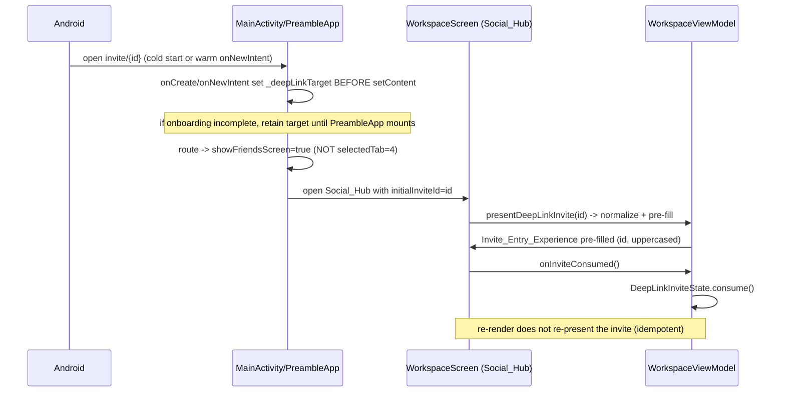

# Design Document

## Overview

This design **evolves the existing Preamble social surface in place** (today `WorkspaceScreen`, an `AnimatedVisibility` overlay titled "Friends") into a cohesive, "alive" **Social_Hub**. The existing screen and its UI are good and are deliberately kept: its current layout, structure, Cardfolio-style vibrant stacked cards, lime hero ID card, `RandomBackgrounds` PNG packs, and overall composition are **preserved and enhanced, not rebuilt**. On top of that established foundation the design layers in the latest Material 3 Expressive "alive" material — expressive shape morphing, expressive motion, and Expressive components — and the new focused capabilities. The intent is to **enrich the established look rather than redesign it**, and to make the surface *feel alive and impress on design* (MASTER_PLAN global principle).

The redesign keeps the existing data and business logic intact — `WorkspaceRepository`, `WorkspaceViewModel`, the pure `collab` logic (`PreambleId`, `InviteValidator`, `InviteLink`, `Leaderboard`, `OutgoingInviteReconciler`, `RequestsListOrganizer`, `DeepLinkInviteState`), and the `onReferralFriendship` Cloud Function — and adds focused, **additive** capabilities around the existing screen. Much of the prior pass already landed in source (the `SectionOrganizer`, `InviteEntrySheet`, `RequestsList`, the outgoing-invite mirror, the `navigateToRequests` event, and the `invite/{id}` → `showFriendsScreen` routing all exist today); this pass **sharpens those to the expanded requirements**, adds the missing edge-state / paging / search behavior, and **diagnoses why two already-implemented behaviors still misbehave in the built app** (invite-sent feedback and deep-link landing).

The capabilities, mapped to the expanded requirements:

1. The **"alive" full social surface** built from Material 3 Expressive components and expressive shape/motion, preserving the Cardfolio cards, lime hero card, and PNG packs, and now handling its **Loading_State, empty-state, and Error_State** edge cases gracefully (Req 1, including 1.6/1.7; Req 2.4).
2. A **Section_Organizer** that splits the Friends_Leaderboard and Friends_List into distinct, independently-scrolled panes with a **persistent, labeled, active-aware navigation control** (Req 2.1, 2.5, 2.6), and **Paged_Loading for BOTH the friends list and the leaderboard** at the ~1000-row scale (Req 2.3, 2.7, 2.8).
3. **Social_Search** in both areas, case-insensitive over Preamble_ID and display name, that searches the **full Friends_List** rather than only the loaded pages (Req 9).
4. A first-class **Circles_Entry** surface, styled with the PNG packs, that clearly reads as "create a friend group" (Req 3).
5. A persistent **Outgoing_Invite** representation, an **on-demand Requests control showing the pending count**, and a **Requests_List** the user lands on after sending an invite (Req 4, Req 5 including 5.6).
6. The **same on-theme Invite_Entry_Experience** sheet for **both manual Preamble_ID entry and Invite_Link entry** (Req 6, including 6.6).
7. A **deep-link fix** so an `invite/{id}` link lands on the (enhanced) social surface — **including cold start** — with the id pre-filled and consumed exactly once (Req 7, including 7.5).
8. A reversible, server-side **referral reward gate** that disables the Referral_Reward in Development_Mode while leaving the invite/friendship flow working, with reconciled CTA copy (Req 8; MASTER_PLAN: NO referral rewards during development).

The design concentrates all decision logic that varies with input into small **pure modules** in `com.theblankstate.preamble.collab` (JVM-testable with jqwik) and a pure gate in `functions/src`, keeping the Compose/Firestore/Cloud-Function layers thin. This pass adds two pure modules — **`SocialSearch`** (search filtering) and **`PageWindow`** (paging reconciliation) — alongside the existing ones. The visual, motion, and styling work — which enhances the existing surface rather than reinventing it — is verified with example/snapshot/manual strategies rather than property tests.

### Key Design Decisions

- **Social_Hub is the existing `WorkspaceScreen` evolved in place.** Rather than building a new screen, the current friends overlay is enhanced where it stands: it remains a full-screen `AnimatedVisibility` overlay opened from Home (`onOpenFriends`) and from the `invite/{id}` deep link, its existing layout and card composition are kept, and the new capabilities and expressive material are layered onto it. The collaborative-tasks tab (`selectedTab = 4`, `WorkspaceTasksScreen`) is untouched.

- **Section_Organizer keeps the segmented sub-navigation, made persistent, labeled, and active-aware.** The existing `SingleChoiceSegmentedButtonRow` (with "Leaderboard"/"Friends" labels and icons) already provides the two-pane split with per-pane `LazyListState`. This pass formalizes it against Req 2.6 — the segmented control is rendered as a **persistent header that stays visible above the active pane**, names both areas, and indicates the active one through the Expressive selected state — and confirms each pane retains its own scroll position (Req 2.5).

- **Paging is client-side windowing over a fully-synced lightweight list, NOT server-side cursor paging.** *Decision and tradeoff (Req 2.7, 2.8, 9.6):* the friends collection at `/users/{uid}/friends` and the leaderboard score docs are **small** (each friend doc is `uid`/`name`/`preambleId`/`addedAt` — on the order of ~100 bytes; ~100 KB at 1000 rows). Req 9.6 requires Social_Search to cover the **full** Friends_List, not just loaded pages. These two facts make true server-side cursor paging a poor fit: Firestore has **no native case-insensitive substring search**, so satisfying 9.6 with server-side paging would force either mirroring the whole list to the client anyway or standing up an external search index (Algolia/Typesense) — disproportionate at the ~1000 scale and offline-hostile. The decision is therefore a **two-tier model**: (a) the full lightweight Friends_List / leaderboard rows are streamed once via the existing snapshot listeners (cheap, enables whole-list search and offline use); (b) **Paged_Loading is implemented as client-side render windowing** — only a fixed-size window (`PAGE_SIZE` rows, default 30) of the in-memory ordered list is emitted into the `LazyColumn`, and the window grows by one page as the user scrolls within `PREFETCH_THRESHOLD` of the end of the loaded window. This bounds composition (Req 2.3), grows incrementally as the user scrolls (Req 2.7, 2.8), and keeps the entire set available for instant search (Req 9.6). The window computation is the pure `PageWindow` module so it is property-testable. *Tradeoff accepted:* the full (lightweight) list is fetched up front rather than page-by-page from the server; this is intentional given the ~1000-row target and the full-list search requirement. *Revisit trigger:* if a single user's friends/leaderboard realistically exceeds ~5–10k rows, migrate to server-side cursor paging plus a dedicated search index; the `PageWindow`/`SocialSearch` seam keeps that change localized.

- **Search index lives client-side, over the in-memory full list.** *Decision (Req 9):* `Social_Search` filters the already-synced full Friends_List / Friends_Leaderboard in memory through the pure `SocialSearch.filter`, matching case-insensitively against Preamble_ID and display name. No server query or remote index is introduced. This directly satisfies "search across the full Friends_List rather than only the entries already loaded through Paged_Loading" (Req 9.6) because the full list is resident; search operates on the complete set, independent of the current render window. To search the leaderboard by Preamble_ID consistently with the friends list, **`Leaderboard.Entry` is enriched with a `preambleId` field** (populated from the friend directory map the ranking already receives), since today it carries only `uid`/`name`/`weeklyPoints`.

- **Loading and Error edge states are first-class Expressive surfaces.** *Decision (Req 1.6, 1.7):* a `SocialHubLoadState` is derived in the ViewModel (Loading until the first friends/leaderboard emission; Error when a list listener fails) and the screen renders an Expressive **skeleton/shimmer Loading_State** instead of a blank surface, and an **Error_State card with a retry control** that re-subscribes the failed flow. This replaces relying solely on the transient `WorkspaceUiState` toast for load problems.

- **Outgoing invites are mirrored under the sender, written atomically with the incoming invite.** `sendInvite` writes a mirror doc at `/users/{senderUid}/outgoingInvites/{targetUid}` in the **same Firestore batch** as the recipient's incoming invite. The displayed Outgoing_Invite list is derived by the pure `OutgoingInviteReconciler` from the mirror set and the friend set, so an accepted invite (friend now present) drops out automatically. **Because the batch is atomic, the `/outgoingInvites` security rule must be deployed or every send fails** — this is central to the bug diagnosis below.

- **The on-demand Requests control shows the live pending count.** *Decision (Req 5.6):* the existing top-bar Requests entry point is bound to a `pendingRequestsCount` derived from `requestsSections` (outgoing + incoming) and renders an Expressive badge so the user can open the Requests_List at any time and see how many requests are pending.

- **Reward gate is a configuration flag read server-side.** A `REFERRAL_REWARDS_ENABLED` flag (sourced from `functions/src/config.ts`, overridable by environment/remote config, `false` in Development_Mode) gates only the credit-increment step inside `onReferralFriendship`. Attribution, eligibility classification, friendship establishment, and funnel logging are unchanged, so the gate is fully reversible. CTA copy is reconciled to not promise credits.

### Diagnosis: why the built app still misbehaves (Req 4, 5, 7)

The source code for the persistent invite feedback and the deep-link landing is **already present and correct** (tasks 4.x, 5.x, 8.1). The user nonetheless reports, in the built app, (a) only a transient "invite sent" toast with no navigation/persistent representation, and (b) the `invite/{id}` link still opening the collaborative-tasks workspace. Grounded in the actual code, the root causes are:

1. **Stale installed build (primary, explains both symptoms with one cause).** The currently-installed APK predates this spec's source changes. The old `sendInvite` was a single write of only the incoming invite (success → "Invite sent" toast, no mirror, no `navigateToRequests`), and the old deep-link branch set `selectedTab = 4` (the workspace) for `invite/`. Both reported symptoms are exactly the *old* behavior. The current source (verified in this pass) writes the mirror in a batch, emits `navigateToRequests`, exposes the persistent Outgoing_Invite via `requestsSections`, and routes `invite/` to `showFriendsScreen = true` with `initialInviteId`. **Verification step: rebuild and reinstall, then confirm against the running build.**

2. **Undeployed `/outgoingInvites` Firestore rule (blocks the *new* build).** Once the new build is installed, the atomic batch in `sendInvite` writes both the incoming invite and `/users/{senderUid}/outgoingInvites/{targetUid}`. The create rule for that path exists in `firebase-firestore-rules.rules` but the MASTER_PLAN status log flags it as **not yet deployed**. If the deployed ruleset lacks it, the **entire batch is rejected with `PERMISSION_DENIED`** (Firestore batches are all-or-nothing), so the send fails outright and `WorkspaceViewModel.sendInvite` takes the failure path (Error toast, no navigation, no Outgoing_Invite). **Verification step: deploy the rules (`firebase deploy --only firestore:rules`) and confirm the rule is live before validating the flow.**

3. **Cold-start ordering for the deep link (Req 7.5).** `MainActivity.onCreate` sets `_deepLinkTarget` from the launch intent *before* `setContent`, so on a returning user's cold start the `PreambleApp` `LaunchedEffect(deepLinkTarget)` fires on first composition and routes to `showFriendsScreen = true`. Two ordering hazards are addressed: (i) for a brand-new user, `OnboardingScreen` renders instead of `PreambleApp`, so the deep link must be **retained (not consumed) until onboarding completes** and `PreambleApp` mounts — the design keeps `_deepLinkTarget` set across the onboarding gate and only clears it via `onDeepLinkConsumed` after routing; (ii) `MainActivity` is `singleTop`, so a warm launch arrives through `onNewIntent`, which also sets `_deepLinkTarget` — both paths converge on the same routing effect. The `https://preamble.theblankstate.com/invite/*` intent filter (`autoVerify`) and the `parseDeepLink` mapping to `invite/{id}` are confirmed present in the manifest and `MainActivity`.

These three are recorded as explicit **deploy/verification steps** in the Testing Strategy so the requirements are re-verified against the *running, deployed* app rather than assumed satisfied because the source exists.

## Architecture

The Social_Hub is the existing `WorkspaceScreen` Compose surface — enhanced in place — backed by the existing `WorkspaceViewModel` (extended), the existing `WorkspaceRepository` (extended), new pure decision modules, and the existing Cloud Function (extended with a gate). The data sources (Firestore subcollections) and the pure `collab` logic are reused unchanged except where noted.

```mermaid
graph TD
    subgraph Client[Android App]
        MA[MainActivity / PreambleApp\nnavigation + deep-link routing\ncold-start + onNewIntent]
        SH[WorkspaceScreen (Social_Hub)\nenhanced in place: Section_Organizer\n+ Loading/Error/empty states + Social_Search]
        IE[InviteEntrySheet\nInvite_Entry_Experience\nmanual + link, same sheet]
        RL[RequestsList\nOutgoing + Incoming\n+ on-demand control w/ pending count]
        VM[WorkspaceViewModel\nstate + orchestration + load state]
        subgraph Pure[com.theblankstate.preamble.collab pure logic]
            PI[PreambleId.normalize]
            OIR[OutgoingInviteReconciler]
            RLO[RequestsListOrganizer]
            DLS[DeepLinkInviteState]
            SS[SocialSearch.filter]
            PW[PageWindow.visible]
        end
        REPO[WorkspaceRepository]
    end
    subgraph Firebase
        FS[(Firestore\nusers/.../invites\nusers/.../outgoingInvites\nusers/.../friends\nleaderboard/uid)]
        RULES{{firestore.rules\n/outgoingInvites create\nMUST be deployed}}
        CF[onReferralFriendship\n+ referral reward gate]
        CFG[config.ts\nREFERRAL_REWARDS_ENABLED]
    end

    MA -->|invite/id deep link\ncold start + warm| SH
    SH --> IE
    SH --> RL
    SH --> VM
    IE --> VM
    RL --> VM
    VM --> PI
    VM --> OIR
    VM --> RLO
    VM --> DLS
    VM --> SS
    VM --> PW
    VM --> REPO
    REPO --> FS
    FS -. enforced by .-> RULES
    FS -->|friend doc created| CF
    CF --> CFG
```

### Navigation flow for the deep-link fix (Requirement 7, including cold start 7.5)



The single behavioral change for Req 7.1 (already in source) is that the `invite/` branch in `PreambleApp`'s deep-link `LaunchedEffect` opens the enhanced friends overlay (`showFriendsScreen = true`, `initialInviteId = id`) instead of selecting the collaborative-tasks tab (`selectedTab = 4`). This pass confirms cold-start ordering (7.5) and adds the verification that it holds in the deployed build.

### Send-invite atomicity and the security rule (Requirement 4, 5)

```mermaid
sequenceDiagram
    participant U as User
    participant VM as WorkspaceViewModel
    participant REPO as WorkspaceRepository
    participant FS as Firestore (+ rules)
    U->>VM: sendInvite(targetId)
    VM->>VM: optimistic Outgoing_Invite added
    VM->>REPO: sendInvite(...)
    REPO->>FS: batch { set incoming invite; set outgoing mirror }.commit()
    alt /outgoingInvites rule deployed
        FS-->>REPO: commit OK
        REPO-->>VM: success
        VM->>VM: emit navigateToRequests; keep mirror
        VM-->>U: land on Requests_List with persistent Outgoing_Invite
    else rule NOT deployed
        FS-->>REPO: PERMISSION_DENIED (whole batch rejected)
        REPO-->>VM: failure
        VM->>VM: revert optimistic entry
        VM-->>U: Error toast, no invite created
    end
```

This makes explicit why deploying the rule is a hard prerequisite: the atomic batch means a missing rule fails the *entire* send, not just the mirror.

## Components and Interfaces

### WorkspaceScreen — enhanced in place as the Social_Hub

The existing top-level friends surface, **kept and enhanced rather than replaced**. Its current layout, stacked-card composition, and styling are preserved; the redesign layers Material 3 Expressive components, expressive shape/motion, and the new capabilities onto it. It presents, as one cohesive surface (Req 1.1–1.7):

- **HeroIdCard** — the existing lime hero ID card showing the signed-in user's Preamble_ID and current productivity score, retained and enriched with a `RandomBackgrounds` PNG and an expressive morphing shape treatment (Req 1.4, 1.5).
- **CirclesEntryCard** — the always-visible Circles_Entry (Req 3).
- **ReferralCta** — reused, with reconciled copy (Req 8.2).
- **Section_Organizer** — persistent, labeled, active-aware segmented control switching between the Leaderboard pane and the Friends_List pane, each with `Social_Search` and `Paged_Loading` (Req 2, Req 9).
- **Requests control** — top-bar entry point opening the Requests_List on demand, showing the pending count (Req 5.6).
- An entry control that opens the **InviteEntrySheet** (Req 6).
- **Loading_State / Error_State** — Expressive skeleton while loading (Req 1.6) and a retry-able error surface on load failure (Req 1.7).

```kotlin
// The existing WorkspaceScreen composable, extended in place with the additive
// Social_Hub parameters (onOpenCircles, deep-link consumption). Existing parameters
// and the established UI it renders are retained.
@Composable
fun WorkspaceScreen(
    viewModel: WorkspaceViewModel = viewModel(),
    taskViewModel: TaskViewModel? = null,
    initialInviteId: String? = null,
    onInviteConsumed: () -> Unit = {},
    onClose: (() -> Unit)? = null,
    onOpenCircles: (() -> Unit)? = null,
    modifier: Modifier = Modifier,
)
```

### Section_Organizer (enhanced: persistent labeled control + paging + search)

The existing `SectionOrganizer` already splits the Friends_Leaderboard and Friends_List into distinct panes selected by a `SingleChoiceSegmentedButtonRow`, with a per-pane `LazyListState` for independent scroll positions (Req 2.1, 2.2, 2.5) and a `LazyColumn` per pane so only visible rows are composed (Req 2.3). This pass extends it:

- **Persistent labeled navigation control (Req 2.6):** the segmented control is rendered as a sticky header above the active pane, labeling both areas ("Leaderboard", "Friends") and marking the active one via the Expressive selected state, so the control is always visible regardless of scroll position.
- **Paged_Loading (Req 2.7, 2.8):** each pane drives a `loadedPageCount` state; the `LazyColumn` renders `PageWindow.visible(fullList, loadedPageCount)` and a trailing sentinel item. A `LaunchedEffect` watching the pane's `LazyListState` increments `loadedPageCount` when the last loaded index comes within `PREFETCH_THRESHOLD` of the end, until the whole list is shown. Applies to both the Friends_List and the Leaderboard.
- **Social_Search (Req 9):** each pane has a `Social_Search` field above the list; the active query filters the **full** in-memory list via `SocialSearch.filter` *before* windowing, so search covers the entire set (Req 9.6) and a no-match query shows an empty-state (Req 9.5). Clearing the query restores the unfiltered list (Req 9.4).
- **Empty state (Req 2.4):** when the user has no friends, the Friends pane shows a no-friends empty-state with an "add a friend" control.

```kotlin
enum class SocialSection { Leaderboard, Friends }

@Composable
fun SectionOrganizer(
    selected: SocialSection,
    onSelect: (SocialSection) -> Unit,
    leaderboardState: LazyListState,
    friendsState: LazyListState,
    leaderboardQuery: String,
    onLeaderboardQueryChange: (String) -> Unit,
    friendsQuery: String,
    onFriendsQueryChange: (String) -> Unit,
    // ... content slots receiving the already-filtered, already-windowed entries
)
```

### Social_Search field

A reusable Expressive search field rendered within both panes (Req 9.1). It is purely a text input bound to the pane's query state; all matching is delegated to the pure `SocialSearch.filter`. Case-insensitivity and the Preamble_ID/display-name match are properties of `SocialSearch`, not the UI (Req 9.2, 9.3).

### CirclesEntryCard

A styled card (consistent with Social_Hub_Design_Language, reusing `RandomBackgrounds` PNG imagery) visible without opening any menu (Req 3.1, 3.4). It carries descriptive text conveying that a Circle is a shared friend group — not just an icon (Req 3.2) — and conveys this and offers "create a Circle" even when the user belongs to no Circles (Req 3.5). Activating it calls `onOpenCircles` to navigate to the existing `CirclesScreen` (Req 3.3).

### InviteEntrySheet (Invite_Entry_Experience)

An on-theme entry surface (Expressive `ModalBottomSheet` + `RandomBackgrounds` + expressive motion), styled consistently with the established surface, in place of the plain add-friend dialog (Req 6.1, 6.5). The **same sheet** is used for both manual Preamble_ID entry and Invite_Link/deep-link entry (Req 6.6) — the only difference is the initial value. It supports:

- Manual Preamble_ID entry that normalizes to uppercase as the user types, via `PreambleId.normalize` (Req 6.3).
- A pre-filled id when opened from an Invite_Link/deep link (Req 6.2, 7.2), set into the same `targetId` state the manual path uses.
- A send control disabled while the entered id is blank (Req 6.4).
- On successful send, the host navigates to the Requests_List (Req 5.1).

```kotlin
@Composable
private fun InviteEntrySheet(
    value: String,
    onValueChange: (String) -> Unit,  // host applies PreambleId.normalize
    sendEnabled: Boolean,             // derived: normalized id is not blank
    onSend: () -> Unit,
    onDismiss: () -> Unit,
)
```

### RequestsList + on-demand Requests control

Presents the signed-in user's Outgoing_Invites and Incoming_Invites in grouped sections (outgoing separated from incoming) using the pure `RequestsListOrganizer` (Req 5.3). Each Outgoing_Invite is rendered with prominence/detail comparable to an Incoming_Invite — recipient Preamble_ID and an "awaiting response" status — and is visually distinguished from incoming invites (Req 4.2, 4.3). When there are no invites of either kind, an empty-state is shown (Req 5.5). The user is navigated here after a successful send (Req 5.1) and the just-sent invite is present (Req 5.2).

The **on-demand control (Req 5.6)** is the existing top-bar Requests entry point, now bound to `pendingRequestsCount = outgoing.size + incoming.size` and rendering an Expressive badge; tapping it opens the Requests_List at any time.

### Pure decision modules (com.theblankstate.preamble.collab)

These hold all input-dependent logic and are exercised directly by jqwik property tests. The existing modules (`OutgoingInviteReconciler`, `RequestsListOrganizer`, `DeepLinkInviteState`, `PreambleId`, `Leaderboard`) are reused; **two new modules** are added this pass.

**SocialSearch (new)** — filters a list of searchable entries by a case-insensitive query over Preamble_ID and display name.

```kotlin
object SocialSearch {
    /** Anything the Social_Hub can search: exposes the two matchable fields. */
    interface Searchable {
        val preambleId: String
        val displayName: String
    }

    /**
     * Returns the entries whose Preamble_ID or display name contains [query],
     * compared case-insensitively (Req 9.2, 9.3). A blank query returns the input
     * unchanged (Req 9.4). Order is preserved and the result is always a sublist of
     * the input — no entry is fabricated or duplicated. Called over the FULL list,
     * before paging, so search covers the whole set (Req 9.6).
     */
    fun <T : Searchable> filter(query: String, entries: List<T>): List<T>
}
```

**PageWindow (new)** — computes the visible window for client-side Paged_Loading.

```kotlin
object PageWindow {
    const val PAGE_SIZE: Int = 30

    /**
     * The prefix of [all] that has been "loaded" after [pageCount] pages, i.e. the
     * first min(pageCount * pageSize, all.size) entries (Req 2.7, 2.8). The result is
     * always a prefix of [all], never longer than [all], and its length is
     * non-decreasing in [pageCount]; once pageCount is large enough the whole list is
     * returned. pageCount <= 0 yields an empty window.
     */
    fun <T> visible(all: List<T>, pageCount: Int, pageSize: Int = PAGE_SIZE): List<T>

    /** True when the user has scrolled close enough to the end to load the next page. */
    fun shouldLoadMore(lastVisibleIndex: Int, loadedCount: Int, threshold: Int = 5): Boolean
}
```

**OutgoingInviteReconciler / RequestsListOrganizer / DeepLinkInviteState** — unchanged from the prior pass (signatures retained); see the prior design text. `PreambleId.normalize` is reused for as-you-type normalization and blank detection.

**Leaderboard.Entry (enriched)** — gains a `preambleId` field so the leaderboard is searchable by Preamble_ID consistently with the friends list (Req 9.3). `Leaderboard.ranking` already receives a per-uid names map; it is extended to also receive/propagate the per-uid Preamble_ID (sourced from the friend records the ViewModel already holds).

```kotlin
data class Entry(
    val uid: String,
    val name: String,
    val weeklyPoints: Int,
    val preambleId: String = "",   // added for Social_Search (Req 9.3)
)
```

### WorkspaceViewModel additions

Existing (prior pass, retained): `outgoingInvites`, `requestsSections`, `navigateToRequests`, `sendInvite`/`withdrawInvite`, `deepLinkInviteToPresent`/`onInviteConsumed`, `leaderboard`. New/changed this pass:

- `socialHubLoadState: StateFlow<SocialHubLoadState>` — `Loading` until the first friends/leaderboard emission, `Loaded`, or `Error(message)` when a list listener fails; drives the Loading_State / Error_State (Req 1.6, 1.7).
- `retryLoad()` — re-subscribes the friends/leaderboard flows after an Error_State (Req 1.7).
- `pendingRequestsCount: StateFlow<Int>` — `outgoing.size + incoming.size`, drives the on-demand Requests control badge (Req 5.6).
- Search is held as per-pane query state in the screen; the ViewModel exposes the **full** `friends` and `leaderboard` lists (already present), and the screen applies `SocialSearch.filter` then `PageWindow.visible`. (Filtering/paging are pure and kept out of the ViewModel to stay property-testable; the ViewModel only supplies the full lists.)
- `leaderboard` entries are populated with `preambleId` via the enriched `Leaderboard.ranking`.

### WorkspaceRepository (unchanged this pass)

`sendInvite` (atomic batch writing the incoming invite + `/users/{senderUid}/outgoingInvites/{targetUid}`), `getOutgoingInvitesFlow`, `withdrawInvite`, `getFriendsFlow`, and `getLeaderboardScoresFlow` are all present and reused unchanged. No repository change is required for paging/search because both operate client-side over the already-streamed full lists (per the paging decision above).

### Server: referral reward gate (functions/src) — unchanged this pass

```typescript
// config.ts
/** Master switch for the two-sided Referral_Reward. Development_Mode sets this false. */
export const REFERRAL_REWARDS_ENABLED: boolean =
  (process.env.REFERRAL_REWARDS_ENABLED ?? "false") === "true";

// referrals.ts — pure gate wrapping the existing eligibility decision.
export function gatedReferralDecision(
  input: ReferralInput,
  rewardsEnabled: boolean,
): ReferralDecision {
  if (!rewardsEnabled) return { kind: "RejectRewardsDisabled" };
  return classifyReferralEligibility(input);
}
```

`onReferralFriendship` calls `gatedReferralDecision(..., REFERRAL_REWARDS_ENABLED)`. When disabled, the credit-increment transaction never runs, so no user's `ai_credits`/`ai_credits_total_earned` is modified (Req 8.1, 8.5). Friend-doc writes, attribution, and funnel logging are untouched, so invites/accepts/friendships keep working (Req 8.3) and the flag is reversible (Req 8.4). The `ReferralCta` copy no longer states that both sides receive AI credits while disabled (Req 8.2).

## Social Hub scrollability and bottom-inset handling (Requirement 10)

This section is a focused, additive fix for Requirement 10. Everything else in this design is unchanged.

### How the Social_Hub is actually hosted (verified in source)

The Social_Hub (`WorkspaceScreen`) is **not** a tab inside the main app `Scaffold`. In `MainActivity`/`PreambleApp` it is a **full-screen sibling overlay**: an `AnimatedVisibility(visible = showFriendsScreen)` rendered *after* — and therefore drawn *on top of* — the main `Scaffold` whose `bottomBar` is the `ExpressiveNavigationBar`. The overlay's root is `WorkspaceScreen`'s own `Scaffold(modifier = Modifier.fillMaxSize())`, whose content (`PullToRefreshBox`) paints an opaque `MaterialTheme.colorScheme.background`. Consequences that matter for Req 10:

- **The app's `ExpressiveNavigationBar` is hidden behind the overlay while the Social_Hub is open.** It is not visually present, so the Social_Hub does not need to pad for the *app* bottom nav while it is shown. The `ExpressiveNavigationBar` already applies its own `navigationBarsPadding()`, but it is occluded by the overlay.
- **`enableEdgeToEdge()` is active** (`MainActivity.onCreate`), so the window draws behind the system bars and `WindowInsets.navigationBars` is non-zero at runtime. The relevant Bottom_System_Inset for the overlay is therefore effectively **`WindowInsets.navigationBars`** (the device gesture/3-button area). The requirement's broader definition (app bottom nav + system insets) still holds as the contract; for the *current* host the app-nav term is zero because the bar is occluded.

### Current layout and why content hides behind the chin

The overlay's structure (verified in `WorkspaceScreen.kt`):

```
Scaffold(topBar = custom Row)         // default contentWindowInsets = systemBars
  PullToRefreshBox(fillMaxSize + padding(scaffoldPadding) + opaque background)
    Column(fillMaxSize, padding horizontal 16dp)
      Column(spacedBy -12dp)          // FIXED header: HeroIdCard + ReferralCta + CirclesEntryCard
      when (loadState) {
        Loaded -> SectionOrganizer(Modifier.weight(1f).fillMaxWidth())
      }

SectionOrganizer:
  Column(modifier = weight(1f) from caller)
    Surface { SingleChoiceSegmentedButtonRow }   // persistent labeled control (fixed)
    Box(weight(1f)) {
      AnimatedContent { pane ->
        Column(fillMaxSize) {
          SocialSearchField                       // fixed
          LazyColumn(fillMaxSize)                 // <-- NO contentPadding
            ...content(visibleWindow)...
            item { PagingSentinel(hasMore = visible.size < filtered.size) }
        }
      }
    }
```

The two pane `LazyColumn`s carry **no `contentPadding`**. The only bottom clearance is the trailing `PagingSentinel`:

```kotlin
@Composable
private fun PagingSentinel(hasMore: Boolean) {
    if (hasMore) { /* 16.dp-padded CircularProgressIndicator */ }
    else { Spacer(modifier = Modifier.height(80.dp)) }   // fixed 80.dp, only when fully loaded
}
```

This is defective against Req 10 for three reasons:

1. **Magic constant, not the real inset (violates 10.3, 10.6).** `80.dp` is a hardcoded guess unrelated to the device's actual `WindowInsets.navigationBars`. Gesture-nav, 3-button nav, and tall display cutouts produce different bottom insets; on devices whose bottom inset is large the final row stays partly behind the chin. The clearance is also not *equal to or greater than* the Bottom_System_Inset by construction — it just happens to be 80.dp.
2. **Clearance is coupled to paging state (violates 10.6 while scrolling).** When `hasMore` is true the trailing item is only a ~16.dp-padded spinner, so the last *loaded* friend before the spinner sits with almost no clearance and can be obscured by the chin. The guaranteed clearance only appears once the whole list is loaded (`else` branch). Bottom clearance must be unconditional, independent of how many pages are loaded.
3. **It rides implicitly on the host's single outer inset.** The overlay `Scaffold` uses the default `contentWindowInsets = systemBars`, and that bottom inset is applied once to the outer `PullToRefreshBox` via `padding(scaffoldPadding)`. Whether the last list row clears the chin then depends on that single outer pad plus the magic spacer, with the list itself drawing to the bottom edge of the `weight(1f)` pane. There is no explicit, list-level bottom `contentPadding` tied to `WindowInsets.navigationBars`, so the design does not *guarantee* clearance — and naively adding both the outer pad and a full inset `contentPadding` would double-count and leave a large dead gap.

### The fix

**Fix 1 — Delegate the bottom inset to the panes, not the outer content block (avoids double counting).** Change the overlay `WorkspaceScreen` `Scaffold` so its content auto-applies the **top and horizontal** system-bar insets but **not the bottom**, e.g. `contentWindowInsets = ScaffoldDefaults.contentWindowInsets.only(WindowInsetsSides.Top + WindowInsetsSides.Horizontal)` (the custom top bar continues to handle the status-bar inset). The outer `PullToRefreshBox` then no longer consumes the bottom inset, so each pane's `LazyColumn` can extend to the physical bottom edge and scroll its content beneath the (translucent) system nav area — the idiomatic edge-to-edge list pattern.

**Fix 2 — Apply unconditional bottom `contentPadding` >= Bottom_System_Inset on BOTH panes (Req 10.3, 10.6).** In `SectionOrganizer`, resolve the inset once and pass it to both `LazyColumn`s as `contentPadding`, applied regardless of paging state:

```kotlin
// Bottom_System_Inset for the overlay = system navigation bar inset (the app bottom nav
// is occluded by the full-screen overlay). A comfortable gap is added so the final row
// sits clearly above the chin (Req 10.6).
val bottomSystemInset = WindowInsets.navigationBars.asPaddingValues().calculateBottomPadding()
val paneBottomPadding = bottomSystemInset + 24.dp

LazyColumn(
    state = friendsState,
    modifier = Modifier.fillMaxSize(),
    verticalArrangement = Arrangement.spacedBy((-12).dp),
    contentPadding = PaddingValues(bottom = paneBottomPadding),   // unconditional (Req 10.3)
) { ... }
```

The same `contentPadding` is applied to the Leaderboard pane's `LazyColumn`. Because `contentPadding` is part of the scrollable extent, the last row (and the trailing sentinel) can always be scrolled fully clear of the Bottom_System_Inset (Req 10.6), and the clearance is `>= Bottom_System_Inset` by construction (Req 10.3) on every device.

**Fix 3 — Stop using the conditional 80.dp spacer as the clearance mechanism.** `PagingSentinel` keeps the spinner *only* as the loading affordance while `hasMore` is true; its `else` branch no longer needs the fixed `80.dp` `Spacer` (it becomes `Spacer(Modifier.height(0.dp))` or is omitted), because clearance now comes from the unconditional `contentPadding`. This removes the paging-state coupling.

**Fix 4 — Guarantee each pane gets usable scrollable height independent of the header (Req 10.5).** The fixed header (`HeroIdCard` 180.dp + `ReferralCta` + `CirclesEntryCard`, stacked with `-12.dp` spacing) is a non-scrolling `Column`; the Section_Organizer is given `Modifier.weight(1f)`, and within it the segmented control + per-pane `SocialSearchField` are fixed while the `LazyColumn` itself is in a `Box(Modifier.weight(1f))`. `weight(1f)` allocates the *remaining* height after the header measures, so each pane receives the leftover viewport height regardless of header size, and the pane content is a `LazyColumn` that scrolls within that height. This already satisfies 10.5 for normal screens; the design records the accepted tradeoff that on a very short viewport the fixed header consumes proportionally more space (the panes still scroll, they just get less height). No change is required for 10.5 beyond confirming the `weight(1f)` allocation and that the panes fill and scroll.

**Fix 5 — Every friend reachable by scrolling (Req 10.4).** Reachability is the combination of (a) the paging window eventually covering the whole list and (b) the last row clearing the chin. (a) is already guaranteed by the pure `PageWindow` logic (existing **Property 9**: `PageWindow.visible` grows monotonically and equals the full list once `pageCount` is large enough) driven by the prefetch effect that advances `friendsPageCount` as the user scrolls within `PREFETCH_THRESHOLD` of the loaded end. (b) is delivered by Fix 2. Together, the user can scroll to the genuine last friend and see it fully (Req 10.4). No windowing change is needed — paging does not strand rows; it only ever shows a growing *prefix*, and the trailing sentinel (now clearing the chin) keeps the prefetch trigger reachable so the window advances to completion.

### Host-level note (PreambleApp / MainActivity)

No change is required in `MainActivity` for the overlay path, because the Social_Hub overlay is a **full-screen, opaque sibling drawn over** the main `Scaffold`, so the app `ExpressiveNavigationBar` is occluded and contributes no inset while the Hub is open — the inset to clear is `WindowInsets.navigationBars`, handled entirely inside `WorkspaceScreen`/`SectionOrganizer` by Fixes 1–3. The design records one forward-looking caveat: **if** the Social_Hub is ever re-hosted *inside* the main `Scaffold` content (as a real tab rather than an overlay), the app `ExpressiveNavigationBar` would then occupy the bottom and the panes would also need to clear its height; in that case `paneBottomPadding` must be driven from the host-provided bottom inset (e.g. the `Scaffold` `innerPadding` bottom, which already includes the nav-bar height) rather than from `WindowInsets.navigationBars` alone. The Bottom_System_Inset contract in the requirement (app bottom nav + system insets) is written to cover both hosting models.

### Correctness note for Requirement 10

Requirement 10 is a **layout / window-inset fix**, not new input-dependent logic, so it introduces **no new correctness property**. Its testable substance splits as:

- **10.4 (every friend reachable)** — the data-coverage half is already underwritten by the existing **Property 9** (`PageWindow.visible` eventually exposes the entire list). No new property is added; Property 9 is the relevant guarantee.
- **10.1, 10.2, 10.3, 10.5, 10.6** — scrollability, bottom `contentPadding` >= Bottom_System_Inset, usable pane height, and final-row visibility above the chin are **layout/inset behaviors** verified by example/UI tests and manual review on representative device insets, exactly as the Testing Strategy specifies. They are not expressible as a "for all inputs" pure-logic property because they depend on Compose layout and device insets, not on a pure function's output.

## Data Models

### OutgoingInvite (existing, reused)

| Field | Type | Notes |
|-------|------|-------|
| `targetUid` | String | Recipient uid; document id under the mirror subcollection. |
| `targetPreambleId` | String | Recipient's normalized Preamble_ID, shown in the Outgoing_Invite (Req 4.2). |
| `timestamp` | Long | Creation time for ordering. |

Stored at `/users/{senderUid}/outgoingInvites/{targetUid}`. Written in the same atomic batch as the incoming Friend_Request; deleted on withdraw and pruned by a Cloud Function on decline. Accepted invites drop out of the displayed list because the target becomes a friend (reconciler), and may be lazily pruned.

### WorkspaceInvite (existing, reused unchanged)

Incoming Friend_Request at `/users/{recipientUid}/invites/{senderUid}` with `senderUid`, `senderName`, `senderPreambleId`, `timestamp`.

### Friend (existing, reused unchanged)

`{ uid, name, preambleId, addedAt }` at `/users/{uid}/friends/{friendUid}`. Both `preambleId` and `name` feed `SocialSearch.Searchable` for the Friends_List.

### Leaderboard.Entry (enriched)

`{ uid, name, weeklyPoints, preambleId }`. The new `preambleId` makes leaderboard rows satisfy `SocialSearch.Searchable` so the leaderboard is searchable by Preamble_ID and display name (Req 9.3). Sourced from the friend directory map already passed to `Leaderboard.ranking`.

### SocialSearch.Searchable (new, in-memory)

An interface exposing `preambleId` and `displayName`. The Friends_List and the (enriched) Leaderboard entries adapt to it; `SocialSearch.filter` is generic over it.

### PageWindow (new, in-memory)

Pure view-model state: a `pageCount` per pane and the derived visible prefix `PageWindow.visible(full, pageCount)`. No persistence.

### RequestsListOrganizer.Sections (existing)

In-memory view model: `{ outgoing: List<OutgoingInvite>, incoming: List<WorkspaceInvite> }` plus `isEmpty`. `pendingRequestsCount` is derived as `outgoing.size + incoming.size` (Req 5.6).

### SocialHubLoadState (new, in-memory)

`Loading | Loaded | Error(message)` — derived from the first friends/leaderboard emissions and listener failures; drives the Loading_State (Req 1.6) and Error_State with retry (Req 1.7).

### DeepLinkInviteState (existing)

In-memory presentation state: a nullable pending Preamble_ID that becomes null once consumed (Req 7.3).

### Referral reward configuration (existing)

`REFERRAL_REWARDS_ENABLED` boolean in `functions/src/config.ts`, overridable via the `REFERRAL_REWARDS_ENABLED` environment variable; `false` in Development_Mode. The `ReferralDecision` variant `RejectRewardsDisabled` records the gated outcome.

## Correctness Properties

*A property is a characteristic or behavior that should hold true across all valid executions of a system — essentially, a formal statement about what the system should do. Properties serve as the bridge between human-readable specifications and machine-verifiable correctness guarantees.*

Most of this feature is UI redesign (Material 3 Expressive components, expressive motion/shape, styling), edge-state presentation (Loading_State, Error_State, empty-states), routing, layout/window-inset handling (Requirement 10), and a server configuration flag — these are verified by example/UI tests, snapshot/visual review, and integration tests, not property-based tests. The properties below cover the input-dependent **pure logic**: outgoing-invite reconciliation, requests-list grouping, Preamble_ID input handling, deep-link consumption, the referral reward gate, **Social_Search filtering**, and **client-side paging (PageWindow)**.

**Requirement 10 adds no new property.** It is a layout/inset fix (full scrollability and bottom content padding >= Bottom_System_Inset). Its data-coverage half — every friend eventually reachable by scrolling (Req 10.4) — is already underwritten by **Property 9** below (`PageWindow.visible` exposes a growing prefix that eventually equals the whole list). The remaining clauses (10.1, 10.2, 10.3, 10.5, 10.6) are Compose-layout/device-inset behaviors verified by example/UI tests and manual review, not by a "for all inputs" pure-logic property — see "Social Hub scrollability and bottom-inset handling (Requirement 10)" above and the Testing Strategy below.

Properties 1–7 are retained unchanged from the prior pass. Properties 8 and 9 are added for the new search and paging logic.

### Property 1: Preamble_ID input normalization is uppercase, trimmed, and idempotent

*For any* input string entered into the Invite_Entry_Experience, the normalized field value contains no leading/trailing whitespace, contains no lowercase letters, and normalizing the already-normalized value produces the same value (`normalize(normalize(x)) == normalize(x)`).

**Validates: Requirements 6.3**

### Property 2: The send control is enabled exactly when the entered id is non-blank

*For any* input string, the Invite_Entry_Experience send control is disabled if and only if the normalized Preamble_ID is blank (empty or whitespace-only). This holds identically for both the manual-entry and link-prefill paths, since both feed the same `targetId` state (Req 6.6).

**Validates: Requirements 6.4**

### Property 3: Outgoing-invite reconciliation persists unresolved invites and drops accepted ones

*For any* set of mirrored Outgoing_Invites and any set of friend uids, the displayed Outgoing_Invites are exactly those mirrored invites whose target uid is not in the friend set: every not-yet-accepted invite (including a just-sent one for a non-friend target) is shown, and every invite whose target has become a friend is excluded, with no invite duplicated or fabricated.

**Validates: Requirements 4.1, 4.4, 5.2**

### Property 4: A failed send leaves the outgoing-invite set unchanged

*For any* prior set of Outgoing_Invites, when a send attempt fails (including the atomic-batch `PERMISSION_DENIED` case), the resulting Outgoing_Invite set equals the prior set — no Outgoing_Invite is created for the failed request and any optimistic entry is reverted.

**Validates: Requirements 5.4**

### Property 5: Requests_List grouping partitions invites without loss or duplication

*For any* set of Outgoing_Invites and any set of Incoming_Invites, the Requests_List organizer produces an outgoing group containing exactly the outgoing invites and an incoming group containing exactly the incoming invites — every input invite appears in exactly one group, no invite is duplicated, and no invite crosses groups. The pending count exposed by the on-demand control equals the total number of grouped invites (Req 5.6).

**Validates: Requirements 5.3**

### Property 6: Deep-link invite presentation is consumed at most once

*For any* pending deep-link Preamble_ID, after the invite has been consumed the value to present is null, and consuming again leaves it null — so re-rendering the Social_Hub never re-presents the same invite (`toPresent(after consume) == null`, idempotent).

**Validates: Requirements 7.3**

### Property 7: The referral reward gate grants nothing while rewards are disabled

*For any* referral input, when the referral reward is disabled the gated decision is never `Eligible`, so the credit-increment transaction never runs and no user's AI-credit balance is modified on account of a referral.

**Validates: Requirements 8.1, 8.5**

### Property 8: Social_Search returns exactly the case-insensitively matching entries, over the full list

*For any* query string and *any* list of searchable entries (Friends_List or Friends_Leaderboard rows), `SocialSearch.filter(query, entries)` returns a sublist of `entries` (order preserved, nothing fabricated or duplicated) in which an entry is present **if and only if** the query is a case-insensitive substring of the entry's Preamble_ID or display name; and when the query is blank the result equals the full input list unchanged. Because filtering is applied to the complete in-memory list before any paging window, the matching set is independent of how many pages are loaded.

**Validates: Requirements 9.2, 9.3, 9.4, 9.6**

### Property 9: Paged_Loading exposes a growing prefix that eventually covers the whole list

*For any* list and *any* page count, `PageWindow.visible(list, pageCount)` is a prefix of the list whose length is `min(pageCount * pageSize, list.size)`; the length is non-decreasing as `pageCount` increases (loading a further page never hides already-loaded entries); and once `pageCount` is large enough the window equals the entire list. The same function governs both the Friends_List and the Friends_Leaderboard panes.

**Validates: Requirements 2.7, 2.8**

## Error Handling

- **Send failure / undeployed rule (Req 5.4):** `sendInvite` writes the incoming Friend_Request and the sender mirror in a **single atomic Firestore batch**. If the batch fails — including a `PERMISSION_DENIED` when the `/users/{senderUid}/outgoingInvites/{targetUid}` create rule is not deployed, or any existing validation gate rejecting — **no documents are written**, the ViewModel surfaces an error via `WorkspaceUiState.Error`, and the optimistic outgoing entry is reverted so the outgoing set is unchanged (Property 4). Navigation to the Requests_List does not occur on failure. Deploying the rule is a hard prerequisite (see Testing Strategy → Deploy/verification).
- **Load failure with retry (Req 1.7):** when the Friends_List or Friends_Leaderboard listener fails, the ViewModel sets `socialHubLoadState = Error(message)`; the screen renders an Error_State card describing the failure with a retry control that calls `retryLoad()` to re-subscribe the failed flow. Prior successfully-loaded data is retained (listener `catch` without clearing the backing `StateFlow`), so a transient failure never blanks the surface.
- **Loading presentation (Req 1.6):** while `socialHubLoadState == Loading` (before the first friends/leaderboard emission), the screen renders an Expressive skeleton/shimmer rather than a blank surface.
- **Empty states (Req 2.4, 5.5, 9.5):** no friends → Friends pane empty-state with an add-friend control; no invites → Requests_List empty-state; a Social_Search query matching nothing → no-match empty-state. Each is a deterministic presentation of an empty derived collection.
- **Unresolvable deep-link id (Req 7.4):** when an `invite/{id}` id does not resolve to exactly one account, the Social_Hub still opens and the Invite_Entry_Experience presents a "couldn't find that Preamble ID" message rather than failing to open, reusing the existing `resolvePreambleId` null path and `InviteValidation.NotFound` messaging.
- **Cold-start ordering (Req 7.5):** `_deepLinkTarget` is set before `setContent` and retained across the onboarding gate until `PreambleApp` mounts and routes; `singleTop` warm launches route through `onNewIntent`. Both converge on the same routing effect, which is consumed exactly once via `onDeepLinkConsumed`.
- **Listener failures generally:** the new and existing snapshot flows close on error so the collecting ViewModel can `catch`, retain the last loaded value, and surface a non-fatal message without crashing the surface.
- **Outgoing-mirror lifecycle:** an accepted invite is removed from the displayed list by reconciliation (target became a friend) even before its mirror doc is pruned, so a delayed/failed prune never shows a stale Outgoing_Invite. Withdraw deletes both docs; a decline-time Cloud Function prunes the mirror best-effort.
- **Reward gate (Req 8):** disabling the reward only short-circuits the credit-increment transaction. Attribution, friendship establishment, and funnel logging continue; a lookup/transaction failure in the granter is fail-closed (no grant). Re-enabling is a configuration flip with no schema or attribution change.
- **Bottom-inset clearance / scrollability (Req 10):** the panes apply an **unconditional** bottom `contentPadding >= Bottom_System_Inset` (resolved from `WindowInsets.navigationBars` at the overlay, since the app bottom nav is occluded by the full-screen overlay), so the final Friends_List / Friends_Leaderboard row always scrolls clear of the chin regardless of paging state. The overlay `Scaffold` delegates the bottom inset to the panes (top/horizontal insets only on the content) to avoid double-counting against the outer padding. If the bottom inset ever resolves to zero (no edge-to-edge, or a host that already consumes it), the added comfortable gap still keeps the last row visible; if the Hub is re-hosted inside the main `Scaffold`, `paneBottomPadding` must be driven from the host `innerPadding` bottom so it also clears the `ExpressiveNavigationBar`.

## Testing Strategy

### Property-based tests (jqwik, JVM)

Property tests live in `app/src/test/java/com/theblankstate/preamble/collab` (and a TypeScript property test for the reward gate in the functions test suite), follow the repository's existing jqwik conventions, run a **minimum of 100 iterations** (`@Property(tries = 100)` or higher), and each is tagged with a single-line comment:

`// Feature: social-hub-redesign, Property {n}: {property text}`

Each correctness property is implemented by exactly one property test:

1. **Property 1** — generate arbitrary strings; assert `PreambleId.normalize` output is trimmed, has no lowercase, and is idempotent.
2. **Property 2** — generate whitespace-only and mixed strings; assert send-enabled ⇔ normalized id non-blank.
3. **Property 3** — generate random mirrored-invite lists and friend-uid sets; assert `OutgoingInviteReconciler.visibleOutgoing` equals mirrored-minus-friends, with no loss/duplication/fabrication.
4. **Property 4** — generate a prior outgoing set; apply a simulated failed send; assert the outgoing set is unchanged.
5. **Property 5** — generate random outgoing and incoming invite lists; assert `RequestsListOrganizer.organize` partitions them exactly, no item lost, duplicated, or cross-grouped.
6. **Property 6** — generate arbitrary pending ids; assert `DeepLinkInviteState.toPresent` after `consume` is null and idempotent.
7. **Property 7** — generate arbitrary `ReferralInput`; assert `gatedReferralDecision(input, rewardsEnabled = false)` is never `Eligible`.
8. **Property 8** (new) — generate random searchable entries (varying Preamble_ID/display-name case) and queries (including substrings, mismatched case, and blank); assert `SocialSearch.filter` membership equivalence (entry kept iff query case-insensitively matches preambleId or displayName), sublist/order preservation, and blank-query identity. Use large generated lists to exercise the full-list guarantee (Req 9.6).
9. **Property 9** (new) — generate random lists and page counts (including 0, mid, and beyond size); assert `PageWindow.visible` is a prefix of the input, has length `min(pageCount*pageSize, size)`, is monotonic non-decreasing in `pageCount`, and equals the full list once `pageCount` is large enough.

### Unit / example tests

- Hero card renders the Preamble_ID and current productivity score (1.5).
- Social_Hub presents all named sub-surfaces (1.1); Circles_Entry visible with descriptive text and create option, including the no-circles case (3.1, 3.2, 3.5); activation invokes `onOpenCircles` (3.3).
- **Loading_State** skeleton shows while load state is Loading (1.6); **Error_State** shows on listener failure with a retry control that re-subscribes (1.7).
- Section_Organizer exposes two distinct selectable areas (2.1), reachable with a large list (2.2), retains independent scroll positions (2.5), shows a **persistent labeled control naming both areas and marking the active one** (2.6), and shows the no-friends empty-state with an add control (2.4).
- Paging wiring: scrolling toward the end of a pane increments the loaded page count for both the Friends_List and the Leaderboard (2.7, 2.8 — UI wiring around the `PageWindow` property).
- Social_Search field renders in both panes (9.1); a query matching nothing shows the no-match empty-state (9.5); clearing the query restores the unfiltered list (9.4 — UI wiring around the `SocialSearch` property).
- Outgoing invite renders recipient Preamble_ID + awaiting-response status, visually distinguished from incoming (4.2, 4.3); Requests_List empty-state (5.5); on-demand Requests control shows the pending count (5.6); successful send emits the navigate-to-Requests_List event (5.1).
- Invite_Entry_Experience uses the **same sheet** for manual entry and link/deep-link prefill (6.2, 6.6, 7.2); unresolvable id still opens with a not-found message (7.4).
- Deep-link routing maps `invite/{id}` to the Social_Hub overlay rather than `selectedTab = 4` (7.1), including a **cold-start** intent (7.5).
- Referral CTA copy omits the credits statement when the reward is disabled (8.2); flipping the flag re-enables the eligibility path (8.4).
- **Scrollability and bottom-inset (Req 10):** UI tests assert each pane's `LazyColumn` carries a bottom `contentPadding` resolved from `WindowInsets.navigationBars` (>= Bottom_System_Inset) **unconditionally** — present whether or not more pages remain (10.3), so the assertion does not depend on `hasMore` (regression guard against the old conditional 80.dp spacer). A scroll-to-end UI test confirms the final Friends_List entry and the final Friends_Leaderboard entry are fully visible above the bottom inset (10.1, 10.2, 10.6), including the case where the whole list fits in one page (no paging spinner). A test with a friend set larger than several pages confirms scrolling reaches the genuine last friend (10.4, alongside the Property 9 paging guarantee). A short-viewport test confirms the `weight(1f)` panes still receive usable, scrollable height with the fixed header present (10.5).

### Integration tests

- With the reward disabled, sending and accepting an invite still establishes the reciprocal friendship and modifies no AI-credit balances (8.3) — 1–2 representative cases against the functions emulator/mocks.

### Deploy / build verification (re-verify the running build — Req 4, 5, 7)

Because the source for the invite-sent feedback and deep-link landing is already correct yet the *built* app misbehaves, these steps re-verify against the deployed/installed artifact:

1. **Deploy Firestore rules** — `firebase deploy --only firestore:rules`; confirm the `/users/{uid}/outgoingInvites/{targetId}` create rule is live (the atomic batch in `sendInvite` fails entirely without it). Re-run the firebase-rules-tests suite against the deployed ruleset.
2. **Rebuild and reinstall the app** — confirm the installed APK includes this spec's `sendInvite` batch, `navigateToRequests`, persistent Outgoing_Invite, and the `invite/` → `showFriendsScreen` routing (not the stale single-write/`selectedTab = 4` behavior).
3. **End-to-end invite send** — on the running build, send an invite and confirm it navigates to the Requests_List, the Outgoing_Invite persists with "awaiting response", and no reliance on the transient toast (Req 4, 5).
4. **End-to-end deep link, including cold start** — open `https://preamble.theblankstate.com/invite/{id}` from a fully-killed app and confirm it lands on the Social_Hub with the id pre-filled (Req 7.1, 7.5), and a warm `onNewIntent` launch does the same.

### Visual / snapshot review

- Material 3 Expressive component usage, expressive motion/shape (including morphing shapes), preserved Cardfolio design language, lime hero card, and `RandomBackgrounds` reuse (1.2, 1.3, 1.4, 3.4, 4.3, 6.1, 6.5) are verified by snapshot tests and manual visual review, since they are look-and-feel requirements not expressible as computable properties.

### Framework windowing

- Incremental Friends_List / Leaderboard rendering (2.3) is provided by `LazyColumn` driven by `PageWindow.visible`; verified by confirming lazy usage and the Property 9 paging test, optionally a UI test that off-screen rows are not composed.
