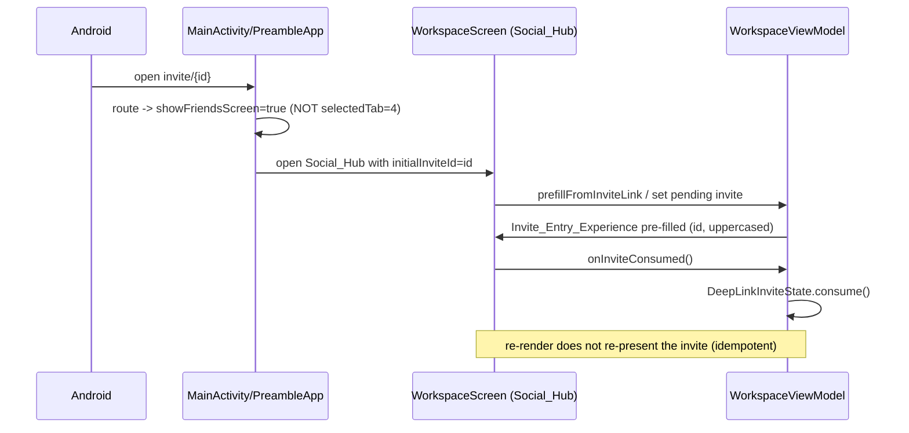

# Design Document

## Overview

This design **evolves the existing Preamble social surface in place** (today `WorkspaceScreen`, an `AnimatedVisibility` overlay titled "Friends") into a cohesive **Social_Hub**. The existing screen and its UI are good and are deliberately kept: its current layout, structure, Cardfolio-style vibrant stacked cards, lime hero ID card, and overall composition are **preserved and enhanced, not rebuilt**. On top of that established foundation the design layers in Material 3 Expressive "alive" material — expressive shape, motion, and components — and the new focused capabilities. The intent is to **enrich the established look rather than redesign it**.

The redesign keeps the existing data and business logic intact — `WorkspaceRepository`, `WorkspaceViewModel`, the pure `collab` logic (`PreambleId`, `InviteValidator`, `InviteLink`, `Leaderboard`), and the `onReferralFriendship` Cloud Function — and adds focused, **additive** capabilities around the existing screen:

1. The existing screen is **extended** so that a `Section_Organizer` splits the Friends_Leaderboard and Friends_List into distinct, independently scrollable areas so neither dominates at large list sizes — layered onto the current composition rather than replacing it.
2. A first-class **Circles_Entry** surface that explains what a Circle is and routes to the existing `CirclesScreen`.
3. A persistent **Outgoing_Invite** representation, backed by a new mirror subcollection, plus a **Requests_List** the user lands on after sending an invite.
4. An on-theme **Invite_Entry_Experience** (Preamble_ID entry and link-prefill) that supersedes the plain add-friend dialog while matching the screen's established styling.
5. A **deep-link fix** so an `invite/{id}` link lands on the (enhanced) social surface (not the collaborative-tasks workspace) with the id pre-filled, and is consumed exactly once.
6. A reversible, server-side **referral reward gate** that disables the Referral_Reward in Development_Mode while leaving the invite/friendship flow working, with reconciled CTA copy.

The design deliberately concentrates all decision logic that varies with input into small **pure modules** in `com.theblankstate.preamble.collab` (JVM-testable with jqwik) and a pure gate in `functions/src`, keeping the Compose/Firestore/Cloud-Function layers thin. The visual, motion, and styling work — which enhances the existing surface rather than reinventing it — is verified with example/snapshot/manual strategies rather than property tests.

### Key Design Decisions

- **Social_Hub is the existing `WorkspaceScreen` evolved in place.** Rather than building a new screen, the current friends overlay is enhanced where it stands: it remains a full-screen overlay opened from Home (`onOpenFriends`) and from the `invite/{id}` deep link, its existing layout and card composition are kept, and the new capabilities and expressive material are layered onto it. The change stays contained to the friends surface and its entry points. The collaborative-tasks tab (`selectedTab = 4`, `WorkspaceTasksScreen`) is untouched.
- **Section_Organizer enhances the current single scroll with segmented sub-navigation and per-area `LazyListState`.** The existing surface stacks everything in one continuous `LazyColumn`; this is enhanced so the Leaderboard and Friends_List become separately scrollable panes selected by a Material 3 Expressive segmented/tab control, each retaining its own scroll position. This satisfies the "no endless single scroll" and "preserve scroll position independently" requirements and keeps composition size bounded via lazy rendering, while keeping the established card styling within each pane.
- **Outgoing invites are mirrored under the sender.** `sendInvite` additionally writes a mirror doc under `/users/{senderUid}/outgoingInvites/{targetUid}` in the same batch as the recipient's incoming invite. The displayed Outgoing_Invite list is derived by a pure reconciler from the mirror set and the friend set, so an accepted invite (friend now present) drops out automatically. A small Cloud Function prunes the mirror on decline/withdraw.
- **Reward gate is a configuration flag read server-side.** A `referralRewardsEnabled` flag (sourced from `functions/src/config.ts`, overridable by environment/remote config) gates only the credit-increment step inside `onReferralFriendship`. Attribution, eligibility classification, friendship establishment, and funnel logging are unchanged, so the gate is fully reversible.

## Architecture

The Social_Hub is the existing `WorkspaceScreen` Compose surface — enhanced in place — backed by the existing `WorkspaceViewModel` (extended), the existing `WorkspaceRepository` (extended), new pure decision modules, and the existing Cloud Function (extended with a gate). The data sources (Firestore subcollections) and the pure `collab` logic are reused unchanged except where noted.

```mermaid
graph TD
    subgraph Client[Android App]
        MA[MainActivity / PreambleApp\nnavigation + deep-link routing]
        SH[WorkspaceScreen (Social_Hub)\nenhanced in place: Section_Organizer + sub-areas]
        IE[InviteEntrySheet\nInvite_Entry_Experience]
        RL[RequestsList\nOutgoing + Incoming]
        VM[WorkspaceViewModel\nstate + orchestration]
        subgraph Pure[com.theblankstate.preamble.collab pure logic]
            PI[PreambleId.normalize]
            OIR[OutgoingInviteReconciler]
            RLO[RequestsListOrganizer]
            DLS[DeepLinkInviteState]
        end
        REPO[WorkspaceRepository]
    end
    subgraph Firebase
        FS[(Firestore\nusers/.../invites\nusers/.../outgoingInvites\nusers/.../friends)]
        CF[onReferralFriendship\n+ referral reward gate]
        CFG[config.ts\nreferralRewardsEnabled]
    end

    MA -->|invite/id deep link| SH
    SH --> IE
    SH --> RL
    SH --> VM
    IE --> VM
    RL --> VM
    VM --> PI
    VM --> OIR
    VM --> RLO
    VM --> DLS
    VM --> REPO
    REPO --> FS
    FS -->|friend doc created| CF
    CF --> CFG
```

### Navigation flow for the deep-link fix (Requirement 7)



The single behavioral change for Requirement 7.1 is that the `invite/` branch in `PreambleApp`'s deep-link `LaunchedEffect` opens the enhanced friends overlay (`showFriendsScreen = true`) instead of selecting the collaborative-tasks tab (`selectedTab = 4`). The `initialInviteId` plumbing into `WorkspaceScreen` already exists and is retained.

## Components and Interfaces

### WorkspaceScreen — enhanced in place as the Social_Hub

The existing top-level friends surface, **kept and enhanced rather than replaced**. Its current layout, stacked-card composition, and styling are preserved; the redesign layers Material 3 Expressive components, expressive shape/motion, and the new capabilities onto it. It presents, as one cohesive surface (Req 1.1–1.5):

- **HeroIdCard** — the existing lime hero ID card showing the signed-in user's Preamble_ID and current productivity score, retained and enriched with a `RandomBackgrounds` PNG and an expressive morphing shape treatment (Req 1.4, 1.5).
- **CirclesEntryCard** — the always-visible Circles_Entry (Req 3).
- **ReferralCta** — reused, with reconciled copy (Req 8.2).
- **Section_Organizer** — segmented control switching between the Leaderboard area and the Friends_List area, layered onto the existing list composition (Req 2).
- An entry control that opens the **InviteEntrySheet** (Req 6).

```kotlin
// The existing WorkspaceScreen composable, extended in place with the additive
// Social_Hub parameters (onOpenCircles, deep-link consumption). Existing parameters
// and the established UI it renders are retained.
@Composable
fun WorkspaceScreen(
    viewModel: WorkspaceViewModel = viewModel(),
    taskViewModel: TaskViewModel? = null,
    initialInviteId: String? = null,
    onInviteConsumed: () -> Unit = {},
    onClose: (() -> Unit)? = null,
    onOpenCircles: (() -> Unit)? = null,
    modifier: Modifier = Modifier,
)
```

### Section_Organizer

Enhances the existing single-scroll friends composition by splitting the Friends_Leaderboard and Friends_List into distinct, separately navigable panes. Each pane owns its own `LazyListState` so scroll positions are preserved independently when the user switches areas (Req 2.1, 2.2, 2.5). The Friends_List pane is a `LazyColumn` so only visible rows are held in composition regardless of total list size (Req 2.3). When there are no friends, the Friends_List pane shows an empty-state with an "add a friend" control (Req 2.4).

```kotlin
enum class SocialSection { Leaderboard, Friends }

@Composable
fun SectionOrganizer(
    selected: SocialSection,
    onSelect: (SocialSection) -> Unit,
    leaderboardState: LazyListState,
    friendsState: LazyListState,
    // ... content slots
)
```

### CirclesEntryCard

A styled card (consistent with Social_Hub_Design_Language, may reuse `RandomBackgrounds`) visible without opening any menu (Req 3.1, 3.4). It carries descriptive text conveying that a Circle is a shared friend group — not just an icon (Req 3.2) — and conveys this and offers "create a Circle" even when the user belongs to no Circles (Req 3.5). Activating it calls `onOpenCircles` to navigate to the existing `CirclesScreen` (Req 3.3).

### InviteEntrySheet (Invite_Entry_Experience)

An on-theme entry surface (Expressive_Component + `RandomBackgrounds`, expressive motion), styled consistently with the established surface, in place of the plain add-friend dialog (Req 6.1, 6.5). It supports:

- Manual Preamble_ID entry that normalizes to uppercase as the user types, via `PreambleId.normalize` (Req 6.3).
- A pre-filled id when opened from an Invite_Link/deep link (Req 6.2, 7.2).
- A send control disabled while the entered id is blank (Req 6.4).
- On successful send, the host navigates to the Requests_List (Req 5.1).

```kotlin
@Composable
fun InviteEntrySheet(
    initialId: String,
    onIdChange: (String) -> Unit,      // host applies PreambleId.normalize
    sendEnabled: Boolean,              // derived: normalized id is not blank
    onSend: () -> Unit,
    onDismiss: () -> Unit,
)
```

### RequestsList

Presents the signed-in user's Outgoing_Invites and Incoming_Invites in grouped sections (outgoing separated from incoming) using the pure `RequestsListOrganizer` (Req 5.3). Each Outgoing_Invite is rendered with prominence/detail comparable to an Incoming_Invite — recipient Preamble_ID and an "awaiting response" status — and is visually distinguished from incoming invites (Req 4.2, 4.3). When there are no invites of either kind, an empty-state is shown (Req 5.5). The user is navigated here after a successful send (Req 5.1) and the just-sent invite is present (Req 5.2).

### Pure decision modules (com.theblankstate.preamble.collab)

These hold all input-dependent logic and are exercised directly by jqwik property tests.

**OutgoingInviteReconciler** — derives the displayed Outgoing_Invite list from the mirror set and the friend set.

```kotlin
object OutgoingInviteReconciler {
    /**
     * The displayed Outgoing_Invites are exactly the mirrored outgoing invites whose
     * target is not yet a friend (an accepted invite drops out — Req 4.4) and that
     * have not been withdrawn. A freshly-created mirror for a non-friend target is
     * therefore included (Req 4.1, 5.2).
     */
    fun visibleOutgoing(
        mirrored: List<OutgoingInvite>,
        friendUids: Set<String>,
    ): List<OutgoingInvite>
}
```

**RequestsListOrganizer** — partitions invites into grouped sections.

```kotlin
object RequestsListOrganizer {
    data class Sections(
        val outgoing: List<OutgoingInvite>,
        val incoming: List<WorkspaceInvite>,
    ) { val isEmpty: Boolean get() = outgoing.isEmpty() && incoming.isEmpty() }

    /** Partitions into outgoing/incoming with no loss or duplication (Req 5.3, 5.5). */
    fun organize(
        outgoing: List<OutgoingInvite>,
        incoming: List<WorkspaceInvite>,
    ): Sections
}
```

**DeepLinkInviteState** — a small state holder that yields a pending invite id to present at most once.

```kotlin
object DeepLinkInviteState {
    /** Returns the id to present, or null. Consuming clears it so re-derivation yields null (Req 7.3). */
    fun toPresent(pending: String?): String?
    fun consume(pending: String?): String?   // always null after consume — idempotent
}
```

`PreambleId.normalize` (existing) is reused unchanged for as-you-type normalization and blank detection.

### WorkspaceViewModel additions

- `outgoingInvites: StateFlow<List<OutgoingInvite>>` — observed from the repository and reconciled with `_friends` through `OutgoingInviteReconciler.visibleOutgoing`.
- `requestsSections: StateFlow<RequestsListOrganizer.Sections>` — combines `outgoingInvites` and `invites`.
- `sendInvite` extended to: on success, optimistically add the mirror, emit a "navigate to Requests_List" one-shot event (Req 5.1); on failure, surface an error and leave the outgoing set unchanged (Req 5.4).
- `withdrawInvite(targetUid)` — withdraws an Outgoing_Invite.
- Deep-link presentation routed through `DeepLinkInviteState` so `onInviteConsumed` makes the presentation idempotent (Req 7.3).

### WorkspaceRepository additions

```kotlin
data class OutgoingInvite(
    val targetUid: String = "",
    val targetPreambleId: String = "",
    val timestamp: Long = System.currentTimeMillis(),
)

// sendInvite(...) writes BOTH docs in one batch:
//   users/{targetUid}/invites/{senderUid}        (existing incoming Friend_Request)
//   users/{senderUid}/outgoingInvites/{targetUid} (new mirror)
fun getOutgoingInvitesFlow(): Flow<List<OutgoingInvite>>
suspend fun withdrawInvite(targetUid: String): Result<Unit>   // deletes both docs
```

The existing `sendInvite` validation gates (1.2–1.8 from collaborative-tasks) are preserved; the only change is that the successful write becomes a batch that also creates the sender's mirror, so a failed send creates neither doc (Req 5.4).

### Server: referral reward gate (functions/src)

```typescript
// config.ts
/** Master switch for the two-sided Referral_Reward. Development_Mode sets this false. */
export const REFERRAL_REWARDS_ENABLED: boolean =
  (process.env.REFERRAL_REWARDS_ENABLED ?? "false") === "true";

// referrals.ts — pure gate wrapping the existing eligibility decision.
export function gatedReferralDecision(
  input: ReferralInput,
  rewardsEnabled: boolean,
): ReferralDecision {
  if (!rewardsEnabled) return { kind: "RejectRewardsDisabled" };
  return classifyReferralEligibility(input);
}
```

`onReferralFriendship` calls `gatedReferralDecision(..., REFERRAL_REWARDS_ENABLED)`. When disabled, the credit-increment transaction never runs, so no user's `ai_credits`/`ai_credits_total_earned` is modified (Req 8.1, 8.5). The friend-doc writes, attribution records, and funnel logging are untouched, so invites/accepts/friendships keep working (Req 8.3) and the flag is reversible without removing attribution (Req 8.4). The `ReferralCta` reward-statement copy is changed so it no longer states that both sides receive AI credits while the reward is disabled (Req 8.2).

## Data Models

### OutgoingInvite (new)

| Field | Type | Notes |
|-------|------|-------|
| `targetUid` | String | Recipient uid; document id under the mirror subcollection. |
| `targetPreambleId` | String | Recipient's normalized Preamble_ID, shown in the Outgoing_Invite (Req 4.2). |
| `timestamp` | Long | Creation time for ordering. |

Stored at `/users/{senderUid}/outgoingInvites/{targetUid}`. Written in the same batch as the incoming Friend_Request; deleted on withdraw and pruned by a Cloud Function on decline. Accepted invites are not deleted by path — they drop out of the displayed list because the target becomes a friend (reconciler), and may be lazily pruned.

### WorkspaceInvite (existing, reused unchanged)

Incoming Friend_Request at `/users/{recipientUid}/invites/{senderUid}` with `senderUid`, `senderName`, `senderPreambleId`, `timestamp`.

### RequestsListOrganizer.Sections

In-memory view model: `{ outgoing: List<OutgoingInvite>, incoming: List<WorkspaceInvite> }` plus `isEmpty`.

### DeepLinkInviteState

In-memory presentation state: a nullable pending Preamble_ID that becomes null once consumed.

### Referral reward configuration

`REFERRAL_REWARDS_ENABLED` boolean in `functions/src/config.ts`, overridable via the `REFERRAL_REWARDS_ENABLED` environment variable; `false` in Development_Mode. A new `ReferralDecision` variant `RejectRewardsDisabled` records the gated outcome.

## Correctness Properties

*A property is a characteristic or behavior that should hold true across all valid executions of a system — essentially, a formal statement about what the system should do. Properties serve as the bridge between human-readable specifications and machine-verifiable correctness guarantees.*

Most of this feature is UI redesign (Material 3 Expressive components, expressive motion/shape, styling) and a server configuration flag — these are verified by example/UI tests, snapshot/visual review, and integration tests, not property-based tests. The properties below cover the input-dependent **pure logic** the redesign introduces: outgoing-invite reconciliation, requests-list grouping, Preamble_ID input handling, deep-link consumption, and the referral reward gate.

### Property 1: Preamble_ID input normalization is uppercase, trimmed, and idempotent

*For any* input string entered into the Invite_Entry_Experience, the normalized field value contains no leading/trailing whitespace, contains no lowercase letters, and normalizing the already-normalized value produces the same value (`normalize(normalize(x)) == normalize(x)`).

**Validates: Requirements 6.3**

### Property 2: The send control is enabled exactly when the entered id is non-blank

*For any* input string, the Invite_Entry_Experience send control is disabled if and only if the normalized Preamble_ID is blank (empty or whitespace-only).

**Validates: Requirements 6.4**

### Property 3: Outgoing-invite reconciliation persists unresolved invites and drops accepted ones

*For any* set of mirrored Outgoing_Invites and any set of friend uids, the displayed Outgoing_Invites are exactly those mirrored invites whose target uid is not in the friend set: every not-yet-accepted invite (including a just-sent one for a non-friend target) is shown, and every invite whose target has become a friend is excluded, with no invite duplicated or fabricated.

**Validates: Requirements 4.1, 4.4, 5.2**

### Property 4: A failed send leaves the outgoing-invite set unchanged

*For any* prior set of Outgoing_Invites, when a send attempt fails, the resulting Outgoing_Invite set equals the prior set (no Outgoing_Invite is created for the failed request).

**Validates: Requirements 5.4**

### Property 5: Requests_List grouping partitions invites without loss or duplication

*For any* set of Outgoing_Invites and any set of Incoming_Invites, the Requests_List organizer produces an outgoing group containing exactly the outgoing invites and an incoming group containing exactly the incoming invites — every input invite appears in exactly one group, no invite is duplicated, and no invite crosses groups.

**Validates: Requirements 5.3**

### Property 6: Deep-link invite presentation is consumed at most once

*For any* pending deep-link Preamble_ID, after the invite has been consumed the value to present is null, and consuming again leaves it null — so re-rendering the Social_Hub never re-presents the same invite (`toPresent(after consume) == null`, idempotent).

**Validates: Requirements 7.3**

### Property 7: The referral reward gate grants nothing while rewards are disabled

*For any* referral input, when the referral reward is disabled the gated decision is never `Eligible`, so the credit-increment transaction never runs and no user's AI-credit balance is modified on account of a referral.

**Validates: Requirements 8.1, 8.5**

## Error Handling

- **Send failure (Req 5.4):** `sendInvite` writes the incoming Friend_Request and the sender mirror in a single Firestore batch. If the batch fails (or the existing validation gates reject), no documents are written, the ViewModel surfaces an error message via `WorkspaceUiState.Error`, and the optimistic outgoing entry (if applied) is reverted so the outgoing set is unchanged (Property 4). Navigation to the Requests_List does not occur on failure.
- **Unresolvable deep-link id (Req 7.4):** when an `invite/{id}` id does not resolve to exactly one account, the Social_Hub still opens and the Invite_Entry_Experience presents a "couldn't find that Preamble ID" message rather than failing to open. This reuses the existing `resolvePreambleId` null path and `InviteValidation.NotFound` messaging.
- **Listener failures:** the new `getOutgoingInvitesFlow` follows the existing repository pattern — a snapshot-listener error closes the flow and the ViewModel's `catch` retains the last loaded value and surfaces a non-fatal message, never crashing the surface.
- **Outgoing-mirror lifecycle:** an accepted invite is removed from the displayed list by reconciliation (target became a friend) even before its mirror doc is pruned, so a delayed/failed prune never shows a stale Outgoing_Invite for an established friend. Withdraw deletes both docs; a decline-time Cloud Function prunes the mirror as best-effort cleanup.
- **Reward gate (Req 8):** disabling the reward only short-circuits the credit-increment transaction. Attribution writes, friendship establishment, and funnel logging continue, and a lookup/transaction failure in the granter is fail-closed (no grant) exactly as today. Re-enabling is a configuration flip with no schema or attribution change.

## Testing Strategy

### Property-based tests (jqwik, JVM)

Property tests live in `app/src/test/java/com/theblankstate/preamble/collab` (and a TypeScript property test for the reward gate in the functions test suite), follow the repository's existing jqwik conventions, run a **minimum of 100 iterations** (`@Property(tries = 100)` or higher), and each is tagged with a single-line comment:

`// Feature: social-hub-redesign, Property {n}: {property text}`

Each of the 7 correctness properties is implemented by exactly one property test:

1. **Property 1** — generate arbitrary strings; assert `PreambleId.normalize` output is trimmed, has no lowercase, and is idempotent.
2. **Property 2** — generate whitespace-only and mixed strings; assert send-enabled ⇔ normalized id non-blank.
3. **Property 3** — generate random mirrored-invite lists and friend-uid sets; assert `OutgoingInviteReconciler.visibleOutgoing` equals mirrored-minus-friends, with no loss/duplication/fabrication.
4. **Property 4** — generate a prior outgoing set; apply a simulated failed send; assert the outgoing set is unchanged.
5. **Property 5** — generate random outgoing and incoming invite lists; assert `RequestsListOrganizer.organize` partitions them exactly, no item lost, duplicated, or cross-grouped.
6. **Property 6** — generate arbitrary pending ids; assert `DeepLinkInviteState.toPresent` after `consume` is null and idempotent.
7. **Property 7** — generate arbitrary `ReferralInput`; assert `gatedReferralDecision(input, rewardsEnabled = false)` is never `Eligible` (the existing `classifyReferralEligibility` property tests remain for the enabled path).

### Unit / example tests

- Hero card renders the Preamble_ID and current productivity score (1.5).
- Social_Hub presents all named sub-surfaces (1.1); Circles_Entry visible with descriptive text and create option, including the no-circles case (3.1, 3.2, 3.5); activation invokes `onOpenCircles` (3.3).
- Section_Organizer exposes two distinct selectable areas (2.1), reachable with a large list (2.2), retains independent scroll positions (2.5), and shows the no-friends empty-state with an add control (2.4).
- Outgoing invite renders recipient Preamble_ID + awaiting-response status (4.2); Requests_List empty-state (5.5); successful send emits the navigate-to-Requests_List event (5.1).
- Invite_Entry_Experience pre-fills from a link/deep link (6.2, 7.2); unresolvable id still opens with a not-found message (7.4).
- Deep-link routing maps `invite/{id}` to the Social_Hub overlay rather than `selectedTab = 4` (7.1).
- Referral CTA copy omits the credits statement when the reward is disabled (8.2); flipping the flag re-enables the eligibility path (8.4).

### Integration tests

- With the reward disabled, sending and accepting an invite still establishes the reciprocal friendship and modifies no AI-credit balances (8.3) — 1–2 representative cases against the functions emulator/mocks.

### Visual / snapshot review

- Material 3 Expressive component usage, expressive motion/shape, preserved Cardfolio design language, lime hero card, and `RandomBackgrounds` reuse (1.2, 1.3, 1.4, 3.4, 4.3, 6.1, 6.5) are verified by snapshot tests and manual visual review, since they are look-and-feel requirements not expressible as computable properties.

### Framework windowing

- Incremental Friends_List rendering (2.3) is provided by `LazyColumn`; verified by confirming lazy usage and, optionally, a UI test that off-screen rows are not composed.
