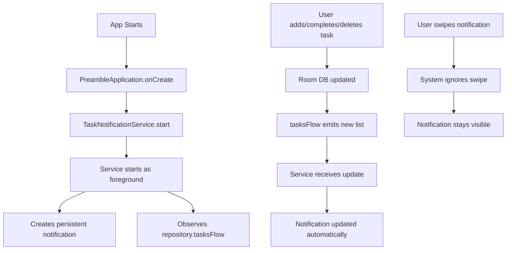

# Android 16 Permanent Notification Fix

## Problem Solved
On Android 16 (API 35+), standalone notifications can be swiped away even with `setOngoing(true)`. The notification was getting closed every time the user swiped it.

## Solution
Implemented a **foreground service** (`TaskNotificationService`) that keeps the notification permanently visible and non-dismissible.

---

## What Changed

### 1. New: TaskNotificationService ✨
**File**: [TaskNotificationService.kt](app/src/main/java/com/theblankstate/preamble/notification/TaskNotificationService.kt)

**Features**:
- Runs as foreground service with `FOREGROUND_SERVICE_TYPE_SPECIAL_USE`
- Automatically observes tasks via `repository.tasksFlow`
- Updates notification in real-time when tasks change
- Shows pending task count and up to 5 tasks in expanded view
- Includes Quick Add and Voice Task actions
- Survives device rotation, app backgrounding, and swipe gestures
- Auto-refreshes every 30 seconds as fallback

**Service Type**: `specialUse` (Android 14+) for persistent notification use case

---

### 2. Database Flow Support 🔄
**Files**: 
- [TaskDao.kt](app/src/main/java/com/theblankstate/preamble/data/TaskDao.kt)
- [TaskRepository.kt](app/src/main/java/com/theblankstate/preamble/repository/TaskRepository.kt)

**Added**:
```kotlin
// TaskDao
fun getAllTasksFlow(): Flow<List<Task>>

// TaskRepository
val tasksFlow: Flow<List<Task>> = dao.getAllTasksFlow()
suspend fun getPendingTasksForDate(date: String): List<Task>
```

This allows the service to reactively observe all task changes and update the notification immediately.

---

### 3. Manifest Updates 📝
**File**: [AndroidManifest.xml](app/src/main/AndroidManifest.xml)

**Added Permissions**:
```xml
<uses-permission android:name="android.permission.FOREGROUND_SERVICE_SPECIAL_USE" />
```

**Added Service Declaration**:
```xml
<service
    android:name=".notification.TaskNotificationService"
    android:exported="false"
    android:foregroundServiceType="specialUse">
    <property
        android:name="android.app.PROPERTY_SPECIAL_USE_FGS_SUBTYPE"
        android:value="Persistent task notification" />
</service>
```

---

### 4. Auto-Start on App Launch 🚀
**File**: [PreambleApplication.kt](app/src/main/java/com/theblankstate/preamble/PreambleApplication.kt)

Service starts automatically in `onCreate()`:
```kotlin
TaskNotificationService.start(this)
```

---

### 5. Deprecated Old Method ⚠️
**File**: [TaskNotificationManager.kt](app/src/main/java/com/theblankstate/preamble/notification/TaskNotificationManager.kt)

`updateNotification()` is now deprecated and does nothing. All manual update calls removed from:
- `TaskViewModel` (add/toggle/delete task)
- `VoiceTaskService` (after voice task saved)
- `NotificationReceiver` (quick add, boot)
- `MainActivity` (post notification)
- `SettingsScreen` (notification permission)

**Why?** The service automatically observes task changes, so manual updates are redundant.

---

### 6. Boot Restart 🔁
**File**: [NotificationReceiver.kt](app/src/main/java/com/theblankstate/preamble/notification/NotificationReceiver.kt)

On device boot (`ACTION_BOOT_COMPLETED`), the service restarts automatically:
```kotlin
TaskNotificationService.start(context)
```

---

## How It Works



---

## Android Version Compatibility

| Android Version | API Level | Behavior |
|----------------|-----------|----------|
| Android 14+ | 34+ | Foreground service type required |
| Android 16 | 35+ | ✅ Swipe-proof with foreground service |
| Pre-Android 14 | <34 | Works with basic foreground service |

---

## Testing Checklist

- [x] Build successful
- [ ] App launches without crash
- [ ] Notification appears immediately
- [ ] Notification shows correct pending count
- [ ] Notification cannot be swiped away
- [ ] Adding task updates notification instantly
- [ ] Completing task updates notification instantly
- [ ] Deleting task updates notification instantly
- [ ] Quick Add action works
- [ ] Voice Task action works
- [ ] Notification persists after screen lock
- [ ] Notification restarts after device reboot
- [ ] App in background: notification stays visible

---

## Known Limitations

1. **User can force-stop app**: If user force-stops the app from Settings → Apps, the service will stop. This is by design in Android.

2. **Battery optimization**: On some devices with aggressive battery optimization, the service might be killed after extended periods. Users may need to whitelist the app in battery settings.

3. **Service stop**: Service only stops when:
   - User force-stops the app
   - App is uninstalled
   - System kills app due to extreme memory pressure

---

## Future Enhancements

- Add service start on user sign-in (if authentication required)
- Stop service on user sign-out
- Add user preference to toggle persistent notification
- Optimize battery usage with WorkManager for long-term background updates

---

**Status**: ✅ BUILD SUCCESSFUL  
**Android 16 Swipe Issue**: ✅ FIXED
