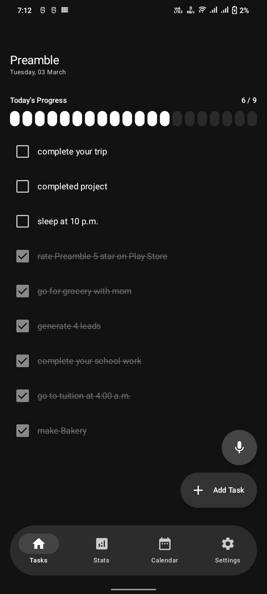
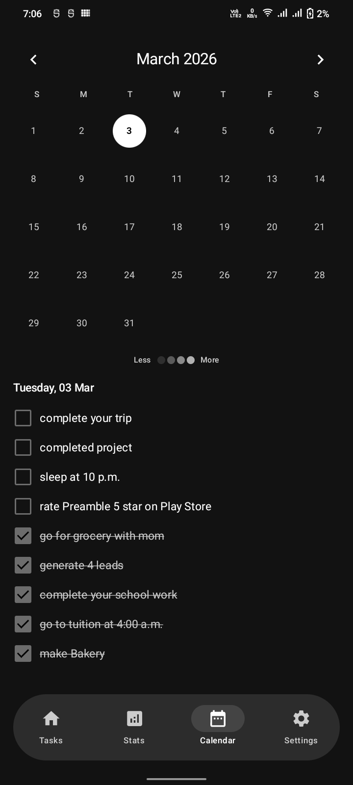
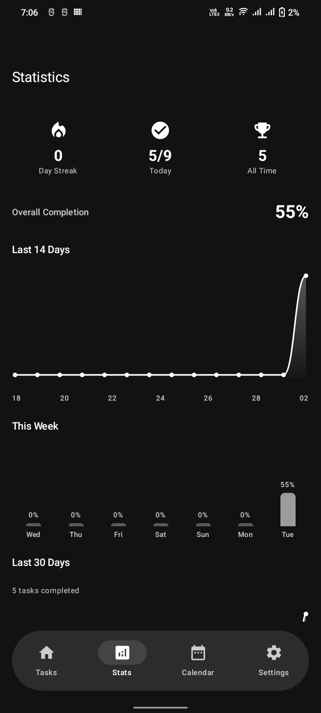
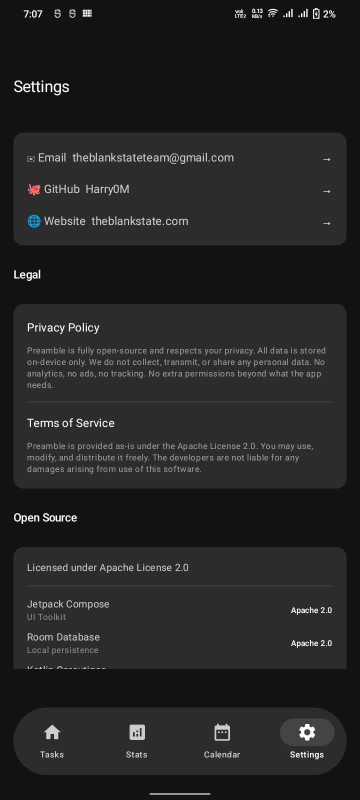
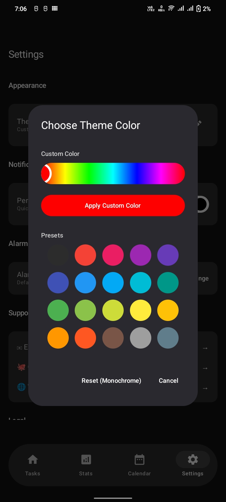

# Preamble

A beautiful, privacy-first task management app for Android — built entirely with Jetpack Compose and Kotlin.

## ✨ Features

- **Daily Task Tracking** — Add, complete, and manage tasks for today and future dates.
- **Offline-First + Realtime Sync** — Every task is saved instantly on-device, then synced to Cloud Firestore in seconds.
- **Voice Input** — Tap the mic and speak your task. Auto-saves when you stop talking.
- **Smart Reminders** — Set deadline times and get alarm notifications so you never miss a task.
- **Permanent Notification** — Quick Add and Voice Task directly from the notification bar.
- **Wave Progress Bar** — Animated wave-form progress indicator showing daily completion.
- **Overdue Highlighting** — Tasks past their deadline are highlighted in red.
- **Calendar View** — Browse tasks by date on a full calendar screen.
- **Streak Tracking** — Track your daily task completion streak.
- **Full Theme Customization** — Pick any color from the full spectrum or use presets.
- **Professional Onboarding** — Swipeable intro with custom illustrations explaining features.

## 🔒 Privacy

Preamble is **offline-first**. Your tasks are always stored locally first. If you sign in, tasks sync to your Firebase account for backup + realtime multi-device sync. No ads, no tracking SDKs.

## 📸 Screenshots

<p align="center">
  
  
  
  
</p>
<p align="center">
  
  
  
</p>

## 🏗 Architecture

| Layer | Technology |
|-------|-----------|
| UI | Jetpack Compose + Material Design 3 |
| State | ViewModel + Kotlin StateFlow |
| Data | Room Database (SQLite) + Cloud Firestore |
| Async | Kotlin Coroutines |
| Alarms | Android AlarmManager (setAlarmClock) |
| Voice | Android SpeechRecognizer |
| Navigation | Bottom Navigation (Compose) |

## 📁 Project Structure

```
app/src/main/java/com/theblankstate/preamble/
├── data/              # Room entities, DAO, database
├── repository/        # Data access layer
├── viewmodel/         # Business logic & state management
├── notification/      # AlarmReceiver, AlarmDismiss, VoiceTaskService, NotificationManager
├── ui/
│   ├── components/    # TaskItem, AddTaskSheet, ColorPicker
│   ├── screens/       # Home, Calendar, Stats, Settings, Onboarding
│   └── theme/         # Custom theming with full color spectrum
└── MainActivity.kt    # Entry point with floating bottom nav
```

## 🎨 Design

- **Floating Bottom Nav Bar** with 100% rounded corners
- **Monochrome-first** theme (default), fully customizable
- **Wave animations** for voice input and progress tracking
- **Material Design 3** with dynamic color support

## 📋 Permissions

| Permission | Reason |
|-----------|--------|
| `POST_NOTIFICATIONS` | Permanent notification for quick task management |
| `RECORD_AUDIO` | Voice input for hands-free task creation |
| `SCHEDULE_EXACT_ALARM` | Deadline alarm reminders |
| `RECEIVE_BOOT_COMPLETED` | Restore notification after device restart |

## 📄 License

Preamble is proprietary software owned by The Blank State. Preamble is no longer open-source.

See [TERMS_AND_CONDITIONS.md](TERMS_AND_CONDITIONS.md) and [PRIVACY_POLICY.md](PRIVACY_POLICY.md).

## 🤝 Support

- **Email:** theblankstate@theblankstate.com
- **GitHub:** [Harry0M](https://github.com/Harry0M)
- **Website:** [theblankstate.com](https://theblankstate.com)
